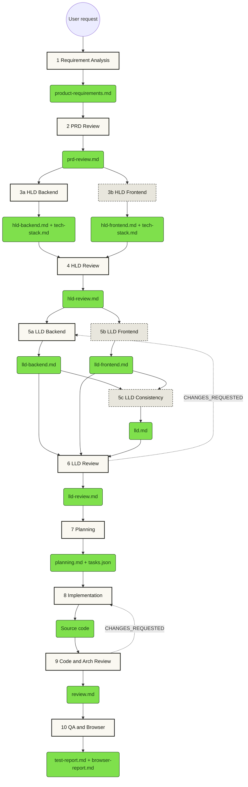

# The `.ai/` directory

Supporting files for the locked **10-stage PRD→Production pipeline** that runs under
**Claude Code**.

> **Runtime note.** This pipeline was originally built for Google Antigravity and has
> been ported to Claude Code. Antigravity is no longer the runtime. `.agents/hooks.json`
> remains on disk but is inert — Claude Code never reads it. The full audit of that port
> is in [CLAUDE-CODE-PORT-CHECKLIST.md](CLAUDE-CODE-PORT-CHECKLIST.md).

**Authoritative spec:** [`workflows/prd-to-prod.md`](workflows/prd-to-prod.md).
Everything below is orientation; where the two disagree, the workflow file wins.

---

## 1. What lives where

Claude Code discovers skills, commands and hooks from `.claude/` and the repo root —
**not** from `.ai/`. This directory holds state, artifacts, docs, and disabled material.

| Path | Purpose | Live? |
|---|---|---|
| `.ai/workflows/prd-to-prod.md` | The authoritative pipeline spec | **yes** — read by the agent |
| `.ai/state/workflow-state.json` | Current stage, scope, approvals, checksums | **yes** — gitignored, per-developer |
| `.ai/artifacts/` | Generated stage artifacts | **yes** |
| `.ai/examples/` | Archived reference run — the quality bar | reference |
| `.ai/dashboard/` | Zero-dependency live dashboard | **yes** |
| `.ai/skills/` | **Disabled** skills, retained for reference | no — not discoverable |
| `.ai/stages/*/SKILL.md` | Legacy stage skills from the 7-stage era | no — not discoverable |
| `../.claude/skills/` | The **13 locked skills** | **yes** — the only discoverable ones |
| `../.claude/commands/` | `/prd-to-prod`, `/workflow-status`, `/workflow-reset` | **yes** |
| `../hooks/` | The three enforcement hooks + preflight | **yes** |

The skill lock is structural: an unlisted skill isn't merely forbidden, it is invisible
to the runtime, because Claude Code only scans `.claude/skills/`.

---

## 2. The 10-stage pipeline

Scope (`backend` / `frontend` / `fullstack`) is resolved at Stage 1 and decides which
sub-stages exist at all.



Dashed nodes are scope-gated. `5c` runs only for `fullstack`.

---

## 3. Skill directory

All 13 live in `../.claude/skills/`. These are the **only** skills this workflow may invoke.

| Stage | Skill |
|---|---|
| 1 Requirement Analysis | `prd-generator-split` |
| 2 PRD Review | `prd-reviewing` |
| 3a HLD Backend | `backend-hld-architect` |
| 3b HLD Frontend | `frontend-hld-designer` |
| 4 HLD Review | `hld-reviewer` |
| 5a LLD Backend | `backend-lld-architect` |
| 5b LLD Frontend | `frontend-lld-designer` |
| 5c LLD Consistency | *(orchestrator — no skill)* |
| 6 LLD Review | `lld-reviewer` and/or `frontend-lld-review` |
| 7 Planning | `edited-plan-skill` |
| 8 Implementation | `trading-platform-coding` |
| 9 Code & Arch Review | `code-reviewer` |
| 10 QA & Browser | `full-stack-test-suite` |

**Disabled, retained for reference only** — these are *not* discoverable and must never
be invoked: `.ai/skills/prd-generator` (superseded by `prd-generator-split`; its SKILL.md
references two support files it cannot resolve, which is why it was replaced),
`.ai/skills/requirements-analysis-2`, and the eight `.ai/stages/*/SKILL.md` files.

---

## 4. Entry points and iteration

Start or resume with **`/prd-to-prod <feature>`**. State is read from
`state/workflow-state.json`, so a bare `/prd-to-prod` resumes wherever you left off.
Check position any time with `/workflow-status`; reset with `/workflow-reset` (which
archives rather than deletes).

**Gates are hard.** Every stage halts and calls `AskUserQuestion` with
APPROVE / ITERATE / REJECT / JUMP. An artifact already on disk is never approval — it
must be approved in the current session.

**Entry point.** Do not start at a stage other than 1 unless you name one explicitly.
Unlike the older 7-stage version, guessing an entry point is a workflow violation.

**Jump-backs** require explicit user confirmation. A `CHANGES_REQUESTED` verdict is
hard-blocking and cannot be worked around by proceeding — `hooks/pre-tool.js` denies the
downstream write.

---

## 5. Enforcement

Rules are executed, not merely documented. Three hooks in `../hooks/`, registered in
`../.claude/settings.json`:

- **`pre-tool.js`** denies writes that fall below depth floors, miss required sections,
  contain `TBD`/placeholders in a design doc, violate artifact ownership, or breach the
  verdict gate.
- **`post-tool.js`** records checksums and versions, cascades staleness (scope-aware),
  validates split-PRD completeness, and reports owed traceability cells.
- **`stop.js`** blocks the turn from ending on missing in-scope artifacts, incomplete PRD
  parts, stale artifacts, an unapproved stage, or Stage 9 traceability gaps.
- **`session-start.sh`** (POSIX `sh`, so it works even without Node) warns loudly if Node
  is missing — otherwise the guards would silently not run.

Verify with `node hooks/test/run-tests.js` — 44 assertions, ~5 seconds, no side effects.

---

## 6. Replicating this workflow

**Same repo, new machine** — everything needed is committed:

```sh
git clone -b claude-code https://github.com/Thinq-Money/prd-to-prod.git
cd prd-to-prod
node --version || brew install node    # macOS ships no Node
node hooks/test/run-tests.js           # expect 44 passed
claude
```

No `npm install`, no build step — hooks and dashboard use Node built-ins only.

**Into another project** — copy `.claude/skills/`, `.claude/commands/`,
`.claude/settings.json`, `hooks/`, `.ai/workflows/`, and the root `CLAUDE.md`. The hooks
resolve their own paths from `__dirname`, so they work from any repo root. `CLAUDE.md` is
what makes the pipeline the default behaviour — without it the agent has no standing
instruction to route feature requests through the workflow.

**Globally, across all projects** — put the skills in `~/.claude/skills/` and the rules in
`~/.claude/CLAUDE.md`. Note this weakens the skill lock: skills in your home directory are
discoverable in every project, not just this one.
