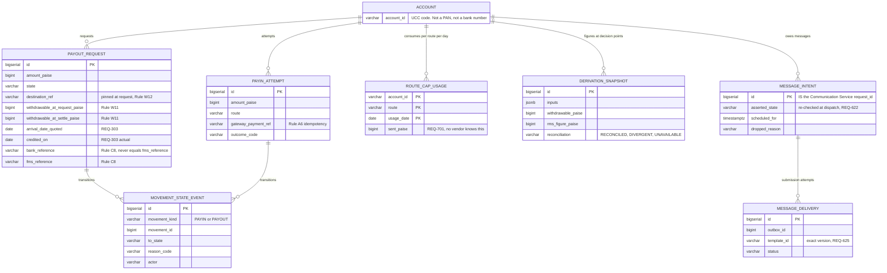

# Database Architecture — Fund Management System

| | |
|---|---|
| Status | Supporting design document. Consolidates the schema already specified in `lld-backend.md` §2.2 |
| Authority | **`lld-backend.md` is the source of truth.** This document reorganises and explains it; where the two ever differ, the LLD wins |
| Engine | PostgreSQL, single primary, no read replica (`hld.md` §14) |
| Migrations | Flyway, forward-only, additive, continuing the estate's sequence from **V21** |
| Date | 2026-08-21 |

---

## 1. The first thing to understand: FMS stores no ledger entries

The Stage 3 gate decided that **TechExcel is the system of record** for entries and balances. Every
schema decision below follows from that, and reading the tables without it will make them look
strangely incomplete.

| Data | Owner | FMS holds |
|---|---|---|
| Ledger entries, running balance, opening/closing balances | **TechExcel** | Nothing. Read through per request |
| Margin, positions, the withdrawable authority | **Kambala Noren (RMS)** | Nothing. Read through, or pushed by subscription |
| Verified bank accounts | **Profile** | A reference and a masked display form only |
| Message templates and their versions | **Communication Service** | The resolved version id, per delivery |
| Withdrawal requests, payin attempts, movement history, derivation snapshots, message intents, delivery log, route caps | **FMS** | Everything below |

**The rule the schema encodes:** FMS stores what has no home in the back office. A withdrawal request
does not exist in TechExcel until it is instructed; a payin attempt does not exist until it succeeds;
neither system records why a figure was what it was at the moment a trader acted on it. Those gaps are
the seven tables.

The consequence for sizing is large. The estimated ~770 GB of ledger data at seven-year retention sits
in TechExcel. FMS's own tables are in the **low tens of gigabytes**, which is why a single primary with
vertical headroom is the whole scaling story.

---

## 2. Entity relationship



**There are no foreign keys to an account table**, because FMS does not own the account. `account_id`
is a UCC code carried from the authenticated principal and validated at the service boundary, not by
referential integrity against a table FMS has no right to define.

`MOVEMENT_STATE_EVENT` deliberately has no foreign key to either movement table either — it is
polymorphic over `(movement_kind, movement_id)`. A foreign key would require either two nullable
columns or two tables, and the read pattern is always "this movement's timeline", never a join across
both.

---

## 3. Money representation

**Every monetary column is `BIGINT`, holding an integer number of paise.** Never `NUMERIC`, never
`DOUBLE PRECISION`, never a decimal string parsed late.

This comes from the ratified taxonomy's rule R5, and Rule B4 makes it structural: the withdrawable
derivation must reconcile to its figure exactly, and REQ-102 shows every term to the trader. A
representation that cannot hold a sum exactly turns a rounding artefact into a visible contradiction
between the terms and the total — which the PRD treats as severe enough to block withdrawal entirely.

`BIGINT` gives ±9.2 × 10^18 paise, roughly ±9.2 × 10^16 rupees. At any plausible account size this is
not a constraint worth thinking about again.

**Conversion happens once, at the vendor boundary, in both directions.** TechExcel returns `DR_AMT`,
`CR_AMT` and `CLOSING_AMT` as numerics and accepts `Amount` as a decimal string with two places; the
anti-corruption layer converts on ingest and on egress. No paise value is ever formatted inside the
domain, and no decimal ever travels inward.

---

## 4. Tables

### 4.1 `fms_payout_request` — V21

One row per withdrawal request, whole lifecycle. The most constrained table in the schema.

| Column | Type | Purpose |
|---|---|---|
| `id` | `BIGSERIAL` PK | Also the instruction-key component (§6.3a) |
| `account_id` | `VARCHAR(32)` | UCC |
| `amount_paise` | `BIGINT` `CHECK > 0` | Requested |
| `state` | `VARCHAR(24)` | See §5's transition table |
| `destination_ref` / `destination_masked` | `VARCHAR` | Pinned at request (Rule W12). Masked form only (Profile PR-31) |
| `withdrawable_at_request_paise` | `BIGINT` | Rule W11 |
| `withdrawable_at_settle_paise` | `BIGINT` NULL | Rule W11 — null until settled |
| `arrival_date_quoted` | `DATE` | REQ-303 |
| `credited_on` | `DATE` NULL | REQ-303's actual, for quoted-versus-actual |
| `bank_reference` | `VARCHAR(64)` NULL | The bank's own transfer reference |
| `fms_reference` | `VARCHAR(32)` | This module's |
| `settlement_reason_code` / `settlement_reason_text` | | §4.5's mapping, and the verbatim unmapped string |
| `amount_sent_paise` | `BIGINT` NULL `CHECK ≤ amount_paise` | |
| `version` | `INTEGER` | Stale-copy detection, **not** the concurrency mechanism |

**Three constraints carry business rules rather than data hygiene.**

```sql
-- Rule W4. Rule W3 removed reservation from the withdrawal path, which left this
-- as the ONLY protection against a trader committing the same money twice.
CREATE UNIQUE INDEX fms_payout_one_open_per_account
    ON fms_payout_request (account_id)
    WHERE state IN ('ACCEPTED', 'QUEUED_FOR_RUN', 'INSTRUCTED');

-- Rule C8. A trader chasing a payment needs the identifier their bank can trace;
-- reusing ours would send them somewhere the reference means nothing.
CONSTRAINT fms_payout_refs_differ
    CHECK (bank_reference IS NULL OR bank_reference <> fms_reference)

-- A settlement can send less than was requested. It can never send more.
CONSTRAINT fms_payout_sent_within_request
    CHECK (amount_sent_paise IS NULL OR amount_sent_paise <= amount_paise)
```

**Why the partial unique index and not a service check.** A read-then-write in application code has a
window; the index has none. The repository contract states explicitly that the service must **not**
pre-check by reading first, because that would be a race dressed as validation. The insert is attempted
and the constraint violation is translated to `409 request_already_open`.

### 4.2 `fms_payin_attempt` — V22

| Column | Type | Purpose |
|---|---|---|
| `id` | `BIGSERIAL` PK | |
| `account_id`, `amount_paise`, `route`, `state` | | |
| `gateway_payment_ref` | `VARCHAR(96)` NULL | The gateway's payment identity |
| `outcome_code` | `VARCHAR(48)` NULL | One of Rule A9a's six outcomes |
| `source_masked` | `VARCHAR(24)` NULL | Last four digits only (REQ-612) |

```sql
-- Rule A6: a payment is recorded once however many confirmations arrive.
-- Repeat confirmations are an EXPECTED condition, not an error, so the second
-- insert collides here and the handler returns 200 having recorded nothing.
CREATE UNIQUE INDEX fms_payin_gateway_ref
    ON fms_payin_attempt (gateway_payment_ref)
    WHERE gateway_payment_ref IS NOT NULL;
```

The index is partial because an attempt that has not yet reached the gateway has no reference, and
several such rows can legitimately coexist for one account.

### 4.3 `fms_route_cap_usage` — V23

Composite primary key `(account_id, route, usage_date)`. One row per account per route per day.

This table exists because **no external system can provide it.** REQ-701 requires caps enforced per day
per route measured against everything that customer has already sent on that route today. Juspay's
`Get Balance` is the gateway's own balance, not a per-customer remaining cap. FMS owns the ledger of
what it has sent, because only FMS knows.

Incremented inside the transaction that accepts an attempt, so a cap cannot be exceeded by two
concurrent attempts.

### 4.4 `fms_movement_state_event` — V24

Append-only. Every state transition of a payin or payout, with actor and reason.

**Partitioned by month on `occurred_at`**, which makes retention a partition drop rather than a delete
sweep across a live table. The primary key is `(id, occurred_at)` because Postgres requires the
partition key in any unique constraint.

REQ-405 requires a movement's full timeline with the time of each state and the reason recorded at any
refusal. That cannot be reconstructed from a current status column, which is why the transitions are
written as they happen rather than derived later. This is a write-path decision, not a display one.

### 4.5 `fms_derivation_snapshot` — V25

The inputs and output of `derive()` at every decision point — a payout request, a settlement, a message
render. Not for a page view; a view is not disputed months later, a payout is.

`inputs` is `JSONB` deliberately: the input set is a whole captured at an instant, it is never queried
by individual field, and its shape will change as vendors change. Normalising it would buy query
patterns nobody needs and impose a migration every time a source adds a field.

`reconciliation` records `RECONCILED`, `DIVERGENT` or `UNAVAILABLE`, so a later question about why a
figure was unavailable has an answer rather than an absence.

### 4.6 `fms_message_intent` — V25a

The piece the estate's existing outbox could not provide.

The outbox dispatches promptly after commit. The shortfall ladder has step offsets and the dues
sequence runs day 0, 7, 14, 30 then monthly, so an intent must **wait without being lost** and must
**not be sent once the state it asserts has resolved** (REQ-622).

```sql
-- The relay's only query.
CREATE INDEX fms_intent_due ON fms_message_intent (scheduled_for)
    WHERE dispatched_at IS NULL AND dropped_reason IS NULL;

-- One intent per template per occurrence per channel. A ladder step written twice
-- for one shortfall collides here rather than being sent twice.
CREATE UNIQUE INDEX fms_intent_once
    ON fms_message_intent (account_id, template_key, channel, asserted_ref);
```

`id` **is** the `request_id` submitted to the Communication Service, so a relay retry after a crash
replays the same key and the service returns the original result rather than sending again.

`asserted_state` is what makes drop-rather-than-retract possible: the relay re-reads the account's
state before submitting, and a superseded intent is marked `dropped_reason = STATE_RESOLVED`.

### 4.7 `fms_message_delivery` — V26

One row per submission per channel. Partitioned by month on `submitted_at`, same retention mechanism as
the movement events.

`template_id` stores the exact version the Communication Service resolved, which is how REQ-625 —
a delivered message must always be reconstructable — is satisfied without FMS versioning templates
itself. `suppression_code` records a message deliberately not sent, because REQ-623 requires the
suppressed ones logged too, not only the sent ones.

---

## 4.8 Index inventory, and what each one is for

Ten indexes. **Four of them serve no query at all** — they are business rules the database enforces
because application code cannot enforce them without a race. Separating the two kinds is the point of
this table: an index that carries a rule must never be dropped as an optimisation.

| Index | Table | Kind | Serves |
|---|---|---|---|
| `fms_payout_one_open_per_account` | `payout_request` | **Rule** | Rule W4. Partial on open states |
| `fms_payin_gateway_ref` | `payin_attempt` | **Rule** | Rule A6. Partial on a non-null reference |
| `fms_intent_once` | `message_intent` | **Rule** | One intent per template per occurrence per channel |
| `fms_msg_outbox_channel` | `message_delivery` | **Rule** | One delivery row per submission per channel |
| `fms_payout_fms_reference` | `payout_request` | Rule and lookup | Our reference is unique, and support searches by it |
| `fms_payout_run_scan` | `payout_request` | Query | The end-of-day run's only scan. Partial on the two states it collects |
| `fms_payin_account_recent` | `payin_attempt` | Query | The movements view and the last-successful-deposit lookup for Rule A1 |
| `fms_mse_movement` | `movement_state_event` | Query | One movement's timeline (REQ-405) |
| `fms_snapshot_account` | `derivation_snapshot` | Query | "Why did I receive less?", months later |
| `fms_intent_due` | `message_intent` | Query | The relay's only query: what is due and unresolved. Partial |

**Five of the ten are partial**, which is not a micro-optimisation here. `fms_payout_one_open_per_account`
is only correct *because* it is partial — a full unique index on `account_id` would permit one
withdrawal per account ever. The `WHERE` clause is the rule.

**There is no index on `account_id` alone anywhere.** Every account-scoped query also filters by state,
time or route, and the composite indexes above already lead with `account_id`, so a bare one would be
redundant on read and pure cost on write.

## 5. State, and where it is enforced

`fms_payout_request.state` is the only lifecycle in the schema. Its transitions are enforced in the
domain, not by a database constraint — a check constraint cannot see the previous value.

| From | To | Trigger |
|---|---|---|
| — | `ACCEPTED` | Trader submits |
| `ACCEPTED` | `CANCELLED` | Trader cancels |
| `ACCEPTED` | `INSTRUCTED` | The run instructs the rail |
| `ACCEPTED` / `INSTRUCTED` | `QUEUED_FOR_RUN` | Rail unavailable — stays cancellable |
| `QUEUED_FOR_RUN` | `CANCELLED` | Trader cancels, still permitted |
| `INSTRUCTED` | `PAID` / `PARTLY_PAID` / `NOTHING_SENT` | Settlement outcome |
| `PAID` / `PARTLY_PAID` | `RETURNED` | Bank refuses after sending |

`RETURNED` following a terminal state is not a contradiction: the original stands and a compensating
entry is added (Rule W7, Rule L2). Nothing in this schema is ever deleted or overwritten to represent a
reversal.

**`INSTRUCTED` is the only state a crash can strand**, which is why it is the only state that triggers
the status query before the end-of-day run reissues an instruction.

---

## 6. Concurrency

| Situation | Mechanism | Why this one |
|---|---|---|
| Two withdrawal requests at once | **Partial unique index** | No window. A service check has one |
| Duplicate gateway confirmation | **Partial unique index** | Rule A6 calls repeats expected, not exceptional |
| Cancel racing the settlement | **`SELECT … FOR UPDATE`** on the request row | One row, twice a day, near-zero contention. A pessimistic lock is cheaper to reason about than an optimistic retry, and a retry of `applyOutcome` after the rail already paid would be wrong |
| Cap consumed by two attempts | Row lock on the `(account, route, date)` row | The increment must be atomic with the acceptance |
| Two end-of-day runs | **Leader lock**, one runner | Rule W9's guarantee cannot survive two instructing processes |

`version` columns exist on the two movement tables for stale-in-memory-copy detection. They are a
consistency check, **not** the concurrency mechanism — the LLD is explicit about this because the two
are easy to confuse and they fail differently.

---

## 7. Partitioning, retention and growth

| Table | Partitioned | Retention | Growth |
|---|---|---|---|
| `fms_payout_request` | No | Statutory | ~500 rows/day |
| `fms_payin_attempt` | No | Statutory | ~1,500 rows/day |
| `fms_route_cap_usage` | No | Prunable after settlement | ≤ 2 rows per active account per day |
| `fms_movement_state_event` | **Monthly** | Statutory; drop the partition | ~6,000 rows/day |
| `fms_derivation_snapshot` | No initially | Statutory | ~2,000 rows/day |
| `fms_message_delivery` | **Monthly** | 7 years assumed (C-Q6, open) | ~5,000 rows/day |
| `fms_message_intent` | No | Prunable once dispatched or dropped | ~5,000 rows/day |

Only the two append-only, window-queried, retention-bounded tables are partitioned. Partitioning the
others would add operational surface for no benefit — `fms_payout_request` is queried by account and by
open state, never by a time window, and its whole lifetime volume is smaller than one month of movement
events.

**`fms_derivation_snapshot` is the one to watch.** It is not partitioned today because its volume is
modest, but it is append-only and time-queried, so it has the same shape as the two that are. If
decision-point volume rises materially, it becomes the third partitioned table, and that is an additive
migration rather than a redesign.

---

## 8. Migration strategy

**Flyway, forward-only, additive.** The estate is at V20; FMS continues at V21.

| Version | Contents |
|---|---|
| V21 | `fms_payout_request` + its three constraints |
| V22 | `fms_payin_attempt` + the Rule A6 index |
| V23 | `fms_route_cap_usage` |
| V24 | `fms_movement_state_event` + partitions |
| V25 | `fms_derivation_snapshot` |
| V25a | `fms_message_intent` |
| V26 | `fms_message_delivery` + partitions |

**Rules that make a rollback safe.** A column is added and backfilled before it is read, never renamed
in place. No migration rewrites an existing table. A deploy that rolls back therefore lands on a schema
the previous version can still read, which is the only property that makes forward-only migration
compatible with a rollback plan.

**Nothing here alters an existing estate table.** FMS adds; it does not modify what run 001 through
run 004 built.

---

## 9. Privacy and deletion

- **No full bank account number is ever stored.** Only `destination_masked` and `source_masked`, last
  four digits. Profile masks server-side (PR-31) and FMS never receives the unmasked value, so there is
  nothing to leak and nothing to redact.
- **No balance is stored outside `fms_derivation_snapshot`**, which is FMS's own audit record and never
  leaves the system.
- **No PAN, no IFSC, no Aadhaar, and no hash of any of them** — taxonomy R4 forbids the hash as well as
  the value, so a regulated identifier cannot be smuggled in as a pseudonymous key.
- **Deletion on account closure:** `fms_message_intent` and the renderable content of
  `fms_message_delivery` are purged; the send record and its outcome are retained for the statutory
  period, because the record that a regulatory intimation was sent is itself a compliance artifact.
  Ledger entries are TechExcel's to retain and to purge.

---

## 10. What this document does not decide

Two schema questions are open and both are external, not design:

1. **Whether `fms_derivation_snapshot` needs a local entry mirror beside it.** If TechExcel's `Ledger`
   API does not support date-bounded paging per account (OA-6 / TASK-01), the transaction list cannot
   be served as a read-through and an entry mirror becomes necessary — which would be a new table, a
   new ingest path, and a reconciliation obligation between the mirror and its source. **That question
   returns to the HLD**, because it reverses the Stage 3 system-of-record decision. It is not absorbed
   here.
2. **The delivery-log retention period.** Seven years is assumed (C-Q6). If it is shorter, the partition
   drop schedule changes and nothing else does.
