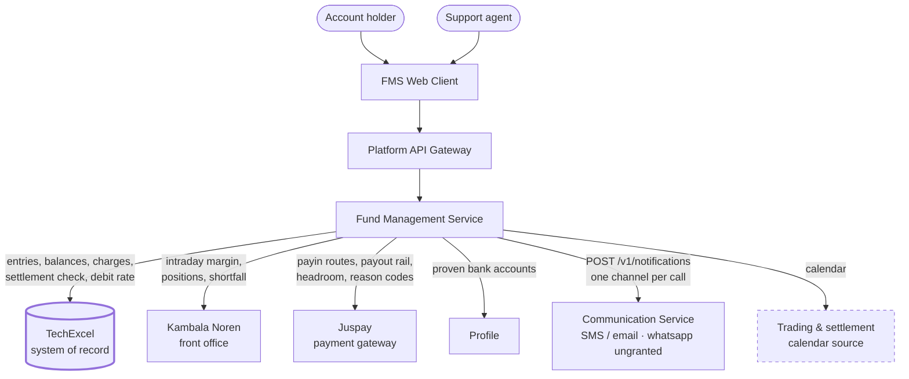
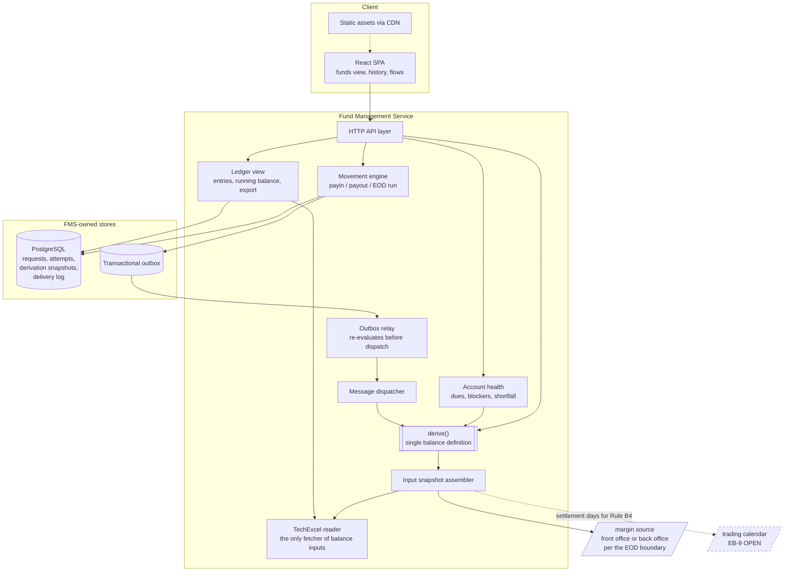
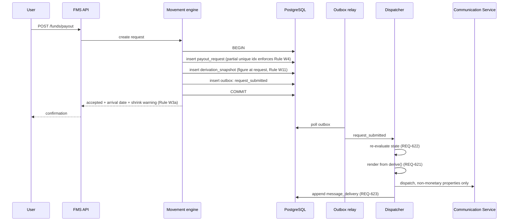

# High-Level Design — Fund Management System

**Stage:** 3 — Unified System HLD
**Source PRD:** `docs/specs/001-fund-management-system/product-requirements.md` + 7 parts (3,024 lines), review verdict APPROVED (iteration 3)
**Scope:** `fullstack` — client, services, data and infrastructure in one design
**Date:** 2026-08-21

---

## 1. Overview

The Fund Management System is the money surface of a broking account. It answers three questions
that a broking account answers with three different numbers — what the account records, what can be
committed to a trade, and what can reach a bank today — and it explains the gap between them. It
moves money in, moves money out on a mandated cycle, records every event in language the account
holder can read, and tells the user when the account needs them to act.

The system's hard problem is **correctness, not scale**. At the assumed workload in §5 the read path
is roughly 21 requests per second sustained, which any single application node serves. What makes
this system difficult is that a payout exceeding the withdrawable figure, a payment credited twice,
or a ledger whose entries do not sum to its stated balance are each a regulatory incident rather than
a defect. Every significant decision below is made in favour of provable correctness over latency,
throughput or elegance.

### 1.1 The one idea the architecture is organised around

Rule B12 of the PRD requires exactly one definition of each balance in the product, with no surface
computing its own. This design realises that as a single pure function, `derive()`, which takes a
snapshot of externally-sourced inputs and returns the three figures **together with the term-by-term
derivation that produced them**. Screens render its output. Messages render its output. The export
renders its output. No caller adds, subtracts or rounds afterwards.

That constraint is what makes REQ-102 (explain the withdrawable figure line by line), REQ-621 (every
message generated from the same figures as the screen) and the daily integrity invariant a single
mechanism rather than three features that must be kept in agreement by discipline.

---

## 2. Goals & Non-Goals

### Goals

| # | Goal | Requirement anchor |
|---|---|---|
| G1 | One definition of each balance, rendered identically everywhere it appears | Rule B12, REQ-101, REQ-621 |
| G2 | Every figure carries the derivation that produced it, reconcilable to the last unit | Rule B4, REQ-102 |
| G3 | No money movement fails silently; every refusal names its rule and its next action | REQ-205, REQ-306, Rule A9 |
| G4 | A payout never exceeds the withdrawable figure computed at settlement | REQ-308, Rule W10 |
| G5 | A payment produces exactly one credit however many confirmations arrive | REQ-204, Rule A6 |
| G6 | Every money event and every correction is retained, attributable and immutable | Rule L1, Rule L2 |
| G7 | The account tells the user when it needs them, on channels that reach them | REQ-601, REQ-604, Rule C1 |

### Non-Goals

- **Order placement, positions and margin computation.** Consumed, never computed. FMS reads margin;
  the risk function decides it.
- **Identity and bank account verification.** Owned by Profile. FMS reads the proven-account list and
  never mutates it (REQ-704, REQ-705, Rule G4).
- **Period reconciliation.** Relocated to the system of record; FMS supplies two stamped period
  endpoint balances (REQ-406).
- **An operations console.** Corrections must be attributable from day one; the surface for making
  them is a later phase.
- **A mobile application.** The PRD states there is none, which is why SMS carries the load WhatsApp
  and push would otherwise share (Communications §1).

---

## 3. Assumptions

Every assumption below is stated because a decision rests on it. EB-10 leaves all workload figures
unmeasured, so §5 is derived from these rather than from production data.

| # | Assumption | Basis | If wrong |
|---|---|---|---|
| A1 | 500,000 registered accounts, 10% daily active on the funds surface | Mid-size Indian retail broker profile; EB-10 open | Read-path sizing changes; the single-node conclusion in §14 holds to roughly 20× this |
| A2 | Traffic concentrates around 09:15 IST market open and mandated settlement dates | Stated in the PRD's Scalability outcomes | Autoscaling triggers in §14 need a different signal |
| A3 | ~20 ledger entries per active account per day | Trades, charges, mark-to-market, money movement | Storage in §10 scales linearly and stays small |
| A4 | ~~The platform standardises on a JVM or Go runtime~~ — **superseded by evidence, no longer an assumption** | The approved design set for run 004 of the sibling Fund Management Service, held at `05-dependencies/fms-run-004-reference/`, states the running stack: a **Java Spring Boot modular monolith**, a **single PostgreSQL primary** with Flyway forward-only migrations already at V20, and a **client-rendered React and TypeScript** web client using React Query | Nothing. This row is retained to record that a stack assumption was replaced by a stack observation |
| A5 | TechExcel exposes a settlement-check outcome with a machine-readable deduction reason | Required by REQ-308; the PRD flags that a bare status code satisfies the control and fails the requirement | REQ-308 degrades to a generic decline and Rule W10's naming obligation cannot be met |
| A6 | Juspay exposes per-route daily headroom and per-attempt failure reason codes | Required by REQ-701 and REQ-614 | Route selection falls back to attempt-and-retry; REQ-614 degrades to a generic failure on that route |
| A7 | The 7-year retention assumption for delivery logs holds | C-Q6, open | Storage in §10 changes by a constant factor |
| A8 | The existing transactional outbox and dispatcher can carry FMS's message intents by adding event types rather than machinery | Run 004's stack document records the outbox as built in run 001 and reused by later runs by adding event types | §12 becomes a build rather than a reuse, which is more work but no design change |

### 3.1 What already exists, and why it matters here

The sibling design set is evidence rather than inference, and it changed three decisions in this
document. A Spring Boot service in this estate already owns a trader's money, with a settlement run, a
reconciliation sweep, a payment register and an outbox dispatcher in production. That does not make
this PRD a delta on it — the two carry different requirement schemes and this PRD was written as a
fresh specification — but it does mean the platform, its conventions and several of its components are
observable rather than assumed.

Where this design would otherwise have invented something the estate already has, it reuses it and says
so. Where it departs from an established precedent, §11 and §13 name the precedent and give the reason.

One consequence should be flagged to the PRD's author rather than absorbed silently: this PRD's
Reality-Check Gate records demand as unevidenced *"because no version of this product exists"*. A
system in the same estate already moves a trader's money. Whether that system is the same product is a
question for the author, and it is recorded in §23.

---

## 4. Requirements

### 4.1 Functional — the six journeys

| Journey | Requirements | Notes |
|---|---|---|
| See the balances and the derivation | REQ-101 to REQ-108 | The wedge. Everything else computes against these |
| Add funds | REQ-201 to REQ-207, REQ-701 to REQ-703 | Route selected automatically (REQ-702); disclosure only (REQ-202) |
| Withdraw and settle at end of day | REQ-301 to REQ-308, REQ-706 to REQ-707 | Reserves nothing (Rule W3); one open request (Rule W4) |
| Read history and export | REQ-401 to REQ-405, REQ-407 | Immutable entries, paired reversals, CSV from the list on screen |
| Discover and clear a debt | REQ-501 to REQ-506 | Includes the shortfall deadline and the withdrawable consequence |
| Receive an action message | REQ-601 to REQ-604, REQ-608 to REQ-627 | Generated from `derive()`, queued against the event |

### 4.2 Non-functional — with the target and its source

| Attribute | Target | Source |
|---|---|---|
| First balance visible | 1.5 s p95 | PRD, `[PROPOSED]`, inside the range observed across four benchmarked competitors |
| Confirmed payin reflected in available margin | 30 s p95 | PRD, bounded by the auto-square-off window rather than user patience |
| Payout status change visible | 1 minute | PRD, `[PROPOSED]` |
| Availability | 99.5% monthly | PRD, `[PROPOSED]`; not an order-placement path |
| Ledger integrity check | At least daily is the PRD's floor; **this design runs it hourly in market hours** and again before the EOD run | Correctness invariant, not a performance target. §16.4 explains why the floor is not enough once the balance is a read of another system |
| Duplicate credits | Zero | Correctness invariant |
| Payouts exceeding withdrawable at settlement | Zero | Correctness invariant |
| Accessibility | WCAG 2.1 AA | PRD; one benchmarked competitor had no money action keyboard-reachable |

**Consistency posture.** Money movement is strongly consistent and transactional. Margin figures are
explicitly eventually consistent and carry their computed-at time (REQ-107); the design never hides
that lag, it renders it. This split is deliberate: pretending margin is current is the failure REQ-107
exists to make visible.

---

## 5. Capacity & Workload Estimates

Derived from §3's assumptions. No figure here is a measurement.

| Quantity | Estimate | Working |
|---|---|---|
| Funds-view opens | ~75,000/day | 50,000 DAU × 1.5 |
| Sustained peak read rate | ~21 rps | 25% of daily opens inside the 15 minutes around market open: 18,750 ÷ 900 s |
| Burst read rate | ~60 rps | 3× sustained peak |
| `derive()` invocations | ~150,000/day | Two per view: initial render plus one refresh |
| Payin attempts | ~1,500/day | 3% of DAU |
| Payout requests | ~500/day | 1% of DAU, settled in one EOD batch |
| Ledger entries | ~1,000,000/day | 50,000 × 20 |
| Ledger storage | ~300 MB/day, ~110 GB/year, **~770 GB at 7 years** | 300 B/row plus indexes |
| Message sends | ~5,000/day, ~3,000 of them SMS | Shortfall ladder plus movement confirmations |
| CSV export | ~5,000 rows typical, ~60,000 worst case | One financial year of an active account |

**What this sizing means.** The read path fits comfortably on two application nodes with a single
primary database and no read replica (§14). The system is not scale-constrained at any plausible multiple
of these figures. Engineering effort belongs in the settlement path, the idempotency of payin
confirmation, and the integrity check — the three places where being wrong is expensive and being
slow is not.

**The one genuine burst.** The end-of-day payout run processes the whole day's requests in a single
batch against a back-office window. At ~500 requests it is small, but it is serial against an external
system with its own rate limits, and it is the only path where a partial failure leaves money in an
ambiguous state. §15 treats it accordingly.

---

## 6. High-Level Architecture

### 6.1 System context



`CAL` is dashed because **EB-9 is open**: no calendar source is nominated. §21 R1 explains why that
gates Phase 1 rather than Phase 3.

### 6.2 Container view



The calendar is dashed here as it is in §6.1, and for the same reason: it is an input `derive()` cannot
do without — Rule B4's unsettled-proceeds deduction is measured in settlement days — and no source is
nominated. A container inventory that omitted it would let someone build the snapshot assembler with
three inputs and discover the fourth on a trading holiday.

### 6.3 The decision that shapes everything else

**TechExcel is the system of record for ledger entries and balances.** FMS originates money events,
presents what TechExcel holds, and stores only what TechExcel does not: withdrawal requests and their
lifecycle, payin attempts and their outcomes, derivation snapshots, and the message delivery log.

*Rejected — FMS owns a double-entry ledger of its own.* This is what EB-1 states, and it was rejected
at the Stage 3 gate. It would have put the authoritative entries where the derivation runs, removing a
network hop from the hottest read path and letting the integrity invariant be enforced inside one
transaction. It loses because it creates a second set of books for money that the back office is
already the record for, and two sets of books that must agree is precisely the failure the PRD's
reconciliation requirements exist to prevent.

**The consequence must be stated plainly, because it is the largest architectural risk in this
document:** every balance FMS displays is now a read of a system FMS does not control, while Rule B12
still requires exactly one definition of each figure. §16.4 and §21 R2 describe how that is held.

---

## 7. Component Breakdown

| Component | Responsibility | Owns | Never does |
|---|---|---|---|
| **`derive()`** | Compute the three balances and the full term-by-term derivation from one input snapshot | The single definition (Rule B12) | Fetch its own inputs, round for display, or return a figure without its derivation |
| **Input snapshot** | Assemble margin, entries, charges and calendar into one immutable, timestamped input set | The computed-at time REQ-107 renders | Blend sources; exactly one margin source is authoritative at any instant (§7.1) |
| **Movement engine** | Payin attempts, withdrawal request lifecycle, the EOD run, compensating entries | Request state, idempotency, the one-open-request invariant | Compute a balance itself; it calls `derive()` |
| **Ledger view** | Present entries in plain language, running balance, paired reversals, CSV export | The description mapping and the export | Alter an entry, or export anything other than what is on screen (Rule L8a) |
| **Account health** | Dues, blockers, empty state, shortfall deadline | The blocker precedence order (REQ-505) | Decide margin; it reads the shortfall from the snapshot |
| **Message dispatcher** | Render and dispatch on the channels §5 of the PRD assigns, log every attempt | Template versions, the delivery log, suppression decisions | Compute a figure; it renders `derive()` output (REQ-621) |

### 7.1 Margin source selection — the hard cutover

Decided at the Stage 3 gate: **the front office is authoritative while the market is open; TechExcel is
authoritative outside it.** The switch happens at the same EOD boundary the payout run uses, per Rule
G5, so that two systems cannot disagree about when the day ended.

**What the contracts changed about this.** The front office is Noren's RMS, reached through
`GetRmsLimits` for margin and `GetWithdrawalAmt` for what may leave, with `FundsUpdateSubscribe`
pushing changes rather than FMS polling for them. §8.0 settles the relationship between
`GetWithdrawalAmt` and Rule B4: RMS's figure is the authority on what may withdraw, Rule B4 is the
explanation, and a disagreement between them makes the figure unavailable rather than making FMS choose.

The cutover therefore switches two things together — which system answers "how much margin" and which
answers "how much may leave" — because splitting them across the boundary would produce a derivation
sourced from one system reconciled against a figure from another.

Exactly one source is authoritative at any instant. A figure from the inactive source is stale by
definition and is never blended with the active one — the PRD's stale-figures edge case explicitly
forbids the product from choosing a winner between two disagreeing sources.

The visible consequence is that figures can step at the boundary. REQ-107's computed-at time must
therefore render the *source* alongside the time, so that a step reads as a scheduled handover rather
than as a data error.

*Rejected — prefer the front office and fall back to TechExcel on staleness.* Survives a front-office
outage during market hours, but allows both sources to be live at once, which reintroduces exactly the
two-disagreeing-figures situation the PRD forbids. Under the hard cutover a front-office outage during
market hours makes figures stale, and REQ-107's third criterion then refuses commitment against them —
which is the correct behaviour, not a degradation.

---

## 8. API Design & Network Perimeter

REST over HTTPS through the platform's existing gateway. Chosen because the client is a single web SPA
with straightforward resource semantics, the platform already terminates auth and rate limiting at the
gateway, and every consumer is first-party.

*Rejected — GraphQL.* The flexible-shape argument does not apply when one client renders one screen
family, and it would let a caller select a subset of the derivation, which Rule B12 exists to prevent.
*Rejected — gRPC for the browser path.* Adds a proxy layer for no gain at 21 rps.

| Endpoint | Method | Purpose | Notes |
|---|---|---|---|
| `/funds/summary` | GET | The three balances, the **complete derivation**, the computed-at time with its source, and **per-action availability with the rule and figure responsible where an action is unavailable** | The only balance source for every surface. The derivation ships here rather than on a second request so that REQ-102's one interaction cannot fail (§13.2); the availability block ships here so a disabled control never renders without its reason (Rule W2) |
| `/funds/margin/breakdown` | GET | Named margin components, blocked money by source and commitment state, and the deployable figure for each trade kind the account is enabled for | REQ-103, REQ-105, REQ-106. A kind the account is not enabled for is omitted, never returned as zero |
| `/funds/payin/quote` | POST | Selected route, arrival date, any cost, and the **applicable minimum including the debt waiver** | Selection is server-side (REQ-702). The waiver is offered here and re-checked on submit (REQ-703, Rule H3) |
| `/funds/payin` | POST | Start a payin attempt | Idempotency key required |
| `/funds/payin/callback` | POST | Gateway confirmation | Idempotent by payment reference (Rule A6) |
| `/funds/payout/quote` | GET | Arrival date computed from this account's state against the EOD boundary, plus the shrink warning text | REQ-303, REQ-707. Rule W3a must be shown before commitment. The quoted date is stored so quoted and actual can be compared |
| `/funds/payin/limits` | GET | Remaining headroom per route for today, measured against everything already sent on that route | REQ-701. Caps are enforced per day per route server-side, not per transaction and not at the gateway's request-rate limiter |
| `/funds/payout` | POST | Create the single open request | Rejects a second while one is open (Rule W4) |
| `/funds/payout/{id}` | DELETE | Cancel before the run | REQ-305 |
| `/funds/transactions` | GET | Either view, filtered by period | REQ-402's two views over one running balance (Rule L5): money-in-and-out with live status, or every entry. The period survives a switch between them |
| `/funds/transactions/{id}` | GET | Full state timeline with reasons and references | REQ-405 |
| `/funds/statement.csv` | GET | Export of exactly the view and period on screen | Rule L8a |
| `/funds/health` | GET | Dues, blockers, shortfall and its deadline | REQ-501, REQ-505, REQ-506 |

**Perimeter.** TLS everywhere; mTLS for service-to-service inside the platform. The gateway rate-limits
per account, and the payin and payout endpoints carry a stricter limit than the read paths because they
originate money movement. The Juspay callback endpoint is authenticated by signature verification
before its body is parsed — the PRD's security outcome requires that no externally-originated message
can cause money to be credited unless its authenticity is established **before its contents are read**.

### 8.0 The four integration contracts, as they actually are

Read from the vendor references in `05-dependencies/vendor-api/` rather than assumed. Each entry records
what the contract provides and what it changes here. **Every one replaced an assumption**, and four
changed a decision.

#### Kambala Noren — OMS and RMS, the front office

Not a margin feed. It is the order management and risk management system, and it carries a full money
surface of its own: `AddFunds`, `PayinStatusVerify`, `GetWithdrawalAmt`, `WithdrawFunds`,
`CancelWithdrawFunds`, `PayoutStatusVerify`, `GetWithdrawFundsReport`, `GetRmsLimits`, and
subscribe/unsubscribe streams for funds, payin and payout updates.

**`GetWithdrawalAmt` is RMS's own answer to "what may leave", and it is the authority.** RMS knows what
is blocked against open positions; FMS does not and must not guess. The relationship is settled here:
**RMS's figure is what the account may withdraw; Rule B4 is the explanation of it.** `derive()` composes
the six terms from back-office and RMS inputs and must reconcile to RMS's figure. Where the two
disagree, the withdrawable figure is presented as unavailable and no withdrawal may be requested —
which REQ-102's error path and the PRD's stale-figures edge case already require, and is why neither
system may silently be picked as the winner.

This preserves Rule B12 rather than breaching it. There is exactly one definition of what may leave and
it lives in RMS. What FMS owns is the derivation that makes it legible, which is the product.

**The streams replace polling.** `FundsUpdateSubscribe`, `PayInUpdateSubscribe` and
`PayOutUpdateSubscribe` push state changes, so REQ-204's 30-second payin-to-margin target and REQ-405's
live movement status are push-driven. This is materially easier than the callback model assumed
earlier, and it changes §15's margin-staleness condition from a missed poll to a dropped subscription.

The transport is a C++ request/response protocol with `Start` / `Response` / `End` envelopes, not REST.
That is an anti-corruption-layer concern (§22) and changes nothing above it.

#### TechExcel — the back office and system of record

`Ledger` returns entries with `DR_AMT`, `CR_AMT`, `VOUCHERDATE`, `NARRATION`, `SETTLEMENT_NO`,
`TRANS_TYPE`, `VOUCHERNO`, `USERREFNO` and `GATEWAYID`, plus three fields that close open questions:

- **`CLOSING_AMT`, the closing amount of each transaction.** §9.1b's decision that TechExcel supplies
  the running balance and FMS never accumulates one is confirmed by contract rather than assumed.
- **`OPENINGBALANCE`, flagging an opening-balance transaction.** REQ-406's residual FMS obligation —
  two stamped period endpoints — has a source.
- **`COCD`, carrying `BSE_CASH / NSE_CASH / NSE_FNO / CD_NSE / CD_B`.** This is the segment. REQ-108's
  obligation in §9.1a — that every entry records its segment from day one so a later split is a display
  change rather than an impossibility — is **already satisfied by the contract**. Nothing needs
  building; what needs doing is not discarding it on ingest.

`Payment Request Status View Update` returns `Amount` (requested), `AUTH_DUE_AMT` (authorised),
`RMSData` — *"risk amount which is block in payment"* — plus `Reject` and `Reject_Reason`. REQ-308's
requirement to state the amount requested, the amount sent, and the deduction accounting for the gap is
therefore **satisfiable**: the first two are fields and `RMSData` is the blocked amount in the margin
case. Assumption A5 is closed to the extent the data exists, with the caveat carried into §21 R7.

#### Juspay — the payment gateway

The v1 payin routes exist as `UPI Collect`, `UPI Intent` and `Netbanking Payment`, with `Order Status`
and a refund surface. There is a separate merchant payout surface (`Order Create`, `Attempt`,
`Order Status`, `Get Balance`, `IFSC Validation`) and a Virtual Account eCollect surface.

**Juspay does not provide per-user per-route daily headroom.** `Get Balance` is the gateway's own
balance, not a customer's remaining cap. REQ-701 requires caps enforced per day per route against
everything that customer has already sent on that route today, and no external system knows that.
**FMS owns the cap ledger**, which is what `/funds/payin/limits` exists for — confirmed as necessary
rather than defensive. Assumption A6's headroom half is closed by being disproved: FMS computes it.

`IFSC Validation` supports REQ-306's requirement to say a destination needs attention before another
request, rather than reporting a bare failure.

#### The Communication Service — messaging

`POST /v1/notifications` and `GET /v1/notifications/{id}`. Four properties are load-bearing, and one is
hostile to a requirement.

- **`request_id` is an idempotency key**, and a replay returns the original result rather than sending
  again. The outbox row identifier *is* the `request_id`, so relay redelivery cannot double-send.
- **The response returns `template_id`, the exact version resolved**, for the caller's audit trail.
  REQ-625 — a delivered message must always be reconstructable — is satisfied by storing that value
  rather than by FMS versioning templates itself.
- **`parameters` must match the template's declared set exactly.** This reinforces §9.3's structural
  non-disclosure: a template with no balance parameter cannot be sent one, and the service rejects the
  attempt rather than a reviewer catching it.
- **One channel per call.** `channels` carries exactly one element today, so the PRD's Rule C1 — a
  shortfall goes out on SMS *and* email at minimum, regardless of preferences — is **two submissions
  with two `request_id`s that fail independently**, not one call to two channels.

**And the property that fights a requirement: nothing retries, ever.** The service commits its claim
before contacting the provider, so a crash leaves a notification unsent rather than sent twice.
`failed` is terminal and *nothing calls back to say a message never left*. §15 and §21 R6 carry what
that costs a mandatory same-day regulatory intimation.

#### Profile — the proven-account owner

FMS reads the account list and never mutates it, which was already the design. What the Profile PRD
adds is four constraints FMS must honour rather than discover:

- **An unverified account is unusable for withdrawal (PR-28), and verification resolves *after the
  session ends*.** A ₹1 debit-and-reverse or credit, plus a PAN-to-holder-name match. So "proven" is
  not a property FMS can read once and cache for a journey: an account can be pending when a user
  starts and verified or rejected when they return. §15 carries the resulting condition.
- **Masking is server-side (PR-31), and the policy covers every export, download and printed view
  (PR-32).** A bank account number is a Tier A regulated identifier: masked by default, revealed only
  behind PIN re-authentication. This makes §9.3's rule an estate-wide policy rather than an FMS
  choice, and it binds REQ-407's CSV export — a statement carrying an unmasked account number would
  breach PR-32 even though the export is FMS's.
- **Changing the primary account must state the effect on in-flight settlements before it is confirmed
  (PR-33).** §16.2 already exposes which accounts carry an open withdrawal so Profile can refuse a
  deletion under Rule G4. PR-33 extends that: Profile needs the same fact for a primary *change*, not
  only a deletion, so the exposed contract is "accounts with money in flight", not "accounts that
  cannot be deleted".
- **The add-funds source control is specified in Profile's PRD (PR-161a)** — the card names the account
  the money comes from, and that name is itself the control, an in-place dropdown of verified accounts.
  §13.1's Add funds row matches this; the point is that the behaviour is jointly owned and Stage 5b
  should not redesign it.

### 8.1 The withdrawal out-of-band seam

The PRD records that a withdrawal request has no out-of-band protection today, and that Phase 3 is
gated on the authentication team ruling on a one-time password. The control is not FMS's to build, so
this design provides the seam and nothing more: `POST /funds/payout` accepts an optional
step-up-assertion header, and the movement engine treats a configured step-up requirement as a
precondition it verifies rather than a challenge it issues. Where the requirement is not configured the
endpoint behaves as it does today. Building the seam now means the eventual ruling is a configuration
change and an authentication integration, not a change to the withdrawal state machine.

---

## 9. Data Model, Privacy & Lifecycle

### 9.1 What FMS stores, and what it does not

FMS stores no ledger entries. It stores the things that have no home in the back office:

| Store | Contents | Why FMS owns it |
|---|---|---|
| `payout_request` | One row per request: amount, destination pinned at request time, state, the withdrawable figure at request and at settlement, the **arrival date quoted** and the date actually credited, and **two separate references** — the bank's own transfer reference and this module's | Rule W11 requires both figures retained so "why did I receive less?" has an answer months later. REQ-303 requires the quoted date stored so quoted and actual can be compared, which is the entire mitigation for the PRD's rated risk that operations cannot meet the times the product quotes. Rule C8 requires the bank's reference and ours to be different fields that never share a value — a constraint enforced by a check rather than by convention, because the failure it prevents is a user quoting our reference to a bank that has never seen it |
| `payin_attempt` | Amount, route selected, gateway reference, outcome, reason code, timestamps per state | REQ-405 requires the whole life of a movement, REQ-614 its specific failure |
| `movement_state_event` | Append-only state transitions with actor and reason | REQ-405's timeline cannot be reconstructed from a current status |
| `derivation_snapshot` | The input set and `derive()` output for every figure shown at a decision point | Makes a past figure reproducible, which Rule W11 and dispute handling both need |
| `message_delivery` | Per-channel send attempt, outcome, template version, suppression reason | REQ-623, REQ-625 |
| `whatsapp_optin` | Consent with its date and capture surface | REQ-624 requires provenance, not a boolean |

### 9.1b Who computes the running balance

REQ-404 requires the resulting balance after each entry, and entries belong to TechExcel. The question
of who computes the running total is therefore a Rule B12 question, not a presentation one, and it is
decided here rather than left to Stage 5a.

**TechExcel supplies the balance after each entry; FMS never accumulates one.** This is added to the
integration acceptance criteria alongside assumptions A5 and A6.

*Rejected — FMS accumulates the running balance over fetched entries.* It needs no integration change
and is trivial to write, and it loses on two counts. It would make FMS compute a balance, and Rule B12
permits exactly one definition of each figure with no surface computing its own — a running balance FMS
derives while TechExcel derives the headline figure is two computations of the same quantity, which is
the failure the integrity check exists to catch after the fact rather than a thing to build on
purpose. It also breaks paging: an accumulated total can only be computed from a known anchor, so
serving the fortieth page of a long history would require replaying every entry before it, and the PRD
requires every entry in the account's life to stay reachable (REQ-403).

If TechExcel cannot supply it, the fallback is not local accumulation but a stored per-entry balance
that FMS persists **once, on ingest, from TechExcel's own figures** — still one computation, done by the
system of record, with FMS recording rather than deriving. That fallback is a schema addition and should
be decided before Stage 5a, not during it.

### 9.1a The one data-model obligation that outlives this phase

REQ-108 ships as a single merged balance: no segment selector, column or filter is built. Its final
acceptance criterion is satisfied by omitting the distinction while the account holds one segment.

What must still be true is that **every entry records the segment it belongs to from day one**.
Reintroducing segments later is then a change to what is displayed rather than to what was recorded;
without it, the history predating the change can never be split and the requirement becomes
unimplementable retroactively.

Entries are TechExcel's, so this is an obligation on the integration contract rather than on an FMS
table: the entry representation FMS consumes must carry the segment, and FMS's transaction list must
preserve it even though nothing renders it in this phase. This is the cheapest requirement in the
document to satisfy now and among the most expensive to satisfy later.

### 9.1c Money is an integer in paise

Every monetary value FMS stores, computes with, or emits is an **integer number of paise**. Never a
float, never a decimal string parsed late.

This is not a preference. The ratified event taxonomy states it as rule R5, and Rule B4 makes it
structural here: the withdrawable derivation must reconcile to the figure exactly, and REQ-102 shows
every term to the user. A representation that cannot hold a sum exactly turns a rounding artefact into
a visible contradiction between the terms and the total — which both of Balances & Margin's Flow 2
error paths treat as a correctness failure severe enough to block withdrawal.

The same rule governs the boundary. TechExcel's `DR_AMT`, `CR_AMT` and `CLOSING_AMT` are numeric, and
RMS returns its own figures; the anti-corruption layer in §22 converts each to paise on ingest, once,
rather than letting a float travel inward and be rounded at the point it is displayed.

### 9.2 Immutability

`movement_state_event`, `derivation_snapshot` and `message_delivery` are append-only. No `UPDATE`, no
`DELETE`. A correction is a new row referencing what it corrects, matching Rule L2's treatment of ledger
entries so that FMS's own records follow the same discipline as the entries it presents.

The same discipline governs money that must be undone. **A payin found to be invalid is reversed by a
compensating entry and never deleted** (REQ-206, Rule A10): the original stands, the reversal references
it, both remain visible, and the pair is presented together so a user scanning the history does not count
the charge twice (REQ-404, Rule L2). Where the reversal takes the account into debit because the money
was already used, that is handed to the debt path rather than being prevented by refusing the reversal —
a refusal would leave FMS presenting money the firm does not hold. The same rule covers a failed payout
returned by the bank (REQ-306, Rule W7), which is why neither path has a delete.

### 9.3 Privacy and deletion

Full bank account numbers are never stored by FMS and never rendered — only the last four digits, per
REQ-612 and the PRD's security outcomes. The proven-account list stays in Profile; FMS holds a reference
and the masked display form.

Balance figures and account identifiers are never sent to third parties. This is enforced at the
message dispatcher rather than trusted to template discipline: the dispatcher's payload for the Communication Service
carries an event name, a template version and non-monetary properties only. Where a message must show a
figure, it is rendered inside the message body by FMS before dispatch. This is the mechanism that
prevents the recurrence of the defect the PRD documents — a tracking table that would have sent eight
balance-carrying properties to a third party, contradicting the firm's own non-disclosure rule.

Deletion cascade on a closed account: FMS purges `whatsapp_optin` and the renderable content of
`message_delivery` while retaining the send record and its outcome for the statutory period, because the
record that a regulatory intimation was sent is itself a compliance artifact. Ledger entries are
TechExcel's to retain and to purge.

---

## 10. Data Storage & Partitioning

**PostgreSQL** for every FMS-owned store. At ~770 GB of ledger data held elsewhere and FMS's own tables
in the low tens of gigabytes, a single primary covers the assumed workload with a wide margin. §14
explains why no read replica is added, and the reason is correctness rather than cost.

*Rejected — a document store.* Every FMS-owned table has a fixed shape and the movement engine needs
multi-row transactions and a uniqueness constraint to hold the one-open-request invariant. *Rejected —
sharding.* Nothing here approaches a single node's limits; a partition key chosen now would be a
guess that constrains later.

**Partitioning where it earns its place:** `movement_state_event` and `message_delivery` are partitioned
by month. Both are append-only, both are queried by recent window, and both have a retention boundary —
which makes dropping an old partition the retention mechanism rather than a delete sweep.

**The one uniqueness constraint that carries a business rule:** a partial unique index on
`payout_request` over the account, restricted to open states, enforces Rule W4's one-open-request rule
in the database rather than in application code. Rule W4 is the sole protection against a user
committing the same money twice, since Rule W3 removed reservation — so it is enforced where a race
cannot get past it.

---

## 11. Caching Strategy

Caching money figures is where this kind of system goes wrong, so the policy is narrow and explicit.

| What | Cached | TTL | Reasoning |
|---|---|---|---|
| Margin input snapshot | Yes, per account | Until the source's next refresh, and always rendered with its computed-at time | REQ-107 requires the age to be visible, which makes the cache honest rather than hidden |
| `derive()` output | **No** | — | It is a pure function over a cached snapshot; caching it twice would create a second place a figure could go stale |
| Configuration values | Yes, service-wide | Short, with an explicit invalidation on change | Rule G1 requires copy to read the value, and a same-day change must not need a release |
| Trading calendar | Yes, long-lived | Refreshed daily, versioned | It changes rarely and is on the critical path of Rule B4 |
| Transaction list | **No** | — | Immutable rows, cheap indexed reads, and staleness here reads as missing money |
| Static assets | Yes, CDN | Long, content-hashed | Standard |

The rule underneath the table: **cache the inputs, never the answer.** A cached input carries its
timestamp and the product renders that timestamp. A cached answer is a figure with no provenance, and
REQ-107 exists to make exactly that impossible.

**This matches an established precedent in the estate rather than departing from one.** Run 004's stack
document lists "a cache for the fund summary" under dependencies deliberately not added, with the
reason: *"the figure a trader checks before committing money must not be briefly wrong"*, and records
that the summary path was made read-your-writes in run 001. The policy above reaches the same place by
the same reasoning — the balance itself is never served from a cache, and the only cached thing is an
input that arrives stale by nature and is rendered with its age.

The client half of that precedent also holds: React Query caches server state by query key and the
funding position is invalidated after any completed movement by the same trader. §13 keeps that
invalidation rule, because a balance that does not refresh after the user's own payment is the same
defect as a cached one.

---

## 12. Async & Messaging

**A transactional outbox, not direct dispatch — and the estate already has one.** Run 001 built the
outbox and dispatcher, and run 004 extended it by adding event types rather than machinery (assumption
A8). FMS does the same: it registers its own message intents and outcome types against the existing
relay. When the movement engine commits a state change it writes the resulting message intents in the
same transaction, and the relay reads the outbox and dispatches.

What FMS must add on top of the existing relay is the re-evaluation step below, because REQ-622's
drop-rather-than-retract behaviour is a property of this feature's messages rather than of the relay.

This is what makes REQ-622 — messages queued against the event, not the schedule — implementable. A
message intent that is superseded before it is dispatched is dropped rather than sent and retracted,
because the relay re-evaluates the state at dispatch time. A shortfall that clears while ladder step 2
is queued causes step 2 to be dropped, which is exactly what REQ-622 requires.

*Rejected — dispatching inline at the point of state change.* A message sent inside the transaction is
sent even if the transaction rolls back; a message sent after commit is lost if the process dies
between. The outbox makes the message and the state change atomic.



### 12.1 The end-of-day payout run

```mermaid
sequenceDiagram
    participant CRON as EOD scheduler
    participant M as Movement engine
    participant TX as TechExcel
    participant DB as PostgreSQL
    participant D as Dispatcher

    CRON->>M: run at payoutCutoff boundary (Rule G5)
    M->>DB: select open requests + due mandated returns
    loop per account
        M->>M: combine own request and mandated return (Rule W9)
        M->>TX: settlement check + payout instruction
        alt full amount available
            TX-->>M: sent in full
        else partial
            TX-->>M: sent, with deduction reason (A5)
            M->>DB: snapshot figure at settlement (Rule W11)
        else nothing available
            TX-->>M: nothing sent, with reason
        else rail unavailable
            TX-->>M: queued for next run
        end
        M->>DB: close request, or keep open if rail unavailable (Rule W4a)
        M->>DB: outbox: outcome-specific message (REQ-619)
    end
    M->>D: relay dispatches; no dialog, no user present (Rule W4b)
```

**The run's idempotency key is the payment instruction, not the request's local state.** Each instruction
carries a key derived deterministically from the request identifier and the run date, and TechExcel
rejects a repeat of a key it has already acted on. A re-run therefore reissues identical keys and is
refused rather than paying twice.

Keying on local state — "the request is closed, skip it" — was rejected because it fails in the one
scenario that matters. If the primary fails between TechExcel accepting an instruction and FMS recording
the outcome, recovery restores a state in which the request reads open and the money has already gone;
a re-run would then see an open request and instruct a second payout. The lost writes are precisely the
ones that would have prevented it. Keying on the instruction moves the guarantee to the side of the
boundary that knows what it has already paid.

Rule W9's "the same money is never sent twice" is enforced twice over: by combining a user request and a
mandated return into one instruction per account before any instruction is issued, and by the key.

---

### 12.2 What each message must carry, and which channel carries it

§12 and §12.1 decide message *mechanics*. The PRD also constrains message *content* in ways that are
architectural rather than editorial, because each one determines what the dispatcher must be given.

**Channel allocation is a property of the state, not of the message.** SMS is reserved for the two
states where the account cannot wait — margin shortfall and dues — and carries no cause and no link.
WhatsApp carries the cause and an action control where the user has opted in. Email carries anything
that needs a breakdown. The dispatcher resolves the channel set from the state and the user's consent
and reachability, never from a per-message flag.

| Message group | Must carry | Requirements |
|---|---|---|
| Shortfall ladder | Amount short, deadline, action control carrying the exact amount, and on email the figures that produced the shortfall set out in rows with the cause named | REQ-601, REQ-602, REQ-603, REQ-604 |
| Dues | Banding by amount and age, the accrual rate read from configuration, and a single clear-down confirmation when the debt is settled | REQ-608, REQ-609 |
| Payin | One chase at 30 minutes and one at write-off; the amount and last four digits and nothing more; what changed including what did not; each failure outcome with its own recovery | REQ-611, REQ-612, REQ-613, REQ-614, REQ-615 |
| Withdrawal | Cancellation by email only; a partial transfer as its own message on both channels stating requested against sent; where the money now is; each end-of-day outcome; the bank's own transfer reference distinct from ours | REQ-616, REQ-617, REQ-618, REQ-619, REQ-620 |
| Governing | One source of figures, event-queued, delivery logged, opt-in with provenance, template-versioned, preferences over optional channels only, SMS-only users flagged | REQ-621 to REQ-627 |

**Three of these are structural rather than editorial**, and the design has to hold them:

- **REQ-620 needs two reference fields that may never be equal** (Rule C8), which is why §9.1's
  `payout_request` carries both and a check enforces the difference. A message that quotes our reference
  to a user chasing their bank sends them somewhere the reference means nothing.
- **REQ-602's action control must carry the exact amount into the surface it opens**, and must resolve
  against the funds screen rather than against the figures held when the message was queued — otherwise
  a user who acts on a two-hour-old message funds a figure that has moved (REQ-621).
- **REQ-616's cancellation is email-only.** It is the one withdrawal outcome the user already saw happen
  on screen, so it is recorded rather than announced. This is why the dispatcher resolves channels from
  the state rather than sending every withdrawal outcome to every available channel.

## 13. Client, Rendering, Accessibility & i18n

**A client-rendered React and TypeScript application using React Query for server state**, matching the
estate's existing web client rather than introducing a second rendering model beside it.

An earlier draft of this design specified server-side rendering for the first paint of the funds view,
reasoning that the 1.5 s p95 first-balance target is a first-paint target and that shipping a bundle
before the first byte of data spends the budget on the wrong thing. That reasoning is sound in
isolation and was dropped on evidence: the running client is client-rendered, and adding an SSR path
for one screen family would mean two rendering models, two caching stories and two places a balance
could be rendered — the last of which is what Rule B12 exists to prevent.

The latency target is met instead where the estate already meets it: the funds summary is a single
indexed read behind one request, the bundle is content-hashed and CDN-served so it is warm for a
returning user, and the derivation panel is data the summary response already carried rather than a
second fetch. If measurement later shows the target missed on a cold first visit, SSR for that one
route is the escalation, taken with numbers rather than in advance.

*Rejected — fully server-rendered.* The derivation panel, the margin breakdown and the transaction
filters are interactive, and a round trip per interaction fights REQ-102's one-interaction requirement.

**No offline mode, no client-side balance cache.** A stale balance rendered offline is indistinguishable
from a current one, which is the exact failure Rule B10 and REQ-107 exist to prevent. When data cannot
be fetched the client says so; it never renders a remembered figure.

**No client-side derivation.** The client renders the terms `derive()` returned. It does not sum them to
check, because a client that computes is a second definition (Rule B12).

**Accessibility — WCAG 2.1 AA, treated as a requirement rather than a pass.** Every money action is
keyboard reachable and every disabled control carries its reason as programmatically associated text,
not as adjacent styling (Rule W2). The PRD documents a benchmarked competitor with none of its eight
money actions keyboard-reachable and 130 contrast failures in one view; that is the standard being
designed against.

**Internationalisation.** Indian numbering for amounts, one currency, English at launch. Message copy is
template-versioned server-side (REQ-625), so a language addition is a template set rather than a client
change.

### 13.1 Client surfaces — what each owns

The sections above decide the client's *technology*. This one decides its *behaviour*, at the same
granularity §7 gives the server, because the PRD's wedge is presentation: getting the three balances
right is a server problem, and explaining the gap between them is a client one.

| Surface | Owns | Carries | Never does |
|---|---|---|---|
| **Funds view** | The three named figures, the computed-at time and its source, the largest deduction named without being asked | REQ-101, REQ-102, REQ-107 | Collapse two equal figures into one; render a figure it did not receive from `/funds/summary` |
| **Derivation panel** | Every term of Rule B4 with its sign and its plain-language gloss, including terms whose value is zero | REQ-102, REQ-104 | Fetch separately (§13.2); sum the terms to check; hide the shortfall term when it is zero |
| **Margin breakdown** | The cash portion and the **collateral** portion as separate figures, named components, blocked money split by funding source and by commitment state, per-trade-kind figures where the account is enabled | REQ-103, REQ-104, REQ-105, REQ-106 | Render an unavailable component as zero (Rule B10); present a kind the account is not enabled for; present collateral anywhere in the withdrawable figure (Rule B5) |
| **Add funds** | Amount entry, the route and arrival date as disclosure, the funding-account confirmation, and the post-funding action — **Trade Now to the configured destination, or a plain dismissal where none is configured** | REQ-201, REQ-202, REQ-203, REQ-709, REQ-710 | Offer a route choice (REQ-702); act on a value it did not display (§13.3); offer an action that leads nowhere (Rule H6) |
| **Withdraw** | The always-present entry point, the shrink warning before commitment, the arrival date, cancellation | REQ-301, REQ-302, REQ-303, REQ-305 | Absorb an interaction silently when disabled (Rule W2); submit a second request while one is open |
| **Transaction list** | Two views over one running balance, the period control, the state timeline, the export | REQ-401 to REQ-405, REQ-407 | Compute a balance; export anything other than the view and period on screen (Rule L8a) |
| **Health banner** | Dues with cause and accrual, the single named blocker, the shortfall amount and its deadline, the empty state. **While a shortfall is outstanding it leads with the shortfall amount and the deadline, and funding becomes the primary action** (REQ-207, Rule A11) | REQ-207, REQ-501, REQ-502, REQ-504, REQ-505, REQ-506, REQ-706a | Present a debt under an availability label (Rule H1); show a funding path beside a blocker (Rule H6); suppress the deadline because the margin figures are stale (REQ-107) |
| **Preferences** | The optional channels the user may control, and a statement of which messages cannot be turned off | REQ-626 | Present a control over regulatory messages (Rule C13) |

### 13.2 The four client decisions that are architectural

Everything else in §13.1 is component structure and belongs to Stage 5b. These four are not, because
each one determines whether a PRD requirement is achievable at all.

**One — the derivation ships with the summary, not after it.** REQ-102 requires the derivation reachable
from the figure in **one interaction**. A panel that fetches on open makes the interaction a round trip,
and a round trip that fails leaves the user looking at a figure whose explanation is unavailable — which
is the support call the requirement exists to prevent. `/funds/summary` therefore returns the figures
*and* the complete derivation in one response. The panel is a disclosure control over data already
present, and opening it cannot fail.

The same argument was used in §13 to reject a second rendering model. It applies here for the same
reason: an explanation that can be missing while its figure is present is a second source of truth about
one number.

**Two — invalidation is scoped to the account's own movements.** React Query caches server state by
query key, and the funding position is invalidated after any completed movement by the same trader. FMS
keeps that rule and extends it to the derivation, because a payin that raises available margin and
leaves the withdrawable figure untouched (REQ-613, REQ-615) must show *both* effects the moment it
lands. A refresh that updated the headline figure and left a stale derivation beneath it would render
the gap the product exists to explain as an arithmetic error.

**Three — a disabled control carries its reason in the same payload that disabled it.** Rule W2 requires
the reason adjacent to the control, and REQ-301 requires the withdraw entry point present-but-unavailable
with the responsible deduction named. If the reason arrives on a second request, then between the two the
client either renders a disabled control with no reason — which Rule W2 forbids — or renders nothing.
`/funds/summary` therefore returns, for each money action, whether it is available and, when it is not,
the specific rule and figure responsible. The client renders that; it does not derive availability by
comparing figures itself, which would be a client computing a balance decision.

**Four — no client-side money arithmetic, of any kind.** The client renders terms; it does not sum them,
does not compare a requested amount against a figure to decide acceptance, and does not compute an
arrival date. Every one of those is a decision the server has already made and returned. This is Rule
B12 applied to the client: a client that computes is a second definition, and the PRD's documented
failure mode is precisely two figures that disagree.

### 13.3 Amount entry — the one input this system has

The PRD gives the amount field more rules than any other control, because it is where money enters.

- **Opens on the last successfully added amount, from the account it came from** (Rule A1), editable and
  clearable in one keystroke. Where no successful deposit exists it opens empty, which is the first-time
  case the anchoring exclusion was written for (REQ-201).
- **An abandoned attempt is never carried forward** — only a completed deposit is a fact about what this
  user funds.
- **Refuses a non-numeric keystroke at the keystroke, paste included, rather than accepting and
  correcting afterwards** (Rule A13). The rule exists because a parser that stripped a leading minus
  turned `-500` into ₹500 and offered to add a number the user had not typed. A field that silently
  rewrites its own value is worse than one that refuses.
- **States the minimum before anything is entered**, not after a value below it is rejected (REQ-201).
- **Offers the exact amount owed while the account is in debt**, and accepts it below the minimum
  (REQ-502, REQ-703). The waiver is re-checked server-side; the client offers it, the server permits it.
- **A suggestion states whether it sets or adds** (Rule A2). Both behaviours are legitimate; presenting
  one while behaving as the other is not.

### 13.4 The states users actually arrive in

Three of the PRD's four documented competitor failures are states, not flows, and each has a designed
surface rather than a default one.

- **Empty.** One statement that the account is empty, one statement of what it will do once funded, one
  statement of the smallest useful amount, one action (Rule H5, REQ-504). Not a decomposition of margin
  components reading zero. Where the account has held money before, its history stays reachable — an
  empty balance is not an empty account.
- **Blocked.** The funding path is **replaced** by the blocker and the action that clears it, not shown
  beside it disabled (Rule H6, REQ-505, REQ-706a). Where more than one blocker exists, one is named. When
  it clears, the funding path returns without the user having to find it again.
- **In debt.** Presented as an amount owed under a treatment visually distinct from a positive balance,
  never under an availability label (Rule H1, REQ-501). The cause is named, the accrual rate is shown
  from configuration, and the route to clear it sits alongside the statement of it.

---

## 14. Scaling Strategy

At the assumed workload the answer is horizontal application nodes behind the existing gateway against
**a single PostgreSQL primary**, which is what the estate already runs. Nodes are stateless; the EOD
run is the only stateful path and is described below.

**No read replica.** An earlier draft added one for the transaction list and export. It was dropped
because the estate runs a single primary today, because §5's read rate is ~21 rps sustained against
indexed reads on append-only tables, and because a replica introduces a lag window on the one surface
where staleness reads to a user as missing money. A replica is the escalation if export contention ever
shows up in the metrics of §17, and it is not needed to meet any stated target.

| Dimension | Approach | Trigger |
|---|---|---|
| Read path | Horizontal, stateless nodes | CPU and p95 latency; A2's market-open concentration is predictable enough for a schedule-based floor |
| Database | Single primary, vertical headroom first | ~770 GB of ledger data sits in the back office, not here; FMS's own tables are in the low tens of gigabytes |
| Export | Streamed, never buffered whole | A financial-year CSV is bounded by §5's 60,000-row worst case |
| EOD payout run | **Single instance, by design** | A leader lock ensures exactly one run; scaling it out would risk two instructions for one request |
| External calls | Bounded concurrency per integration, with per-integration circuit breakers | §15 |

**Why the payout run is deliberately not scaled.** Rule W9 requires that the same money is never sent
twice. Parallelising the run across instances would introduce exactly the race that rule forbids, to
save minutes on a 500-request batch. This is a case where the lazy answer and the correct answer agree.

---

## 15. Reliability & Failure Handling

| Failure | Behaviour | Requirement |
|---|---|---|
| Margin source unreachable | Figures marked stale with their age and their source; any action committing money against them is refused, stating staleness as the reason | REQ-107, Rule B10 |
| A margin component missing | Presented as unavailable with its last known value, never as zero; the total is presented as incomplete | Rule B10 |
| Duplicate payin confirmation | Credited once. Idempotency is keyed on the gateway payment reference, enforced by a unique constraint. A payment in flight is visible and affects no balance until confirmed | REQ-204, Rules A5, A6 |
| Confirmation after user abandons | Recorded anyway and the user notified | REQ-204, Rule A7 |
| Payin outcome unknown | Presented as unknown, not failed; retry withheld; user told not to pay again | REQ-205, REQ-614, Rules A9a, A9b |
| Payin failed with a reason | The specific outcome is stated with a recovery, and an alternative route is offered only where it can be executed and has headroom today | REQ-205, REQ-614, Rules A9c, A9d |
| Payout fails at the bank | Compensating entry, reason stated, never automatically resent | REQ-306, Rule W7 |
| Rail unavailable during the run | Request stays open and cancellable, queued for the next run | REQ-619 |
| EOD run crashes mid-batch | Re-run is idempotent **on the payment instruction, not on local request state**. Each instruction carries a deterministic key derived from the request and the run date; TechExcel rejects a repeat of a key it has already acted on | §12.1 |
| Primary fails mid-run, inside the 15-minute RPO window | Recovery can restore a state where a request reads open although money has left. The instruction key above is what makes this safe: the re-run reissues the same key and is rejected rather than paying twice. Local state alone would not have been enough, because the lost writes are exactly the ones recording that the payout happened | Rule W9 |
| TechExcel unavailable at run time | The run does not partially execute; it aborts and alerts. No instruction is issued against an unverified settlement check | REQ-308 |
| Calendar unavailable | No mandated return executes on an unverified date | Withdraw Flow 3 error path |
| RMS's withdrawable figure and Rule B4's terms disagree | The withdrawable figure is presented as unavailable, no withdrawal may be requested, and the disagreement is alerted. FMS does not choose a winner between two systems | §8.0, REQ-102 error path |
| A bank account's verification resolves after the session ends | The account list is re-read at every decision point rather than cached for a journey. A withdrawal may not be requested to an account that is not verified **at the moment of request**, and an account verified since the user last looked appears without them having to find it again | Profile PR-28, REQ-505 |
| A withdrawal's destination stops being verified before settlement | The request completes to its original destination or is refused, never redirected (Rule W12). Where it is refused, the reason names the destination rather than reporting a generic decline | REQ-306, Rule W12 |
| A funds, payin or payout subscription drops | Treated as staleness rather than as silence: the affected figures carry their age, commitment against them is refused, and the subscription is re-established. A dropped stream that looked like "no changes" would present a stale figure as current | REQ-107, Rule B10 |
| **A message is never sent, and nothing says so** | The Communication Service does not retry and does not call back on a stuck hand-off. FMS polls `GET /v1/notifications/{id}` for any intimation whose delivery is a regulatory obligation, and on `failed`, `bounced`, `rejected`, `dropped` or `expired` **resubmits with a new `request_id`** rather than replaying the old one, which would return the original result and send nothing | REQ-601, REQ-604, Rule C1, Rule C13 |
| An SMS reports `delivered` | Treated as vendor acceptance, not receipt. The service marks these `SYNTHETIC_ACCEPT_NO_DLR` because the SMS aggregator publishes no delivery reports at all. No decision — including whether the regulatory intimation obligation is met — may rest on it | REQ-623, REQ-627 |
| Entries do not sum to the stated balance | Correctness failure. No money leaves the account. Alerted, not auto-corrected | Rule L9, PRD edge case |

**Disaster recovery.** RPO 15 minutes via continuous archiving; RTO 4 hours. Both sit inside the 99.5%
monthly availability target with room, and both are justified by the PRD's own reasoning that this is
not an order-placement path — a customer temporarily unable to reach their money is serious, but it is
not a position closing against them.

---

## 16. Security & Compliance

### 16.1 Authorisation

Every balance, movement, statement and message is reachable only by the account holder. Authorisation is
checked per object at the service boundary against the authenticated principal, never inferred from a
path parameter. Support access is a distinct role with its own audit trail and no ability to originate a
movement.

### 16.2 Money movement controls

- Money enters only from a Profile-proven account and leaves only to one (Rule A4, REQ-203).
- The primary account is the default destination for a withdrawal and the default source shown when
  adding funds; where the user holds exactly one verified account it is used without presenting a
  choice (REQ-706, REQ-706a).
- The destination is pinned at request time; a later change to the user's accounts never redirects a
  request in flight (Rule W12). FMS exposes which accounts carry an open withdrawal so Profile can
  refuse a deletion that would strand money in flight (Rule G4).
- Gateway callbacks are signature-verified before the body is parsed.
- The step-up seam in §8.1 is present and inert until authentication rules on it.

### 16.3 Data protection

Encryption in transit and at rest. Full account numbers never stored or rendered. No balance figure or
account identifier leaves the system to a third party, enforced structurally at the dispatcher (§9.3)
rather than by template review.

### 16.4 Holding Rule B12 across a boundary we do not own

This is the compliance consequence of making TechExcel the system of record. `derive()` remains the only
definition, but its *inputs* now come from a system FMS does not control. Three controls hold the line:

1. **One reader.** Exactly one component fetches balance inputs from TechExcel and assembles the
   snapshot. No other code path may call the back office for a figure.
2. **Snapshot before compute.** `derive()` takes an immutable snapshot, so every consumer of one
   computation sees identical inputs. A figure on screen and the same figure in a message are the same
   computation, not two computations that agree.
3. **The integrity check is a gate, not a report.** The check compares the entries TechExcel holds
   against the balance it states. On failure, no money leaves any affected account — the PRD makes this
   a correctness invariant and the design enforces it as a precondition of the EOD run, not as an alert
   somebody reads.

**What these three controls do not buy, stated plainly.** Controls 1 and 2 guarantee that every FMS
surface shows the *same* figure. Neither says anything about whether that figure is *correct*. Control 3
is the only correctness control and it gates one path — money leaving. **Balance display has no such
gate.** A divergence arising on the back-office side is rendered to the user, quoted in messages and
written into derivation snapshots until the next check runs.

The check therefore runs **hourly during market hours and again before the EOD run**, rather than merely
"at least daily" as the PRD's floor requires. The floor is a correctness invariant about the books; this
is a bound on the display window, and the two are different obligations. One hour is chosen because it
is the shortest interval that costs nothing meaningful — the check is a comparison over data already
fetched — and because a figure wrong for a whole trading session is the failure this PRD was written
against, while a figure wrong for under an hour is detectable before most users act twice on it.

The residual after all of this: FMS can detect a divergence within the hour and refuse to move money on
it, and it cannot prevent one. That is the accepted cost of the system-of-record decision in §6.3, and
§21 R2 states it as such rather than claiming the controls close it.

### 16.5 Compliance obligations carried by the design

Client money segregation is TechExcel's; FMS never applies one client's money to another's obligation
because it never moves money between accounts at all. Charges are disclosed before they are incurred
(REQ-202, REQ-708). Unused funds are returned on the mandated calendar (REQ-307). Every money event and
correction is retained with its actor for the statutory period.

---

## 17. Observability

**Metrics.** Payin success rate by route and reason code; payout outcomes by category; `derive()`
latency and snapshot age at compute time; margin source freshness and which source was authoritative;
EOD run duration, size and outcome mix; message delivery by channel and outcome; integrity check
result.

**The four alerts that page a human**, chosen because each maps to a correctness invariant rather than a
threshold someone picked:

1. Integrity check failed — entries do not sum to the stated balance.
2. A payout was issued exceeding the withdrawable figure at settlement.
3. A duplicate credit was detected.
4. The EOD run did not complete, or did not start.

**Tracing.** One trace per money movement, spanning the client action, the gateway or back-office call
and the resulting message dispatch, so that "where is my money" is answerable from telemetry and not
only from the account.

**The support view is a product surface, not a dashboard.** REQ-623 requires the delivery log visible
alongside the account, and REQ-627 requires an unreachable account to be flagged. Both are built as
part of the product rather than left to an internal tool, because the PRD's requirement is that support
can answer "I was never told" from the account itself.

**Instrumentation.** Product events follow the ratified taxonomy, which registers FMS as `module: funds`
and spends **no new event names** — six frozen generic names carry every interaction, and a funnel step
is a filter rather than a name. Names are the scarce resource: 512 per account, permanent, shared
product-wide and not reclaimable.

Four of the taxonomy's rules bind this design rather than merely governing its analytics:

- **R3 — the server emits outcomes, the client emits interaction.** Every completion, failure,
  abandonment, request transition and ops decision is emitted by the movement engine, not by the
  screen that started it. This matters beyond tidiness: a payout outcome decided by the end-of-day run
  has no client present to emit it (Rule W4b), so a client-emitted outcome would simply be missing for
  the whole category of events the PRD cares most about.
- **R4 — no regulated identifier, and no hash of one.** No bank account number, no IFSC, no PAN. This
  is stricter than "never display them": a hash is also forbidden, so an account identifier cannot be
  smuggled into analytics as a pseudonymous key.
- **R5 — what a thing cost is product data; what the customer holds is never sent.** This is the rule
  §9.3 enforces structurally at the dispatcher, and it is the rule the PRD's superseded tracking table
  would have broken in eight places.
- **R8 — `expired` is not `failed` is not `withdrawn`.** Three populations, three owners. This maps
  exactly onto Rule A9b's insistence that an unknown payin outcome is not a failure, and onto REQ-619's
  five distinct end-of-day outcomes. The instrumentation vocabulary and the product vocabulary agree,
  which is why an outcome code can be read as a product fact rather than translated into one.

`outcome_code` is one namespace partitioned by module and cased `<DOMAIN>_<CONDITION>` (R9), so FMS's
refusal reasons — the deduction responsible for a zero withdrawable figure, the specific payin failure
— are registered values rather than free text. The taxonomy already supersedes
`blocked_reason: unsettled_funds` with `nothing_withdrawable`, which is precisely the distinction
REQ-102 draws between naming the deduction and naming the refusal.

---

## 18. Deployment, Operations & QA

Containers on the platform's existing orchestration, deployed through its existing pipeline. Migrations
run forward-only and additively; a column is added and backfilled before it is read, never renamed in
place, so a rollback never lands on a schema the previous version cannot read.

**Configuration is data, not deployment.** Every value in the PRD's Configuration part — caps, the
minimum, the payout cut-off, the debit rate, the post-funding destination — is stored with an owner and
a last-changed timestamp and is changeable without a release (Rules G1, G2). Rule G3 requires that
changing a value never changes a state machine: in-flight requests complete under the values they were
created with, which the design holds by stamping the applicable values onto the request at creation.

**Testing.** The `derive()` function is property-tested — the derivation must reconcile to the figure
for every generated input, and the withdrawable figure must never be negative. The EOD run is tested
against the five outcomes of Communications §4.4 including the rail-unavailable case that leaves a
request open. Idempotency is tested by replaying every external callback. Browser tests cover keyboard
reachability of every money action, because WCAG 2.1 AA is a stated requirement rather than an
aspiration.

---

## 19. Cost Analysis

At this workload infrastructure cost is dominated by fixed floors rather than by usage: two small
application nodes, one database instance with a replica, a CDN, and the message channels. The single
variable cost that matters is **SMS**, because it is per-message, it is the channel the shortfall ladder
is mandated to use, and REQ-601 permits up to three per user per day during a shortfall.

The controls on it are already requirements rather than cost measures: Rule C12 caps one SMS per event
per day outside the ladder, Rule C2 keeps money movement off SMS entirely, and §10 of the PRD suppresses
messages below ₹1.00. The design adds no further throttle, because throttling a regulatory intimation to
save money is not available.

SMS template registration is called out in the PRD as the slowest item in the release. The design's
answer is the same as the PRD's: five templates covering the two action states, with cause pushed to the
channels that can carry it, rather than eleven cause-specific templates each needing separate approval.

---

## 20. Technology Stack Summary

Recorded in full, with alternatives and reasons, in `tech-stack.md`. Summary:

| Layer | Choice | Rejected | Why |
|---|---|---|---|
| Client | React + TypeScript, client-rendered, React Query | SSR first paint; full SSR | Matches the running client; a second rendering model is a second place a balance can be rendered |
| API | REST/HTTPS via platform gateway | GraphQL; gRPC to browser | One first-party client; field selection would fracture the single definition |
| Service runtime | Java on Spring Boot, modular monolith | Microservices; a new runtime | The estate runs this; module boundaries give isolation without a network hop on the balance path |
| Store | Single PostgreSQL primary, monthly partitions on append-only tables | Document store; sharding; a read replica | Fixed shapes, multi-row transactions, a uniqueness constraint carrying a business rule, and no lag window on a money surface |
| Migrations | Flyway, forward-only, additive | In-place renames | The estate is at V20; a rollback must never meet a schema the prior version cannot read |
| Ledger | TechExcel, system of record | FMS-owned double-entry | Decided at the Stage 3 gate; avoids two sets of books |
| Async | The existing transactional outbox and dispatcher, extended with FMS event types | Building a new outbox; inline dispatch; broker-first | Built in run 001 and extended by run 004 the same way; makes the state change and its message atomic, which REQ-622 needs |
| Metrics | Micrometer, as the estate already instruments | A separate metrics path | The outbox dispatcher and payout path are already instrumented this way |
| Messaging | The platform Communication Service, one channel per call, non-monetary parameters only | Direct provider integration; a retrying wrapper | The service's `request_id` maps onto the outbox row; its exact-parameter rule enforces non-disclosure structurally. It never retries, so §15 polls and resubmits with a new key rather than wrapping it |

---

## 21. Risk Analysis

**R1 — EB-9 gates Phase 1, not Phase 3.** No trading and settlement calendar source is nominated. Rule
B4's unsettled-proceeds deduction is measured in settlement days, so without the calendar the
withdrawable figure is computed against weekdays and is wrong on every trading holiday. Phase 1 ships
the three balances. *Mitigation:* nominate the source before Phase 1 development starts, not before
Phase 3. Until then the calendar is a versioned, cached input with an explicit unavailable state that
refuses a mandated return rather than executing on an unverified date. **This is the highest-severity
open item in the design.**

**R2 — Rule B12 now spans a boundary FMS does not own.** With TechExcel as the system of record, a
back-office change to how a balance is computed changes what FMS displays without any FMS change.
*Mitigation:* the single-reader rule and the snapshot discipline in §16.4 hold FMS's surfaces in
agreement with each other; the integrity check, run hourly in market hours and again before the EOD
run, bounds how long a divergence can be displayed and gates money movement on it.
*Residual, stated at its real size:* **display correctness is unguarded between checks.** For up to an
hour a wrong figure can be shown, acted on and quoted in a message. FMS can detect a divergence and
refuse to move money on it; it cannot prevent one, and it cannot retract a figure a user has already
acted on. This risk did not exist under EB-1's model and is the accepted cost of the gate decision.

**R3 — REQ-308 depends on a settlement outcome specific enough to name a deduction.** Assumption A5. The
PRD warns that an outcome arriving as an unexplained status code satisfies the control and fails the
requirement. *Mitigation:* treat the reason-code contract as an integration acceptance criterion for
TechExcel, not as a field to be discovered during implementation.

**R4 — The margin handover is visible to users.** §7.1's hard cutover means figures can step at the EOD
boundary. *Mitigation:* REQ-107 renders the source alongside the computed-at time, so a step reads as a
scheduled handover. *Residual:* a user watching across the boundary sees a change they did not cause,
which Rule B8 requires be attributable — the handover must be a named cause, not an unexplained
difference.

**R5 — The withdrawal path has no out-of-band control.** Someone with account access can withdraw to an
account already on file, notified only by an email arriving after the instruction. *Mitigation:* §8.1's
seam is built now so the ruling is a configuration change. *Residual:* until authentication rules, the
exposure is real and Phase 3 is gated on it. This is recorded as a gate rather than a risk in the PRD
precisely so it cannot fall between two teams at handover.

**R6a — The messaging channel cannot guarantee delivery of a message the regulator requires.** The
Communication Service does not retry, `failed` is terminal, nothing calls back on a stuck hand-off, and
SMS `delivered` means the vendor accepted rather than that a handset received. The margin shortfall
intimation is mandatory and same-day. *Mitigation:* §15's poll-and-resubmit-with-a-new-key path, and
sending on both SMS and email as two independent submissions so a single terminal failure does not
silence the account. *Residual:* on SMS there is **no evidence of receipt available at all** — the
strongest signal the channel offers is vendor acceptance. If the obligation is to demonstrate that the
client was informed rather than that a message was sent, this channel cannot demonstrate it, and that
is a compliance question rather than an engineering one. **Raised to the PRD author in §23 item 8.**

**R7 — REQ-308's deduction reason arrives as free text.** `Reject_Reason` is a String and the
enumerated error codes are transport-level rather than business-level. *Mitigation:* `RMSData` gives the
blocked risk amount numerically, which covers the margin case — the most common one — without parsing
prose. *Residual:* for any other cause the specificity of the explanation depends on what the back
office writes into a free-text field, and the PRD warns that an unexplained status code satisfies the
control and fails the requirement. Make the reason-code vocabulary an integration acceptance criterion
rather than discovering it in production.

**R8 — Three systems can execute a payout.** Noren has `WithdrawFunds`, TechExcel has
`Payout_Request_Addition`, and Juspay has a merchant payout surface. This design routes payout through
the back office because that is where the settlement check and the ledger entry live (§12.1), and the
front office's `WithdrawFunds` is the same instruction expressed one layer earlier. *Risk:* if two of
these paths are ever live at once, Rule W9's "the same money is never sent twice" is no longer enforced
by FMS's combine-before-instruct step, because a second path could instruct independently.
*Mitigation:* exactly one payout path is enabled, and that is a deployment invariant rather than a code
one — it should be asserted at startup rather than assumed.

**R6 — Message copy can change without this design changing.** The PRD's catalogue is generated from a
prototype and hosted outside the repository. *Mitigation:* template versioning (REQ-625) means a
delivered message is always reconstructable regardless of where the copy originated. *Residual:* the
authoring source remains outside change control until the PRD's carried finding M8 is closed.

---

## 22. Migration & Integration Strategy

FMS is a new service, so there is no legacy FMS to strangle. The brownfield surface is the four
integrations, and each gets an anti-corruption layer: a translation boundary where the vendor's model is
converted into FMS's own terms, so that a vendor field rename is a one-file change rather than a
refactor.

The integration that matters most is TechExcel, because the gate decision made it the system of record.
Its anti-corruption layer is the single reader from §16.4 — one component, one place where the
back office's shape becomes the domain's shape, and the only code that may fetch a figure.

Phase sequencing follows the PRD's roadmap with one correction carried from Stage 2: **EB-9 moves from a
Phase 3 dependency to a Phase 1 dependency**, per R1.

---

## 23. Open Questions

1. **EB-1 contradicts the Stage 3 gate decision and must be corrected in the PRD.** EB-1 states that FMS
   owns the ledger and that TechExcel is "not the system of record for FMS's own entries". The gate
   decided the opposite. This design follows the gate decision. The PRD's EB-1 row and REQ-406's
   description of "the Ledger" both need a Stage 1 amendment so that the approved PRD and the approved
   HLD do not disagree about who holds the books.
2. **EB-9 — the calendar source.** Open, and now known to gate Phase 1.
3. **EB-8 — the confirmed debit interest rate.** Open; gates Phase 4 messaging only.
4. **EB-6 — whether TechExcel exposes a not-yet-posted charge.** Determines whether REQ-503 is buildable.
5. **C-Q8 — the withdrawal out-of-band control.** With authentication; gates Phase 3.
6. ~~**Assumption A5 and A6.**~~ **Closed 21 Aug 2026 against the vendor references.** A5: the fields
   exist — requested amount, authorised amount and the blocked risk amount — with the free-text caveat
   now carried as R7. A6: Juspay does **not** expose per-user per-route daily headroom, so FMS owns the
   cap ledger. See §8.0.
7. **Is FMS granted the WhatsApp channel?** Narrowed, not resolved. The Communication Service names
   `whatsapp` as a valid channel value and channel use is permission-gated per caller
   (`403 channel_not_permitted`), while its integration guide documents an address format for `sms`
   and `email` only. **Profile settles that the channel is live in the estate** — its §7.4b sends
   `BANK_ACCOUNT_VERIFIED` on email and WhatsApp and `BANK_ACCOUNT_REJECTED` on WhatsApp — so the
   earlier worry that WhatsApp might not exist at all is answered. What remains is narrower and still
   blocking for Stage 5b: whether **FMS** is in the grant, and what address format and template
   registration it uses. The PRD leans on WhatsApp as *the action channel* across REQ-602, REQ-604,
   REQ-624 and REQ-626; if FMS is not granted it, those requirements lose the channel they were
   written for and that is a Stage 1 amendment rather than something the LLD should improvise around.
8. **Can the regulatory intimation obligation be met on SMS at all?** R6a sets this out: the channel
   offers vendor acceptance as its strongest signal and no evidence of receipt. If compliance requires
   demonstrating that the client was informed, rather than that a message was dispatched, this is a
   channel question for compliance and not a design one.
7. **Is this product already partly built?** The estate contains a Spring Boot service that owns a
   trader's money, with a settlement run, a reconciliation sweep, a payment register and an outbox
   dispatcher in production, designed across runs 001 to 004 of the Fund Management Service. This PRD's
   Reality-Check Gate records demand as unevidenced *"because no version of this product exists"*, and
   its Risks section carries the competitor-only evidence base as the document's largest gap.
   These two statements are hard to hold together. Either the running system is a different product
   from the one this PRD specifies, in which case the gate is correct and this design is greenfield on a
   shared platform — which is how it is written — or it is the same product, in which case the PRD's
   Reality-Check Gate, Assumptions and Risks all need a Stage 1 correction and this HLD should be
   reframed as a delta on a running system. **This question belongs to the PRD's author and was
   deliberately not resolved here**, because answering it either way changes what Stage 5 designs.
