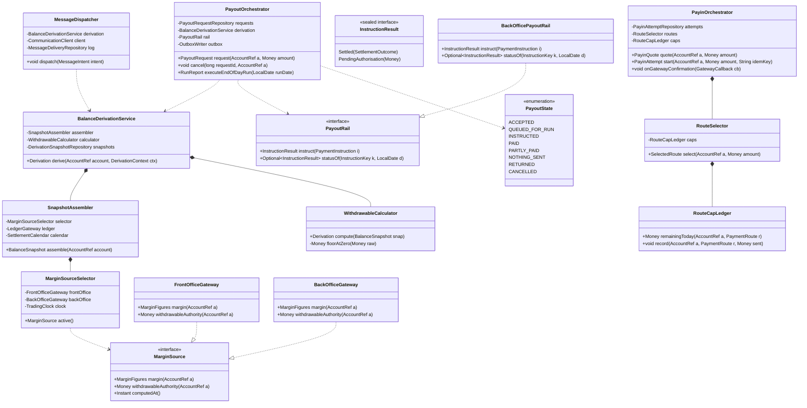

# Backend Low-Level Design — Fund Management System

| | |
|---|---|
| Stage | 5a — backend only. The client half is Stage 5b |
| Upstream | `hld.md` v3 (APPROVED), `tech-stack.md` v3, `hld-review.md` verdict APPROVED_WITH_CONDITIONS (iteration 3) |
| PRD | `docs/specs/001-fund-management-system/product-requirements.md` + 7 parts |
| Vendor contracts | `05-dependencies/vendor-api/` — Kambala Noren (OMS/RMS), TechExcel, Juspay, Communication Service |
| Stack | Java 21, Spring Boot, modular monolith, PostgreSQL single primary, Flyway from V21 |
| Date | 2026-08-21 |

---

## 1. Requirements & Scope

### 1.1 Functional scope of this document

This LLD covers the backend of the six journeys the PRD defines, with **two designed to implementation depth and four to contract depth**. That split is a deliberate call, stated here rather than discovered by a reader:

| Module | Manifest | Depth | Why |
|---|---|---|---|
| **Balance derivation** (`derive()` and the RMS reconciliation) | Included | Full — pseudocode, contracts, state | Every other module reads it, and a wrong figure is the failure the product exists to prevent |
| **Withdrawal and the end-of-day run** | Included | Full — pseudocode, state machine, locking | The only path where being wrong moves money irreversibly |
| Payin | Included | Contract — interfaces, schema, error mapping | Idempotency is the hard part and it is one constraint, stated below |
| Ledger view and export | Included | Contract | A read-through to TechExcel with a plain-language mapping |
| Account health | Included | Contract | Composition over `derive()` output; no independent computation |
| Message dispatch | Included | Contract | The outbox already exists; FMS registers types and a re-evaluation rule |

The four at contract depth carry complete interfaces, schemas, validation and error mapping — enough for the traceability gate and for an engineer to start — but not step-by-step pseudocode. Where a contract-depth module has one genuinely hard mechanism, that mechanism is designed in full.

### 1.2 Non-functional targets

Taken from the PRD and `hld.md` §4.2 and §5; none invented here.

| Target | Value | Source |
|---|---|---|
| First balance visible | 1.5 s p95 | PRD, `[PROPOSED]` |
| Confirmed payin reflected in available margin | 30 s p95 | PRD, bounded by the square-off window |
| Payout status change visible | 1 minute | PRD, `[PROPOSED]` |
| Sustained peak read rate | ~21 rps, ~60 rps burst | `hld.md` §5, derived from assumptions |
| End-of-day payout batch | ~500 requests, one run | `hld.md` §5 |
| Availability | 99.5% monthly | PRD |
| Integrity check | Hourly in market hours, and before the run | `hld.md` §16.4 |

### 1.3 Out of scope — Manifest, Excluded

- **Every client surface.** Stage 5b owns the funds view, the derivation panel, amount entry, the transaction list and the health banner. This document defines what the API returns, not how it is rendered.
- **Ledger entry storage.** TechExcel is the system of record. FMS holds no entries and no double-entry logic.
- **Margin computation.** RMS computes it. FMS reads it.
- **Bank account mutation.** Profile owns add, delete and set-primary. FMS reads the list.
- **Period reconciliation (REQ-406).** Relocated to the system of record; FMS supplies two stamped endpoints.
- **The step-up authentication control.** `hld.md` §8.1 defines the seam; the control belongs to the authentication team.

### 1.4 Open assumptions

Carried from `hld.md` §23 and `hld-review.md`, restated because the design below is shaped by them and a reader must not mistake them for settled.

| # | Assumption | If wrong |
|---|---|---|
| **OA-1** | **RMS's `GetWithdrawalAmt` applies deductions compatible with Rule B4's six terms.** | The reconciliation in §6.2 fails routinely rather than exceptionally, and `UNAVAILABLE` becomes the normal state of the withdrawable figure. This is the highest-consequence open item in this document — `hld-review.md` question 3 |
| **OA-2** | FMS is granted the `whatsapp` channel on the Communication Service | Four requirements lose their channel; `MessageChannel` already models it as a value so the code change is configuration, but the PRD needs amending |
| **OA-3** | Exactly one payout path is configured. §7.6 asserts this at startup rather than assuming it | Rule W9's guarantee is void — two paths instruct independently and the combine step protects nothing |
| **OA-4** | `Reject_Reason` is free text; `RMSData` carries the blocked amount numerically | §4.5's reason mapping degrades to `UNSPECIFIED` for non-margin causes, and REQ-308's naming obligation is met only in the margin case |
| **OA-5** | A trading-calendar source will be nominated before Phase 1 | `SettlementCalendar` throws `CalendarUnavailableException`, `derive()` returns `UNAVAILABLE`, and no mandated return executes. Fails safe, ships nothing |
| **OA-6** | TechExcel's `Ledger` supports a date-bounded query per account with pagination | **This one does not fail safe, and is therefore not really an assumption.** Its failure path — a local entry mirror — reverses a Stage 3 gate decision after two LLDs are approved. Escalated: it must be confirmed against the vendor before Stage 7, and if unsupported the question returns to the HLD rather than being absorbed here. Recorded as a verification task, not a risk to carry |
| **OA-7** | TechExcel's duplication validation on `Payout_Request_Addition` may or may not key on `UserRefNo`; its response is `Input_Value_Validation`, indistinguishable from an input-value rejection | **The design no longer depends on it.** §6.3 reads `Payment Request Status View Update` before reissuing rather than inferring meaning from a refusal. If the duplication check does prove reliable and distinguishable, it becomes a redundant second line rather than a change |

**This LLD proposes no new bounded context.** Every module below sits inside the existing Spring Boot monolith, and the one new persistence area — FMS's own request, attempt and audit tables — is additive to a schema already at V20.

---

## 2. Core Entities & Data Model

### 2.1 Domain entities

| Entity | What it is |
|---|---|
| `AccountRef` | The trader's account identity as FMS holds it — UCC code, never a PAN or bank number |
| `Money` | An integer number of paise with a currency, per taxonomy R5. The only monetary type in the system |
| `BalanceSnapshot` | One immutable capture of every input `derive()` needs, stamped with its source and instant |
| `Derivation` | The output of `derive()`: three figures, six named terms with signs and glosses, a reconciliation verdict |
| `PayoutRequest` | A trader's withdrawal request through its whole life, including both withdrawable figures and both dates |
| `PayinAttempt` | One payment attempt, its route, its outcome and its reason |
| `MovementStateEvent` | An append-only transition of a payin or payout, with actor and reason |
| `PaymentInstruction` | What is sent to the payout rail, carrying the deterministic idempotency key |
| `MessageIntent` | An outbox row: what to send, to whom, on which channel, and the state it asserts |
| `RouteCapUsage` | What this account has already sent on this route today — the cap ledger Juspay cannot provide |

### 2.2 Database schema

Flyway `V21__fms_core.sql` onward. Additive only; no existing table is altered.

```sql
-- V21: withdrawal requests. One row per request, whole lifecycle.
CREATE TABLE fms_payout_request (
    id                      BIGSERIAL PRIMARY KEY,
    account_id              VARCHAR(32)   NOT NULL,
    amount_paise            BIGINT        NOT NULL CHECK (amount_paise > 0),
    state                   VARCHAR(24)   NOT NULL,
    -- Destination pinned at request time (Rule W12). Masked form only (Profile PR-31).
    destination_ref         VARCHAR(64)   NOT NULL,
    destination_masked      VARCHAR(24)   NOT NULL,
    -- Rule W11: what was true at each decision.
    withdrawable_at_request_paise   BIGINT NOT NULL,
    withdrawable_at_settle_paise    BIGINT,
    -- REQ-303: quoted vs actual, the whole mitigation for a rated PRD risk.
    arrival_date_quoted     DATE          NOT NULL,
    credited_on             DATE,
    -- Rule C8: two references that may never share a value.
    bank_reference          VARCHAR(64),
    fms_reference           VARCHAR(32)   NOT NULL,
    settlement_reason_code  VARCHAR(48),
    settlement_reason_text  TEXT,
    amount_sent_paise       BIGINT,
    requested_at            TIMESTAMPTZ   NOT NULL DEFAULT now(),
    closed_at               TIMESTAMPTZ,
    version                 INTEGER       NOT NULL DEFAULT 0,

    CONSTRAINT fms_payout_refs_differ
        CHECK (bank_reference IS NULL OR bank_reference <> fms_reference),
    CONSTRAINT fms_payout_sent_within_request
        CHECK (amount_sent_paise IS NULL OR amount_sent_paise <= amount_paise)
);

-- Rule W4 lives here, not in a service method. Rule W3 removed reservation, which
-- left this as the only thing preventing a trader committing the same money twice.
CREATE UNIQUE INDEX fms_payout_one_open_per_account
    ON fms_payout_request (account_id)
    WHERE state IN ('ACCEPTED', 'QUEUED_FOR_RUN', 'INSTRUCTED');

CREATE INDEX fms_payout_run_scan
    ON fms_payout_request (state, requested_at)
    WHERE state IN ('ACCEPTED', 'QUEUED_FOR_RUN');

CREATE UNIQUE INDEX fms_payout_fms_reference ON fms_payout_request (fms_reference);
```

```sql
-- V22: payin attempts.
CREATE TABLE fms_payin_attempt (
    id                  BIGSERIAL PRIMARY KEY,
    account_id          VARCHAR(32)  NOT NULL,
    amount_paise        BIGINT       NOT NULL CHECK (amount_paise > 0),
    route               VARCHAR(24)  NOT NULL,
    state               VARCHAR(24)  NOT NULL,
    -- Rule A6: one credit however many confirmations arrive.
    gateway_payment_ref VARCHAR(96),
    outcome_code        VARCHAR(48),
    source_masked       VARCHAR(24),
    started_at          TIMESTAMPTZ  NOT NULL DEFAULT now(),
    resolved_at         TIMESTAMPTZ,
    version             INTEGER      NOT NULL DEFAULT 0
);

-- The idempotency guarantee for Rule A6. A second confirmation for one payment
-- collides here rather than producing a second credit.
CREATE UNIQUE INDEX fms_payin_gateway_ref
    ON fms_payin_attempt (gateway_payment_ref)
    WHERE gateway_payment_ref IS NOT NULL;

CREATE INDEX fms_payin_account_recent ON fms_payin_attempt (account_id, started_at DESC);
```

```sql
-- V23: the cap ledger Juspay cannot provide (REQ-701).
CREATE TABLE fms_route_cap_usage (
    account_id    VARCHAR(32) NOT NULL,
    route         VARCHAR(24) NOT NULL,
    usage_date    DATE        NOT NULL,
    sent_paise    BIGINT      NOT NULL DEFAULT 0 CHECK (sent_paise >= 0),
    PRIMARY KEY (account_id, route, usage_date)
);
```

```sql
-- V24: append-only movement history (REQ-405). Monthly partitions; retention is a
-- partition drop rather than a delete sweep over a live table.
CREATE TABLE fms_movement_state_event (
    id             BIGSERIAL,
    movement_kind  VARCHAR(8)   NOT NULL,       -- PAYIN | PAYOUT
    movement_id    BIGINT       NOT NULL,
    from_state     VARCHAR(24),
    to_state       VARCHAR(24)  NOT NULL,
    reason_code    VARCHAR(48),
    reason_text    TEXT,
    actor          VARCHAR(32)  NOT NULL,       -- USER | SYSTEM | TECHEXCEL | RMS | GATEWAY
    occurred_at    TIMESTAMPTZ  NOT NULL DEFAULT now(),
    PRIMARY KEY (id, occurred_at)
) PARTITION BY RANGE (occurred_at);

CREATE INDEX fms_mse_movement ON fms_movement_state_event (movement_kind, movement_id, occurred_at);
```

```sql
-- V25: derivation snapshots. Makes a past figure reproducible months later (Rule W11).
CREATE TABLE fms_derivation_snapshot (
    id                  BIGSERIAL PRIMARY KEY,
    account_id          VARCHAR(32)  NOT NULL,
    computed_at         TIMESTAMPTZ  NOT NULL,
    source              VARCHAR(16)  NOT NULL,   -- FRONT_OFFICE | BACK_OFFICE
    inputs              JSONB        NOT NULL,
    withdrawable_paise  BIGINT,
    rms_figure_paise    BIGINT,
    reconciliation      VARCHAR(16)  NOT NULL,   -- RECONCILED | DIVERGENT | UNAVAILABLE
    context             VARCHAR(32)  NOT NULL    -- PAYOUT_REQUEST | SETTLEMENT | MESSAGE | VIEW
);

CREATE INDEX fms_snapshot_account ON fms_derivation_snapshot (account_id, computed_at DESC);
```

```sql
-- V25a: scheduled message intents. The existing outbox dispatches promptly after
-- commit; the shortfall ladder has step offsets and the dues sequence runs day 0,
-- 7, 14, 30 then monthly, so an intent must be able to wait without being lost and
-- without being sent once the state it asserts has resolved (REQ-622).
CREATE TABLE fms_message_intent (
    id              BIGSERIAL PRIMARY KEY,   -- IS the Communication Service request_id
    account_id      VARCHAR(32)  NOT NULL,
    template_key    VARCHAR(64)  NOT NULL,
    channel         VARCHAR(16)  NOT NULL,
    -- The state this message asserts. Re-checked at dispatch; a superseded intent
    -- is dropped rather than sent and retracted (REQ-622).
    asserted_state  VARCHAR(32)  NOT NULL,   -- SHORTFALL_OPEN | DUES_OUTSTANDING | PAYIN_PENDING …
    -- The occurrence this intent belongs to. NOT NULL is load-bearing: see fms_intent_once.
    -- A caller with no natural occurrence key synthesises a stable one (a daily digest uses
    -- its date) rather than leaving it empty.
    asserted_ref    VARCHAR(64)  NOT NULL CHECK (asserted_ref <> ''),
    scheduled_for   TIMESTAMPTZ  NOT NULL,   -- now() for immediate; the offset for a ladder step
    dispatched_at   TIMESTAMPTZ,
    dropped_reason  VARCHAR(48),
    created_at      TIMESTAMPTZ  NOT NULL DEFAULT now()
);

-- The relay's only query: what is due and not yet resolved.
CREATE INDEX fms_intent_due
    ON fms_message_intent (scheduled_for)
    WHERE dispatched_at IS NULL AND dropped_reason IS NULL;

-- One intent per template per occurrence per channel. A ladder step written twice
-- for one shortfall collides here rather than sending twice.
--
-- This works only because asserted_ref is NOT NULL. PostgreSQL treats NULLs as
-- distinct in a unique index, so a nullable asserted_ref would let unlimited
-- duplicates exist for every intent carrying no occurrence reference — the exact
-- case this index prevents, with the trader receiving the message twice.
-- PostgreSQL 15's NULLS NOT DISTINCT is deliberately not used: no server version is
-- pinned, and a constraint that stops constraining on an older server is worse than
-- one that cannot express the null case at all.
CREATE UNIQUE INDEX fms_intent_once
    ON fms_message_intent (account_id, template_key, channel, asserted_ref);
```

**How this relates to the existing outbox.** The estate's outbox and relay are reused, not replaced —
the intent row is written in the same transaction as the state change that caused it, which is what
makes the message and the state atomic. What FMS adds is the `scheduled_for` predicate and the
re-evaluation step: the relay claims only rows whose time has come, and before submitting it re-reads
`asserted_state` for the account. If the shortfall cleared while step 2 waited, step 2 is marked
`dropped_reason = STATE_RESOLVED` and never sent. That is REQ-622's drop-rather-than-retract, and it is
why the schedule cannot be a plain delayed job.

`fms_message_intent.id` is the `request_id` submitted to the Communication Service, so a relay retry
after a crash replays the same key and the service returns the original result rather than sending
again. Note that this is the **submission** idempotency; the service itself never retries a failed
send, so §7.9 covers the resubmission path separately.

```sql
-- V26: message delivery log (REQ-623, REQ-625).
CREATE TABLE fms_message_delivery (
    id                BIGSERIAL,
    account_id        VARCHAR(32)  NOT NULL,
    outbox_id         BIGINT       NOT NULL,     -- IS the Communication Service request_id
    template_key      VARCHAR(64)  NOT NULL,
    template_id       VARCHAR(64),               -- the exact version the service resolved
    channel           VARCHAR(16)  NOT NULL,
    notification_id   VARCHAR(64),
    status            VARCHAR(24)  NOT NULL,
    suppression_code  VARCHAR(48),
    submitted_at      TIMESTAMPTZ  NOT NULL DEFAULT now(),
    resolved_at       TIMESTAMPTZ,
    PRIMARY KEY (id, submitted_at)
) PARTITION BY RANGE (submitted_at);

CREATE UNIQUE INDEX fms_msg_outbox_channel
    ON fms_message_delivery (outbox_id, channel, submitted_at);
```

**Index justification.** `fms_payout_one_open_per_account` serves no query — it is a business rule. `fms_payout_run_scan` serves the end-of-day sweep's only query. `fms_payin_gateway_ref` serves no read either; it is Rule A6's enforcement. `fms_payin_account_recent` and `fms_mse_movement` serve the transaction detail view. `fms_snapshot_account` serves the "why did I receive less?" question months later.

**Denormalisation.** `destination_masked` duplicates a value Profile owns. Justified: Profile PR-31 masks server-side and a payout message months later must still name the account without a live Profile call, and Rule W12 pins the destination at request time — so the masked form is a historical fact, not a cache.

---

## 3. Class Diagram & Design Patterns



### 3.1 Design patterns, and why each earns its place

| Pattern | Where | Why this design needs it |
|---|---|---|
| **Strategy** | `MarginSource` with front-office and back-office implementations, chosen by `MarginSourceSelector` | The HLD's hard cutover means the *same question* is answered by a different system depending on the clock. A conditional inside the assembler would put a time check in the middle of a money computation; a strategy puts the decision in one place and makes "which source answered" a value the snapshot carries, which REQ-107 must render |
| **Strategy** | `PayoutRail`, with exactly one implementation registered | Three systems can execute a payout (`hld.md` R8). One interface with a startup assertion that exactly one bean exists (§7.6) turns "we only use one" from a comment into a failure to boot |
| **Repository** | All persistence interfaces | Standard, and specifically so the orchestrators can be unit-tested against in-memory doubles without a database, which §8 relies on |
| **State** (as an explicit transition table, not a class per state) | `PayoutState` and §7.5's matrix | Eight states with a fixed legal-transition set, and the illegal transitions are the interesting ones. A table is diffable and testable; eight state classes would be ceremony around a lookup |
| **Template Method** | `AbstractVendorGateway` wrapping every outbound call with timeout, circuit breaker, **paise conversion in both directions**, and error translation | Four vendors, four different error vocabularies, one anti-corruption obligation. Without it, `RMSData` parsing and Juspay reason mapping leak into orchestrators |
| **Transactional Outbox** | `OutboxWriter` | Already in the estate. The message intent and the state change commit together or not at all, which is what REQ-622's drop-before-dispatch needs |

Deliberately **not** used: no `FundsManager`, no `PaymentHelper`. Each class above names one responsibility, and the two that could have become god objects — the derivation and the payout orchestrator — are split into an assembler, a calculator and an orchestrator that owns only sequencing.

---

## 4. API Contract & Edge Layer

REST over HTTPS behind the platform gateway, per `hld.md` §8. All paths prefixed `/api/v1`.

### 4.1 Endpoints

| Verb | Path | Purpose |
|---|---|---|
| GET | `/funds/summary` | Three balances, the full derivation, computed-at with source, per-action availability |
| GET | `/funds/margin/breakdown` | Named components, blocked money by source and commitment state, per-trade-kind figures |
| POST | `/funds/payin/quote` | Selected route, arrival date, cost, applicable minimum including the debt waiver |
| GET | `/funds/payin/limits` | Remaining headroom per route today |
| POST | `/funds/payin` | Start an attempt. `Idempotency-Key` header required |
| POST | `/funds/payin/callback` | Gateway confirmation. Signature-verified before the body is parsed |
| GET | `/funds/payout/quote` | Arrival date and the Rule W3a shrink warning |
| POST | `/funds/payout` | Create the single open request |
| DELETE | `/funds/payout/{id}` | Cancel before the run |
| GET | `/funds/transactions` | Either view, filtered by period |
| GET | `/funds/transactions/{id}` | Full state timeline with reasons and references |
| GET | `/funds/statement.csv` | Export of exactly the view and period on screen |
| GET | `/funds/health` | Dues, blockers, shortfall and its deadline |

### 4.2 Request and response DTOs

```java
public record MoneyDto(long paise, String currency) { }          // R5: never a float

public record DerivationTermDto(
        String termCode,          // SETTLED_LEDGER | ADDED_TODAY | UNSETTLED_PROCEEDS |
                                  // CHARGES_UNPOSTED | SHORTFALL_OUTSTANDING | COLLATERAL_MET
        String sign,              // PLUS | MINUS
        MoneyDto amount,
        String glossKey) { }      // resolved to copy by the client; never English here

public record FundsSummaryResponse(
        MoneyDto ledgerBalance,
        MoneyDto availableMargin,
        MoneyDto withdrawable,             // null when reconciliation != RECONCILED
        String   withdrawableState,        // RECONCILED | DIVERGENT | UNAVAILABLE
        List<DerivationTermDto> derivation,
        String   largestDeductionTermCode, // REQ-102: named without being asked
        Instant  computedAt,
        String   computedBy,               // FRONT_OFFICE | BACK_OFFICE — REQ-107
        boolean  stale,
        List<ActionAvailabilityDto> actions,
        // Added 21 Aug 26 by the Stage 5c consistency pass. Both are data the client
        // needs to render a requirement 5a had marked wholly presentational — which
        // was the mistake: presentational does not mean data-free.
        Long     lastSuccessfulDepositPaise,  // REQ-201, Rule A1. null on first deposit
        String   postFundingDestination) { } // REQ-709 / REQ-710. null = plain dismissal

public record ActionAvailabilityDto(
        String action,            // ADD_FUNDS | WITHDRAW | CLEAR_DUES
        boolean available,
        String  blockedReasonCode,      // e.g. NOTHING_WITHDRAWABLE, NO_VERIFIED_BANK_ACCOUNT
        String  responsibleTermCode) { }

public record PayoutRequestCommand(MoneyDto amount, String destinationRef) { }

public record PayoutRequestResponse(
        long requestId,
        String fmsReference,
        LocalDate arrivalDateQuoted,
        String shrinkWarningKey,   // Rule W3a — must be shown before commitment
        String state) { }

public record PayinQuoteResponse(
        String route,                    // chosen server-side; REQ-702
        LocalDate expectedArrivalDate,
        MoneyDto cost,
        MoneyDto amountReaching,
        MoneyDto applicableMinimum,      // REQ-703: reflects the debt waiver
        MoneyDto remainingHeadroomToday) { }
```

### 4.3 Request handling and validation

Validation runs at two layers, and the split is deliberate: **shape at the edge, rule in the domain.** A rule enforced only at the edge is a rule a second caller can skip.

| Check | Layer | Behaviour |
|---|---|---|
| Well-formed JSON, required fields, `paise > 0`, currency `INR` | Edge — Bean Validation on the DTO | `400 invalid_request` |
| `Idempotency-Key` present on `POST /funds/payin` | Edge — interceptor | `400 missing_idempotency_key` |
| Callback signature | Edge — filter, **before the body is parsed** | `401 bad_signature`. The PRD's security outcome requires authenticity established before contents are read |
| Amount within the withdrawable figure | Domain — `PayoutOrchestrator.request` | `422 amount_exceeds_withdrawable`, carrying the derivation |
| One open request per account | **Database** — partial unique index | Caught as a constraint violation, mapped to `409 request_already_open` |
| Destination is a verified account **at this instant** | Domain — Profile call, not a cached list (PR-28) | `422 destination_not_verified` |
| Route has headroom today | Domain — `RouteCapLedger` | Auto re-route (Rule A12), or `422 no_route_available` |
| Minimum, with the debt waiver | Domain — `PayinOrchestrator.quote` and re-checked in `start` | `422 below_minimum` |
| Figures not stale | Domain — `derive()` precondition | `409 figures_stale`, stating the age |

**Auth and authz.** Every endpoint requires a validated platform JWT; the gateway rejects an absent or expired token before FMS sees it. **Authorisation is per object and enforced in the service layer, never inferred from the path.** `AccountRef` is resolved from the token's subject claim, and every repository method takes it as a parameter — so `GET /funds/transactions/{id}` for another trader's movement returns `404` rather than `403`, because confirming existence would itself leak. Support access is a distinct role with read-only scope and no ability to originate a movement; every support read is logged with the agent's identity.

### 4.4 Error responses

Every domain exception has exactly one edge representation. No exception reaches the client as a stack trace or a 500 unless it is genuinely unhandled.

| Exception | Status | Code | Notes |
|---|---|---|---|
| `WithdrawableUnavailableException` | 409 | `withdrawable_unavailable` | Carries the reconciliation verdict — REQ-102's error path |
| `FiguresStaleException` | 409 | `figures_stale` | Carries `computedAt` and the source |
| `RequestAlreadyOpenException` | 409 | `request_already_open` | Rule W4, surfaced from the unique index |
| `AmountExceedsWithdrawableException` | 422 | `amount_exceeds_withdrawable` | Carries the derivation so the client need not re-fetch |
| `DestinationNotVerifiedException` | 422 | `destination_not_verified` | Profile PR-28 |
| `NoRouteAvailableException` | 422 | `no_route_available` | Consumes no attempt |
| `BelowMinimumException` | 422 | `below_minimum` | States the applicable minimum after the waiver |
| `CalendarUnavailableException` | 503 | `calendar_unavailable` | OA-5. Fails safe rather than guessing a date |
| `VendorUnavailableException` | 503 | `upstream_unavailable` | Names which upstream, not which vendor |
| `RequestNotCancellableException` | 409 | `not_cancellable` | States why — REQ-305 |

### 4.5 Mapping the settlement outcome to a reason the user can read

REQ-308 requires the amount requested, the amount sent, and the deduction accounting for the gap. TechExcel returns `Amount`, `AUTH_DUE_AMT`, `RMSData`, `Reject` and `Reject_Reason`.

```
if Reject = 1                          -> NOTHING_SENT, reason from mapping below
else if AUTH_DUE_AMT < Amount          -> PARTLY_PAID
     and RMSData > 0                   -> reason MARGIN_BLOCKED, quantified by RMSData
     and RMSData = 0                   -> reason from Reject_Reason mapping
else                                   -> PAID
```

`Reject_Reason` is free text (OA-4). It is matched against a configured phrase-to-code table and, on no match, recorded verbatim in `settlement_reason_text` with `settlement_reason_code = UNSPECIFIED`. **The verbatim text is never shown to the trader** — an unmapped back-office string is not user-facing copy. The user sees the generic partial-settlement message; the unmapped phrase raises an operational alert so the table can be extended. This is how OA-4 degrades without either lying to the user or losing the information.

---

## 5. SOLID Breakdown

**SRP.** `SnapshotAssembler` gathers inputs; `WithdrawableCalculator` computes; `BalanceDerivationService` sequences and persists the snapshot. Merging the assembler into the calculator would put vendor I/O inside a pure function, and the property tests in §8 depend on that function being pure — they generate snapshots directly and assert the derivation reconciles, which is impossible if computing requires a network call.

**OCP.** `MarginSource` and `PayoutRail` are the extension points. A second payout rail is a new implementation and a configuration change, with no edit to `PayoutOrchestrator` — which matters because `hld.md` R8 records that two other rails already exist and could become the chosen one.

**LSP.** `FrontOfficeGateway` and `BackOfficeGateway` are substitutable because `MarginSource` is defined in terms of what both genuinely provide, and both must return a `computedAt`. Neither may return a figure without one, so a caller can never accidentally treat back-office data as live.

**ISP.** `MarginSource` deliberately excludes payout methods even though Noren offers `WithdrawFunds`, because `BackOfficeGateway` also implements `MarginSource` and would otherwise be forced to implement payout methods it must not expose. The payout capability is a separate `PayoutRail` interface, which is why exactly one implementation can be registered.

**DIP.** `PayoutOrchestrator` depends on `PayoutRail`, `PayoutRequestRepository` and `BalanceDerivationService` — all abstractions, all constructor-injected. The concrete `BackOfficePayoutRail` is wired by Spring configuration and asserted singular at startup (§7.6), so the high-level payout policy has no compile-time knowledge of which vendor executes it.

---

## 6. Interfaces & Skeleton Code

### 6.1 The derivation contract

```java
public interface MarginSource {
    /** @throws VendorUnavailableException when the source cannot be reached. */
    MarginFigures margin(AccountRef account);

    /**
     * RMS's own answer to what may leave. The AUTHORITY, per hld.md §8.0 —
     * Rule B4's terms explain this figure, they do not override it.
     * @throws VendorUnavailableException when unreachable
     */
    Money withdrawableAuthority(AccountRef account);

    /** Never null. A figure without its instant cannot satisfy REQ-107. */
    Instant computedAt();

    MarginSourceKind kind();
}
```

### 6.2 `derive()` — full pseudocode

This is the method every other module depends on, so it is written out in full.

```java
public Derivation derive(AccountRef account, DerivationContext ctx) {
    // 1. Assemble one immutable input set. Every consumer of this computation
    //    sees identical inputs — that is what makes a screen and a message agree.
    BalanceSnapshot snap;
    try {
        snap = assembler.assemble(account);          // may throw CalendarUnavailable
    } catch (CalendarUnavailableException e) {
        return Derivation.unavailable(UNAVAILABLE_NO_CALENDAR);   // OA-5, fails safe
    }

    // 2. Staleness is a first-class outcome, not an error. REQ-107 requires the age
    //    to be rendered; the refusal to act on stale figures is the caller's, not ours.
    boolean stale = snap.age().compareTo(snap.source().expectedRefreshInterval()) > 0;

    // 3. Compute the six terms. Pure function over the snapshot: no I/O below here.
    Derivation d = calculator.compute(snap);

    // 4. Reconcile against RMS's authority (hld.md §8.0).
    //    Rule B4 explains what may leave; it does not decide it.
    Money authority = snap.withdrawableAuthority();
    if (authority == null) {
        d = d.withReconciliation(UNAVAILABLE);
    } else if (d.withdrawable().equals(authority)) {
        d = d.withReconciliation(RECONCILED);
    } else {
        // The two disagree. We do NOT pick a winner — the PRD's stale-figures edge
        // case forbids it, and either number could be the wrong one.
        d = d.withReconciliation(DIVERGENT)
             .withWithdrawable(null);                // nothing may be withdrawn
        metrics.counter("fms.derivation.divergent").increment();
        alerts.raise(DIVERGENCE, account, d.withdrawableRaw(), authority);
    }

    // 5. Persist the snapshot for every context that could later be disputed.
    //    A view is not disputed; a payout request months later is (Rule W11).
    if (ctx.isDecisionPoint()) {
        snapshots.save(DerivationSnapshot.of(account, snap, d, ctx));
    }

    return d.withStale(stale).withComputedAt(snap.computedAt()).withSource(snap.source());
}
```

```java
// WithdrawableCalculator — pure, and the reason §8 can property-test it.
public Derivation compute(BalanceSnapshot s) {
    List<DerivationTerm> terms = List.of(
        term(SETTLED_LEDGER,        PLUS,  s.settledLedgerBalance()),
        term(ADDED_TODAY,           MINUS, s.moneyAddedToday()),
        term(UNSETTLED_PROCEEDS,    MINUS, s.unsettledSaleProceeds()),
        term(CHARGES_UNPOSTED,      MINUS, s.chargesIncurredNotPosted()),
        term(SHORTFALL_OUTSTANDING, MINUS, s.marginShortfall()),      // the sixth term
        term(COLLATERAL_MET,        PLUS,  s.committedMarginMetFromCollateral()));

    long raw = terms.stream().mapToLong(DerivationTerm::signedPaise).sum();

    // Rule B9's single exception: the withdrawable figure floors at zero, because
    // "what can reach my bank today" has no negative answer. The debt itself is
    // still shown as a debt by the health module, and the shortfall term above
    // stays visible — nothing is hidden, only the answer is bounded.
    Money withdrawable = Money.ofPaise(Math.max(0L, raw));

    return new Derivation(s.ledgerBalance(), s.availableMargin(), withdrawable,
                          terms, largestDeduction(terms));
}
```

### 6.3 The end-of-day run — full pseudocode

```java
@Scheduled(cron = "${fms.payout.run-cron}")
public RunReport executeEndOfDayRun(LocalDate runDate) {
    // Exactly one runner. The estate's existing single-runner arrangement.
    if (!leaderLock.tryAcquire("fms-payout-run", runDate)) return RunReport.skipped();

    // Precondition, not a report: the integrity check gates money leaving.
    if (!integrityCheck.passedFor(runDate)) {
        alerts.raise(INTEGRITY_FAILED_RUN_ABORTED, runDate);
        return RunReport.aborted(INTEGRITY_FAILED);
    }

    RunReport report = RunReport.starting(runDate);

    for (AccountRef account : requests.accountsWithOpenRequests(runDate)) {
        try {
            // Rule W9: a user request and a mandated return due today are met from
            // the same balance in ONE instruction. Combining before instructing is
            // what makes "the same money is never sent twice" structural.
            Optional<PayoutRequest> own = requests.openFor(account);
            Optional<MandatedReturn> swept = mandatedReturns.dueOn(runDate, account);
            if (own.isEmpty() && swept.isEmpty()) continue;

            Money combined = Money.sum(own.map(PayoutRequest::amount).orElse(ZERO),
                                       swept.map(MandatedReturn::amount).orElse(ZERO));

            // The instruction key is deterministic and derived from the request and
            // the run date — NOT from local state. Keying on local state would fail
            // precisely when the lost writes are the ones proving we already paid.
            InstructionKey key = InstructionKey.of(own, swept, runDate);   // §6.3a
            PaymentInstruction instruction = PaymentInstruction.of(account, combined,
                    own.map(PayoutRequest::destinationRef).orElseGet(() -> primaryOf(account)),
                    key);

            // READ BEFORE REISSUING. The key alone does not close the guarantee.
            // TechExcel's duplication validation returns Input_Value_Validation — the
            // SAME code as a malformed input value — so a refusal cannot be read as
            // "already paid" rather than "rejected", and those demand opposite actions
            // on money that may already have moved. INSTRUCTED is the only state a
            // crash can strand, so it is the only state that needs the read.
            if (own.map(r -> r.state() == INSTRUCTED).orElse(false)) {
                // Optional.empty() means no record — nothing was instructed under this key.
                // A record that exists but is not yet authorised comes back as
                // PendingAuthorisation, which is a different answer and must not be collapsed
                // into "not found": reissuing against it would instruct the same payout twice.
                Optional<InstructionResult> prior = rail.statusOf(key, runDate);
                if (prior.failed()) {                       // an unread status is not an absent payment
                    report.recordError(account);
                    alerts.raise(PAYOUT_STATUS_UNREADABLE, account);
                    continue;
                }
                if (prior.found()) {                        // the instruction landed before the crash
                    own.ifPresent(r -> applyOutcome(r, prior.outcome(), runDate));
                    report.record(prior.outcome());
                    continue;                               // do NOT reinstruct
                }
                // Not found: the instruction never landed. Fall through and reissue.
            }

            InstructionResult result = rail.instruct(instruction);   // OA-3: exactly one rail

            // Corrected 21 Aug 26. `instruct` previously returned a SettlementOutcome, which
            // assumed the rail settles synchronously. TechExcel does not: Payout_Request_Addition
            // places the entry in an AUTHORISATION QUEUE, and the status view then reports
            // AUTHO = 1 or 0. So the row read straight after a successful post is normally
            // AUTHO = 0 with no authorised amount — which the old mapping read as
            // `AUTH_DUE_AMT < Amount` and reported as PARTLY_PAID with nothing sent, closing the
            // request terminally and telling the trader they had received zero.
            //
            // PendingAuthorisation leaves the request INSTRUCTED. The next run's read-before-
            // reissue step above resolves it — which is the path that already exists for exactly
            // this shape of uncertainty. Nothing is retried and nothing is reissued.
            if (result.isPending()) {
                report.recordPendingAuthorisation(account);
                continue;
            }
            SettlementOutcome outcome = result.settledOutcome().orElseThrow();

            own.ifPresent(r -> applyOutcome(r, outcome, runDate));
            swept.ifPresent(m -> mandatedReturns.record(m, outcome));
            report.record(outcome);

        } catch (VendorUnavailableException e) {
            // The rail is down. Requests stay OPEN and cancellable, queued for the
            // next run (REQ-619's fifth outcome). This is the only outcome that does
            // not close the request, and the trader must be able to change their mind.
            requests.markQueuedForNextRun(account);
            report.recordRailUnavailable(account);
        } catch (Exception e) {
            // One account's failure must never abort the batch for everyone else.
            log.error("payout run failed for account", e);
            report.recordError(account);
            alerts.raise(PAYOUT_RUN_ACCOUNT_FAILED, account);
        }
    }

    return report.finish();
}

private void applyOutcome(PayoutRequest r, SettlementOutcome o, LocalDate runDate) {
    // One transaction: the state change and its message intent commit together,
    // or neither does. This is what REQ-622's drop-before-dispatch relies on.
    //
    // The row is locked for the duration of the transition, matching §7.4. A cancel
    // arriving concurrently blocks here rather than racing; whichever acquires first
    // wins and the loser meets a state it may not transition from. The repository's
    // version column remains for detecting a stale in-memory copy — it is a
    // consistency check, not the concurrency mechanism.
    txTemplate.executeWithoutResult(status -> {
        requests.lockForUpdate(r.id());            // SELECT ... FOR UPDATE — §7.4
        r.settle(o.state(), o.amountSent(), o.reasonCode(), o.reasonText(),
                 derivation.derive(r.account(), SETTLEMENT).withdrawableOrNull());
        r.recordCreditedOn(o.creditedOn());       // REQ-303's actual, against the quote
        r.recordBankReference(o.bankReference()); // Rule C8: never equal to fmsReference
        requests.save(r);
        events.append(PAYOUT, r.id(), r.state(), o.reasonCode(), SYSTEM);
        outbox.write(MessageIntent.forSettlement(r, o));   // REQ-617/618/619
    });
}
```

### 6.3a The instruction key, and the twenty digits it must fit in

`Payout_Request_Addition` types `UserRefNo` as **Integer, length 20**. A composite key must therefore
serialise into at most twenty decimal digits, and an encoding that silently overflows or truncates would
deduplicate one account's payout against another's — a missing payout with no error anywhere.

```
UserRefNo = (instruction_seq * 100000) + run_date_ordinal

  instruction_seq   15 digits available — from fms_payout_request.id, or from a
                    dedicated sequence offset above the request range for a
                    mandated return that has no user request behind it
  run_date_ordinal   5 digits — days since 2026-01-01, giving 99,999 days
```

Fifteen digits carry 10^15 instructions; at the assumed 500 payouts a day that outlasts the firm. The
two components occupy disjoint positions, so no two distinct (instruction, run date) pairs collide.

The separate sequence for mandated returns exists because "use the request id" has no answer for a sweep
nobody requested, and reusing a request id from another account would be the collision this encoding is
designed to prevent.

**`InstructionKey.of` asserts the result is below 10^20 and throws `FmsInvariantException` otherwise.**
An overflow is not a user error and must never be truncated into a valid-looking key.

### 6.3b `EntryDescriptionMapper` — REQ-401's whole substance

REQ-401 requires every money event to reach the account holder in language they understand rather than
as a settlement string, and the PRD names the failure to do so as one of four documented competitor
defects. That obligation is this class, so it gets a contract rather than a mention.

```java
public interface EntryDescriptionMapper {
    /**
     * Map a back-office entry to a plain-language copy key plus its secondary detail.
     *
     * Inputs are TechExcel's own fields: TRANS_TYPE (R | P | …), voctype (the
     * margin credit/debit flag), NARRATION, and BOOKTYPECODE.
     *
     * Precondition: entry is non-null and carries at least TRANS_TYPE.
     * Never returns null. An unmapped combination returns a Description whose
     *   copyKey is ENTRY_DESCRIPTION_UNAVAILABLE and whose secondaryDetail carries
     *   the underlying reference — the PRD's edge case requires the raw reference
     *   to be shown WITH an explicit statement that a plain description is not yet
     *   available, never presented as though it were the description (Rule L3).
     * Throws nothing. A mapping failure is a product state, not an exception.
     * Consistency: pure. No I/O, no transaction. The mapping table is configuration
     *   loaded at startup and refreshed on change, so a new entry type is a settings
     *   change rather than a release.
     */
    Description describe(LedgerEntry entry);

    record Description(String copyKey,
                       Map<String, String> parameters,   // amounts already in paise
                       String secondaryDetail,           // VOUCHERNO / SETTLEMENT_NO / BILLNO
                       boolean userCaused) { }           // Rule L4
}
```

`userCaused` is part of the mapping rather than a separate concern because Rule L4 requires the
distinction to be visible without opening the entry, and only the mapper knows that a mandated
settlement return and a user-requested payout are both `TRANS_TYPE = P`.

**Every unmapped combination is counted and alerted**, because an entry type appearing in production
that the table does not know about is a requirement gap the user is currently seeing.

### 6.4 Repository contracts

Signatures alone are not a contract. Each method below states its preconditions, its not-found behaviour, what it throws, and its transactional guarantee.

```java
public interface PayoutRequestRepository {

    /**
     * The single open request for an account, if any.
     * Precondition: account is the authenticated caller's (checked in the service).
     * Not found: returns Optional.empty(). Never throws for absence.
     * Consistency: read-committed is sufficient — a request created concurrently
     *   will be refused by the partial unique index, not by this read.
     * Transaction: joins the caller's transaction; does not commit.
     */
    Optional<PayoutRequest> openFor(AccountRef account);

    /**
     * Persist a new request.
     * Throws RequestAlreadyOpenException, translated from the unique-index violation
     *   on fms_payout_one_open_per_account. The service does NOT pre-check by reading
     *   first — a read-then-write is a race, and the index is the actual guarantee.
     * Throws OptimisticLockException on a stale version for an update.
     * Transaction: REQUIRED. Must run inside the caller's transaction so the outbox
     *   row commits with it.
     */
    PayoutRequest save(PayoutRequest request);

    /**
     * Accounts with a request eligible for the given run.
     * Returns an empty list, never null. Ordered by requested_at for a stable,
     *   repeatable run — a re-run must process in the same order.
     * Consistency: read-committed. A request created after the run starts is not
     *   picked up, which is correct: it belongs to the next run.
     * Transaction: runs in its own read-only transaction; the per-account work
     *   below it opens its own.
     */
    List<AccountRef> accountsWithOpenRequests(LocalDate runDate);

    /**
     * Move a request to QUEUED_FOR_RUN after a rail outage.
     * Precondition: the request is INSTRUCTED or ACCEPTED.
     * Throws IllegalStateTransitionException if it is terminal — a paid request
     *   must never be re-queued.
     * Transaction: REQUIRES_NEW. This must survive the failure that caused it.
     */
    void markQueuedForNextRun(AccountRef account);
}
```

```java
public interface DerivationSnapshotRepository {
    /**
     * Append-only. No update, no delete.
     * Transaction: REQUIRED — a snapshot taken at a decision point must commit with
     *   the decision, or the decision has no evidence behind it.
     */
    void save(DerivationSnapshot snapshot);

    /**
     * The snapshot behind a past figure, for "why did I receive less?" months later.
     * Not found: Optional.empty() — a view-context computation was never persisted,
     *   and its absence is expected rather than exceptional.
     */
    Optional<DerivationSnapshot> forDecision(long payoutRequestId, SnapshotContext ctx);
}
```

---

## 7. Concurrency, Thread-Safety & Edge Cases

### 7.1 Two withdrawal requests arriving together

**Mechanism: the partial unique index, not a lock.** Both transactions insert; one commits, the other gets a constraint violation translated to `RequestAlreadyOpenException` → `409`. No `SELECT ... FOR UPDATE`, no read-then-write, no application-level check.

This is deliberate. Rule W3 removed reservation from the withdrawal path, which left Rule W4 as the only protection against a trader committing the same money twice. A service-layer check would be a race with a window; the index has no window.

### 7.2 A duplicate gateway confirmation

**Mechanism: a unique index on `gateway_payment_ref`.** Rule A6 states that repeat confirmations for one payment are an expected condition, not an exception. The second insert collides, the handler catches the violation, returns `200`, and records nothing further — the caller is a gateway that will retry on anything else.

### 7.3 A trade and a withdrawal in the same moment

**Mechanism: none needed, by design.** Rule W3 means the request holds nothing, so the trade is unaffected and the payout is met from whatever remains at the run. The PRD explicitly calls this the intended behaviour rather than a race. The design's only obligation is disclosure, which Rule W3a places before commitment.

### 7.4 The run executing while a trader cancels

**Mechanism: pessimistic lock on the request row for the duration of the state transition.** `SELECT ... FOR UPDATE` on `fms_payout_request` in both the cancel path and `applyOutcome`. The window is small and the contention is near-zero — one row, twice a day — so a pessimistic lock is cheaper to reason about than an optimistic retry. Whichever acquires first wins, and the loser sees a state it may not transition from and returns `409 not_cancellable` with the reason.

### 7.5 Payout state transitions

| From | To | Trigger | Illegal from |
|---|---|---|---|
| — | `ACCEPTED` | Trader submits | — |
| `ACCEPTED` | `CANCELLED` | Trader cancels | Any terminal state |
| `ACCEPTED` | `INSTRUCTED` | Run instructs the rail | — |
| `ACCEPTED` / `INSTRUCTED` | `QUEUED_FOR_RUN` | Rail unavailable | Any terminal state |
| `QUEUED_FOR_RUN` | `CANCELLED` | Trader cancels — still permitted, REQ-619 | — |
| `INSTRUCTED` | `PAID` | Rail reports sent in full | — |
| `INSTRUCTED` | `PARTLY_PAID` | `AUTH_DUE_AMT < Amount` | — |
| `INSTRUCTED` | `NOTHING_SENT` | `Reject = 1`, or nothing available | — |
| `PAID` / `PARTLY_PAID` | `RETURNED` | Bank refuses after sending | — |

Terminal: `PAID`, `PARTLY_PAID`, `NOTHING_SENT`, `RETURNED`, `CANCELLED`. Any transition not in this table throws `IllegalStateTransitionException`, which is a `500` — it is a bug, not a user error, and must not be presented as one.

`RETURNED` from `PAID` is not a deletion: the original stands and a compensating entry is added (Rule W7, Rule L2), which is why the state machine allows a terminal state to be followed by exactly one more.

### 7.6 Asserting the single payout rail

```java
@Configuration
class PayoutRailConfiguration {
    PayoutRailConfiguration(List<PayoutRail> rails) {
        // hld.md R8 / OA-3: Noren, TechExcel and Juspay can each move money out.
        // Two live rails would instruct independently, and Rule W9's combine-before-
        // instruct step would protect nothing. A comment cannot enforce that; this can.
        if (rails.size() != 1) {
            throw new IllegalStateException(
                "Exactly one PayoutRail must be configured; found " + rails.size()
                + ". Two live rails void Rule W9's no-double-payout guarantee.");
        }
    }
}
```

### 7.7 Exception hierarchy

```
FmsException (RuntimeException)
├── FmsClientException          → 4xx
│   ├── ValidationException           (400)
│   ├── RequestAlreadyOpenException   (409)
│   ├── FiguresStaleException         (409)
│   ├── WithdrawableUnavailableException (409)
│   ├── RequestNotCancellableException (409)
│   └── BusinessRuleException         (422)
│       ├── AmountExceedsWithdrawableException
│       ├── DestinationNotVerifiedException
│       ├── BelowMinimumException
│       └── NoRouteAvailableException
├── FmsUpstreamException        → 503
│   ├── VendorUnavailableException
│   └── CalendarUnavailableException
└── FmsInvariantException       → 500, always alerts
    ├── IllegalStateTransitionException
    ├── DerivationDoesNotReconcileException
    └── IntegrityCheckFailedException
```

`FmsInvariantException` and its subtypes are the ones that page someone. They mean the system reached a state its own rules say is impossible, and the correct response is to stop, not to degrade.

---

### 7.9 A message that is never sent, and nothing says so

The Communication Service **never retries**. It claims a notification and commits that claim before
contacting the provider, so a crash mid-hand-off leaves it unsent rather than sent twice. `failed` is
terminal, and nothing calls back to say a message never left. That trade is right for a one-time
password and wrong for a margin shortfall intimation, which is mandatory and same-day.

**So FMS notices, because nothing else will.** For any intent whose delivery carries a regulatory
obligation, a reconciler polls `GET /v1/notifications/{id}` and acts on the terminal statuses:

| Status | Action |
|---|---|
| `accepted`, `claimed`, `dispatched`, `sent`, `delivered` | Record and stop. Note that on SMS, `delivered` means the vendor accepted — the aggregator publishes no delivery reports, and affected records carry `SYNTHETIC_ACCEPT_NO_DLR`. It is never treated as proof the customer saw it |
| `failed`, `bounced`, `rejected`, `dropped`, `expired` | Terminal non-delivery. **Resubmit under a NEW `request_id`** — replaying the old one returns the original result and sends nothing — and record the attempt chain against the account |
| Still non-terminal past the poll window | Alert. A notification can sit at `dispatched` indefinitely on a channel with no delivery reporting, so a timeout here is a signal to a human rather than a retry |

**Rule C1's two channels are two submissions.** The service sends one channel per call, so a shortfall
intimation is an SMS submission and an email submission with independent `request_id`s that fail
independently. The intimation is treated as **made when at least one reaches a non-terminal-failure
status**; a terminal failure on either is recorded and alerted even when the other succeeded, because a
user reachable on only one channel is a fact support needs (REQ-627).

**And when both fail terminally while the shortfall still stands, a human is paged.** That is the one
case the design cannot resolve by retrying: the account is in an action state, the deadline is live, and
no channel has carried the message. Alerting is not a fallback for delivery — it is an admission that
delivery failed while it still mattered.

## 7.8 Backend coverage of the contract-depth modules

§1.1 promised the four contract-depth modules would carry enough design to be implementable and
traceable. This section delivers that: for each backend-owned requirement, the mechanism that serves
it. Requirements whose substance is presentation are marked **5b** and are deliberately absent from
this document rather than claimed by it.

### Balances and margin

| Req | Backend mechanism |
|---|---|
| REQ-101 | `FundsSummaryResponse` returns three separately named figures. Two equal figures are still returned as two fields — the API has no collapsing behaviour to disable |
| REQ-103 | `/funds/margin/breakdown` returns named components that sum to the stated total; a component RMS cannot supply is returned with `available: false` and its last-known instant, never as zero (Rule B10) |
| REQ-104 | The breakdown returns cash and collateral as separate figures, and `WithdrawableCalculator` has no collateral term other than `COLLATERAL_MET`, so collateral cannot reach the withdrawable figure by construction (Rule B5) |
| REQ-105 | The breakdown returns a deployable figure per trade kind the account is enabled for, sourced from `GetRmsLimits`; a kind the account lacks is omitted from the array rather than returned as zero |
| REQ-106 | Blocked money is returned split on two axes — cash or collateral, position or unexecuted order — as RMS reports them, with the release reflected in the same components (Rule B7) |
| REQ-108 | `COCD` is preserved on every entry ingested from TechExcel and stored on the transaction projection. Nothing renders it this phase; discarding it is what would make the later split impossible |
| REQ-102, REQ-107 | Designed in §6.2. Presentation is **5b** |

### Add funds

| Req | Backend mechanism |
|---|---|
| REQ-201 | **The field is 5b's; the value it opens on is ours.** The summary returns `lastSuccessfulDepositPaise` — the most recent `fms_payin_attempt` in a terminal successful state for the account, or null where none exists, which is Rule A1's first-deposit case. No schema change: V22 already holds it. The quote returns the applicable minimum including the debt waiver. Corrected 21 Aug 26 — this row previously read "5b" outright, and a presentational requirement still needs data |
| REQ-202 | `PayinQuoteResponse` carries the route chosen server-side, the arrival date computed from that route, any cost, and the amount reaching the account. The client is given a decision already made |
| REQ-203 | `PayinOrchestrator.start` calls Profile for the verified list at the moment of the attempt, never a cached copy (PR-28). A payment arriving from an unlisted account is rejected and the reason is recorded on the attempt, so it survives in history |
| REQ-204 | Confirmed money raises available margin via the RMS push; an in-flight attempt is a `fms_payin_attempt` row in a non-terminal state and contributes to no balance (Rule A5) |
| REQ-205, REQ-614 | §4.5's mapping applied to Juspay's outcome, with the six Rule A9a outcomes distinguished. An alternative route is offered only where `RouteCapLedger.remainingToday` covers the amount (Rule A9d) |
| REQ-206 | A reversal is a compensating instruction to TechExcel plus an appended `MovementStateEvent`; no row is updated or deleted (Rule A10). A resulting debit balance is handed to the health module rather than blocking the reversal |
| REQ-207 | While `BalanceSnapshot.marginShortfall()` is non-zero the quote returns the shortfall as the suggested amount and the fastest executable route; a confirmed payin applies to the shortfall on the RMS push rather than waiting for a scheduled process |

### Withdraw funds

| Req | Backend mechanism |
|---|---|
| REQ-302 | §7.1's partial unique index, §7.5's state machine, and §6.3's run. `withdrawable_at_request_paise` records the figure at acceptance (Rule W11) |
| REQ-303, REQ-707 | `arrival_date_quoted` is computed at quote time from `payoutCutoff` against the settlement calendar and stored; `credited_on` records the actual. Where the calendar is unavailable the quote fails rather than defaulting (OA-5) |
| REQ-306 | A bank refusal after sending transitions `PAID → RETURNED` with a compensating instruction; nothing is auto-resent, and where the cause is the destination, `IFSC Validation` supplies the detail that lets the message say the destination needs attention |
| REQ-307 | `MandatedReturn` rows are combined with any open request into one instruction per account per run date (§6.3), which is where Rule W9's guarantee is enforced |
| REQ-301, REQ-305 | Cancellation is §7.4. The always-visible entry point is **5b**; the backend supplies its availability and reason in `ActionAvailabilityDto` |

### Transactions and statements

| Req | Backend mechanism |
|---|---|
| REQ-401 | Entries are read through from TechExcel's `Ledger` and mapped by `EntryDescriptionMapper` from `TRANS_TYPE`, `NARRATION` and `voctype` to a plain-language key; the raw identifiers are carried as secondary detail, never as the description (Rule L3) |
| REQ-402 | `/funds/transactions` takes a `view` parameter — `MOVEMENTS` or `ALL_ENTRIES` — over one running balance, with the period preserved across a switch (Rule L5) |
| REQ-403 | The period is a date range against `VOUCHERDATE`, defaulting to 30 days (Rule L6). An empty period returns an explicit empty result with the period echoed, never a bare empty array (Rule L7). Kind and amount filters are deferred |
| REQ-404 | The running balance is TechExcel's `CLOSING_AMT` per entry, never accumulated by FMS (§9.1b of the HLD). A reversal is returned paired with the entry it reverses, and the original is flagged as reversed so a scanning reader does not count it twice |
| REQ-407 | `/funds/statement.csv` streams the same view and period as the list (Rule L8a), with amounts as unformatted paise-derived decimals, and **no unmasked account number anywhere** (Profile PR-32) |
| REQ-405 | Designed in §2.2 and §6.4 — `fms_movement_state_event` is the timeline REQ-405 requires, which is why intermediate states are written as they happen rather than reconstructed |

### Account health

| Req | Backend mechanism |
|---|---|
| REQ-501 | `/funds/health` returns the amount owed as a distinct field from any availability figure, the entry that caused it, the rate from configuration, and the accrual so far. It composes `derive()` output and computes no figure of its own |
| REQ-502 | The exact amount owed is returned as a payable amount, and `PayinOrchestrator` accepts it below `minAdd` when it settles the debt exactly (REQ-703). Accrual since display is re-read at payment time |
| REQ-505, REQ-706a | Blockers are returned as an ordered list with the one to resolve first named; `ActionAvailabilityDto` marks the funding action unavailable with that reason, which is what lets **5b** replace the path rather than disable it |
| REQ-506 | The shortfall amount and its deadline come from the RMS snapshot; the sixth derivation term is what makes the withdrawable consequence reconcilable (§6.2) |
| REQ-503 | **Not designed.** Requires forward visibility of a scheduled charge, which EB-6 has not established. Deliberately absent rather than stubbed |
| REQ-504 | **5b** |

### Communications

| Req | Backend mechanism |
|---|---|
| REQ-601, REQ-604 | The ladder is three `MessageIntent` rows written against the shortfall event with a scheduled dispatch offset, capped at three SMS per day. An absent WhatsApp opt-in drops that step and never delays the others; SMS and email are two submissions (§4.1 of the HLD's contract note) |
| REQ-602 | Each intent carries the exact amount as a template parameter and a deep-link target resolved against the funds screen, not against the figures held when it was queued |
| REQ-603, REQ-613, REQ-615 | Email intents carry the figures as separate named parameters produced by one `derive()` call, so the message and the screen are the same computation rather than two that agree |
| REQ-608, REQ-609 | The dues schedule is day 0, 7, 14, 30 then monthly, with the SMS band decided by amount against ₹500; clearing the debt cancels the remaining intents via REQ-622's re-evaluation rather than sending and retracting |
| REQ-611 | Two intents only — 30 minutes after start, and at write-off — both dropped if the payin resolves first |
| REQ-612 | Payin confirmation parameters are the amount and `source_masked`; no template carries a balance, and the Communication Service rejects an undeclared parameter (taxonomy R4, R5) |
| REQ-616, REQ-618, REQ-620 | Channel is resolved from the outcome: a user cancellation is email-only; every terminal message carries where the money is and `bank_reference` where one exists, never `fms_reference` in its place (Rule C8) |
| REQ-621, REQ-622 | One `derive()` call per intent at dispatch, and the relay re-evaluates the asserted state before submitting, dropping a superseded intent |
| REQ-623 | `fms_message_delivery`, one row per submission per channel, carrying status, `template_id` and any suppression reason |
| REQ-624 | Opt-in is read from Profile with its date and capture surface; absence drops the step and is recorded as a suppression rather than a failure |
| REQ-625 | `template_id` returned by the Communication Service is stored per delivery — the exact version, so a delivered message is reconstructable without FMS versioning templates itself |
| REQ-626 | Preferences gate the optional channels only; the regulatory intimation path ignores them entirely (Rule C13) |
| REQ-627 | An email bounce with no WhatsApp opt-in sets a reachability flag on the account, which `ActionAvailabilityDto` surfaces so the banner cannot be dismissed |

### Configuration

| Req | Backend mechanism |
|---|---|
| REQ-701 | `fms_route_cap_usage`, incremented on every accepted attempt and read by `RouteSelector`. Juspay cannot supply this; FMS owns it |
| REQ-702 | `RouteSelector.select` chooses against amount and remaining headroom; the API exposes no route parameter, so a client cannot choose one |
| REQ-703 | The waiver is applied in `quote` and re-checked in `start`, so it cannot be bypassed by calling the second directly |
| REQ-706 | The primary account is the default destination and default source, read from Profile per request; a change never redirects a pinned request (Rule W12), and FMS exposes accounts with money in flight so Profile can enforce PR-33 and Rule G4 |
| REQ-708 | The rate is read from configuration on each render; while it remains a stand-in, no production message quoting it is dispatched — enforced as a dispatch precondition, not a copy convention |
| REQ-709, REQ-710 | The summary returns `postFundingDestination` — the configured value, or null. **The branch is 5b's; the value is ours.** Corrected 21 Aug 26 after the consistency pass found the client reading a field this document had not defined |
| REQ-704, REQ-705 | Profile's, not FMS's |

## 8. Test Strategy

### 8.1 Unit tests

**`WithdrawableCalculator` — property-based**, because it is pure and because the PRD makes its exactness an invariant:

- For any generated snapshot, the six signed terms sum to the pre-floor figure.
- The returned withdrawable figure is never negative (Rule B9's exception).
- Flooring engages only when the raw sum is below zero, and the shortfall term stays visible when it does.
- All arithmetic is in paise; no test may construct a `Money` from a floating-point value.

**`BalanceDerivationService`** — example-based, one per branch of §6.2: calendar unavailable returns `UNAVAILABLE` and never throws to the caller; figures older than the refresh interval come back `stale`; equal figures reconcile; unequal figures return `DIVERGENT` with a null withdrawable, increment the counter and raise the alert; a decision-point context persists a snapshot and a view context does not.

**`PayoutOrchestrator.executeEndOfDayRun`** — one test per outcome in §7.5 plus: an account throwing `VendorUnavailableException` leaves its request open and cancellable while other accounts still settle; a failing account does not abort the batch; a run whose integrity check failed aborts before instructing anything.

**State machine** — a table-driven test asserting every legal transition in §7.5 succeeds and every transition absent from it throws.

### 8.2 Integration tests

Against a real PostgreSQL in Testcontainers, because three of this design's guarantees live in the schema and cannot be tested against a mock.

| Scenario | Asserts |
|---|---|
| Two concurrent `POST /funds/payout` for one account | Exactly one `201`, one `409 request_already_open`, one row. Covers §7.1 |
| The same gateway callback delivered three times | One `fms_payin_attempt` row, one credit. Covers §7.2 |
| Cancel racing `applyOutcome` on one request | Exactly one wins; the loser gets `409 not_cancellable`; the row is in exactly one terminal state. Covers §7.4 |
| Run interrupted after the rail accepted, then re-run | The status query finds the prior instruction and **no second instruction is issued**; the request reaches its true terminal state. Covers §6.3's central claim, and it must be asserted on the *absence* of a second call to the rail, not on the request's final state — a design that paid twice and recorded once would pass the weaker assertion |
| Run interrupted, re-run, and the status query itself fails | The account is skipped and alerted; no instruction is issued. An unreadable status must never be read as an absent payment |
| `InstructionKey.of` for the largest plausible request id and run date | Result is below 10^20; a synthetic overflow throws `FmsInvariantException` rather than truncating. Covers §6.3a |
| Two distinct (instruction, run date) pairs | Produce distinct keys. Property-tested across the full component ranges, because a collision here is a silently missing payout |
| A ladder step whose state resolves before it is due | The relay marks it `STATE_RESOLVED` and does not submit. Covers REQ-622 and V25a |
| A regulatory intimation reaching `failed` | Resubmitted under a **new** `request_id`, not the original; the attempt chain is recorded. Covers §7.9 |
| Both channels of one intimation failing terminally while the shortfall stands | A human is alerted. Covers §7.9's last paragraph |
| Two `PayoutRail` beans present at startup | The context fails to start. Covers §7.6 |
| `GET /funds/transactions/{id}` for another trader's movement | `404`, not `403`. Covers §4.3's authorisation rule |
| A statement export for an account with a bank reference | No unmasked account number anywhere in the CSV. Covers Profile PR-32 |

### 8.3 What is mocked, and where the line is

| Layer | Approach | Why |
|---|---|---|
| Unit — calculators, state machine | Everything in memory, no Spring context | These are pure functions and a table; a container would only slow the feedback loop |
| Unit — orchestrators | Repositories and gateways as hand-written fakes, not mocking-framework stubs | A fake that enforces the repository contract in §6.4 catches a caller violating a precondition; a stub returns whatever it was told to |
| Integration — persistence and concurrency | **Real PostgreSQL**, Testcontainers | The partial unique index, the check constraints and the row lock are the design. A mocked repository would assert that the code we wrote calls the code we wrote |
| Integration — vendors | Contract fakes built from the recorded responses in `05-dependencies/vendor-api/`, including the reason-code shapes | OA-1 and OA-4 are assumptions about vendor behaviour; a fake built from the real workbook is what turns an assumption into a test that fails when the assumption does |
| End-to-end | Out of scope here — Stage 10 owns it | |

### 8.4 The test that exists because of OA-1

A contract test asserting that RMS's `GetWithdrawalAmt` and Rule B4's computed figure agree for a set of representative account shapes: cash only, collateral only, mid-settlement proceeds, outstanding shortfall, and debit balance.

**If this test fails routinely rather than exceptionally, OA-1 is wrong and the reconciliation design needs revisiting before implementation continues** — because `DIVERGENT` would then be the normal state of the withdrawable figure, and a product whose central number is usually unavailable is not the product the PRD specifies. This is the cheapest possible place to discover that, and it is the reason the assumption is written down rather than absorbed.
