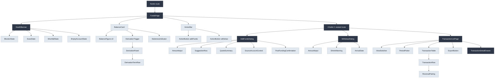
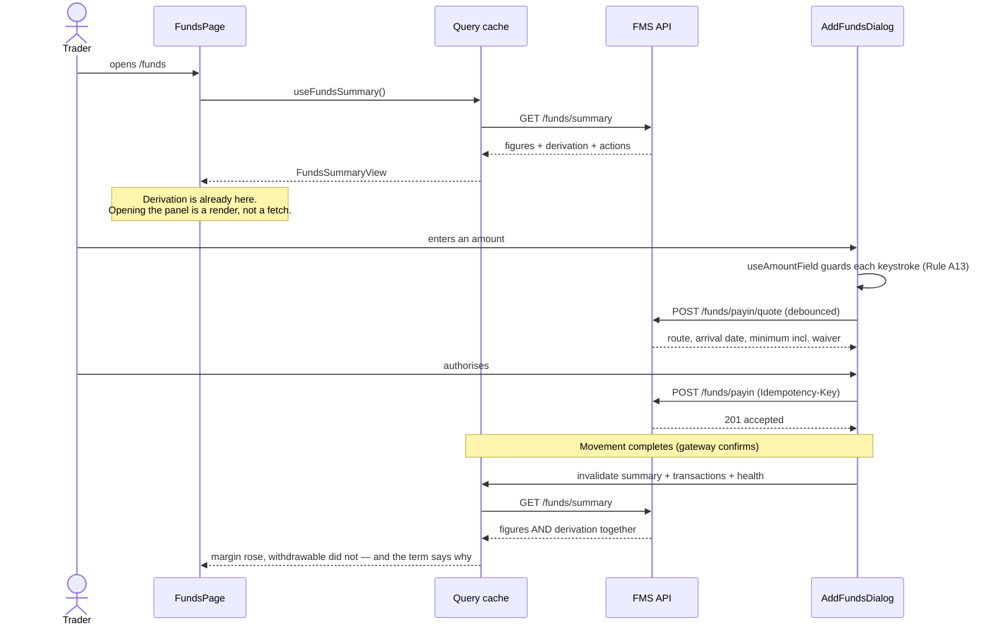

# Frontend Low-Level Design — Fund Management System

| | |
|---|---|
| Stage | 5b — client only. The backend is Stage 5a and is approved |
| Upstream | `hld.md` v3 §13, `lld-backend.md` (APPROVED), `hld-review.md` iteration 3 |
| PRD | `docs/specs/001-fund-management-system/product-requirements.md` + 7 parts |
| Stack | React 18, TypeScript strict, client-rendered, TanStack Query, matching the estate's existing web client |
| Date | 2026-08-21 |

---

## 1. Executive Summary

The client half of the Fund Management System: eight surfaces that let a trader see three balances,
understand the gap between them, move money in and out, read their history, and find out what their
account needs from them.

**The design is unusually constrained, and that is the point.** Four decisions were made upstream and
are not reopened here:

1. **The derivation ships inside `/funds/summary`.** The panel is a disclosure control over data
   already in memory, so REQ-102's "one interaction" cannot fail and cannot spin.
2. **Invalidation is scoped to the account's own completed movements**, and refreshes the derivation
   alongside the headline figure.
3. **A disabled control carries its reason from the payload that disabled it** — `ActionAvailabilityDto`
   — never a second request.
4. **No client-side money arithmetic of any kind.** The client renders terms; it does not sum them,
   compare an amount against a figure to decide acceptance, or compute an arrival date.

Together these mean the client is a **rendering layer over server decisions**, which is Rule B12
applied to the browser: a client that computes is a second definition of a number that must have
exactly one.

**Assumptions stated rather than asked:**

- **FA-1** — the estate's existing design system supplies primitives (button, field, banner, table).
  This document specifies FMS-specific components and reuses those; it does not author a second
  styling approach.
- **FA-2** — the accessibility bar is **WCAG 2.1 AA**, taken from the PRD rather than this skill's 2.2
  default. Substitution noted deliberately: the PRD names 2.1 AA as a stated requirement and it governs.
- **FA-3** — `paise` values arrive as JSON numbers within `Number.MAX_SAFE_INTEGER`. At ₹1 crore this
  is 10^9 paise, nine orders of magnitude inside the limit, so `number` is safe and `BigInt` is not
  needed. Recorded because it is the kind of assumption that is silently wrong in another currency.
- **FA-4** — one locale (en-IN), one currency, left-to-right. RTL is not designed for.

---

## 2. Functional Requirements

### 2.1 Owned outright by this document

The five Stage 5a left, because their substance is presentation:

| Req | Capability |
|---|---|
| REQ-201 | Choose an amount without being anchored — pre-fill from the last successful deposit, keystroke-level input refusal, suggestions that state what they do, the minimum stated before entry |
| REQ-301 | A withdraw entry point that is always present, disabled with its reason adjacent, and never absorbs an interaction silently |
| REQ-504 | An empty account that states its state once and offers a purpose |
| REQ-709 | A post-funding action to the configured destination |
| REQ-710 | A plain dismissal where no destination is configured |

### 2.2 Shared with the backend — the client owns the behaviour

| Req | Client responsibility |
|---|---|
| REQ-101, REQ-102 | Three separately named figures; the largest deduction named without being asked; the derivation reachable in one interaction with every term, sign and gloss |
| REQ-103–REQ-106 | Margin components, cash and collateral separated, blocked money on two axes, per-trade-kind figures |
| REQ-107 | The computed-at time **and its source**, and a stale treatment distinct from a current one |
| REQ-402, REQ-403, REQ-404 | Two views over one running balance, the period preserved across a switch, reversals rendered against their originals |
| REQ-405 | A movement's full state timeline with reasons and references |
| REQ-407 | Export triggered from the list, of exactly the view and period on screen |
| REQ-501, REQ-502, REQ-505, REQ-506 | The debt treatment, the exact-amount payment, the single named blocker, the shortfall deadline |

### 2.3 Implicit requirements not stated in the input

Surfaced rather than invented: every async surface needs loading, empty and error states; a
period-filtered list needs an empty-period state distinct from a failure (Rule L7); a form that
submits money needs a double-submit guard; a figure that changes while being read needs to say it
changed rather than swap silently (Rule B8).

---

## 3. Non-Functional Requirements

| Attribute | Target | Source |
|---|---|---|
| First balance visible | 1.5 s p95 | PRD |
| Derivation panel open | No network call, so bounded by render only | `hld.md` §13.2 |
| Payout status change visible | 1 minute | PRD |
| Accessibility | WCAG 2.1 AA, every money action keyboard reachable | PRD, FA-2 |
| Browser support | Evergreen Chrome, Safari, Firefox, Edge | Estate default |
| Bundle | Route-split; the funds route must not pull the transaction table's virtualiser | §20 |
| Money | Integer paise in, formatted string out. The client never parses a float | Taxonomy R5 |

---

## 4. Architecture Decisions

| Axis | Chosen | Rejected | Why |
|---|---|---|---|
| Architecture pattern | **Feature-based module** under `src/features/funds`, owning its components, hooks, api and types | Clean/hexagonal with a domain layer | There is no client-side domain logic to isolate — every rule is enforced server-side by design. A domain layer would have nothing in it but mappers |
| Component pattern | **Container/presentational split** at each surface; compound components for the derivation panel and the view switcher | Everything presentational with props drilled from the route | Eight surfaces sharing one summary query; containers subscribe to the query, presentational children stay pure and trivially testable |
| Server state | **TanStack Query**, one summary query fanned out by selectors | Redux with async thunks; per-component `useEffect` fetching | The estate already standardises on it, and server data must never be modelled as global client state. `useEffect` fetching would refetch the summary once per surface |
| Client state | `useState`, lifted to `TransactionListPage` for the period and the view | A context for the period; Zustand or Redux | No state crosses a component boundary. An earlier draft put the period in a context to make it "survive a view switch" — but the switcher and the picker are siblings under the same component, so a view change unmounts nothing and lifted state survives identically. The context was the ceremony it claimed to avoid |
| Form state | **React Hook Form** for the two money forms | Manual `useState` | Both need touched/dirty tracking, submit guards and error association. Manual state for a money field is where double-submits are born |
| Amount input | **Controlled, with a keystroke-level guard** (§7.3) | Uncontrolled with post-hoc sanitisation | Rule A13 exists because a parser that stripped a leading minus turned `-500` into ₹500. Sanitising after acceptance is exactly that failure |
| Styling | The estate's design system + tokens | Introducing Tailwind or CSS-in-JS alongside it | FA-1. A second styling approach in one app is a permanent tax |
| Routing | Nested routes under `/funds`, code-split per route | One route with tabs | The transaction list's virtualiser is heavy and most sessions never open it |

---

## 5. Component Hierarchy



Dark = Container (subscribes to a query or owns state). Light = Presentational (props only).

**Shared-layer candidates:** `AmountInput` and `StalenessIndicator` are FMS-specific for now and stay
feature-local. Rule of three applies — neither is promoted to the design system until a third consumer
appears outside funds.

---

## 6. Folder Structure

```
src/features/funds/
├── FundsPage.tsx                  # Route container; owns the summary query
├── api/
│   ├── client.ts                  # Typed fetch wrappers over the platform base client
│   └── keys.ts                    # Query key factory — the single source of cache keys
├── components/
│   ├── balance/
│   │   ├── BalanceCard.tsx        # Three figures + derivation trigger + staleness
│   │   ├── BalanceFigure.tsx      # One named figure; never collapses with a sibling
│   │   ├── DerivationPanel.tsx    # Disclosure over data already present
│   │   ├── DerivationTermRow.tsx  # One term: name, sign, amount, gloss
│   │   └── StalenessIndicator.tsx # Computed-at time AND source (REQ-107)
│   ├── health/
│   │   ├── HealthBanner.tsx       # Chooses one state; never stacks them
│   │   ├── BlockerState.tsx       # Replaces the funding path (Rule H6)
│   │   ├── DuesState.tsx          # Amount owed, cause, accrual, route to clear
│   │   ├── ShortfallState.tsx     # Amount short + deadline (Rule H7)
│   │   └── EmptyAccountState.tsx  # One statement, one action (Rule H5)
│   ├── money/
│   │   ├── AmountInput.tsx        # Rule A13's keystroke guard lives here
│   │   ├── SuggestionRow.tsx      # States set-or-add (Rule A2)
│   │   └── Money.tsx              # Renders paise; the only formatter in the feature
│   ├── addfunds/
│   │   ├── AddFundsDialog.tsx     # Container; owns the quote query
│   │   ├── QuoteSummary.tsx       # Route, arrival date, cost, amount reaching
│   │   ├── SourceAccountControl.tsx
│   │   └── PostFundingConfirmation.tsx  # REQ-709 / REQ-710
│   ├── withdraw/
│   │   ├── WithdrawDialog.tsx     # Container; owns the payout quote
│   │   ├── ShrinkWarning.tsx      # Rule W3a — before commitment, not after
│   │   └── ArrivalDate.tsx
│   ├── transactions/
│   │   ├── TransactionListPage.tsx
│   │   ├── ViewSwitcher.tsx       # Movements | All entries
│   │   ├── PeriodPicker.tsx
│   │   ├── TransactionTable.tsx   # Virtualised
│   │   ├── TransactionRow.tsx
│   │   ├── ReversalPairing.tsx    # Renders a reversal against its original
│   │   └── TransactionDetailDrawer.tsx
│   └── shared/
│       ├── ActionButton.tsx       # Disabled state carries its reason (Rule W2)
│       └── AsyncBoundary.tsx      # Loading / empty / error, one place
├── hooks/
│   ├── useFundsSummary.ts
│   ├── usePayinQuote.ts
│   ├── useTransactions.ts
│   ├── useMovementInvalidation.ts # The invalidation rule, in one place
│   └── useAmountField.ts          # Rule A13's guard, testable without a DOM
├── types/
│   ├── dto.ts                     # Mirrors lld-backend.md §4.2 exactly
│   └── view.ts                    # View models; DTOs never reach a component
└── copy/
    └── keys.ts                    # Gloss and reason keys → copy. No English in components
```

---

## 7. Component Specifications

### 7.1 `BalanceCard` + `DerivationPanel` — REQ-101, REQ-102, REQ-107

| | |
|---|---|
| Props | `summary: FundsSummaryView` |
| State owned | `panelOpen: boolean` |
| Emits | `onDerivationOpened` (analytics only) |

**Loading, before anything else.** The 1.5 s p95 first-balance target means this state is visible on
essentially every visit and is the first thing a trader sees, so it is specified rather than left to an
implementer's spinner. While the summary query is pending: a **skeleton in the three-figure layout**,
no figures rendered, no computed-at line, and the action buttons present but unavailable with **no
reason text** — because the reason is not known yet and inventing one would be worse than omitting it.

A skeleton rather than a spinner, deliberately: a spinner over a money surface reads as *a figure is
being calculated*, and the figures are not being calculated, they are being fetched. The skeleton also
holds the layout, so the figures do not shift into place under a reader.

**Three figures, never two.** `BalanceFigure` is rendered three times from three fields. There is no
equality check and no collapsing behaviour, so REQ-101's "still present them separately when two are
equal" is satisfied by having nothing to disable.

**The largest deduction is named without being asked.** `summary.largestDeductionTermCode` is rendered
beneath the withdrawable figure whenever it differs from the ledger balance. The client does not
determine which term is largest — the server already did (REQ-102).

**The panel is a disclosure, not a fetch.** `summary.derivation` is already in memory.
`DerivationPanel` is `<details>`-backed, so it works without JavaScript state and is keyboard-operable
natively. Opening it cannot fail, cannot spin, and has no error state — which is the whole reason
`hld.md` §13.2 put the derivation in the summary response.

**Every term renders, including zeros.** REQ-102 requires every term of Rule B4 with its sign, so
`DerivationTermRow` has no zero-suppression. The shortfall term is visible at zero for the same reason.

**Withdrawable can be absent.** When `withdrawableState !== 'RECONCILED'` the figure renders as
unavailable with the reason, and the withdraw action is disabled by the same payload. The client does
**not** fall back to the raw sum — that would be computing a balance.

### 7.2 `HealthBanner` — REQ-501, REQ-504, REQ-505, REQ-506

Renders **exactly one** state, chosen by precedence, never stacked:

```
BLOCKED  >  SHORTFALL  >  DUES  >  EMPTY  >  (nothing)
```

Shortfall outranks dues because it has a deadline and dues do not — the PRD's edge case says so
explicitly. Blocked outranks everything because the account cannot receive money at all.

**Rule H6 is a routing decision, not a styling one.** When `BLOCKED`, `FundsPage` renders
`BlockerState` **in place of** `ActionBar` and the add-funds route. The funding path is not rendered
disabled beside the blocker; it is not rendered. The PRD's documented failure — a live, responsive
amount entry ending in a permanently disabled button — is impossible if the entry is never mounted.

### 7.3 `AmountInput` — REQ-201, Rule A13

The most rule-dense component in the feature.

| Props | Type |
|---|---|
| `valuePaise` | `number \| null` |
| `onChange` | `(paise: number \| null) => void` |
| `minimumPaise` | `number` |
| `minimumLabelKey` | `string` |
| `suggestions` | `Suggestion[]` |

**The keystroke guard (Rule A13).** Refusal happens at `beforeinput`, not after. The handler inspects
`event.data` and the resulting string, and calls `preventDefault()` when the result would not be a
well-formed amount — **including paste**, which fires `beforeinput` with `inputType: 'insertFromPaste'`.

Rejected: `onChange` sanitisation. That is the exact failure Rule A13 records — a parser that stripped
a leading minus so `-500` silently became ₹500 and the button offered to add a number the user had not
typed. A field that rewrites its own value is worse than one that refuses.

| Input | Result |
|---|---|
| `5`, `50`, `500.` , `500.2`, `500.25` | Accepted |
| `0` | **Accepted.** Well-formed, and the minimum is the server's to enforce — refusing it here would be the client deciding a money rule |
| `.5` | **Accepted**, displayed as typed. Normalised to `0.50` on blur, not on keystroke — a leading decimal is a well-formed amount, and rewriting it mid-typing is the behaviour Rule A13 forbids |
| `007` | **Accepted** on keystroke, trimmed to `7` on blur. Leading zeros carry no value and their removal changes no amount, so this is formatting rather than the silent value rewrite the rule is about |
| `-`, `-500`, `abc`, `5e3`, `500.256`, a second `.` | Refused at the keystroke; value unchanged |
| Paste `₹ 1,200.50` | Refused. **Not** silently normalised — the user sees their paste rejected rather than transformed |
| Paste `1200.50` | Accepted |

**Where the line falls, since three of these rows are judgement calls.** Rule A13 forbids *acting on a
value the field did not display*, and its documented failure is a parser that turned `-500` into `500` —
a change of meaning. Trimming a leading zero or completing a leading decimal on blur changes no amount
and is visible before submission. Stripping a currency symbol and thousands separators from a paste
would also be meaning-preserving, but it is refused anyway because the rule names paste explicitly, and
a rule that says "paste included" is not one to reinterpret in a money field.

**Pre-fill (Rule A1).** Opens on `summary.lastSuccessfulDepositPaise` when present, else empty. An
abandoned attempt is never carried forward — the field is not persisted to storage and is not restored
on remount. Clearing is one keystroke; the value is never re-applied after the user has edited it.

**The minimum is stated before entry**, rendered as helper text on mount and programmatically
associated via `aria-describedby`, so a screen reader hears it before the user types rather than as an
error afterwards.

**Suggestions state what they do (Rule A2).** Each carries `mode: 'SET' | 'ADD'` and its label reflects
it. The component never infers the mode.

### 7.4 `ActionButton` — REQ-301, Rule W2

| Props | Type |
|---|---|
| `availability` | `ActionAvailabilityView` |
| `onActivate` | `() => void` |

**Always rendered.** Removing the control teaches the user the product cannot do it; the button exists
whenever the account does (Rule W1).

**Disabled carries its reason, from the same payload.** `availability.blockedReasonCode` came with the
summary, so there is no second request and therefore no window in which a disabled control has no
reason. Implemented as `aria-disabled="true"` with `aria-describedby` pointing at the visible reason
text — **not** the `disabled` attribute, which removes the control from the tab order and takes its
reason with it. This follows the ARIA Authoring Practices Guide's recommendation for a control that
must stay discoverable while unavailable. It is a usability decision rather than a conformance
requirement: a natively disabled control with adjacent reason text is still reachable in reading order,
so the native form is worse here without being a WCAG failure.

**`onActivate` diverts; it does not do nothing.** This is the whole point, and the two behaviours must
not be confused:

```
onActivate():
  if (availability.available)  -> begin the withdrawal
  else                         -> open the derivation panel and move focus into it
                                  (REQ-301: the derivation is offered as the next step)
```

There is no branch in which activating the control does nothing. **A control that renders as present
and does nothing when activated is precisely the failure Rule W2 forbids** and the PRD documents at a
benchmarked competitor: *"the withdraw control at ₹0 balance renders in its full enabled treatment and,
when clicked, does nothing at all — no dialog, no message, no request."* An earlier draft of this
section described the handler as "a no-op guarded at the top", which read as that exact failure and is
corrected here.

### 7.5 `PostFundingConfirmation` — REQ-709, REQ-710

| `summary.postFundingDestination` | Render |
|---|---|
| Present | The confirmation, what changed, and a primary action to the configured destination |
| `null` | The confirmation and a plain dismissal. No action, no placeholder, no disabled button |

REQ-710 is a rendering branch, not a fallback URL. Rule H6 forbids offering an action that leads
nowhere, so the absence of a destination removes the control rather than pointing it at a default.

The confirmation also carries REQ-613/REQ-615's obligation: available margin rose, **withdrawable did
not**, and the date from which it will.

### 7.6 `TransactionListPage` — REQ-402, REQ-403, REQ-404

**Two views, one running balance, one period.** `ViewSwitcher` toggles `MOVEMENTS | ALL_ENTRIES`. Both
the view and the period are state in `TransactionListPage` and are passed to their controls, so
switching the view sets sibling state and unmounts nothing — the period survives by construction rather
than by being hoisted (REQ-402).

**Reversals are paired.** `ReversalPairing` renders a reversal indented under the entry it reverses and
marks the original as reversed, so a scanning reader does not count the charge twice (Rule L2). Where a
reversal arrives before its original, both render unpaired until both exist — the pairing is by
reference, not by arrival order.

**The empty period is a state, not a blank.** `AsyncBoundary` distinguishes: no entries in this period
(state the period, offer a wider one, Rule L7), versus the request failed (retry). Blank space is
indistinguishable from a failure to load, which is the PRD's stated objection.

**Export takes what is on screen.** `ExportButton` passes the current view and period; it does not
re-derive them (Rule L8a).

---

## 8. Type Definitions

DTOs mirror `lld-backend.md` §4.2 exactly and are **never used in a component**. The boundary maps them
to view models in `api/client.ts`.

```ts
// ---- DTOs: the wire shape. Do not import these outside api/ ----
export interface MoneyDto { readonly paise: number; readonly currency: 'INR' }

export type TermCode =
  | 'SETTLED_LEDGER' | 'ADDED_TODAY' | 'UNSETTLED_PROCEEDS'
  | 'CHARGES_UNPOSTED' | 'SHORTFALL_OUTSTANDING' | 'COLLATERAL_MET';

export interface DerivationTermDto {
  readonly termCode: TermCode;
  readonly sign: 'PLUS' | 'MINUS';
  readonly amount: MoneyDto;
  readonly glossKey: string;
}

// ---- View models: what components consume ----
export interface MoneyView {
  readonly paise: number;
  /** Pre-formatted at the boundary. Components never format, so they never round. */
  readonly display: string;
}

/** Discriminated union, not a nullable figure with a boolean beside it. */
export type WithdrawableView =
  | { readonly kind: 'RECONCILED'; readonly amount: MoneyView;
      readonly largestDeductionTermCode: TermCode | null }
  | { readonly kind: 'DIVERGENT'; readonly reasonKey: string }
  | { readonly kind: 'UNAVAILABLE'; readonly reasonKey: string };

export interface FundsSummaryView {
  readonly ledgerBalance: MoneyView;
  readonly availableMargin: MoneyView;
  readonly withdrawable: WithdrawableView;
  readonly derivation: readonly DerivationTermView[];
  readonly computedAt: Date;
  readonly computedBy: 'FRONT_OFFICE' | 'BACK_OFFICE';
  readonly stale: boolean;
  readonly actions: Readonly<Record<ActionKey, ActionAvailabilityView>>;
  readonly lastSuccessfulDepositPaise: number | null;
  readonly postFundingDestination: string | null;
}

export type ActionKey = 'ADD_FUNDS' | 'WITHDRAW' | 'CLEAR_DUES';

export type ActionAvailabilityView =
  | { readonly available: true }
  | { readonly available: false; readonly reasonKey: string;
      readonly responsibleTermCode: TermCode | null };

/** Health is a union because exactly one state renders (§7.2). */
export type HealthView =
  | { readonly kind: 'BLOCKED'; readonly blockerKey: string; readonly resolveHref: string }
  | { readonly kind: 'SHORTFALL'; readonly amount: MoneyView; readonly deadline: Date }
  | { readonly kind: 'DUES'; readonly amount: MoneyView; readonly causeKey: string;
      readonly ratePercent: string | null; readonly accrued: MoneyView }
  | { readonly kind: 'EMPTY'; readonly smallestUsefulAmount: MoneyView;
      readonly hasHistory: boolean }
  | { readonly kind: 'HEALTHY' };
```

Booleans deliberately avoided for variant state: a nullable `withdrawable` plus an `isDivergent` flag
permits three impossible combinations. The union permits none.

---

## 9. State Management

| Slice | Classification | Owner | Mutated by | Re-renders |
|---|---|---|---|---|
| Funds summary | **Server** | TanStack Query, key `['funds','summary',accountId]` | Refetch, invalidation | Every surface reading a selector of it |
| Payin quote | **Server**, `enabled` only when the amount is valid | `usePayinQuote` | Debounced amount change | `QuoteSummary` |
| Transactions page | **Server**, `keepPreviousData` | `useTransactions` | Period or view change | `TransactionTable` |
| Selected period | **Client, lifted** | `TransactionListPage` | `PeriodPicker` | Table + export |
| Selected view | **Client, local** | `TransactionListPage` | `ViewSwitcher` | Table |
| Amount field | **Form** | React Hook Form inside each dialog | Keystroke, suggestion | The field and the submit guard |
| Panel open | **Client, local** | `BalanceCard` | Trigger | The panel |

**No global store, and no context either.** Nothing here crosses a component boundary: the period and
the view are siblings in `TransactionListPage` and are passed down. A context would be reintroduced only
if a consumer appeared outside that subtree, which nothing in this feature needs.

**Server data is never copied into client state.** The amount field holds a user's intent; every figure
it is checked against stays in the query cache and is re-read at submit.

### 9.1 The invalidation rule

```ts
// useMovementInvalidation.ts — one place, because a partial refresh is a wrong screen.
function onMovementCompleted(accountId: string) {
  // The summary carries BOTH the headline figures and the derivation, so one
  // invalidation refreshes them together. Refreshing the figure while leaving a
  // stale derivation beneath it would render the gap the product exists to
  // explain as an arithmetic error.
  queryClient.invalidateQueries({ queryKey: keys.summary(accountId) });
  queryClient.invalidateQueries({ queryKey: keys.transactions(accountId) });
  queryClient.invalidateQueries({ queryKey: keys.health(accountId) });
}
```

Scoped to **this account's own completed movements**. Not invalidated on a market tick, which would
refetch continuously for no user-visible gain.

### 9.2 Two tabs, and the tab left open overnight

A trader with two tabs open who withdraws in one leaves the other showing a stale withdrawable figure
and an available withdraw control. **No money is at risk** — Rule W4's partial unique index refuses the
second request and §15 renders the resulting `409` — but the second tab presented an action as
available when it was not, and that is the class of failure this product exists to remove.

The fix is one line and covers a second case for free:

```ts
// Refetch when a tab regains focus. Covers the two-tab divergence above and the
// tab left open overnight, whose figures are a day old and whose margin source
// has since changed at the EOD boundary.
useQuery({ ..., refetchOnWindowFocus: true })
```

`BroadcastChannel` and a shared worker were both considered and rejected: they synchronise tabs with
each other, when what matters is synchronising each tab with the server. Focus-based refetch does that
with no new machinery, and a tab that is not focused is not a tab anyone is acting on.

What this does **not** fix is a figure going stale in a tab the trader is actively watching — that is
the invalidation rule above, plus REQ-107's rendered age, and it is the honest limit of a client that
does not hold a socket.

---

## 10. Custom Hooks

| Hook | Purpose | Returns | Wraps |
|---|---|---|---|
| `useFundsSummary()` | The one summary query every surface reads | `UseQueryResult<FundsSummaryView>` | TanStack Query |
| `useAction(key)` | Availability + reason for one action | `ActionAvailabilityView` | A selector over the summary |
| `usePayinQuote(paise)` | Debounced quote; disabled below the minimum | `UseQueryResult<PayinQuoteView>` | TanStack Query |
| `useTransactions(view, period)` | Paged list for the given view and period | `UseInfiniteQueryResult<TransactionPageView>` | TanStack Query |
| `useMovementInvalidation()` | §9.1's rule, in one place | `(accountId: string) => void` | `useQueryClient` |
| `useAmountField(opts)` | Rule A13's guard, isolated from the DOM so it is unit-testable | `{ value, onBeforeInput, onChange, error }` | Nothing — pure |

`useAmountField` is extracted specifically so Rule A13's table in §7.3 can be tested as a pure function
over strings, without rendering or simulating a browser.

---

## 11. API Contracts

Consumed as defined in `lld-backend.md` §4. Not altered here.

| Method | Path | Client use | Handled statuses |
|---|---|---|---|
| GET | `/funds/summary` | The one query behind every surface | 200; 401 → session expiry; 503 → upstream banner |
| GET | `/funds/margin/breakdown` | On breakdown open only | 200; 503 |
| POST | `/funds/payin/quote` | Debounced on amount change | 200; 422 `below_minimum`, `no_route_available` |
| GET | `/funds/payin/limits` | Alongside the quote | 200 |
| POST | `/funds/payin` | Submit, with `Idempotency-Key` | 201; 409; 422 |
| GET | `/funds/payout/quote` | On withdraw dialog open and amount change | 200; 409 `withdrawable_unavailable`, `figures_stale` |
| POST | `/funds/payout` | Submit | 201; 409 `request_already_open`; 422 `amount_exceeds_withdrawable`, `destination_not_verified` |
| DELETE | `/funds/payout/{id}` | Cancel | 204; 409 `not_cancellable` |
| GET | `/funds/transactions` | Paged, by view and period | 200 |
| GET | `/funds/transactions/{id}` | Detail drawer | 200; 404 |
| GET | `/funds/statement.csv` | Export | 200 |
| GET | `/funds/health` | Banner | 200 |

**The `Idempotency-Key` is generated once per form instance**, not per submit attempt. A retry after a
timeout reuses it, so a double-submit under a slow network cannot become two payments.

---

## 12. Data Flow



---

## 13. User Flow

1. Trader opens the funds view. One request returns everything the first screen needs.
2. If the account is blocked, the blocker replaces the funding path and names one action.
3. If the account is empty, one statement, the smallest useful amount, one action.
4. Otherwise three figures, the computed-at time and its source, and the largest deduction named.
5. Trader opens the derivation. It is already loaded; every term shows with its sign and gloss.
6. Trader adds funds. The field opens on their last successful amount, refuses malformed input at the
   keystroke, and states the minimum before they type.
7. The quote names the route chosen for them and the date the money arrives.
8. On success the confirmation states what changed and what did not, and offers the configured
   destination — or dismisses plainly if none is configured.
9. Trader withdraws. The control is present even when unavailable, and says why. Where available, the
   shrink warning appears before commitment, not after.

---

## 14. Validation Rules

Client validation is **shape only**. Every business rule is re-checked server-side, because a rule
enforced only in the browser is a rule a second caller skips.

| Field | Client checks | Server decides |
|---|---|---|
| Amount | Well-formed (§7.3's table); not empty on submit | Below minimum, waiver applies, exceeds withdrawable, route headroom |
| Source account | One selected | Verified at this instant (PR-28) |
| Period | Start ≤ end; not in the future | Nothing |

The client **never compares the amount to the withdrawable figure to decide acceptance.** It may show
a hint once the server has returned `amount_exceeds_withdrawable`, but the decision is the server's —
comparing two money values to gate a submit is client-side money arithmetic.

---

## 15. Error Handling

| Category | Example | Treatment | Recoverable |
|---|---|---|---|
| Validation | `422 below_minimum` | Inline, associated with the field via `aria-describedby`, focus moved to it | Yes |
| Conflict | `409 request_already_open` | Dialog-level message naming the open request, with a link to it | Yes, by acting on the other request |
| Figure unavailable | `409 withdrawable_unavailable` | The withdraw path is disabled with its reason; the derivation stays readable | No, until it reconciles |
| Stale figures | `409 figures_stale` | The staleness treatment with the age, and commitment refused | Yes, on refresh |
| Figure not computable | `503 calendar_unavailable` | **Not the upstream banner.** The withdrawable figure renders as unavailable with its own reason; the ledger balance and available margin stay visible; the withdraw action is disabled with that reason. A calendar failure means the figure could not be *computed*, not that a refresh failed — Rule B4's unsettled-proceeds deduction is measured in settlement days, so there is no figure to show at any age. Added 21 Aug 26 by the consistency pass | No, until the calendar returns |
| Auth | `401` | Session-expiry redirect. Never an inline message | No |
| Upstream | `503 upstream_unavailable` | Page-level banner naming what is unavailable; cached figures remain visible **with their age** | Yes, retry |
| Unexpected | 500, parse failure | Error boundary at the route, offering reload and a support reference | No |

**Two error boundaries.** One at `/funds` catching render failures per route, and one around
`TransactionListPage`, so a malformed row cannot blank the balances a trader came for.

**A failed fetch never renders a remembered figure.** `hld.md` §13 forbids it: a stale balance shown
offline is indistinguishable from a current one. Where data cannot be fetched the surface says so.

---

## 16. Accessibility — WCAG 2.1 AA (FA-2)

| Concern | Design |
|---|---|
| Landmarks | `<main>` for the page, `<section aria-labelledby>` per surface, `<nav>` for the view switcher |
| Figures | Each is a `<dl>` pair — the name is the term, the amount the definition. A screen reader hears "Withdrawable balance, ₹0.00" rather than two unrelated strings |
| Derivation panel | Native `<details>`/`<summary>` — keyboard-operable and announced as expandable with no ARIA of our own |
| Disabled actions | `aria-disabled` + `aria-describedby` → the reason. **Never the `disabled` attribute**, which removes the control from the tab order and makes its reason unreachable — a WCAG 2.1 AA failure disguised as a styling choice |
| Amount field | `inputmode="decimal"`, `aria-describedby` covering the minimum and any error. A refused keystroke is announced once via a polite live region, not on every rejected key |
| Dynamic figures | A dedicated visually-hidden `aria-live="polite"` status element carries **only the change sentence** — "Available margin increased. Withdrawable balance unchanged." The figures themselves sit **outside** any live region. Making the whole balance region live would re-announce three figures, the computed-at line and every open derivation term on each refresh, which is disruptive enough that users switch such regions off and then lose the announcement entirely |
| Shortfall deadline | Rendered as a **static timestamp, not a countdown** — "Add funds by 2:30 PM". Announced once via `aria-live="assertive"` when the shortfall state is entered, which is the one place assertive is justified because the deadline is the message. A live countdown would interrupt on every tick and make the surface unusable with a screen reader; if a countdown is ever wanted it must be polite and announce at thresholds, not continuously |
| Focus | Dialogs trap focus and restore it to the trigger on close. Activating a disabled withdraw control moves focus to the derivation panel (§7.4) |
| Table | Real `<table>` with `<th scope>`. Virtualisation preserves `aria-rowcount` and `aria-rowindex` so position is announced correctly despite windowing |
| Contrast | Tokens only. The PRD cites a competitor with 130 contrast failures in one view; token values are the control |
| Keyboard | **Every money action reachable and operable by keyboard.** Asserted in tests (§22), not assumed |

---

## 17. Responsive Design

Desktop-first with full responsive support: the primary persona trades on a desktop during market
hours and checks the account on a phone outside them.

| Breakpoint | Layout |
|---|---|
| ≥1280 | Balances and health side by side; transaction table full width; detail as a drawer |
| 768–1279 | Balances stack above health; table drops the reference column into the detail view |
| <768 | Single column. **The table becomes a card list** — a pattern change, not a reflow. Each card carries description, amount, direction and status; the running balance moves into the card body. Dialogs become full-screen sheets |

The table-to-cards change is the only pattern change and it is deliberate: a six-column money table
horizontally scrolled on a phone is where users misread which figure belongs to which row.

---

## 18. Styling Strategy

The estate's existing design system and token layer (FA-1). No second approach introduced.

FMS adds no new tokens. It adds **semantic aliases** over existing ones so intent is greppable:
`--fms-figure-positive`, `--fms-figure-debt`, `--fms-figure-stale`, `--fms-term-plus`,
`--fms-term-minus`. The debt alias exists because Rule H1 requires a treatment visually distinct from a
positive balance, and an alias makes that requirement enforceable in review rather than a colour
someone picked.

---

## 19. Design Tokens

| Category | Used for |
|---|---|
| Colour | Figure states (positive, debt, stale, unavailable), term signs, banner severity |
| Spacing | The derivation panel's row rhythm, card padding |
| Typography | Figure scale — the three balances share one scale so none reads as more important |
| Radii / shadow | Dialog, drawer, card elevation |
| Motion | Panel disclosure only. No animation on a figure change - movement on money reads as instability. The one animation that exists honours `prefers-reduced-motion: reduce` by collapsing to an instant state change |

---

## 20. Performance Optimizations

Four, each tied to a real bottleneck in this feature:

1. **Route-based code splitting.** The transaction route carries the virtualiser; most sessions never
   open it, and the 1.5 s first-balance target is the funds route's budget alone.
2. **Virtualised transaction table.** A financial year is ~5,000 rows and up to ~60,000 worst case
   (`hld.md` §5). Windowed rendering, with `aria-rowcount` preserved (§16).
3. **`keepPreviousData` on the transactions query.** Changing period or view keeps the old page
   visible while the new one loads, so the table does not blank between two states that both have data.
4. **Debounced quote requests.** The quote fires on amount change; without debouncing a trader typing
   ₹50,000 issues six requests and races their responses.

Deliberately **not** done: no blanket memoisation. The summary is one object refreshed rarely; wrapping
every presentational component in `React.memo` would add re-render bookkeeping to a tree that does not
re-render often.

---

## 21. Security Considerations

| Concern | Treatment |
|---|---|
| Auth token | Held by the platform's existing client; never read into feature code, never in `localStorage` |
| PII in logs | No account number, no balance, in any client log or analytics property. Taxonomy R4 forbids the identifier and R5 forbids the holding |
| Masked values | The client receives `destinationMasked` and has no unmasked value to leak. Profile PR-31 masks server-side; there is nothing to reveal client-side |
| XSS | No `dangerouslySetInnerHTML` anywhere in the feature. All copy resolves through `copy/keys.ts`, and back-office reason text is never rendered (`lld-backend.md` §4.5) |
| CSRF | State-changing requests go through the platform client with its existing protection |
| Route guarding | The funds route requires an authenticated session; authorisation is the server's per-object check, and the client never decides what a user may see |
| Export | The CSV is server-generated. The client triggers and downloads it; it never assembles a statement from cached rows |

---

## 22. Testing Strategy

| Level | What | Tool |
|---|---|---|
| Unit | `useAmountField` against §7.3's table, including every paste case. Pure, no DOM | Vitest |
| Unit | View-model mappers: a `DIVERGENT` summary maps to the union's divergent arm and cannot produce an amount | Vitest |
| Component | `ActionButton` disabled is focusable, announces its reason, and activating it opens the derivation | Testing Library + jest-axe |
| Component | `HealthBanner` renders exactly one state at each precedence combination | Testing Library |
| Component | `BalanceCard` renders three figures when two are equal | Testing Library |
| Component | `DerivationPanel` renders every term including zero-valued ones | Testing Library |
| Integration | Completing a movement invalidates summary, transactions and health together — asserted by observing the derivation refresh alongside the figure | Testing Library + MSW |
| Integration | Switching view preserves the period; changing period preserves the view | Testing Library |
| Integration | An empty period renders the empty-period state, and a failed request renders the error state — the two are never confused | Testing Library + MSW |
| Component | `ActionButton` when unavailable: activating it opens the derivation panel and moves focus there. Asserted on the panel opening, not on the absence of a withdrawal - the failure mode is doing nothing | Testing Library |
| Component | The balance surface renders a three-figure skeleton while pending, with no figures and no reason text on the actions | Testing Library |
| Unit | `useAmountField` accepts `0`, `.5` and `007` on keystroke, and normalises the latter two on blur only | Vitest |
| Integration | A tab regaining focus refetches the summary | Testing Library + MSW |
| A11y | The live region announces only the change sentence, not the figures | Testing Library |
| A11y | **Every money action reachable by keyboard alone**, asserted as a test rather than a review note | Testing Library, keyboard-only |
| A11y | Automated axe pass on each surface in each of its states | jest-axe |
| E2E | Two journeys only: fund an empty account end to end; request a withdrawal when the figure is unavailable and reach the derivation from the disabled control | Playwright |

**Not worth testing:** that `Money` formats a known paise value (one unit test, not one per consumer);
presentational components with no logic beyond prop rendering; the design system's own primitives.

---

## 23. Edge Cases

| Case | Expected |
|---|---|
| A figure changes while the panel is open | The panel updates and states that it changed with the cause (Rule B8). It does not close |
| Withdrawable becomes unavailable while the withdraw dialog is open | Submit is disabled with the reason; entered text is preserved. The dialog does not close under the user |
| A suggestion is tapped after the user has typed | `SET` replaces, `ADD` adds — as the label said. Never inferred |
| Paste of a formatted amount | Refused, not normalised (§7.3) |
| Rapid double-submit | The form's own submit guard plus one `Idempotency-Key` per form instance |
| Period spanning a correction to an earlier period | The correction renders in the period it was made, referencing its original |
| Reversal arrives before its original | Both render unpaired; pairing is by reference, not arrival order |
| Account has no history and no money | The empty state omits the history link rather than offering an empty one (Rule H5) |
| Two blockers | One is named — the one to resolve first. The client does not choose; the server ordered them |
| The summary request fails on first load | Full-surface error with retry. **No figures are rendered from cache**, because a remembered balance is indistinguishable from a current one |
| Margin figures are stale | Figures show with their age and source; every commit action is disabled with staleness as the reason |
| Amount exceeds withdrawable | Server refuses; the client shows the message and offers the derivation, having never made the comparison itself |

---

## 24. Risks

| # | Risk | Mitigation |
|---|---|---|
| FR-1 | **OA-1 upstream** — if RMS and Rule B4 disagree routinely, `DIVERGENT` becomes the normal state and this design renders "unavailable" as the everyday case for the product's central number | None available client-side. The design fails legibly rather than wrongly; the fix is upstream and `lld-backend.md` §8.4 is the test that finds out |
| FR-2 | The `<details>` element's styling varies across browsers | Reset in the token layer; the disclosure behaviour is native and the appearance is ours |
| FR-3 | Virtualisation plus `aria-rowindex` is a known source of screen-reader defects | Covered by an explicit keyboard-and-reader test rather than an axe pass alone, since axe cannot detect a wrong row index |
| FR-4 | The `aria-disabled` choice over `disabled` is unusual and a future contributor may "fix" it | The reason is in the component file as a comment and in §16; a test asserts the control stays focusable |
| FR-5 | Copy keys resolve to text owned outside this repo (`hld.md` M8) | The client renders keys; a missing key surfaces in the copy pipeline rather than as blank UI |

---

## 25. Implementation Checklist

**A — Foundation**
1. `types/dto.ts` mirroring `lld-backend.md` §4.2; `types/view.ts` with the unions from §8.
2. `api/client.ts` with the DTO-to-view mapping, including paise formatting at the boundary.
3. `api/keys.ts` query-key factory; `hooks/useFundsSummary.ts`.
4. `components/money/Money.tsx` — the only formatter.

**B — The balance surface (REQ-101 to REQ-107)**
5. `BalanceFigure`, then `BalanceCard` with three instances and no collapsing.
6. `StalenessIndicator` rendering time **and** source.
7. `DerivationPanel` + `DerivationTermRow`, native `<details>`, every term including zeros.

**C — Health (REQ-501, 504, 505, 506)**
8. `HealthBanner` precedence, then the four state components.
9. Route-level swap so `BlockerState` replaces the funding path (Rule H6).

**D — Money entry (REQ-201, 709, 710)**
10. `useAmountField` with §7.3's table as its test spec — write the test first.
11. `AmountInput`, `SuggestionRow`, then `AddFundsDialog` and `usePayinQuote`.
12. `PostFundingConfirmation` with both branches.

**E — Withdraw (REQ-301, 302, 303, 305)**
13. `ActionButton` with the `aria-disabled` treatment and its focus behaviour.
14. `WithdrawDialog`, `ShrinkWarning` before commitment, `ArrivalDate`.

**F — Transactions (REQ-402, 403, 404, 405, 407)**
15. `PeriodPicker` and `ViewSwitcher`, with both values lifted into `TransactionListPage`.
16. `TransactionTable` virtualised with `aria-rowcount`; `ReversalPairing`; the card-list breakpoint.
17. `TransactionDetailDrawer`; `ExportButton`.

**G — Cross-cutting**
18. `useMovementInvalidation`; error boundaries; `AsyncBoundary`'s three states.
19. The a11y suite from §22, including keyboard-only traversal of every money action.

---

## 26. Acceptance Criteria

Binary, testable, and each traceable to a requirement.

1. Three balance figures render as three, including when two are numerically equal. *(REQ-101)*
2. Opening the derivation issues **no network request**, and every Rule B4 term renders with its sign and gloss, including terms whose value is zero. *(REQ-102)*
3. The largest deduction is named beneath the withdrawable figure without the panel being opened. *(REQ-102)*
4. The computed-at time and its source both render, and a stale figure is visually and programmatically distinct from a current one. *(REQ-107)*
5. The amount field opens on the last successful deposit amount, or empty where none exists, and is cleared in one keystroke. *(REQ-201, Rule A1)*
6. Every input in §7.3's refusal row leaves the field's value unchanged, paste included. *(REQ-201, Rule A13)*
7. The minimum is announced before entry, not after a rejected value. *(REQ-201)*
8. A suggestion labelled `SET` replaces the amount; one labelled `ADD` adds to it. *(REQ-201, Rule A2)*
9. The withdraw control renders whenever the account exists; when unavailable it is focusable, announces its reason, and **activating it opens the derivation panel and moves focus there**. There is no state in which activating it does nothing. *(REQ-301, Rule W2)*
10. When the account is blocked, the funding path is **absent from the DOM**, not present and disabled. *(REQ-505, Rule H6)*
11. An empty account renders one statement, the smallest useful amount and one action, with no zero-valued margin decomposition anywhere on the surface. *(REQ-504, Rule H5)*
12. The post-funding confirmation offers the configured destination, or a plain dismissal with no action control when none is configured. *(REQ-709, REQ-710)*
13. Switching view preserves the selected period, and changing period preserves the selected view. *(REQ-402)*
14. A reversal renders against its original and the original is marked reversed. *(REQ-404, Rule L2)*
15. An empty period states the period and offers a wider one; a failed request offers a retry. The two are never the same rendering. *(REQ-403, Rule L7)*
16. Export requests exactly the view and period currently on screen. *(REQ-407, Rule L8a)*
17. Every money action is operable by keyboard alone, and each surface passes an automated axe check in each of its states. *(WCAG 2.1 AA)*
18. No component performs arithmetic on a money value; the only formatting happens at the API boundary. *(Rule B12, taxonomy R5)*
