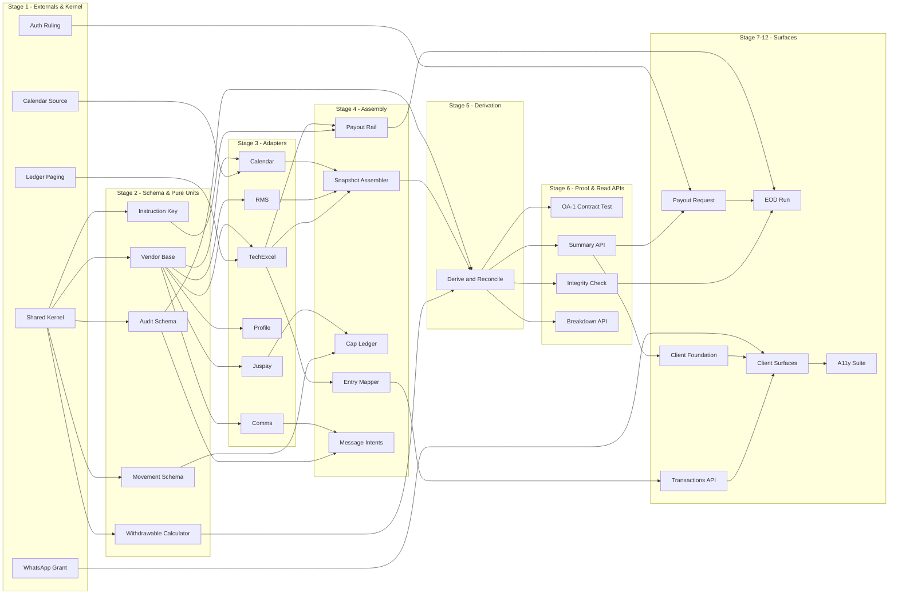

# AI Coding Execution Plan — Fund Management System

| | |
|---|---|
| Stage | 7 — Planning. Converts the approved LLDs into a deterministic execution order |
| Source of truth | `lld-backend.md` (1,143 lines) and `lld-frontend.md` (874 lines), both APPROVED |
| Gating review | `lld-review.md`, verdict APPROVED (iteration 2) |
| Architecture | **Modular monolith.** Java 21 / Spring Boot, single PostgreSQL primary, Flyway forward-only from V21, the estate's existing outbox and relay, Micrometer. React 18 + TypeScript, client-rendered, TanStack Query |
| Money | Integer paise everywhere (taxonomy R5) |
| Date | 2026-08-21 |

**The LLDs are unmodifiable here.** This plan computes order and parallelism; it does not review, improve
or reinterpret the design.

## Modules — read from the LLDs, not invented

| Module | Source |
|---|---|
| `derivation` | `lld-backend.md` §3 — `BalanceDerivationService`, `SnapshotAssembler`, `WithdrawableCalculator`, `MarginSourceSelector` |
| `movement` | §3 — `PayoutOrchestrator`, `PayinOrchestrator`, `RouteSelector`, `RouteCapLedger` |
| `ledger-view` | §6.3b, §7.8 — `EntryDescriptionMapper`, transaction list, export |
| `health` | §7.8 — account health composition |
| `messaging` | §2.2 V25a, §7.9 — intents, relay re-evaluation, delivery reconciler |
| `integration` | §3.1, §22 — the vendor anti-corruption layer |
| `platform` | §2.2 — shared kernel: `Money`, `AccountRef`, migrations, exception hierarchy |
| `web/features/funds` | `lld-frontend.md` §6 — the client feature module |

No task may create, rename, merge or split any of these.

## Phase frame

The PRD's phases are the outer ordering and this plan respects them. Two corrections the design stages
established are carried here as real sequencing, not footnotes:

- **EB-9 gates Phase 1, not Phase 3.** Rule B4's unsettled-proceeds deduction is measured in settlement
  days, so without a calendar source the withdrawable figure is wrong on every trading holiday — and
  Phase 1 ships the three balances. `TASK-04` therefore blocks the derivation chain, not the payout chain.

  > **Held deliberately, though evidence suggests it could relax.** On 21 Aug 26, reading TechExcel's
  > `Ledger` contract showed that every trade entry carries its own `SETL_PAYINDATE`, `SETTLEMENT_NO`
  > and `MKT_TYPE` — the last enumerating `M-T+1 Normal` and `Z-T+1 Trade to trade`. If those identify
  > unsettled proceeds directly, Rule B4 needs no calendar arithmetic and EB-9 returns to gating
  > Phase 3, where the PRD originally had it. `external-questions.md` §A2 sets out the evidence.
  >
  > **The dependency graph below is unchanged anyway, and that is the right call.** The finding only
  > *relaxes* a constraint. Holding TASK-04 in Stage 1 costs one external question asked earlier than
  > strictly necessary, which is harmless. Acting on it would mean amending `hld.md`, `traceability.md`,
  > this plan and `tasks.json` together on an inference read from field descriptions rather than stated
  > by the vendor — and leaving any one of them behind would put two approved documents in
  > contradiction, which is the failure the Stage 5c consistency pass exists to catch.
  >
  > Confirm it with the back office in one line, then correct all four together or none.
- **Phase 3 is additionally gated on the authentication ruling** for out-of-band withdrawal protection.
  `TASK-05` blocks the payout API, and the seam it configures already exists in the design.

---

## 1. Task Breakdown

### Phase 0 — External answers. These are tasks because they have dependents.

> **TASK-01 — Confirm TechExcel `Ledger` date-bounded paging per account**
> Purpose: establish whether the transaction list can be served as a read-through, or whether a local entry mirror is required.
> Input dependencies: none.
> Output: a written answer recorded against OA-6 in `lld-backend.md` §1.4.
> Files/modules: none — this is a vendor confirmation.
> Module ownership: `integration`.
> **If unsupported, this returns to the HLD.** It does not get absorbed here; the system-of-record decision was a Stage 3 gate.

> **TASK-02 — Confirm the `whatsapp` channel grant for FMS and its address format**
> Purpose: establish whether four communications requirements keep the channel they were written for.
> Input dependencies: none.
> Output: a written answer recorded against OA-2.
> Files/modules: none.
> Module ownership: `messaging`.

> **TASK-03 — Confirm whether TechExcel's duplication validation is distinguishable from an input-value rejection**
> Purpose: establish whether the duplication check can serve as a second line behind the status query.
> Input dependencies: none.
> Output: a written answer recorded against OA-7.
> Files/modules: none.
> Module ownership: `integration`.
> **Non-blocking.** §6.3 reads status before reissuing, so nothing waits on this. A positive answer simplifies; a negative one changes nothing.

> **TASK-04 — Nominate the trading and settlement calendar source**
> Purpose: EB-9. Rule B4 cannot compute a settlement-day deduction without it.
> Input dependencies: none.
> Output: a nominated source, its licence and its refresh cadence.
> Files/modules: none.
> Module ownership: `integration`.

> **TASK-05 — Obtain the authentication ruling on out-of-band withdrawal protection**
> Purpose: C-Q8. Phase 3 does not ship until authentication rules.
> Input dependencies: none.
> Output: a ruling, and if positive the step-up contract FMS's existing seam consumes.
> Files/modules: none.
> Module ownership: `movement`.

### Foundation

> **TASK-06 — Shared kernel: `Money`, `AccountRef`, exception hierarchy**
> Purpose: the only monetary type in the system, integer paise, plus §7.7's exception tree.
> Input dependencies: none.
> Output: `Money`, `AccountRef`, `FmsException` and its four branches.
> Files/modules: `platform/`.
> Module ownership: `platform`. Every other module depends on this and it depends on nothing.

> **TASK-07 — Schema: money movement (V21–V23)**
> Purpose: `fms_payout_request` with the **Rule W4 partial unique index**, `fms_payin_attempt` with the **Rule A6 gateway-reference unique index**, `fms_route_cap_usage`.
> Input dependencies: TASK-06.
> Output: three Flyway migrations and their constraints.
> Files/modules: `platform/db/migration/V21..V23`.
> Module ownership: `platform`.
> **The two indexes are business rules, not query optimisations.** They land here because everything downstream assumes they hold.

> **TASK-08 — Schema: audit and messaging (V24–V26)**
> Purpose: `fms_movement_state_event` (monthly partitions), `fms_derivation_snapshot`, `fms_message_intent` with `scheduled_for`, `fms_message_delivery`.
> Input dependencies: TASK-06.
> Output: four Flyway migrations, partition strategy, the due-intent partial index.
> Files/modules: `platform/db/migration/V24..V26`.
> Module ownership: `platform`.

> **TASK-09 — Vendor anti-corruption base**
> Purpose: `AbstractVendorGateway` — timeout, circuit breaker, **paise conversion in both directions**, error translation.
> Input dependencies: TASK-06.
> Output: the template every vendor gateway extends.
> Files/modules: `integration/`.
> Module ownership: `integration`.

### Integration adapters

> **TASK-10 — TechExcel gateway**
> Purpose: `Ledger`, `Payment Request Status View Update`, `Payout_Request_Addition`. Includes §4.5's settlement-outcome mapping and the free-text `Reject_Reason` phrase table.
> Input dependencies: TASK-09, TASK-01.
> Output: `BackOfficeGateway`, `SettlementOutcome` mapping.
> Files/modules: `integration/techexcel/`.
> Module ownership: `integration`.

> **TASK-11 — RMS gateway (Kambala Noren)**
> Purpose: `GetRmsLimits`, `GetWithdrawalAmt`, and the funds/payin/payout subscribe streams.
> Input dependencies: TASK-09.
> Output: `FrontOfficeGateway` implementing `MarginSource`, plus subscription lifecycle and drop detection.
> Files/modules: `integration/noren/`.
> Module ownership: `integration`.
> A dropped subscription is staleness, not silence — §15.

> **TASK-12 — Juspay gateway**
> Purpose: UPI collect, UPI intent, netbanking, order status, refunds, IFSC validation.
> Input dependencies: TASK-09.
> Output: payin route execution and per-outcome reason codes.
> Files/modules: `integration/juspay/`.
> Module ownership: `integration`.

> **TASK-13 — Profile client**
> Purpose: the verified-account list read per decision point (PR-28), and exposing accounts with money in flight so Profile can enforce PR-33 and Rule G4.
> Input dependencies: TASK-09.
> Output: `ProfileClient`.
> Files/modules: `integration/profile/`.
> Module ownership: `integration`.
> **Never cached for a journey.** Verification resolves after the session ends.

> **TASK-14 — Communication Service client**
> Purpose: `POST /v1/notifications` with `request_id`, `GET /v1/notifications/{id}`, one channel per call, template-version capture.
> Input dependencies: TASK-09.
> Output: `CommunicationClient`.
> Files/modules: `integration/comms/`.
> Module ownership: `integration`.

> **TASK-15 — `SettlementCalendar`**
> Purpose: settlement-day arithmetic for Rule B4 and Rule B6, with an explicit unavailable state.
> Input dependencies: TASK-09, TASK-04.
> Output: `SettlementCalendar`, `CalendarUnavailableException`.
> Files/modules: `integration/calendar/`.
> Module ownership: `integration`.

### Derivation — the correctness core

> **TASK-16 — `WithdrawableCalculator` (pure) and its property tests**
> Purpose: Rule B4's six terms, Rule B9's floor-at-zero exception, no I/O.
> Input dependencies: TASK-06.
> Output: the calculator plus property tests asserting the signed terms sum to the pre-floor figure and the result is never negative.
> Files/modules: `derivation/`.
> Module ownership: `derivation`.
> **Deliberately early and dependency-light.** It needs only `Money`, so it can be built and proven while the adapters are still in flight.

> **TASK-17 — `SnapshotAssembler` and `MarginSourceSelector`**
> Purpose: one immutable input set with its computed-at instant and source; the hard cutover at the `payoutCutoff` boundary.
> Input dependencies: TASK-10, TASK-11, TASK-15.
> Output: `BalanceSnapshot`, source selection, staleness determination.
> Files/modules: `derivation/`.
> Module ownership: `derivation`.

> **TASK-18 — `BalanceDerivationService` and the RMS reconciliation**
> Purpose: §6.2's `derive()` — assemble, compute, reconcile against `GetWithdrawalAmt`, persist at decision points.
> Input dependencies: TASK-16, TASK-17, TASK-08.
> Output: `derive()`, `Derivation`, `DIVERGENT` handling and its alert.
> Files/modules: `derivation/`.
> Module ownership: `derivation`.

> **TASK-19 — OA-1 contract test: does RMS apply Rule B4's deductions?**
> Purpose: §8.4. Five account shapes — cash only, collateral only, mid-settlement proceeds, outstanding shortfall, debit balance.
> Input dependencies: TASK-18.
> Output: a passing or failing contract test, and the answer to OA-1.
> Files/modules: `derivation/` test sources.
> Module ownership: `derivation`.
> **This runs before anything is built on the reconciliation.** If it fails routinely rather than exceptionally, `DIVERGENT` is the normal state of the withdrawable figure and the design needs revisiting — which is far cheaper to discover here than after the API, the client and the payout path assume it.

> **TASK-20 — Integrity check and its gate**
> Purpose: compare TechExcel's entries against its stated balance, hourly in market hours and before the run; block money movement on failure.
> Input dependencies: TASK-10, TASK-18.
> Output: the check, its schedule, and the precondition hook the EOD run calls.
> Files/modules: `derivation/`.
> Module ownership: `derivation`.

### Read surfaces — Phase 1

> **TASK-21 — `EntryDescriptionMapper`**
> Purpose: §6.3b. `TRANS_TYPE`, `voctype`, `NARRATION`, `BOOKTYPECODE` to a plain-language copy key, with `ENTRY_DESCRIPTION_UNAVAILABLE` for an unmapped combination and an alert on each.
> Input dependencies: TASK-10.
> Output: the mapper, its configuration table, `userCaused` determination for Rule L4.
> Files/modules: `ledger-view/`.
> Module ownership: `ledger-view`.

> **TASK-22 — Funds summary API**
> Purpose: `GET /funds/summary` — three figures, the full derivation, computed-at with source, and the per-action availability block with the responsible rule.
> Input dependencies: TASK-18, TASK-13.
> Output: `FundsSummaryResponse` including `lastSuccessfulDepositPaise` and `postFundingDestination`.
> Files/modules: `derivation/api/`.
> Module ownership: `derivation`.

> **TASK-23 — Margin breakdown API**
> Purpose: `GET /funds/margin/breakdown` — named components, cash and collateral separated, blocked money on two axes, per-trade-kind figures.
> Input dependencies: TASK-18.
> Output: the endpoint and its unavailable-component handling (Rule B10).
> Files/modules: `derivation/api/`.
> Module ownership: `derivation`.

> **TASK-24 — Transaction list and detail API**
> Purpose: `GET /funds/transactions` two views over one running balance, `GET /funds/transactions/{id}` full state timeline.
> Input dependencies: TASK-21, TASK-08, TASK-01.
> Output: both endpoints, reversal pairing, empty-period response.
> Files/modules: `ledger-view/api/`.
> Module ownership: `ledger-view`.

> **TASK-25 — Statement CSV export**
> Purpose: `GET /funds/statement.csv` — exactly the view and period on screen, streamed, masked (Profile PR-32).
> Input dependencies: TASK-24.
> Output: the endpoint and its streaming writer.
> Files/modules: `ledger-view/api/`.
> Module ownership: `ledger-view`.

> **TASK-26 — Account health API**
> Purpose: `GET /funds/health` — dues with cause and accrual, ordered blockers, shortfall and its deadline.
> Input dependencies: TASK-18, TASK-13.
> Output: the endpoint. Computes no figure of its own.
> Files/modules: `health/`.
> Module ownership: `health`.

### Money in — Phase 2

> **TASK-27 — Route selection and the cap ledger**
> Purpose: REQ-701's per-account per-route daily caps, which no external system knows; automatic selection per REQ-702.
> Input dependencies: TASK-07, TASK-12.
> Output: `RouteSelector`, `RouteCapLedger`, `GET /funds/payin/limits`.
> Files/modules: `movement/payin/`.
> Module ownership: `movement`.

> **TASK-28 — Payin quote API**
> Purpose: `POST /funds/payin/quote` — chosen route, arrival date from the route, cost, and the applicable minimum including the debt waiver.
> Input dependencies: TASK-27, TASK-26.
> Output: `PayinQuoteResponse`.
> Files/modules: `movement/payin/`.
> Module ownership: `movement`.

> **TASK-29 — Payin attempt lifecycle and gateway callback**
> Purpose: `POST /funds/payin`, `POST /funds/payin/callback` signature-verified before the body is parsed, Rule A6 idempotency on the gateway reference, §4.5's failure mapping.
> Input dependencies: TASK-28, TASK-13, TASK-07.
> Output: the attempt state machine, the callback handler, `MovementStateEvent` writes.
> Files/modules: `movement/payin/`.
> Module ownership: `movement`.

### Money out — Phase 3

> **TASK-30 — `InstructionKey` encoding**
> Purpose: §6.3a. `(instruction_seq * 100000) + run_date_ordinal`, the separate sequence for a mandated return with no request behind it, and the overflow assertion.
> Input dependencies: TASK-06.
> Output: `InstructionKey`, its property test over the full component ranges.
> Files/modules: `movement/payout/`.
> Module ownership: `movement`.
> Early and dependency-light for the same reason as TASK-16: a collision here is a silently missing payout, and it can be proven in isolation.

> **TASK-31 — Payout request, cancel and state machine**
> Purpose: `POST /funds/payout` refused by the Rule W4 index rather than a service check, `DELETE /funds/payout/{id}`, `GET /funds/payout/quote` with the Rule W3a warning and the stored quoted date, §7.5's transition table.
> Input dependencies: TASK-07, TASK-22, TASK-13, TASK-05.
> Output: the endpoints, the state machine, `IllegalStateTransitionException`.
> Files/modules: `movement/payout/`.
> Module ownership: `movement`.

> **TASK-32 — `PayoutRail` and the startup singularity assertion**
> Purpose: the interface, its single back-office implementation, and §7.6's fail-to-boot when more than one bean is present.
> Input dependencies: TASK-10, TASK-30.
> Output: `PayoutRail`, `BackOfficePayoutRail`, `PayoutRailConfiguration`.
> Files/modules: `movement/payout/`.
> Module ownership: `movement`.

> **TASK-33 — End-of-day run**
> Purpose: §6.3 — leader lock, integrity precondition, Rule W9 combine-before-instruct, **status query before reissuing**, the row lock in `applyOutcome`, per-account failure isolation, rail-unavailable leaving the request open.
> Input dependencies: TASK-31, TASK-32, TASK-20.
> Output: the run, `RunReport`, its idempotency behaviour under re-run.
> Files/modules: `movement/payout/`.
> Module ownership: `movement`.

### Messaging — Phase 2 onward

> **TASK-34 — Message intents and relay re-evaluation**
> Purpose: V25a's intent model, `scheduled_for` claiming, and REQ-622's drop-on-resolve before dispatch.
> Input dependencies: TASK-08, TASK-14.
> Output: intent writing inside the causing transaction, relay extension, `STATE_RESOLVED` drops.
> Files/modules: `messaging/`.
> Module ownership: `messaging`.

> **TASK-35 — Message content and channel resolution**
> Purpose: §7.8's content obligations — the shortfall ladder, the dues banding, payin and withdrawal outcomes, and channel resolution from state rather than a per-message flag.
> Input dependencies: TASK-34, TASK-18, TASK-02.
> Output: template keys, parameter sets (non-monetary only), channel resolution.
> Files/modules: `messaging/`.
> Module ownership: `messaging`.

> **TASK-36 — Delivery reconciler and resubmission**
> Purpose: §7.9. Poll terminal statuses, resubmit under a **new** `request_id`, never treat SMS `delivered` as receipt, alert when both channels of a regulatory intimation fail while the shortfall stands.
> Input dependencies: TASK-35.
> Output: the reconciler, its poll window as configuration, the alert.
> Files/modules: `messaging/`.
> Module ownership: `messaging`.

> **TASK-37 — Observability**
> Purpose: §17's metrics, the four correctness alerts, and the support-visible delivery log.
> Input dependencies: TASK-18, TASK-29, TASK-33, TASK-36.
> Output: Micrometer counters and timers, alert rules, the support read surface.
> Files/modules: cross-cutting, owned by each module's own package.
> Module ownership: `platform` for the shared instrumentation seam; each metric lands in its own module.

### Client

> **TASK-38 — Client foundation**
> Purpose: DTOs mirroring §4.2, the view-model mapping at the boundary, `Money` formatting, the query-key factory.
> Input dependencies: TASK-22.
> Output: `types/dto.ts`, `types/view.ts`, `api/client.ts`, `api/keys.ts`, `Money.tsx`.
> Files/modules: `web/features/funds/`.
> Module ownership: `web/features/funds`.
> DTOs never leave `api/`; components consume view models only.

> **TASK-39 — Summary query, invalidation and focus refetch**
> Purpose: `useFundsSummary`, the movement-scoped invalidation rule, and `refetchOnWindowFocus` for the two-tab and overnight-tab cases.
> Input dependencies: TASK-38.
> Output: the hooks in one place.
> Files/modules: `web/features/funds/hooks/`.
> Module ownership: `web/features/funds`.

> **TASK-40 — Balance surface and derivation panel**
> Purpose: three figures that never collapse, the skeleton loading state, staleness with source, and the `<details>`-backed panel rendering every term including zeros.
> Input dependencies: TASK-39.
> Output: `BalanceCard`, `BalanceFigure`, `StalenessIndicator`, `DerivationPanel`, `DerivationTermRow`.
> Files/modules: `web/features/funds/components/balance/`.
> Module ownership: `web/features/funds`.

> **TASK-41 — Health banner and the blocked route swap**
> Purpose: one state by precedence, and `BlockerState` rendering **in place of** the funding path (Rule H6) rather than beside it disabled.
> Input dependencies: TASK-39, TASK-26.
> Output: `HealthBanner` and its four states, plus the route-level swap in `FundsPage`.
> Files/modules: `web/features/funds/components/health/`.
> Module ownership: `web/features/funds`.

> **TASK-42 — `ActionButton`**
> Purpose: `aria-disabled` with the reason from the same payload, focusable, and activation that **diverts to the derivation** rather than doing nothing.
> Input dependencies: TASK-40.
> Output: the component and its focus behaviour.
> Files/modules: `web/features/funds/components/shared/`.
> Module ownership: `web/features/funds`.

> **TASK-43 — `useAmountField` and `AmountInput`**
> Purpose: §7.3's refusal table at `beforeinput` including paste, blur-time normalisation for `.5` and `007`, Rule A1's pre-fill, the minimum stated before entry, Rule A2's suggestions.
> Input dependencies: TASK-38.
> Output: the hook (pure, testable without a DOM), the input, `SuggestionRow`.
> Files/modules: `web/features/funds/components/money/`, `hooks/`.
> Module ownership: `web/features/funds`.
> The hook is extracted specifically so the refusal table is a unit test over strings.

> **TASK-44 — Add funds dialog**
> Purpose: the quote, the source-account control, and `PostFundingConfirmation` with both the destination and plain-dismissal branches.
> Input dependencies: TASK-43, TASK-28.
> Output: `AddFundsDialog`, `QuoteSummary`, `SourceAccountControl`, `PostFundingConfirmation`.
> Files/modules: `web/features/funds/components/addfunds/`.
> Module ownership: `web/features/funds`.

> **TASK-45 — Withdraw dialog**
> Purpose: the shrink warning before commitment, the arrival date, cancellation.
> Input dependencies: TASK-42, TASK-31.
> Output: `WithdrawDialog`, `ShrinkWarning`, `ArrivalDate`.
> Files/modules: `web/features/funds/components/withdraw/`.
> Module ownership: `web/features/funds`.

> **TASK-46 — Transaction list, detail and export**
> Purpose: two views over one running balance with the period and view lifted into `TransactionListPage`, virtualised table with `aria-rowcount`, reversal pairing, the card-list breakpoint, the detail drawer and the export trigger.
> Input dependencies: TASK-38, TASK-24, TASK-25.
> Output: the list page and its children.
> Files/modules: `web/features/funds/components/transactions/`.
> Module ownership: `web/features/funds`.

> **TASK-47 — Accessibility suite**
> Purpose: keyboard-only traversal of every money action, the scoped live region, axe passes per surface per state.
> Input dependencies: TASK-40, TASK-41, TASK-42, TASK-43, TASK-44, TASK-45, TASK-46.
> Output: the a11y test suite.
> Files/modules: `web/features/funds/` test sources.
> Module ownership: `web/features/funds`.

---

## 2. Dependency Matrix

| Task | Depends On | Unlocks | Dependency Type |
|---|---|---|---|
| TASK-01 | — | TASK-10, TASK-24 | Independent |
| TASK-02 | — | TASK-35 | Independent |
| TASK-03 | — | — | Independent |
| TASK-04 | — | TASK-15 | Independent |
| TASK-05 | — | TASK-31 | Independent |
| TASK-06 | — | TASK-07, TASK-08, TASK-09, TASK-16, TASK-30 | Independent |
| TASK-07 | TASK-06 | TASK-27, TASK-29, TASK-31 | Hard Dependency |
| TASK-08 | TASK-06 | TASK-18, TASK-24, TASK-34 | Hard Dependency |
| TASK-09 | TASK-06 | TASK-10, TASK-11, TASK-12, TASK-13, TASK-14, TASK-15 | Hard Dependency |
| TASK-10 | TASK-09, TASK-01 | TASK-17, TASK-20, TASK-21, TASK-32 | Hard Dependency |
| TASK-11 | TASK-09 | TASK-17 | Hard Dependency |
| TASK-12 | TASK-09 | TASK-27 | Hard Dependency |
| TASK-13 | TASK-09 | TASK-22, TASK-26, TASK-29, TASK-31 | Hard Dependency |
| TASK-14 | TASK-09 | TASK-34 | Hard Dependency |
| TASK-15 | TASK-09, TASK-04 | TASK-17 | Hard Dependency |
| TASK-16 | TASK-06 | TASK-18 | Hard Dependency |
| TASK-17 | TASK-10, TASK-11, TASK-15 | TASK-18 | Hard Dependency |
| TASK-18 | TASK-16, TASK-17, TASK-08 | TASK-19, TASK-20, TASK-22, TASK-23, TASK-26, TASK-35, TASK-37 | Hard Dependency |
| TASK-19 | TASK-18 | — | Hard Dependency |
| TASK-20 | TASK-10, TASK-18 | TASK-33 | Hard Dependency |
| TASK-21 | TASK-10 | TASK-24 | Hard Dependency |
| TASK-22 | TASK-18, TASK-13 | TASK-31, TASK-38 | Hard Dependency |
| TASK-23 | TASK-18 | — | Hard Dependency |
| TASK-24 | TASK-21, TASK-08, TASK-01 | TASK-25, TASK-46 | Hard Dependency |
| TASK-25 | TASK-24 | TASK-46 | Hard Dependency |
| TASK-26 | TASK-18, TASK-13 | TASK-28, TASK-41 | Hard Dependency |
| TASK-27 | TASK-07, TASK-12 | TASK-28 | Hard Dependency |
| TASK-28 | TASK-27, TASK-26 | TASK-29, TASK-44 | Hard Dependency |
| TASK-29 | TASK-28, TASK-13, TASK-07 | TASK-37 | Hard Dependency |
| TASK-30 | TASK-06 | TASK-32 | Hard Dependency |
| TASK-31 | TASK-07, TASK-22, TASK-13, TASK-05 | TASK-33, TASK-45 | Hard Dependency |
| TASK-32 | TASK-10, TASK-30 | TASK-33 | Hard Dependency |
| TASK-33 | TASK-31, TASK-32, TASK-20 | TASK-37 | Hard Dependency |
| TASK-34 | TASK-08, TASK-14 | TASK-35 | Hard Dependency |
| TASK-35 | TASK-34, TASK-18, TASK-02 | TASK-36 | Hard Dependency |
| TASK-36 | TASK-35 | TASK-37 | Hard Dependency |
| TASK-37 | TASK-18, TASK-29, TASK-33, TASK-36 | — | Hard Dependency |
| TASK-38 | TASK-22 | TASK-39, TASK-43, TASK-46 | Hard Dependency |
| TASK-39 | TASK-38 | TASK-40, TASK-41 | Hard Dependency |
| TASK-40 | TASK-39 | TASK-42, TASK-47 | Hard Dependency |
| TASK-41 | TASK-39, TASK-26 | TASK-47 | Hard Dependency |
| TASK-42 | TASK-40 | TASK-45, TASK-47 | Hard Dependency |
| TASK-43 | TASK-38 | TASK-44, TASK-47 | Hard Dependency |
| TASK-44 | TASK-43, TASK-28 | TASK-47 | Hard Dependency |
| TASK-45 | TASK-42, TASK-31 | TASK-47 | Hard Dependency |
| TASK-46 | TASK-38, TASK-24, TASK-25 | TASK-47 | Hard Dependency |
| TASK-47 | TASK-40, TASK-41, TASK-42, TASK-43, TASK-44, TASK-45, TASK-46 | — | Hard Dependency |

---

## 3. Execution Stages (Topological Layering)

Every task appears in exactly one stage. Tasks in a stage have no dependency on each other.

| Stage | Tasks | What becomes possible |
|---|---|---|
| **Stage 1** | TASK-01, TASK-02, TASK-03, TASK-04, TASK-05, TASK-06 | The five external answers start immediately because they have the longest lead time and are not engineering work. TASK-06 is the only code with no dependency |
| **Stage 2** | TASK-07, TASK-08, TASK-09, TASK-16, TASK-30 | Schema, the vendor base, and the two pure correctness units that need only `Money` |
| **Stage 3** | TASK-10, TASK-11, TASK-12, TASK-13, TASK-14, TASK-15 | Every vendor adapter, in parallel |
| **Stage 4** | TASK-17, TASK-21, TASK-27, TASK-32, TASK-34 | Snapshot assembly, the entry mapper, the cap ledger, the rail, the intent model |
| **Stage 5** | TASK-18 | The derivation service. A single-task stage because everything above converges here |
| **Stage 6** | TASK-19, TASK-20, TASK-22, TASK-23 | **TASK-19 answers OA-1 here**, before the API surface is built on the reconciliation |
| **Stage 7** | TASK-24, TASK-26, TASK-31, TASK-35, TASK-38 | Transaction list, health, payout request, message content, client foundation |
| **Stage 8** | TASK-25, TASK-28, TASK-33, TASK-36, TASK-39 | Export, payin quote, the EOD run, the delivery reconciler, the client query layer |
| **Stage 9** | TASK-29, TASK-40, TASK-41, TASK-43, TASK-46 | Payin lifecycle and the first client surfaces |
| **Stage 10** | TASK-37, TASK-42, TASK-44 | Observability, `ActionButton`, add funds |
| **Stage 11** | TASK-45 | Withdraw dialog |
| **Stage 12** | TASK-47 | The accessibility suite over every finished surface |

---

## 4. Critical Path

```
TASK-06 → TASK-09 → TASK-10 → TASK-17 → TASK-18 → TASK-22 → TASK-38
       → TASK-39 → TASK-40 → TASK-42 → TASK-45 → TASK-47
```

Twelve tasks. It is critical because it threads the three convergence points of the whole system:

1. **TASK-09 → TASK-10** — every vendor adapter descends from the anti-corruption base, and TechExcel is the widest of them: the ledger, the settlement check and the payout instruction all come through it.
2. **TASK-17 → TASK-18** — `derive()` cannot exist until every input source does, and nothing that renders a figure can exist until `derive()` does. This is the narrowest point in the graph: **Stage 5 contains one task**, and every read surface, every message and the entire client wait behind it.
3. **TASK-22 → TASK-38** — the client's types are generated from the summary contract, so the whole frontend chain is downstream of one backend endpoint.

**What a delay here blocks.** Slipping TASK-18 blocks fourteen tasks directly or transitively — every API, every client surface and every message that quotes a figure. Slipping TASK-10 additionally blocks the transaction list and the payout rail. Slipping TASK-22 blocks the entire client chain of ten tasks while leaving the backend free to continue, which makes it the cheapest place on the path to lose time and the most expensive to lose it late.

**TASK-04 is not on the critical path but can put itself there.** It is external, it has no engineering effort, and TASK-15 cannot start without it — so if the calendar answer arrives after Stage 2, it inserts itself into the chain ahead of TASK-17 and lengthens the path. It is in Stage 1 for that reason.

---

## 5. Optimized Execution Plan

### Sequential execution path — the critical chain, in strict order

`TASK-06` → `TASK-09` → `TASK-10` → `TASK-17` → `TASK-18` → `TASK-22` → `TASK-38` → `TASK-39` → `TASK-40` → `TASK-42` → `TASK-45` → `TASK-47`

No task in this chain may begin before its predecessor completes.

### Parallel execution sets

| Stage | Run simultaneously | Note |
|---|---|---|
| 1 | TASK-01, TASK-02, TASK-03, TASK-04, TASK-05, TASK-06 | Five are external; only TASK-06 consumes engineering capacity |
| 2 | TASK-07, TASK-08, TASK-09, TASK-16, TASK-30 | TASK-16 and TASK-30 are pure and self-proving — the highest-value parallel work in the plan |
| 3 | TASK-10, TASK-11, TASK-12, TASK-13, TASK-14, TASK-15 | Six independent adapters. The widest parallelism available |
| 4 | TASK-17, TASK-21, TASK-27, TASK-32, TASK-34 | Different modules, no shared files |
| 5 | TASK-18 alone | The convergence point |
| 6 | TASK-19, TASK-20, TASK-22, TASK-23 | TASK-19 gates nothing mechanically but should report before Stage 7 commits to the reconciliation |
| 7 | TASK-24, TASK-26, TASK-31, TASK-35, TASK-38 | Backend and client foundation proceed together from here |
| 8 | TASK-25, TASK-28, TASK-33, TASK-36, TASK-39 | |
| 9 | TASK-29, TASK-40, TASK-41, TASK-43, TASK-46 | |
| 10 | TASK-37, TASK-42, TASK-44 | |
| 11 | TASK-45 | |
| 12 | TASK-47 | |

### Two sequencing decisions worth stating

**TASK-16 and TASK-30 are pulled to Stage 2 deliberately.** Both are pure functions over `Money` with property tests, and both carry a correctness guarantee that is expensive to discover late — a derivation that does not reconcile, and an instruction key that collides. They could sit anywhere before their consumers; they sit as early as the graph allows.

**TASK-19 sits in Stage 6, immediately after `derive()` exists and before the surfaces that assume it.** It exists to disprove OA-1. If RMS applies different deductions from Rule B4, `DIVERGENT` becomes the everyday state of the withdrawable figure, and that must be known before four API tasks and eleven client tasks are built on top of the reconciliation.

---

## 6. Layered Mermaid DAG



---

## 7. Professional Dependency Graph

**Root nodes (no dependencies):** TASK-01, TASK-02, TASK-03, TASK-04, TASK-05, TASK-06.

**Principal converging edges:**
- Six adapters (TASK-10 … TASK-15) converge from one root, TASK-09.
- Three inputs (TASK-10, TASK-11, TASK-15) converge into TASK-17.
- Three inputs (TASK-16, TASK-17, TASK-08) converge into **TASK-18**, the narrowest point in the graph.
- Seven client surfaces converge into TASK-47.
- Four backend streams (derivation, payin, payout, messaging) converge into TASK-37.

**Principal diverging edges:**
- TASK-06 diverges to five Stage 2 tasks.
- TASK-09 diverges to six adapters.
- **TASK-18 diverges to seven consumers** — the widest fan-out in the plan and the reason Stage 5 is a single-task stage.
- TASK-38 diverges to the entire client chain.

**Terminal nodes (no dependents):** TASK-03, TASK-19, TASK-23, TASK-37, TASK-47.

TASK-19 being terminal is intentional and worth noting: it produces an *answer*, not an artifact other tasks consume. Nothing waits on it mechanically, and everything downstream of TASK-18 depends on its result being favourable.

---

## 8. Visual Execution Flow

```text
🚀 Stage 1 (Start — externals begin immediately)
├── Ledger Paging Answer        (external)
├── WhatsApp Grant Answer       (external)
├── Duplication Semantics       (external, non-blocking)
├── Calendar Source             (external — EB-9, gates Phase 1)
├── Auth Ruling                 (external — gates Phase 3)
└── Shared Kernel: Money, AccountRef, Exceptions

        │
        ▼

⚙️ Stage 2 (Schema and the two pure correctness units)
├── Movement Schema  — Rule W4 index, Rule A6 index
├── Audit & Messaging Schema
├── Vendor ACL Base
├── Withdrawable Calculator     (pure, property-tested)
└── Instruction Key             (pure, property-tested)

        │
        ▼

🔌 Stage 3 (Six adapters in parallel)
├── TechExcel  ├── RMS  ├── Juspay
├── Profile    ├── Comms └── Calendar

        │
        ▼

🧩 Stage 4 (Assembly)
├── Snapshot Assembler  ├── Entry Mapper  ├── Cap Ledger
├── Payout Rail         └── Message Intents

        │
        ▼

🎯 Stage 5 (Convergence — one task)
└── derive() and the RMS reconciliation

        │
        ▼

🔬 Stage 6 (Prove it before building on it)
├── OA-1 Contract Test  ├── Integrity Check
├── Summary API         └── Breakdown API

        │
        ▼

🏗️ Stages 7–11 (Surfaces, backend and client together)
├── Transactions · Health · Payout Request · Message Content · Client Foundation
├── Export · Payin Quote · EOD Run · Delivery Reconciler · Client Queries
├── Payin Lifecycle · Balance · Health Banner · Amount Field · Transaction List
├── Observability · ActionButton · Add Funds
└── Withdraw Dialog

        │
        ▼

✅ Stage 12 (Final)
└── Accessibility Suite over every finished surface
```

---

## 9. Structured Architecture Execution Graph (Spark DAG)

```text
   +------------------+  +------------------+  +------------------+  +------------------+
   | TASK-01          |  | TASK-02          |  | TASK-04          |  | TASK-05          |
   | Ledger Paging    |  | WhatsApp Grant   |  | Calendar Source  |  | Auth Ruling      |
   +------------------+  +------------------+  +------------------+  +------------------+
            |                     |                     |                     |
            |                     |                     |                     |
                       +------------------+
                       | TASK-06          |
                       | Shared Kernel    |
                       +------------------+
                                |
        +-----------------+-----+-----+-----------------+
        |                 |           |                 |
+------------------+ +------------------+ +------------------+ +------------------+
| TASK-07          | | TASK-08          | | TASK-09          | | TASK-16          |
| Movement Schema  | | Audit Schema     | | Vendor ACL Base  | | Withdrawable Calc|
+------------------+ +------------------+ +------------------+ +------------------+
        |                 |                       |                     |
        |                 |         +-------------+-------------+       |
        |                 |         |             |             |       |
        |                 | +------------------+ +------------------+   |
        |                 | | TASK-10          | | TASK-11          |   |
        |                 | | TechExcel        | | RMS Gateway      |   |
        |                 | +------------------+ +------------------+   |
        |                 |         |             |                     |
        |                 |         |   +------------------+           |
        |                 |         |   | TASK-15          |           |
        |                 |         |   | Calendar Adapter |           |
        |                 |         |   +------------------+           |
        |                 |         |             |                     |
        |                 |         +------+------+                     |
        |                 |                |                            |
        |                 |     +------------------+                    |
        |                 |     | TASK-17          |                    |
        |                 |     | Snapshot Assembly|                    |
        |                 |     +------------------+                    |
        |                 |                |                            |
        |                 +----------------+----------------------------+
        |                                  |
        |                      +------------------+
        |                      | TASK-18          |
        |                      | Derive+Reconcile |
        |                      +------------------+
        |                                  |
        |          +-----------+-----------+-----------+
        |          |           |           |           |
        | +------------------+ +------------------+ +------------------+
        | | TASK-19          | | TASK-20          | | TASK-22          |
        | | OA-1 Proof Test  | | Integrity Check  | | Summary API      |
        | +------------------+ +------------------+ +------------------+
        |                            |                     |
        +----------------------------+---------+-----------+
                                     |         |
                        +------------------+ +------------------+
                        | TASK-31          | | TASK-38          |
                        | Payout Request   | | Client Foundation|
                        +------------------+ +------------------+
                                     |                 |
                        +------------------+ +------------------+
                        | TASK-33          | | TASK-40          |
                        | End of Day Run   | | Balance Surface  |
                        +------------------+ +------------------+
                                     |                 |
                        +------------------+ +------------------+
                        | TASK-37          | | TASK-47          |
                        | Observability    | | A11y Suite       |
                        +------------------+ +------------------+
```

---

## 10. Coding Agent Execution Rules

The coding agent MUST adhere to the following rules while implementing this execution plan:

1. Treat the finalized LLD as the sole architectural authority.
2. Preserve the exact module, package, namespace, and folder structure defined by the finalized LLD.
3. Implement code only within the module assigned in the Task Breakdown.
4. Never create new architectural modules unless they already exist in the finalized LLD.
5. Never rename, merge, split, or reorganize existing modules.
6. Never move files across module boundaries.
7. Preserve the architectural style defined by the finalized LLD.
   - The LLD defines a **Modular Monolith**: do not introduce microservices, additional deployables, or new architectural layers.
8. Interact with other modules only through the interfaces, contracts, APIs, or boundaries defined by the finalized LLD.
9. Do not bypass module boundaries by directly accessing another module's internal implementation.
10. If implementation appears to require an architectural change, stop implementation and request an updated LLD instead of modifying the architecture.
11. The execution plan defines implementation order only. It never authorizes architectural changes.
