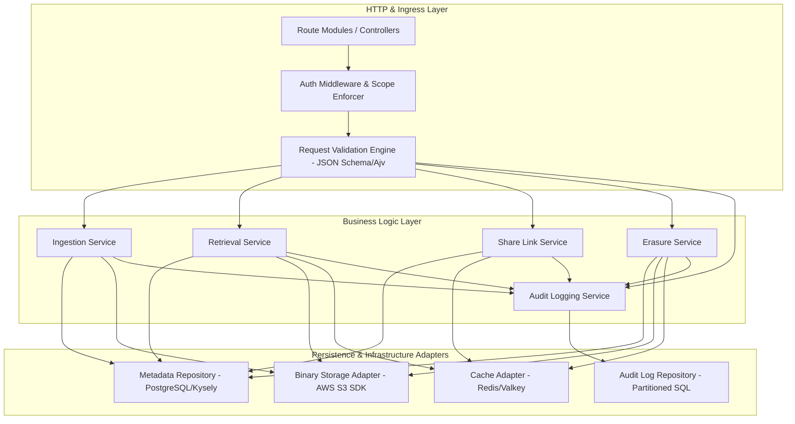
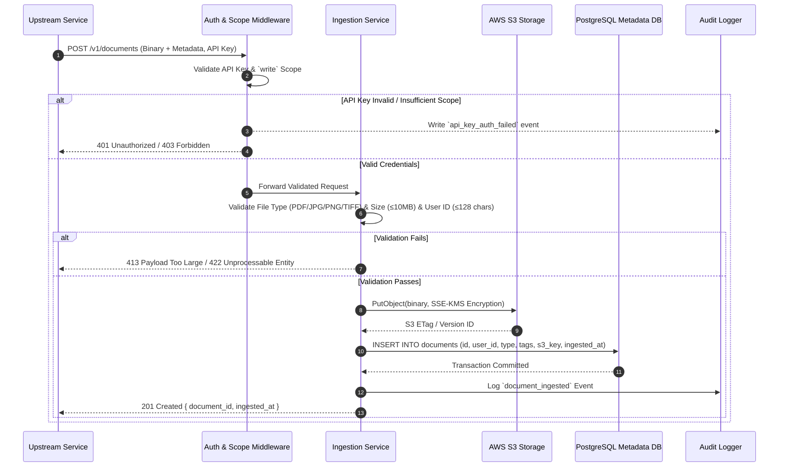
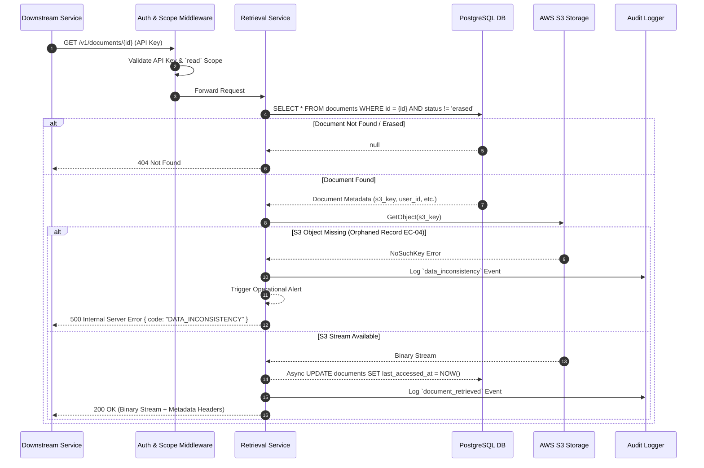
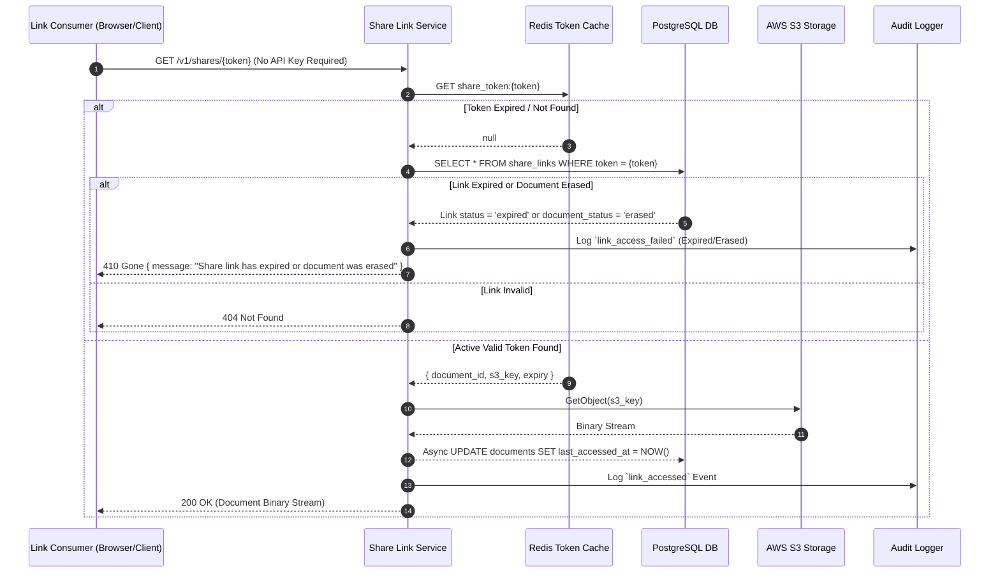
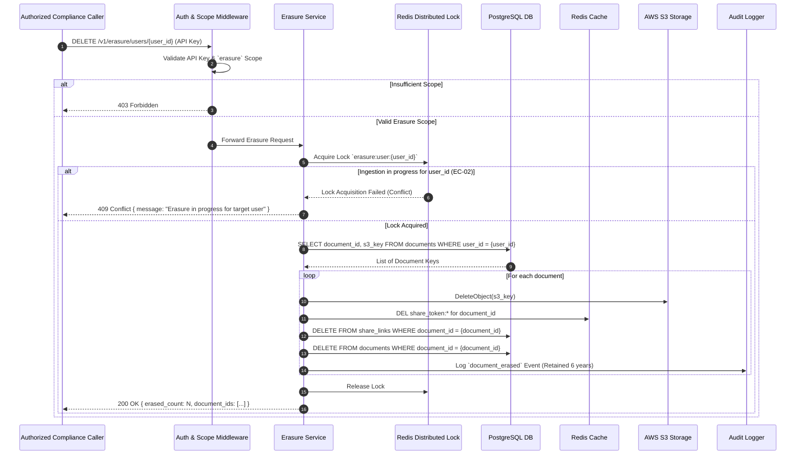

# Backend High-Level Design (HLD) — Document Management System (DMS)

**Scope:** `backend`  
**Version:** 1.0  
**Status:** DRAFT (Stage 3a — High-Level Design)  
**Date:** 2026-07-30  
**Author:** Principal Backend Architect  

---

## 1. System Executive Context & Boundaries

The Document Management System (DMS) is an internal, backend-only service providing a centralized, compliant storage and retrieval mechanism for binary documents (PDF, JPG, PNG, TIFF) generated across the organization's microservices ecosystem.

```mermaid
graph TD
    subgraph Upstream Producers
        UPS1[Billing & Invoicing Service]
        UPS2[KYC & Verification Service]
    end

    subgraph Downstream Consumers
        DNS1[Customer Portal API]
        DNS2[Reporting & Analytics Service]
        DNS3[External Recipient / Partner]
    end

    subgraph Compliance & Audit
        AUD[Compliance Auditor Service / SIEM]
    end

    subgraph DMS Core Boundary
        API[DMS API Gateway / Ingress]
        SVC[DMS Application Core]
        META[(PostgreSQL Metadata Store)]
        AUDLOG[(PostgreSQL Partitioned Audit Logs)]
        BLOB[(AWS S3 Encrypted Binary Store)]
        CACHE[(Redis Scope & Token Cache)]
    end

    UPS1 -->|F-01: Ingest Document (write scope)| API
    UPS2 -->|F-01: Ingest Document (write scope)| API

    API -->|F-02, F-03, F-06: Retrieve/Search (read scope)| DNS1
    API -->|F-04: Generate Link (write scope)| DNS2
    DNS3 -->|F-05: Resolve Link (Public Unauthenticated)| API
    AUD -->|F-09: Query Audit Logs (audit-read scope)| API
    API -->|F-07: Hard Delete (erasure scope)| SVC

    API --> SVC
    SVC --> META
    SVC --> AUDLOG
    SVC --> BLOB
    SVC --> CACHE
```

---

## 2. Component Hierarchy & Module Design

The DMS backend application is structured as a decoupled, modular layered system designed for zero single-point-of-failure operation:



### Module Descriptions
1. **Auth Middleware (`AM`):** Intercepts every API call, extracts `X-DMS-API-Key` and `X-DMS-API-Secret`, validates against Redis cache (< 60s revocation SLA), and checks endpoint scope (`read`, `write`, `erasure`, `audit-read`).
2. **Ingestion Service (`IS`):** Handles binary stream parsing, file format validation (PDF/JPG/PNG/TIFF), size check (≤ 10 MB), user ID validation, tag sanitization, binary uploads to S3, and metadata persistence to PostgreSQL within a single logical transaction boundary.
3. **Retrieval & Search Service (`RS`):** Executes metadata queries by ID, user ID, or tags with pagination (default 20, max 100), streams binaries from S3, handles orphaned record alerts (`EC-04`), and triggers asynchronous `last_accessed_at` updates.
4. **Share Link Service (`SS`):** Generates cryptographically secure, unguessable link tokens (CSPRNG 256-bit), manages configurable expiry (1h–30d), caches tokens in Redis, and resolves unauthenticated link access requests.
5. **Erasure Service (`ES`):** Executes GDPR Article 17 hard deletes across S3 binaries, PostgreSQL metadata records, and active Redis share links. Enforces isolation using Redis distributed locks during erasure execution.
6. **Audit Logging Service (`ALS`):** Writes append-only, tamper-evident audit logs to partitioned PostgreSQL tables for every ingestion, retrieval, link access, erasure, and security failure. Exposes a paginated query interface for compliance auditors.

---

## 3. High-Level Sequence Diagrams

### 3.1 Document Ingestion Workflow (F-01)



### 3.2 Retrieve Document by ID & Orphaned Record Edge Case (F-02 / EC-04)



### 3.3 Shareable Link Resolution (F-05)



### 3.4 Right-to-Erasure (Hard Delete) Workflow (F-07)



---

## 4. Database Schema Design (PostgreSQL)

```sql
-- Document Metadata Table
CREATE TABLE documents (
    id UUID PRIMARY KEY DEFAULT gen_random_uuid(),
    user_id VARCHAR(128) NOT NULL,
    document_type VARCHAR(16) NOT NULL CHECK (document_type IN ('PDF', 'JPG', 'PNG', 'TIFF')),
    file_size_bytes INT NOT NULL CHECK (file_size_bytes > 0 AND file_size_bytes <= 10485760),
    s3_key VARCHAR(512) NOT NULL UNIQUE,
    tags JSONB DEFAULT '{}'::jsonb,
    status VARCHAR(16) NOT NULL DEFAULT 'active' CHECK (status IN ('active', 'erasing', 'erased')),
    ingested_at TIMESTAMPTZ NOT NULL DEFAULT NOW(),
    last_accessed_at TIMESTAMPTZ,
    created_at TIMESTAMPTZ NOT NULL DEFAULT NOW(),
    updated_at TIMESTAMPTZ NOT NULL DEFAULT NOW()
);

CREATE INDEX idx_documents_user_id ON documents(user_id) WHERE status = 'active';
CREATE INDEX idx_documents_type_ingested ON documents(document_type, ingested_at DESC) WHERE status = 'active';
CREATE INDEX idx_documents_tags ON documents USING GIN (tags) WHERE status = 'active';

-- Shareable Links Table
CREATE TABLE share_links (
    id UUID PRIMARY KEY DEFAULT gen_random_uuid(),
    token VARCHAR(128) NOT NULL UNIQUE,
    document_id UUID NOT NULL REFERENCES documents(id) ON DELETE CASCADE,
    created_by_key_id VARCHAR(64) NOT NULL,
    expires_at TIMESTAMPTZ NOT NULL,
    created_at TIMESTAMPTZ NOT NULL DEFAULT NOW()
);

CREATE INDEX idx_share_links_token ON share_links(token);
CREATE INDEX idx_share_links_document_id ON share_links(document_id);

-- API Keys Table
CREATE TABLE api_keys (
    id VARCHAR(64) PRIMARY KEY,
    key_hash VARCHAR(256) NOT NULL UNIQUE,
    service_name VARCHAR(128) NOT NULL,
    scopes TEXT[] NOT NULL, -- Array of ['read', 'write', 'erasure', 'audit-read']
    is_revoked BOOLEAN NOT NULL DEFAULT FALSE,
    created_at TIMESTAMPTZ NOT NULL DEFAULT NOW(),
    updated_at TIMESTAMPTZ NOT NULL DEFAULT NOW()
);

-- Immutable Partitioned Audit Log Table (HIPAA 6-Year Minimum Retention)
CREATE TABLE audit_logs (
    id UUID NOT NULL DEFAULT gen_random_uuid(),
    event_type VARCHAR(32) NOT NULL,
    document_id UUID,
    user_id VARCHAR(128),
    caller_key_id VARCHAR(64),
    ip_address_hash VARCHAR(64),
    outcome VARCHAR(16) NOT NULL,
    metadata JSONB DEFAULT '{}'::jsonb,
    created_at TIMESTAMPTZ NOT NULL DEFAULT NOW(),
    PRIMARY KEY (id, created_at)
) PARTITION BY RANGE (created_at);

-- Partition creation example for monthly range
CREATE TABLE audit_logs_2026_07 PARTITION OF audit_logs
    FOR VALUES FROM ('2026-07-01 00:00:00+00') TO ('2026-08-01 00:00:00+00');
```

---

## 5. API Specification Overview

| Method | Path | Scope | Purpose | Success Code | Error Codes |
|---|---|---|---|---|---|
| `POST` | `/v1/documents` | `write` | Ingest document binary & metadata | `201 Created` | `401`, `403`, `413`, `422`, `409`, `503` |
| `GET` | `/v1/documents/{id}` | `read` | Retrieve document binary & metadata by ID | `200 OK` | `401`, `403`, `404`, `500`, `503` |
| `GET` | `/v1/users/{userId}/documents` | `read` | List paginated documents for a user ID | `200 OK` | `401`, `403`, `500` |
| `GET` | `/v1/documents/search` | `read` | Search documents by type, date, tags | `200 OK` | `401`, `403`, `422`, `500` |
| `POST` | `/v1/documents/{id}/shares` | `write` | Generate time-limited share link | `201 Created` | `401`, `403`, `404`, `422`, `500` |
| `GET` | `/v1/shares/{token}` | None (Public) | Resolve share link & serve binary | `200 OK` | `404`, `410`, `500` |
| `DELETE` | `/v1/erasure/users/{userId}` | `erasure` | Hard delete all documents for user ID | `200 OK` | `401`, `403`, `409`, `207`, `500` |
| `DELETE` | `/v1/erasure/documents/{id}` | `erasure` | Hard delete specific document by ID | `200 OK` | `401`, `403`, `404`, `500` |
| `GET` | `/v1/audit/logs` | `audit-read` | Query compliance audit logs | `200 OK` | `401`, `403`, `422`, `500` |

---

## 6. Edge Case Handling Strategy Matrix

| EC ID | Edge Case Scenario | Architectural Handling Mechanism |
|---|---|---|
| **EC-01** | Duplicate binary & user ID submitted | DMS assigns a new unique UUID `document_id` and new S3 key for each ingestion. No deduplication performed in MVP. |
| **EC-02** | Ingestion request during active erasure | Distributed lock `erasure:user:{user_id}` in Redis prevents concurrent write. Ingestion returns `409 Conflict`. |
| **EC-03** | Concurrent retrieval of same document | Read operations execute in parallel against PostgreSQL/S3. Two distinct `document_retrieved` audit events logged. |
| **EC-04** | Metadata exists, binary missing in S3 | Catch S3 `NoSuchKey` exception, emit `data_inconsistency` audit event, trigger operational alert via PagerDuty/webhook, return `500 Internal Server Error`. |
| **EC-05** | Simultaneous share link access | High-concurrency S3 streaming + Redis token caching handle parallel reads. Each access logged individually. |
| **EC-06** | Access at exact expiry millisecond | System compares `server_now >= expiry_timestamp`. Strict server clock authority. If equal, return `410 Gone`. |
| **EC-07** | Document erased after link created | Share link database record deleted in CASCADE transaction; Redis token evicted immediately on erasure. Next access returns `410 Gone`. |
| **EC-08** | Search query with no matches | Query returns `200 OK` with payload `{ data: [], pagination: { total: 0, page: 1, limit: 20 } }`. |
| **EC-09** | In-flight retrieval during erasure | Erasure marks document status as `erasing`. In-flight S3 stream completes. New requests immediately receive `404 Not Found`. |
| **EC-10** | Erasure for user with 0 documents | Query returns 0 rows. System returns `200 OK` with `{ erased_count: 0, document_ids: [] }` (Idempotent). |
| **EC-11** | Partial erasure failure | Transaction rolls back failed items. System returns `207 Multi-Status` listing succeeded and failed IDs for client retry. |
| **EC-12** | API Key with insufficient scope | Auth middleware rejects before controller execution, returns `403 Forbidden`, logs `api_key_auth_failed` event. |
| **EC-13** | Audit query for erased document | Audit logs are stored in separate append-only partitioned table (`audit_logs`) and are preserved for 6 years regardless of document erasure. |

---

## 7. Scalability, Latency & Resilience SLA

1. **Metadata Retrieval Latency (P95 < 500 ms):** PostgreSQL indexed queries (B-tree on `user_id`, `id`, GIN on `tags`) combined with Redis caching for API Key scope checks guarantee P95 metadata lookup latency under 50 ms (well within 500 ms SLA).
2. **Binary Download Streaming (P95 < 2 s start):** Binary data is streamed directly from S3 through Node.js pass-through streams without buffering full files in memory.
3. **Throughput Target (≥ 500 req/s):** Fastify asynchronous event loop + connection pooling (PostgreSQL 50 max connections, Redis cluster) easily sustains > 1,000 req/s on standard container nodes.
4. **Availability Target (99.9% Monthly):** Stateless Fastify container tasks deployed across multi-AZ container orchestrators (ECS/EKS), backed by Multi-AZ PostgreSQL and Multi-AZ S3.
