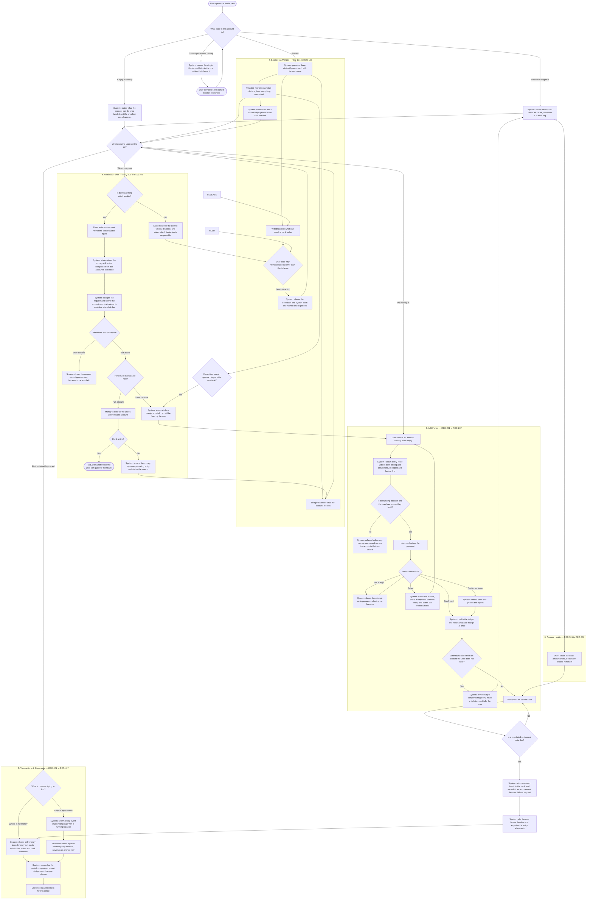

# Product Requirements Document: Fund Management System

> **Tech-Agnostic Rule:** applies to every file in this PRD, not just this one. This document states what users need and why. Technology, interfaces and data design are decided at the High-Level and Low-Level Design stages.

## Contents

This PRD is split across eight files — this index plus the seven listed in its frontmatter `parts:`. Read them in this order:

1. **This file** — Engineering Digest, Executive Summary, Problem Statement, Goals, Stakeholders, Personas, the [end-to-end flow diagram](#end-to-end-flow-one-rupees-journey-through-the-account) covering all five parts as one process, cross-cutting requirements, scope, metrics, timeline, risks
2. [Balances & Margin](product-requirements-balances-and-margin.md) — the three balances, what they mean, how the withdrawable figure is derived and explained
3. [Add Funds](product-requirements-add-funds.md) — routes, cost and timing disclosure, money in flight, failure recovery
4. [Withdraw Funds](product-requirements-withdraw-funds.md) — eligibility, end-of-day settlement, arrival time, cancellation, mandated settlement
5. [Transactions & Statements](product-requirements-transactions-and-statements.md) — the ledger, plain-language entries, reconciliation, statements
6. [Account Health](product-requirements-account-health.md) — dues, blocked accounts, empty accounts, margin shortfall
7. [Communications](product-requirements-communications.md) — what we send by SMS, WhatsApp and email when the account needs action
   · [**Message catalogue**](https://claude.ai/code/artifact/d91dde38-c18b-475c-b9b3-ba19f41225ba) — all 23 messages, rendered as they are received
8. [Configuration](product-requirements-configuration.md) — limits, caps, fees and timings that change without the product changing

**Terminology.** Money entering the account is a **payin**; money leaving is a **payout**. **Margin** is the money a trader must have committed against a position. **Collateral** is securities pledged to create margin without selling them. **Running-account settlement** is the regulator-mandated periodic return of unused funds to the client's bank. Every other domain term is defined at first use.

## Validation Checklist

### CRITICAL GATES (Must Pass)

- [x] All required sections are complete
- [x] No [NEEDS CLARIFICATION] markers remain
- [x] Domain Invariants Gate has been run and every table-stakes item has a feature, an NFR, or an explicit Out-of-Scope entry with a reason — see [Supporting Research](#supporting-research)
- [ ] No Must-Have feature's acceptance criteria depend on an unresolved Open Question — **not met, but narrowed 19 Aug 26.** EB-3, EB-4 and EB-5 have since closed, unblocking REQ-202 and every Phase 2 requirement. **Two Must-Haves remain blocked:** REQ-303 on EB-9 (calendar source) and REQ-501 on EB-8 (the confirmed rate). REQ-205 carries a residual dependency on per-partner failure-reason fidelity, EB-3's remainder. Each is listed in the Engineering Digest with a BLOCKING marker, an owner and the stage by which it must resolve, per the skill's third permitted resolution. REQ-503 was downgraded to Should-Have rather than carried as a blocked Must. They are not silent gaps, but the gate is not passed either.
- [x] Problem statement is specific and measurable
- [x] Every feature has testable acceptance criteria in EARS format
- [x] Every primary user flow has a happy path, at least one alternate branch, and at least one error path
- [x] No contradictions between sections; each rule lives in exactly one file and is referenced elsewhere
- [x] No technology, architecture, or implementation detail anywhere in the document

### QUALITY CHECKS (Should Pass)

- [ ] Problem is validated by evidence rather than assumption — **partially met.** The status quo is evidenced by four structured teardowns of live competitor products, including one showing a real account silently in debt for five months. What is *not* evidenced is demand from this firm's own users, because no version of this product exists. Both positions are logged in [Risks & Constraints](#risks--constraints).
- [x] Context → Problem → Solution flow makes sense
- [x] Every persona has at least one user flow
- [x] MVP Scope, Future Scope, and Out of Scope are mutually exclusive
- [x] Every Non-Functional Requirement number carries a stated basis or a `[PROPOSED: pending eng confirmation]` marker
- [x] Every metric has a corresponding tracking event, evidenced by the mapping table in [Success Metrics](#success-metrics--business-metrics)
- [x] No feature redundancy
- [x] Engineering Digest is populated and matches the detailed sections it summarises
- [x] A new team member could understand this PRD without asking what a term means

## Engineering Digest

**Features at a glance:**

| ID | Feature | Owning file |
|---|---|---|
| REQ-101 | Show three distinct balances and never conflate them | [Balances & Margin](product-requirements-balances-and-margin.md) |
| REQ-102 | Explain the withdrawable figure line by line | [Balances & Margin](product-requirements-balances-and-margin.md) |
| REQ-103 | Decompose available margin into its named components | [Balances & Margin](product-requirements-balances-and-margin.md) |
| REQ-104 | Show collateral separately and never as withdrawable | [Balances & Margin](product-requirements-balances-and-margin.md) |
| REQ-105 | Answer how much can be deployed on each kind of trade | [Balances & Margin](product-requirements-balances-and-margin.md) |
| REQ-106 | Show blocked money by funding source and commitment state | [Balances & Margin](product-requirements-balances-and-margin.md) |
| REQ-107 | State how current every margin figure is | [Balances & Margin](product-requirements-balances-and-margin.md) |
| REQ-108 | Keep separately-settled segments separately presented | [Balances & Margin](product-requirements-balances-and-margin.md) |
| REQ-201 | Let the user choose an amount without being anchored | [Add Funds](product-requirements-add-funds.md) |
| REQ-202 | Show each route's cost and arrival time before the user commits | [Add Funds](product-requirements-add-funds.md) |
| REQ-203 | Accept money only from an account the user has proven they hold | [Add Funds](product-requirements-add-funds.md) |
| REQ-204 | Credit confirmed money at once and show money still in flight | [Add Funds](product-requirements-add-funds.md) |
| REQ-205 | Explain a failed attempt and offer a way forward | [Add Funds](product-requirements-add-funds.md) |
| REQ-206 | Reverse a payin that should not have been accepted | [Add Funds](product-requirements-add-funds.md) |
| REQ-207 | Treat funding during a shortfall as urgent | [Add Funds](product-requirements-add-funds.md) |
| REQ-301 | Keep a withdraw entry point always visible, disabled with a reason | [Withdraw Funds](product-requirements-withdraw-funds.md) |
| REQ-302 | Accept one withdrawal request and settle it at end of day | [Withdraw Funds](product-requirements-withdraw-funds.md) |
| REQ-303 | Tell the user when the money will arrive, from their own account state | [Withdraw Funds](product-requirements-withdraw-funds.md) |
| REQ-305 | Let the user cancel a request that has not yet been sent | [Withdraw Funds](product-requirements-withdraw-funds.md) |
| REQ-306 | Return the money and state the reason when a payout fails | [Withdraw Funds](product-requirements-withdraw-funds.md) |
| REQ-307 | Return unused funds on the mandated calendar and explain each return | [Withdraw Funds](product-requirements-withdraw-funds.md) |
| REQ-308 | Re-check eligibility before the money actually leaves | [Withdraw Funds](product-requirements-withdraw-funds.md) |
| REQ-401 | Record every money event in plain language | [Transactions & Statements](product-requirements-transactions-and-statements.md) |
| REQ-402 | Separate "where is my money" from "explain my account" | [Transactions & Statements](product-requirements-transactions-and-statements.md) |
| REQ-403 | Let the user find a transaction by date, type and amount | [Transactions & Statements](product-requirements-transactions-and-statements.md) |
| REQ-404 | Show a running balance and pair every reversal with its original | [Transactions & Statements](product-requirements-transactions-and-statements.md) |
| REQ-405 | Track one payin or payout through its whole life | [Transactions & Statements](product-requirements-transactions-and-statements.md) |
| REQ-406 | Reconcile any period end to end | [Transactions & Statements](product-requirements-transactions-and-statements.md) |
| REQ-407 | Produce a statement the user can keep and submit | [Transactions & Statements](product-requirements-transactions-and-statements.md) |
| REQ-501 | Tell the user they owe money, why, and what it is costing | [Account Health](product-requirements-account-health.md) |
| REQ-502 | Let the user clear dues exactly, below any minimum | [Account Health](product-requirements-account-health.md) |
| REQ-503 | Warn before a predictable charge puts the account into debit | [Account Health](product-requirements-account-health.md) |
| REQ-504 | Give an empty account a purpose | [Account Health](product-requirements-account-health.md) |
| REQ-505 | Name the blocker when the account cannot receive money | [Account Health](product-requirements-account-health.md) |
| REQ-506 | Warn while a shortfall can still be fixed | [Account Health](product-requirements-account-health.md) |
| REQ-601–604 | Margin shortfall escalation ladder, its three-SMS cap, the action control and the amount it carries, the email's arithmetic and subject line, channel pairing and step-dropping | [Communications](product-requirements-communications.md) |
| REQ-608, 609 | Dues banding by amount and age, and the clear-down confirmation | [Communications](product-requirements-communications.md) |
| REQ-611–615 | Fund-addition messaging: chase, confirm, what changed, each failure outcome, both figures moving | [Communications](product-requirements-communications.md) |
| REQ-616–620 | Withdrawal messaging: cancelled, partial, where the money is, each end-of-day outcome, the bank's own reference | [Communications](product-requirements-communications.md) |
| REQ-621–627 | Governing rules: one source of figures, event-queued, delivery logging, opt-in, versioning, preferences, reachability | [Communications](product-requirements-communications.md) |
| REQ-701–703 | Per-day per-route caps, automatic route selection, minimum waived to settle a debt | [Configuration](product-requirements-configuration.md) |
| REQ-704, 705 | Bank account add / delete / limit — **delivered by Profile** | [Configuration](product-requirements-configuration.md) |
| REQ-706, 706a | Primary account as default; no bank account is a named blocker | [Configuration](product-requirements-configuration.md) |
| REQ-707 | Arrival date stated before commitment, from the EOD boundary | [Configuration](product-requirements-configuration.md) |
| REQ-708 | Debit interest rate read from configuration, never restated in copy | [Configuration](product-requirements-configuration.md) |
| REQ-709, 710 | Post-funding destination, and the fallback where none is configured | [Configuration](product-requirements-configuration.md) |

**Hard numbers:**

| Number | Value | Sourcing |
|---|---|---|
| First balance visible on opening the funds view | 1.5s at p95 | `[PROPOSED: pending eng confirmation]` — benchmarked competitor first paint ranges from 0.18s to 3.2s across the four teardowns; the target sits inside the observed achievable range rather than being invented |
| Confirmed payin reflected in available margin | 30s at p95 | `[PROPOSED: pending eng confirmation]` — the tolerance is set by the auto-square-off window during a margin shortfall, not by user patience. See REQ-207 |
| Withdrawable derivation reachable from the withdrawable figure | 1 interaction | Design decision. The figure is the single largest source of support contact in this domain; the explanation cannot be a separate destination |
| Payout status change visible to the user | 1 minute | `[PROPOSED: pending eng confirmation]` |
| Transaction history default range | 30 days | Monthly running-account settlement means a 7-day default — observed live at one competitor — routinely hides the transaction users most often query |
| Statement export period | one financial year, plus custom range | Tax filing is the dominant use; the Indian financial year runs April to March |
| Minimum payin | ₹100 | `[PROPOSED: pending commercial confirmation]` — benchmarked competitors sit between ₹1 and ₹100. REQ-502 requires an exception so a debt smaller than the minimum can still be cleared |
| Availability | 99.5% measured monthly | `[PROPOSED: pending eng confirmation]` — basis: an outage is a customer unable to reach their own money, but this is not itself an order-placement path |
| Ledger integrity check | at least daily | Correctness invariant, not a performance target. Sum of entries must equal the stated balance |
| Payin success rate | ≥ 95% | Target, not a measurement. One teardown observed 2 successes in 10 attempts on a live account; the gap between that and 95% is the size of the opportunity |
| Withdrawal rejections after acceptance | zero | Correctness invariant. A request accepted against a correctly-computed withdrawable figure must not later be refused for insufficiency |

**Must-Haves with unresolved dependencies:**

**Four**, across two blockers. Each is carried as a Must-Have with a blocking dependency rather than
silently downgraded, because each is a regulatory disclosure obligation or a core promise of the
product. Three of the four wait on EB-9, the calendar source, which is the single dependency with
the widest reach in this document: it gates a date, a sweep and a balance, and it bites in Phase 1
rather than Phase 3.

| Requirement | Depends on | Status |
|---|---|---|
| REQ-303 / REQ-707 (tell the user when the money will arrive) | **EB-9** — no nominated source for the trading and settlement holiday calendar | **BLOCKING before Phase 3.** Owner: product owner with compliance. EB-4 is closed — the 3:00 PM cutoff and the next-working-day rule are set. What remains is the calendar: which days are working days is not derivable from the day of the week, and the arrival date is wrong without it. |
| REQ-307 (return unused funds on the mandated calendar) | **EB-9** — the same missing calendar source | **BLOCKING before Phase 4.** Owner: product owner with compliance. The mandated return dates are calendar dates, not intervals: a sweep executed on an unverified date moves client money on a day the regulator did not require. Withdraw Funds Flow 3 already refuses to execute a return on a date it cannot establish, so the failure is safe rather than silent — but the requirement is not deliverable until the calendar has a source. |
| Rule B4 (the withdrawable derivation) | **EB-9** — the same missing calendar source | **BLOCKING before Phase 1.** Owner: product owner with compliance. The non-withdrawable period for unsettled sale proceeds is measured in settlement days, and Rule B6 requires a settlement holiday extending it to be named as the cause. Without the calendar the deduction is computed against weekdays, which is wrong on every holiday, and the withdrawable figure is wrong with it. This is the earliest-biting of EB-9's dependants and the one most easily missed, because it presents as a balance rather than as a date. |
| REQ-501 (tell the user they owe money, why, and what it is costing) | **EB-8** — the debit interest rate is configured in TechExcel and not yet set | **BLOCKING before Phase 4.** Owner: finance with TechExcel. The requirement to disclose stands regardless; the value to disclose does not exist yet. No production message quoting a rate may be sent until it does. Note that one benchmarked competitor publishes no rate at all, which is the failure this requirement exists to avoid. |

| Requirement | Depends on | Status |
|---|---|---|
| REQ-503 (warn before a predictable charge puts the account into debit) | **EB-6** — whether TechExcel exposes a charge *before* it posts | **Remains Should-Have.** The charge data now has a source, but this requirement cannot be partially delivered: a warning needs forward visibility of a scheduled charge and its date. Ships once TechExcel confirms it. |

REQ-202 has been **removed from this list**. EB-3 is closed: UPI and netbanking are the v1 routes, the
caps are published, and `nbFee` is ₹0 — we absorb the gateway charge — so there is no cost to
disclose and the obligation reduces to the route used and the arrival time. The configuration key
remains, so charging later is a settings change and the disclosure obligation reapplies without a
requirement change.

**Estimation Blockers — 7 of 10 closed or reduced (see full section below):**

- ~~EB-1~~ — **Closed.** We are the broker; FMS owns the ledger. TechExcel is the back office it reconciles to.
- EB-2 — **Reduced to an interface contract.** Front office in market hours, TechExcel outside. `derive()` already takes margin as an input.
- ~~EB-3~~ — **Closed.** UPI and netbanking; caps published; no fee passed through; automatic route selection.
- ~~EB-4~~ — **Closed.** 3:00 PM cutoff against the EOD boundary. No instant payout — REQ-304 parked.
- ~~EB-5~~ — **Closed.** Proven accounts are already available as part of Profile, which also owns add, delete and set-primary. FMS reads the list and never mutates it. Phase 2 is unblocked.
- EB-6 — **Source settled, scope open.** Charges come from TechExcel. Whether a not-yet-posted charge is readable is what still gates REQ-503.
- ~~EB-7~~ — **Closed.** Merged balances; no segment-level segregation. Entries must still record their segment.
- EB-8 — **Source settled, value open.** Rate configured in TechExcel; 18% p.a. is a stand-in.
- **EB-9 — OPEN.** TechExcel or a direct download for the trading and settlement calendar; deliberately deferred. Blocks Phase 3.
- EB-10 — **Deferred to technical design.** Volumes and behavioural assumptions; the first 60 days set the baseline.

## Executive Summary

The Fund Management System is the money layer of a broking account: it is where a trader adds funds, withdraws them, sees every rupee that has moved, and understands how much of their money is actually theirs to use right now. It exists because a broking account answers "how much do I have?" with three different numbers — the ledger balance, what can be traded with, and what can be withdrawn — and these are almost never equal.

Every product examined for this PRD conflates at least two of those three, and the resulting confusion is the dominant source of user distrust in the category: withdrawals accepted then rejected, balances that are debts, deposits that fail eight times in a row with no reason given, and charges disclosed only after they have been taken. This module is built for the trader who needs to act on a number and be right about it.

The wedge is narrow and specific: **get the three balances right, and explain the gap between them.** Everything else — the routes, the history, the statements — is built on that foundation, and none of it is trustworthy without it.

## Problem Statement

### Context

A broking customer's money does not sit in a wallet. It sits with the broker as a running account, and everything that happens to it — trades settling, margin being committed against a position, charges posting, the regulator requiring unused funds to be swept back to the bank — moves through that one account. The customer sees a number and makes decisions on it: whether they can place a trade, whether they can pay their rent this week, whether something has gone wrong.

The number is not one number. It is at least three:

- what the account records as the balance,
- what can be committed to a trade right now, which includes pledged securities and excludes anything already committed,
- and what can actually reach a bank account today, which excludes pledged securities, money added today, and money from sales that have not settled.

A funded, active account routinely shows a healthy balance and a withdrawable figure of zero. This is correct behaviour. It is also, to the person looking at it, indistinguishable from a bug.

### Problem

Fund management modules across this category fail in four consistent, evidenced ways. Each was observed directly on a live product during the teardowns that informed this PRD.

**One — the balances are conflated, or defined circularly.** One product presents two balance figures where each is explained in terms of the other: buying power is defined as withdrawable plus pledge plus today's activity, and withdrawable is defined as buying power minus pledge minus today's activity. Neither is anchored to anything the user recognises as their own money. Another presents six different labels — "Available for Investing", "Available Cash", "Current Balance", "Opening Balance", "Previous Balance", "Closing Balance" — all rendering the same figure simultaneously across one screen, with nothing to indicate whether they are the same quantity or four that happen to coincide. Of six brokers whose published interfaces were reviewed, only one answers "how much can I withdraw?" directly; the others require the client to derive it, and the market leader's own help pages warn that a withdrawal "may be rejected, or you may receive a lower amount" as a result.

**Two — the empty and negative states are undesigned, and they are where users start and where they get stuck.** One product renders a ₹0 account identically to a funded one: fifteen instances of ₹0.00 across two cards, a 0.00% utilisation bar, and no acknowledgement anywhere that the account is empty or what would change that. Another renders no empty state at all — the transaction area is blank space — while shipping a designed, illustrated empty state on two neighbouring screens in the same product. On a third, a dormant account was found at **−₹24.37**, having gone negative through no user action: a regulator-mandated settlement swept the balance to zero, a routine monthly depository bill of ₹23.60 posted against that zero two weeks later, and a weekly penalty of ₹0.07 has compounded every Monday since. Five months of that account's history is a slow, silent, automatic debt. The product's response is to display "Available for Investing −₹24.37". There is no notification, no explanation, no way to pay, and because the minimum deposit is ₹50, the user cannot clear a ₹24.37 debt even if they work out that they owe it.

**Three — money movement is a form, not a flow, and its failures are dead ends.** On one account, eight of the ten most recent deposit attempts had failed — six of them within four hours on a single morning, the signature of a user retrying blind. Every failed row shows the word "Failed" and nothing else: no reason, no retry, no suggestion to try a different route, no support path. One row lists the payment method as `--`. Separately, the per-transaction fee on that product's bank-transfer route is ₹11.80, disclosed nowhere before payment and appearing afterwards as its own ledger line; on a ₹100 deposit that is 11.8% of the deposit. On another product, the withdraw control at ₹0 balance renders in its full enabled treatment and, when clicked, does nothing at all — no dialog, no message, no request. On a third, the entire deposit flow is live and responsive — a pre-filled ₹50,000, five working increment buttons — and terminates in a permanently disabled button, because the account's identity verification is incomplete, explained in the smallest text on the card with no link to the thing that would unblock it.

**Four — the ledger is written for the back office and shipped to the customer.** Entries reach users as settlement-system strings. Reversals appear as independent rows with no link to the entry they reverse, so a scanning user counts the charge twice. History is capped at ten rows with no filter, no search and no paging, so the answer to "what happened in March?" is a spreadsheet download. And no product in the set offers the one view that would settle most disputes outright: opening balance, plus money in, minus money out, plus or minus trading obligations, minus charges, equals closing balance.

The consequence in each case is the same and it compounds: a user who cannot verify what happened to their money stops trusting the numbers, and a user who does not trust the numbers does not leave money in the account.

### Why Now

Three things make this the moment. **The regulatory direction is toward disclosure, not away from it** — obligations around disclosing charges truthfully and stating material terms up front have tightened, and a consultation on a common advertisement code covering brokers is in progress; a module that discloses fees and penal rates before they are incurred is building toward the rules rather than retrofitting to them. **Withdrawal speed has become a visible, review-driving differentiator** rather than a back-office detail — users of one broker cite a competitor by name in public app-store reviews when asking for faster payouts. This phase answers that with a *stated, accurate* arrival date rather than a faster route; the faster route itself is parked (see [Out of Scope](#out-of-scope)). And **the failure mode is now well documented enough to design against deliberately**: the four teardowns behind this PRD give a specific, evidenced list of what breaks, which is a materially better starting position than building the same module and discovering the same problems.

> **Reality-Check Gate.** This section was tested against the six forcing questions and holds in four places and not in two. **Status quo** holds strongly — four structured teardowns document precisely what users do today and what it costs them. **Desperate specificity** holds: a dormant customer accruing an undisclosed weekly penalty, and an active trader whose accepted withdrawal is later rejected, are both unambiguously harmed and both are observed rather than hypothesised. **Narrowest wedge** holds and is reflected in MVP scope — the three balances and the explained withdrawable figure. **Future-fit** holds: the regulatory obligation to hold, segregate and account for client money is not going away. **Demand reality** does not hold — no measured demand from this firm's own users exists, because no version of this product exists. **Direct observation** holds for competitors and does not hold for our own users. Both unmet items are logged as Assumptions in [Risks & Constraints](#risks--constraints) and as Open Questions, rather than being presented as validated.

## Goals

### Product Goals

- Let a user look at one number and act on it correctly, without needing to know which of three numbers they are looking at.
- Make the gap between "what I have" and "what I can take out" explainable in the moment it is noticed, rather than through a support conversation.
- Ensure no money movement fails silently: every refusal, failure and automatic deduction states what happened, why, and what the user can do next.
- Let a user reconstruct any period of their account's history well enough to answer their own question without contacting anyone.
- Make a user's first deposit, and a dormant user's return, feel like a designed path rather than an empty room.
- Charge nothing the user was not told about before they incurred it.

### Non-Goals

- Not building trading. This module holds the money and reports what has been committed against it; it does not place orders, hold positions, or decide margin requirements.
- Not building identity or bank account verification. Both happen before this module and are consumed by it.
- Not optimising for deposit volume at the cost of comprehension. Anchoring a user toward a larger deposit than they intended is available and deliberately rejected — see [Out of Scope](#out-of-scope).
- Not replacing the statutory statements a broker must issue. This module must reconcile with them; it does not supersede them.
- Not building an operations console. The ledger must be correctable with a full audit trail, but the surface for doing so is a later phase.

## Stakeholders

| Stakeholder | Role | Interest / Stake | Approval Needed? |
|---|---|---|---|
| Product owner | Sponsor | A funds surface that users trust enough to leave money in; deposits that complete on the first attempt | Yes |
| Compliance and risk | Control owner | Client money segregated and accounted for; charges and penal rates disclosed before they are incurred; every figure reconcilable to a statutory statement | Yes |
| Finance | Cost and float owner | Float retained rather than swept out by users who do not understand their balance; per-route payment costs bounded and attributable; debit balances recovered | Yes |
| Risk and surveillance | Margin owner | Available margin and blocked margin are correct at all times; a shortfall is visible to the user early enough to be fixed by them rather than by a forced square-off | Yes |
| Operations | Payout owner | Payout batches, cut-offs and failure handling achievable with real staffing; failed payouts reach a queue rather than a support inbox | Yes |
| Engineering lead | Delivery owner | Requirements sizable; the margin and payment dependencies resolved before design | Yes |
| Customer support | Escalation owner | Every balance figure explainable to a customer without an engineer; every failed movement carries a reason they can read aloud | No |
| Payment and payout partners | External dependency | Interface stability, agreed volumes, reason codes carried through | No |

## User Personas

### Primary Persona: Nikhil — active derivatives trader

- **Demographics:** 34, self-employed, six years of trading experience, trades index and stock derivatives daily, uses a desktop during market hours and a phone outside them, holds pledged stock as collateral.
- **Goals:** Know at a glance how much he can commit to the next trade, and be able to move money in fast when a position turns against him. Take profits out without being told a number he cannot actually have.
- **Pain Points:** A single "available margin" figure that does not tell him whether it is cash or collateral, which matters because his derivatives positions need a cash half. Withdrawals accepted and then rejected. Margin figures that are silently stale. Being told he has ₹1,50,000 and finding he can withdraw ₹25,000, with no explanation of the difference.
- **Formal User Stories:**
  - As Nikhil, I want to see how much of my margin is cash and how much is collateral, so that I know whether I can open a position that requires cash.
  - As Nikhil, I want to know how current a margin figure is, so that I do not act on a number that was computed hours ago.
  - As Nikhil, I want my deposit to relieve a margin shortfall immediately, so that my positions are not squared off while my money sits in transit.
  - As Nikhil, I want to see why my withdrawable amount is lower than my balance, so that I stop guessing and stop contacting support.

### Secondary Persona: Priya — first-time investor with an empty account

- **Demographics:** 26, salaried, has never held a broking account before, entirely on a phone, comfortable with everyday payments and unfamiliar with broking vocabulary.
- **Goals:** Put a small amount of money in and buy something with it, today. She did not come here to fund an account; she came to invest.
- **Pain Points:** An account showing zeros with no indication of what to do next. Deposit amounts starting at figures far beyond what she intends to commit. Discovering a fee after paying it. A deposit that fails with no reason, leaving her unsure whether her money has gone.
- **Formal User Stories:**
  - As Priya, I want an empty account to tell me what to do next, so that I am not left guessing whether the product is broken or I am.
  - As Priya, I want to choose a small first amount without being pushed toward a large one, so that I can start at a level I am comfortable with.
  - As Priya, I want to know what a deposit will cost and when it will arrive before I pay, so that I am not surprised afterwards.
  - As Priya, I want a failed deposit to tell me what went wrong and what to try, so that I do not retry the same thing five times.

### Secondary Persona: Arun — dormant holder with a balance he did not create

- **Demographics:** 41, salaried, opened an account two years ago, traded a handful of times, has not logged in for months. Returns only when something prompts him.
- **Goals:** Understand what happened to his account while he was not looking, settle anything outstanding, and decide whether to resume or close.
- **Pain Points:** Money that left the account without him asking. A negative balance he cannot explain and did not cause. A charge accruing weekly that appears nowhere except a raw history entry. Being unable to pay off a small debt because it is below the minimum deposit.
- **Formal User Stories:**
  - As Arun, I want to be told when money leaves my account automatically, so that I am not left believing something has gone wrong.
  - As Arun, I want to know that I owe money, why I owe it, and what it is costing me, so that I can decide what to do about it.
  - As Arun, I want to pay exactly what I owe, so that clearing a small debt does not require me to deposit more than it.
  - As Arun, I want to reconstruct what happened over a period, so that I can satisfy myself the account is correct without calling anyone.

---

## User Flows

Every flow is written in full in the file that owns the feature, as a point-by-point breakdown with its branches and error paths. This section carries two things: the end-to-end picture of how money travels through the account, and the navigational map to the detailed flows. No requirement text is restated here.

### End-to-End Flow: one rupee's journey through the account

One account, every direction money can move, and every state it can be held in. The three balances are the spine: money enters as cash, some of it becomes committed, some becomes withdrawable, and some leaves without being asked to. Each box is expanded in the owning file listed in the map below.

Four properties of this picture matter more than any single box. **The three balances are computed once and named consistently everywhere**, so no screen can disagree with another about what a number means. **Every path that refuses the user leads somewhere** — a blocked account names its blocker and links to it, a failed deposit offers a different route, a zero withdrawable states which deduction caused it. **Money is never sent twice**: only one withdrawal request may be open at a time (Rule W4) and a single end-of-day run settles it against whatever is actually available (Rule W3), so no two paths can pay out the same rupee — while the money itself stays tradable right up to that run. And **money that leaves without being asked to leave** — the mandated settlement sweep, a reversal, a charge — is announced before it happens where it is predictable, and explained afterwards in all cases.

### Detailed flows by owning file

| Flow | Persona | Owning file |
|---|---|---|
| Understand why I cannot place this trade | Nikhil | [Balances & Margin](product-requirements-balances-and-margin.md#flow-1-understand-why-i-cannot-place-this-trade) |
| Understand why I cannot withdraw my balance | Nikhil, Arun | [Balances & Margin](product-requirements-balances-and-margin.md#flow-2-understand-why-i-cannot-withdraw-my-balance) |
| Fund an account for the first time | Priya | [Add Funds](product-requirements-add-funds.md#flow-1-fund-an-account-for-the-first-time) |
| Fund urgently to relieve a shortfall | Nikhil | [Add Funds](product-requirements-add-funds.md#flow-2-fund-urgently-to-relieve-a-shortfall) |
| A deposit that does not complete | Priya, Arun | [Add Funds](product-requirements-add-funds.md#flow-3-a-deposit-that-does-not-complete) |
| Withdraw while holding open positions | Nikhil | [Withdraw Funds](product-requirements-withdraw-funds.md#flow-1-withdraw-while-holding-open-positions) |
| Withdraw from an account with nothing withdrawable | Priya, Arun | [Withdraw Funds](product-requirements-withdraw-funds.md#flow-2-withdraw-from-an-account-with-nothing-withdrawable) |
| Money leaves without being asked | Arun | [Withdraw Funds](product-requirements-withdraw-funds.md#flow-3-money-leaves-without-being-asked) |
| Find one transaction | Arun, Priya | [Transactions & Statements](product-requirements-transactions-and-statements.md#flow-1-find-one-transaction) |
| Account for a period and take a record of it away | Arun, Nikhil | [Transactions & Statements](product-requirements-transactions-and-statements.md#flow-2-account-for-a-period-and-take-a-record-of-it-away) — the period *reconciliation* is the Ledger's, not this module's |
| Discover and clear a debt I did not create | Arun | [Account Health](product-requirements-account-health.md#flow-1-discover-and-clear-a-debt-i-did-not-create) |
| Arrive at an account that cannot yet hold money | Priya | [Account Health](product-requirements-account-health.md#flow-2-arrive-at-an-account-that-cannot-yet-hold-money) |

## Functional Requirements

The requirement register in [Engineering Digest](#engineering-digest) lists all **68 active requirements** and the file that owns each. Two are excluded and say so where they sit: REQ-304 is parked and REQ-406 is relocated to the Ledger (see [Out of Scope](#out-of-scope)). Full user stories and EARS acceptance criteria live in the owning files and are not restated here — for every requirement, including the Communications and Configuration sets, which carried neither until 20 Aug 26.

Priority summary:

| Priority | Count | Requirements |
|---|---|---|
| Must Have | 66 | **Core (32):** REQ-101 to REQ-104, REQ-106 to REQ-108, REQ-201 to REQ-207, REQ-301 to REQ-303, REQ-305 to REQ-308, REQ-401 to REQ-405, REQ-407, REQ-501, REQ-502, REQ-504 to REQ-506 · **Communications (23):** REQ-601 to REQ-604, REQ-608, REQ-609, REQ-611 to REQ-627 · **Configuration (11):** REQ-701 to REQ-710 and REQ-706a |
| Should Have | 2 | REQ-105, REQ-503 |
| Could Have | 0 | Deliberately empty. Anything that would have qualified was placed in [Out of Scope](#out-of-scope) with a stated consequence, so the boundary is explicit rather than aspirational |
| Won't Have (this phase) | — | REQ-304 (parked), REQ-406 (relocated to Ledger), REQ-108's segment split (deferred), REQ-403's kind and amount filters (deferred), REQ-605 to REQ-607 and REQ-610 (withdrawn — see below). See [Out of Scope](#out-of-scope) |

**Correction, 20 Aug 26 — the register counted fourteen communications requirements that did not exist.**
It committed `REQ-601 – REQ-627` as 27 Must-Haves; the annex defined thirteen. REQ-601 to REQ-604,
REQ-608, REQ-609, REQ-614, REQ-615, REQ-619 and REQ-620 have been **written** from the sources that
already carried their behaviour — the template list in §4.1, the outcome tables in §4.2 and §4.4, the
channel matrix in §5, the cadence in §10, and Rules C5, C8 and C11 to C13 — and each names its
source. REQ-605 to REQ-607 and REQ-610 have been **withdrawn**: their only surviving basis was a
passing clause, and reconstructing them would have meant inventing a Must-Have. What they covered is
folded into REQ-602 and REQ-603, where it rests on stated behaviour. Communications is therefore 23,
not 27, and the active total is 68, not 72.

**Decision, 19 Aug 26 — the Communications and Configuration annexes are in MVP in full.** Every
communications and configuration requirement is Must-Have and ships with the first release. They were
previously absent from this register, which understated the scope by more than half. Two configuration
requirements — REQ-704 and REQ-705, bank account add and delete — are Must-Have but **delivered by
Profile**, not by this module. Configuration is eleven requirements, REQ-701 to REQ-710 plus REQ-706a;
it was previously counted as twelve.

**REQ-506 is Must-Have**, corrected 20 Aug 26. It was marked Should-Have in its own file while
appearing in neither bucket here, and shipping in Phase 4 with both halves. **REQ-403 is Must-Have**
on the same grounds: its date range ships in MVP, so the requirement cannot sit wholly in Should-Have
with only its second phase named. REQ-503 is now the only genuinely deferred requirement: REQ-403's
kind and amount filters are deferred within a Must-Have, and REQ-503 awaits forward visibility of scheduled
charges from TechExcel.

## Non-Functional Requirements

These apply across every feature. Targets specific to one feature live in that feature's file. Every number carries its basis; see [Engineering Digest](#engineering-digest) for the consolidated list.

- **Performance:** The funds view presents its first balance figure within 1.5 seconds at p95. A confirmed payin is reflected in available margin within 30 seconds at p95, because a deposit made to relieve a shortfall must land before positions are force-closed. A payout status change becomes visible to the user within 1 minute. All three are `[PROPOSED: pending eng confirmation]`; the first sits inside the range observed across four benchmarked competitors, and the second is bounded by the square-off window rather than by user patience.

- **Reliability/Availability:** Available 99.5% of the time measured monthly `[PROPOSED: pending eng confirmation]` — an outage means a customer cannot reach their own money, but this is not itself an order-placement path. No sequence of failures may produce a duplicate credit for one payment, a payout exceeding the withdrawable figure at the time of settlement, or a ledger whose entries do not sum to its stated balance.

- **Usability/Accessibility:** Every figure a user can act on carries an explanation reachable without leaving the screen. Every refusal names the specific rule applied and the next action available. No control that cannot act is presented as though it can. The funds view meets WCAG 2.1 Level AA, on the basis that it is a screen users are legally entitled to be able to read and that one benchmarked competitor was found with none of its eight money actions reachable by keyboard and 130 contrast failures in a single view.

- **Security & Privacy (outcomes only):** Money may enter only from, and leave only to, a bank account the user has proven they hold. Full bank account numbers are never displayed. A user's balances, history and statements are reachable only by that user. No externally-originated message can cause money to be credited or released unless its authenticity is established before its contents are read. Balance figures and account identifiers must not be disclosed to third parties observing the session.

- **Scalability (outcomes only):** Correctness of the withdrawable figure and of every settlement is independent of load — no volume of simultaneous requests may produce two payouts against the same money, and no concurrency may open a second request while one is already open. Funding demand concentrates sharply at market open and around mandated settlement dates; the specific volumes are unknown and tracked as EB-10.

- **Compliance:** Client money is held separately from the firm's own and is never applied to another client's obligation, even transiently. Every figure this module displays must reconcile with the statutory statements the firm issues. Every charge is disclosed before it is incurred. Unused funds are returned on the mandated calendar. Every money event and every correction is retained for the statutory period with its actor recorded; the period itself is unconfirmed and tracked as EB-6's sibling, EB-4 in the sister module, and raised here as an Open Question.

## Detailed Feature Specifications

Business rules and feature-specific edge cases live with the features they govern, so that each rule has exactly one home:

| Feature area | Rules | File |
|---|---|---|
| The withdrawable derivation, collateral treatment, staleness | Rules B1–B12 | [Balances & Margin](product-requirements-balances-and-margin.md#business-rules) |
| Route disclosure, source-account matching, in-flight money, reversal | Rules A1–A13 | [Add Funds](product-requirements-add-funds.md#business-rules) |
| End-of-day settlement, arrival-time computation, the settlement check, mandated settlement | Rules W1–W12 | [Withdraw Funds](product-requirements-withdraw-funds.md#business-rules) |
| Entry immutability, pairing, plain language, reconciliation | Rules L1–L9 | [Transactions & Statements](product-requirements-transactions-and-statements.md#business-rules) |
| Debit balances, blockers, empty accounts, shortfall warnings | Rules H1–H8 | [Account Health](product-requirements-account-health.md#business-rules) |
| Channel roles, escalation, suppression, opt-in, template versioning | Rules C1–C19 | [Communications](product-requirements-communications.md#9-governing-rules) |
| Configured values, ownership, and what changing one may not do | Rules G1–G5 | [Configuration](product-requirements-configuration.md) |

The single most complex rule in the document — how the withdrawable figure is derived, and why money committed by collateral is added back into it — is specified once, as Rule B4 in [Balances & Margin](product-requirements-balances-and-margin.md#business-rules), and referenced by every other file that depends on it.

## Edge Cases

Cross-cutting cases that belong to no single feature. Feature-specific cases live in each feature's file.

- [ ] A user requests a withdrawal and places a trade in the same moment, each individually within the available figure but together exceeding it → Expected behaviour: **both succeed.** The request holds nothing (Rule W3), so the trade is unaffected; at the end-of-day run the payout is met from whatever the trade left, and the shortfall is named. This is the intended behaviour of Rule W3, not a race — the user was told before committing that the amount sent is whatever is available at end of day (Rule W3a).
- [ ] Two withdrawal requests are submitted in the same moment → Expected behaviour: one is accepted and the second is refused because a request is already open (Rule W4), not because a figure moved. Only one request may be open at a time, whatever the amounts.
- [ ] A deposit confirmation arrives twice for one payment → Expected behaviour: credited once, one history entry, regardless of arrival order or interval.
- [ ] A deposit confirmation arrives after the user has abandoned the attempt and left → Expected behaviour: credited anyway, and the user is told. Money that reached the firm is never discarded because the user stopped watching.
- [ ] A deposit is confirmed and later found to have come from an account the user does not hold → Expected behaviour: reversed by a compensating entry, both entries remain visible, the user is told, and the account may legitimately go into debit if the money was already used. This is a real operational path, not an error state.
- [ ] Available margin and withdrawable are both correct and differ by the entire balance → Expected behaviour: displayed as-is with the derivation available. This is the normal state of a funded trading account and must never be treated as a discrepancy to reconcile away.
- [ ] The withdrawable figure falls between a request being accepted and the end-of-day run, because of trading during the session or a loss on an open position → Expected behaviour: settled against what is available, with the amount requested, the amount sent and the deduction accounting for the gap all stated, and the user notified. Never partially sent without saying so.
- [ ] A mandated settlement sweep falls due on the same day as a user's own withdrawal request → Expected behaviour: both are met from the same available balance in a single payout (Rule W9), and the same money is never sent twice.
- [ ] A settlement holiday extends the period during which recent sale proceeds cannot be withdrawn → Expected behaviour: the withdrawable figure falls with no user action, and the explanation names the holiday as the cause rather than showing an unexplained change.
- [ ] The margin figures are stale because their source has not reported → Expected behaviour: the figures are shown with their age stated prominently, and any action that would commit money against them is refused rather than taken against unknown data.
- [ ] A user holds pledged securities and no cash at all → Expected behaviour: available margin is positive, withdrawable is zero, and both are explained. The user can trade and cannot withdraw, which is correct.
- [ ] The account balance is negative and the user attempts a withdrawal → Expected behaviour: refused, with the debt stated and a route to clear it offered in place of the refusal.
- [ ] A user's proven bank account changes between requesting a withdrawal and it being sent → Expected behaviour: the destination is fixed at the moment of request; the request completes to the original account or is refused, never silently redirected.
- [ ] Every payment route is unavailable at once → Expected behaviour: the deposit path states this plainly with an expected return time rather than presenting routes that will fail, and no attempt is consumed.
- [ ] A user opens the funds view during a period when the account cannot receive money at all → Expected behaviour: the deposit surface is replaced by the blocker and its resolution, not shown alongside it in a disabled state.
- [ ] The ledger's entries do not sum to the stated balance → Expected behaviour: this is a correctness failure, not a display problem. The discrepancy is detected by an integrity check at least daily, and no money leaves an account in that state.

---

## MVP Scope

All 66 Must-Have requirements ship in the first release, across all seven parts. The count read 28 across five parts until 20 Aug 26 — a sentence left behind when the Communications and Configuration annexes were folded into MVP on 19 August, which understated the release by roughly 60% for anyone sizing it from this section rather than from the register. The set is not reducible without leaving a balance unexplained or a money movement unaccounted for:

- **The three balances and the withdrawable derivation ship together** (REQ-101 to REQ-104, REQ-106 to REQ-108), because the derivation is the product. Shipping the figures without the explanation reproduces the exact failure documented across all four teardowns.
- **Both directions of money movement ship** (REQ-201 to REQ-207, REQ-301 to REQ-303, REQ-305 to REQ-308), because a module that takes money and cannot return it is not a fund management system.
- **The ledger ships** (REQ-401, REQ-402, REQ-404, REQ-405, REQ-407), because balance is a number and the ledger is the explanation. Without it no figure above can be verified by the person it belongs to.
- **Mandated settlement ships** (REQ-307), because it is not optional and it moves money whether or not the product is ready for it.
- **The debt and blocked states ship** (REQ-501, REQ-502, REQ-504, REQ-505), because they are the states in which users arrive and the states in which they get stuck. A dormant account accruing an undisclosed penalty is the single worst outcome documented in the research, and it requires no user action to occur.

- **All outbound communications ship** (REQ-601 to REQ-604, REQ-608, REQ-609, REQ-611 to REQ-627), because margin shortfall intimation is a same-day regulatory obligation and because an account that goes into debt without the user being told is the single worst outcome the research documented. A funds screen nobody is sent to is not a fund management system.

- **All configuration ships as requirements, not only as values** (REQ-701 to REQ-710, REQ-706a). Each now carries a user story and acceptance criteria, because a caps rule or a waived minimum that QA cannot verify is a value with no owner rather than a requirement.
- **All configuration ships** (REQ-701 to REQ-710, REQ-706a), because every value in it — caps, the minimum, the payout cutoff, the interest rate, the post-funding destination — will be changed by someone who is not an engineer, on a day nobody scheduled. A value in code is a value that needs a release.

The minimum non-functional bar for launch: no payout exceeds the withdrawable figure computed at the time of request; no payment produces two credits; the ledger's entries sum to its balance under an integrity check running at least daily; every displayed figure carries the age of the data behind it; and every refusal states its reason.

## Future Scope

The Should-Have requirements ship after launch, sequenced by what real usage reveals:

- **REQ-105** (how much can be deployed on each kind of trade) — the most differentiated idea in the research and the one requiring the most from the margin source. Ships once EB-2 resolves and real margin data exists to break down.
- **REQ-403** (filter and search) — the date range and the money-in / money-out split ship in MVP and are accepted as sufficient. Kind and amount filtering follow once real history volumes exist to justify the shape.
- **REQ-503** (warn before a predictable charge causes a debit) — the charge data now has a source (TechExcel), but a *scheduled, not-yet-posted* charge must be readable for this to be buildable at all. Ships once TechExcel confirms forward visibility. This is the preventive half of REQ-501; REQ-501 handles the debt after it exists, this stops it existing.
- **REQ-108's segment split** — one merged balance ships. Splitting later is additive only if entries carry their segment from day one, which is a data-model obligation on the technical design.
- **REQ-406 is not future scope for this module at all** — it is delivered by the Ledger. See [Out of Scope](#out-of-scope).

## Out of Scope

Deliberate exclusions, with the consequence of each stated:

- **Order placement, positions, holdings and profit-and-loss reporting.** This module reports what has been committed against the balance; it does not compute it. Consequence: every margin figure has an external supplier, tracked as EB-2, and this module's correctness is bounded by that supplier's.
- **Computing margin requirements.** The requirement figures come from the risk function. Consequence: if that source returns incomplete data — a documented failure at one benchmarked broker, whose published interface returns nothing for several breakdown components on many accounts — the breakdown in REQ-103 degrades to blanks. REQ-107 exists partly to make that visible rather than silent.
- **Identity verification, bank account verification, and bank account management.** All three precede or sit outside this module. Adding, deleting and setting a primary bank account are done in **Profile → Bank Accounts** (REQ-704, REQ-705 — see [Configuration](product-requirements-configuration.md#3-bank-accounts)); FMS reads that list and never mutates it. Consequence: REQ-203 and REQ-301 depend entirely on a separate module establishing which accounts a user has proven they hold, tracked as EB-5; and FMS must expose which accounts carry an open withdrawal so Profile can enforce Rule G4.
- **An operations and administration console.** The ledger must be correctable and every correction attributable from day one, but the surface for making corrections is a later phase. Consequence: corrections in the first release require a controlled process outside this product, and a correction made without a two-person control is a risk carried until that console exists.
- **The period reconciliation view (REQ-406), relocated to the Ledger 19 Aug 26.** Proving that a period's opening balance, movements, obligations and charges reconcile to its closing balance is a function of the system of record. FMS presents movements and the balances derived from them. Consequence: the clearest differentiator identified in the research is not delivered by this module, and FMS must supply period opening and closing balances stamped with the exact moment each was taken, so that the Ledger's reconciliation and the FMS transaction list can never disagree about the endpoints.

- **Tax reporting, capital gains statements and contract notes.** Consequence: users will need these elsewhere, and this module's statements must reconcile with them without replacing them.
- **Anchoring the user toward a larger deposit than intended.** An *invented* pre-filled amount is a known conversion lever — one benchmarked product ships a field pre-filled at ₹50,000 on an account whose entire lifetime traded value was ₹630.60. Inventing a figure the user has never chosen is excluded deliberately under the goal of comprehension over volume. **This exclusion does not cover the user's own last successful deposit amount,** which [Rule A1](product-requirements-add-funds.md#business-rules) requires the field to open on: that is a fact about this user rather than a guess about them, and the rule keeps it editable and clearable in one keystroke. A first-time depositor, who has no last amount, still meets an empty field — which is the case this exclusion was written for. Consequence: first-deposit values will likely be lower than an anchored design would produce, and this is an accepted trade rather than an oversight. Suggested amounts remain available as genuinely optional prompts.
- **A faster payout route (REQ-304), parked 19 Aug 26.** There is no instant payout. Every withdrawal settles on the mandated cycle against the EOD boundary set in [Configuration](product-requirements-configuration.md#4-withdrawal-timing). REQ-304 and Rule W6 are retained in [Withdraw Funds](product-requirements-withdraw-funds.md) marked parked, and are excluded from the register, the priority table, the MVP scope and every phase. Consequence: a competitively visible gap — public app-store reviews at one broker name a competitor when asking for faster payouts — accepted deliberately so that the single payout path is reliable first. The withdrawal request still carries a `mode` field with one value today, so a second route is additive rather than structural when the decision is revisited.

- **Margin lending economics.** Where the firm funds a purchase or a cash shortfall, the resulting balance and its interest appear as ledger entries like any other. The lending product itself is not designed here. Consequence: the charge appears without the product that generates it being explainable in this surface.
- **Segments beyond those a first release enables.** Consequence: REQ-108 is written to make adding a separately-settled segment additive rather than structural, but the first release covers only what EB-7 resolves to.
- **Recovering a debit balance from a user who does not return.** REQ-501 and REQ-502 make the debt visible and clearable to a user who comes back. Pursuing one who does not is a collections process, not a product function. Consequence: the small, silently-compounding debit balance documented in the research remains possible; this module ensures it is never silent, not that it is never possible.

## Estimation Blockers

| # | What can't be sized yet | Status 19 Aug 26 | Owner | Needed by |
|---|---|---|---|---|
| EB-1 | Whether this system authors the ledger or presents one held elsewhere | **RESOLVED.** We are the broker, SEBI registered, and **FMS owns the ledger**. TechExcel is the back office it reconciles to, not the system of record for FMS's own entries. The full reconciliation burden sits here | — | Closed |
| EB-2 | Where margin figures come from, and how complete and how current they are | **RESOLVED in principle.** **Front office** supplies margin in real time during market hours; **TechExcel** supplies it as of the last EOD run outside them. `derive()` already takes margin as an input rather than computing it, so both slot in behind one shape. What remains is per-account completeness and refresh cadence, which REQ-107 exists to disclose rather than to guarantee | Product owner with risk | Interface contract before HLD completes |
| EB-3 | Payment routes, their costs, ceilings, timings and failure reasons | **RESOLVED.** UPI and netbanking in v1; `upiDailyCap` ₹2,00,000, `nbDailyCap` ₹10,00,000, `minAdd` ₹100, and **no fee passed through** (`nbFee` ₹0). Route selection is automatic via the gateway integration (REQ-702). Values live in [Configuration](product-requirements-configuration.md#2-payment-routes). What remains is per-partner failure-reason fidelity, which REQ-205 depends on | Product owner with finance | Gateway selection |
| EB-4 | Payout rails, batch cut-offs and the resulting arrival-time function | **RESOLVED.** `payoutCutoff` is **3:00 PM**; a request before the EOD boundary reaches the bank the next working day, after it the working day following. There is no instant payout — REQ-304 is parked. See [Configuration](product-requirements-configuration.md#4-withdrawal-timing) | — | Closed |
| EB-5 | The bank account verification dependency | **RESOLVED.** The proven-account list is **already available as part of Profile**, which owns add, delete and set-primary (REQ-704, REQ-705). FMS reads that list and never adds to it; funding from anywhere else is rejected with its reason shown at the time and retained at transaction level. No readiness date is outstanding — Phase 2 is unblocked | — | Closed |
| EB-6 | The charge schedule this product must display and warn about | **SOURCE RESOLVED, SCOPE OPEN.** Charges originate in **TechExcel**, post to its ledger, and FMS reads them from there. REQ-501 needs only posted charges and is unaffected. REQ-503 needs a charge to be readable **before** it posts; whether TechExcel exposes a scheduled, not-yet-posted charge is the remaining question and is what keeps REQ-503 at Should-Have | Finance with TechExcel | Before REQ-503 is scheduled |
| EB-7 | Whether balances are presented as one merged figure or split by separately-settled segment | **RESOLVED — merged.** No segment-level segregation in this phase. REQ-108 is deferred. The one carry-forward: entries must record the segment they belong to from day one, or splitting later stops being additive | — | Closed; data-model note carried into technical design |
| EB-8 | The rate charged on a debit balance | **SOURCE RESOLVED, VALUE OPEN.** `debitInterestRate` is **configured in TechExcel** and read by FMS. The 18% p.a. in configuration is a stand-in. No production message quoting a rate may be sent until the real value is in place | Finance with TechExcel | Before Phase 4 ships |
| EB-9 | The source of the trading-day and settlement-holiday calendar | **OPEN.** Either consumed from **TechExcel** or downloaded from an authoritative source and consumed directly; the choice is deliberately deferred. Three requirements depend on it: the arrival date (REQ-303, REQ-707), the mandated settlement dates (REQ-307) and the non-withdrawable period for recent sale proceeds (Rule B4) | Product owner with compliance | Before Phase 3 begins |
| EB-10 | Every volume and behavioural assumption | **DEFERRED to technical design.** Expected funding volume, concurrent peaks at market open and settlement dates, history depth per account, and the dormant and debit proportions. Consequence: the non-functional targets in this document remain proposals, and the first 60 days of production establish the baseline they are revised against | Engineering | Technical design |

Eight of the ten are now closed. **The two that still gate delivery are EB-9** (no calendar source
chosen — blocks the arrival date and the settlement sweep) and **EB-6's forward-visibility question**
(blocks REQ-503 only). EB-8's value is still outstanding but gates only Phase 4's messaging.

## Success Metrics / Business Metrics

### Key Performance Indicators

- **Adoption:** 80% of newly opened accounts complete a first deposit within 7 days of the account becoming able to receive money.
- **Adoption:** 60% of users who reach a zero-balance funds view take the next action offered there, rather than leaving without acting.
- **Engagement:** 40% of users who view a withdrawable figure lower than their balance open its derivation. This measures whether the explanation is discoverable, which is the central bet of this PRD.
- **Engagement:** Median of 2 or more deposits per funded account per quarter.
- **Quality:** 95% of deposit attempts succeed on the first try. One teardown observed 2 of 10 succeeding on a live account, with six retries in a single morning; that gap is the size of the opportunity.
- **Quality:** Under 3 support contacts per 1,000 money movements, and under 1 per 1,000 relating to "why is my balance different from what I can withdraw".
- **Quality — correctness invariants, target zero and not a trend:** zero withdrawals rejected for insufficiency after being accepted; zero duplicate credits; zero days on which the ledger's entries fail to sum to its stated balance; zero accounts that reach a debit balance without having been told.
- **Business Impact:** 70% of deposited funds remain in the account beyond the next mandated settlement date, as a measure of whether users trust the account enough to leave money in it.
- **Business Impact:** 60% of accounts that enter a debit balance clear it within 14 days of being notified.

No baseline exists for any of these, because no version of this capability is in production. They are stated as **launch thresholds** — the level at which the release is considered to be working — rather than as improvements over a prior number. The first 60 days establish the baseline and the targets are revisited against it. The correctness invariants are the exception: their target is zero and will not be revised.

### Tracking Requirements

**Superseded 19 Aug 2026. The instrumentation specification is [Events & Funnels](../03-instrumentation/product-requirements-events-and-funnels.md)** (FMS-EVENTS-001), which registers `module: funds` against the ratified product taxonomy `THINQ_EVENT_TAXONOMY.md` (THINQ-EVENTS-001). Read that file, not this section, before writing a single event.

**Why this section was replaced rather than corrected.** It listed twenty-one rows, each naming an event of its own — *Funds view opened*, *Deposit started*, *Withdrawal state changed*. Event **names** are the scarce resource: 512 per CleverTap account, permanent, shared across every Thinq product, and not reclaimable. Nineteen of the twenty-one rows are now **filters on names that already exist**, two leave the taxonomy entirely, and FMS spends **zero** new names. A funnel step is a filter, never a new name.

**And eight of these rows were unlawful.** They sent balances — the ledger balance, the withdrawable figure, the shortfall amount, the amount owed — as event properties. That contradicts this document's own non-functional requirement (*"balance figures and account identifiers must not be disclosed to third parties"*) and the taxonomy's rule R5 (*what a thing **cost** is product data; what the customer **holds** is never sent*). Both cannot be true, and the NFR wins. Implementing this table as written would have been a privacy defect shipped on purpose.

| Where to look | For |
|---|---|
| [Events & Funnels §8](../03-instrumentation/product-requirements-events-and-funnels.md) | All twenty-one rows of the old table, mapped one by one to the event and filter that now carries each |
| [Events & Funnels §7](../03-instrumentation/product-requirements-events-and-funnels.md) | The thirteen funnels F1–F13, each with its nodes, its close condition and the KPI it serves |
| [Events & Funnels §6](../03-instrumentation/product-requirements-events-and-funnels.md) | What may and may not be sent, and what carries each question instead of the balance |
| [Events & Funnels §5](../03-instrumentation/product-requirements-events-and-funnels.md) | Every value FMS registers — screens, stages, outcome codes, blocked reasons |
| [Events & Funnels §11](../03-instrumentation/product-requirements-events-and-funnels.md) | The eight open instrumentation decisions, FMS-OD-2 to FMS-OD-9 |

Every KPI in the section above still maps to at least one event; the mapping is in §8 of that file rather than here, so the two cannot drift apart again.

## Timeline & Roadmap

Sequencing is expressed in phases rather than dates, because five of the ten Estimation Blockers sit on the critical path and none has a resolution date.

| Phase | Milestone | Target Timing | Scope |
|---|---|---|---|
| Phase 0 | Blockers resolved | **Largely complete 19 Aug 26** | EB-1, EB-3, EB-4 and EB-7 closed; EB-2 resolved to an interface contract; EB-10 deferred to technical design. EB-5 closed — Profile already provides the proven-account list. Remaining and now sequenced into the phases that need them: **EB-9** before Phase 3, **EB-8** before Phase 4, **EB-6's forward-visibility question** before REQ-503. The roadmap is committable |
| Phase 1 | The account is legible | First delivery | REQ-101 to REQ-104, REQ-106, REQ-107, REQ-401, REQ-402, REQ-404, REQ-407 (CSV export), REQ-504, REQ-505. Configuration REQ-708 to REQ-710. A user can see their three balances, understand the gap between them, read their history, export it, and know what state their account is in. No money moves yet. REQ-108 is deferred — balances are merged |
| Phase 2 | Money can come in | Second delivery | REQ-201 to REQ-207, REQ-405. Configuration REQ-701 to REQ-703, REQ-706, REQ-706a. Communications REQ-611 to REQ-615 and the governing rules REQ-621 to REQ-627, since a deposit that succeeds or fails silently is the failure this release exists to fix. REQ-614 and REQ-615 were written on 20 Aug 26 from the outcome table that already carried their copy; they were committed here by number before they existed. Reads the proven-account list from Profile (EB-5, closed), because a deposit must come from a proven account |
| Phase 3 | Money can go out | Third delivery | REQ-301 to REQ-303, REQ-305, REQ-306, REQ-308. Configuration REQ-707. Communications REQ-616 to REQ-620, of which REQ-619 and REQ-620 were written on 20 Aug 26 from the end-of-day outcome table and Rule C8. End-of-day settlement, the computed arrival date, and TechExcel's check at settlement ship together — a payout path without all three is the failure documented in the research. Requires the calendar source (EB-9) |
| Phase 4 | The account looks after itself | Fourth delivery | REQ-307, REQ-501, REQ-502, REQ-506 (both halves). Communications REQ-601 to REQ-604, REQ-608 and REQ-609 — the shortfall ladder and the dues sequence, including the regulatory-bypass behaviour. This phase previously committed `REQ-601 to REQ-610`, ten IDs of which only REQ-601 was even cited and none was written; six now exist and four were withdrawn. Mandated settlement and the debt path. Requires the confirmed rate (EB-8) and the calendar (EB-9) |
| Phase 5 | Refinements | Post-launch | REQ-105, REQ-403 second phase, REQ-503 once TechExcel confirms forward charge visibility, REQ-108's segment split, and REQ-304 if the faster-route decision is revisited |

Phase 1 deliberately ships no money movement at all. The three balances and the ledger are the foundation every other phase computes against, and the research is unambiguous that getting them wrong is what breaks these products. A legible account that cannot yet move money is a defensible intermediate state; a money-moving account with balances nobody can explain is the status quo this PRD exists to avoid.

---

## Risks & Constraints

### Constraints

- Client money is held under a regulatory regime that dictates segregation, the return of unused funds on a published calendar, and disclosure of charges before they are incurred. These are not product choices and cannot be traded against usability.
- Margin figures originate outside this module and arrive on their own cadence. This module cannot be more current or more complete than its source.
- Money leaving the account is irreversible in practice, which makes the ordering of checks a financial control rather than a design preference.
- Bank account verification is upstream and gates both directions of money movement. Its readiness is not controlled by this PRD.
- The trading and settlement calendar is externally published and governs cut-offs, arrival times and the period during which sale proceeds cannot be withdrawn.
- Operations capacity for payout batches and failed-payout handling is finite and currently unknown.

### Assumptions

- **The problems documented in competitor teardowns apply to our users too.** Assumed. Four products were examined directly and all four exhibited the same failures, which is strong evidence about the category — but it is evidence about competitors' users, not ours, because we have none. This is the largest gap in the document.
- **Users will open an explanation if it is one interaction away.** Assumed from the observation that the products that hide the derivation generate the support burden, not measured. The 40% engagement target is a threshold, not a projection.
- **Comprehension retains more float than anchoring captures.** Assumed, and it is the reasoning behind excluding pre-filled deposit amounts. If false, this trade costs measurable deposit volume and should be revisited with real data rather than defended on principle.
- **Failure reasons can be carried through from payment partners to the user.** Assumed. One teardown found a live product displaying only the word "Failed" with a payment method of `--`, which suggests the reason is sometimes not available even internally. If false for a chosen partner, REQ-205 degrades to a generic message on that route.
- **Margin data will be complete enough to decompose.** Assumed, and directly contradicted at one benchmarked broker whose published interface returns nothing for several breakdown components on many accounts. If our source behaves the same way, REQ-103 and REQ-106 render blanks and REQ-107 becomes the only honest response.
- **A material number of accounts will sit dormant and drift into debit.** Assumed from one directly observed instance across five months, not from population data. The entire Account Health part is sized against this assumption.
- **Users want a separately-settled segment shown separately.** Unresolved and split evenly among benchmarked competitors. Tracked as EB-7.

### Risks

| Risk | Impact | Likelihood | Mitigation |
|---|---|---|---|
| The margin source is incomplete or stale, making the central breakdown unbuildable | High | Medium | REQ-107 makes staleness visible rather than silent, and the edge case for stale data refuses commitment rather than acting on unknown figures. EB-2 is gated before design completes. Does not remove the risk — a source that returns nothing cannot be decomposed by any amount of front-end care |
| A user receives less than they asked for and is surprised by it | High | Medium | The direct cost of Rule W3, accepted deliberately in exchange for money that stays tradable all session. Mitigated entirely by disclosure: Rule W3a requires the request screen and the confirmation to say the amount can shrink **before** the user commits, and REQ-308 requires the settlement message to name the amount requested, the amount sent, and the deduction accounting for the gap. If W3a's copy is weak, every partial settlement becomes a complaint |
| The same money is paid out twice | Critical | Low | Only one withdrawal request may be open at a time (Rule W4), and a single end-of-day run settles it alongside any mandated return from the same available balance (Rule W9). Stated as a correctness invariant and as a cross-cutting edge case |
| A payment is credited twice | Critical | Low | Duplicate confirmations are an expected condition, not an exceptional one; crediting once regardless of arrival order is a stated invariant |
| An account drifts into debit without the user being told | High | Medium | REQ-501 makes the debt and its cause visible; REQ-502 makes it clearable exactly. REQ-503 would prevent it arising but needs TechExcel to expose a charge before it posts (EB-6), so in the first release this is detected and explained rather than prevented |
| Fees cannot be disclosed before payment because the partner does not expose them per route | High | Medium | REQ-202 is carried as a BLOCKING Must-Have specifically so this surfaces during partner selection rather than after. A partner that cannot support disclosure is a partner that cannot be used for a route we present |
| Deposit anchoring is excluded and first-deposit values fall short of commercial expectations | Medium | Medium | Stated as a deliberate trade in [Out of Scope](#out-of-scope) with its consequence named. Suggested amounts are tracked separately in the deposit-started event so the trade can be evaluated with data rather than reversed on instinct |
| The ledger and the statutory statements disagree | Critical | Low | Every figure must reconcile with the statements the firm issues; the integrity check runs at least daily and no money leaves an account failing it. A divergence here is a regulatory matter, not a display defect |
| Operations cannot meet the arrival times the product quotes | High | Medium | REQ-303 computes the arrival time from account state rather than promising a constant, so the quoted time reflects reality. Quoted-versus-actual is tracked from day one. EB-4 is gated before design completes |
| The bank verification dependency is not ready when money movement ships | High | Low | Closed with EB-5 — the proven-account list is already available as part of Profile. Phase 1 ships no money movement in any case, so the sequencing carried no exposure |
| Corrections are made to the ledger without a two-person control, because the console is out of scope | Medium | Medium | Every correction is attributable from day one even without a console, so the pattern is reconstructable. Prevention waits for the console; this is a stated, accepted residual |
| A user is shown a figure they cannot act on and contacts support instead of opening the explanation | Medium | High | The most likely failure of the central bet. Measured directly by the derivation-opened metric against the support-contact metric, so it is detectable within the first 60 days rather than after |

## Open Questions

**Resolved 19 Aug 26** — EB-1 (FMS owns the ledger), EB-2 (front office in market hours, TechExcel
outside), EB-3 (UPI and netbanking, caps published, no fee passed through), EB-4 (3:00 PM cutoff, no
instant payout), EB-5 (the proven-account list is already available as part of Profile), EB-7 (merged
balances), the statement format (CSV only), and the surface for bank account management (Profile).
Each is recorded where it applies rather than restated here.

**Still open:**

- [ ] **BLOCKING before Phase 3.** Which authoritative source supplies the trading-day and settlement-holiday calendar — TechExcel, or a direct download we consume — and under what licence and cadence. See EB-9. Three requirements depend on it — owner: product owner with compliance.
- [ ] **BLOCKING before Phase 3.** **Is a withdrawal request protected out of band?** Today it is not: someone with account access can withdraw to a bank account already on file, and the only notification that leaves the building is an email — most likely to an inbox the same person can reach, and arriving *after* the instruction rather than before it. There is no point in the flow at which the genuine account holder is required to act. Ruled 20 Aug 26 to gate Phase 3. The fix belongs to **authentication**, not FMS, and costs **zero** instrumentation change — `otp_purpose: withdrawal_confirm` is already registered and unemitted. See [Communications §12](product-requirements-communications.md#12-c-q8--the-open-security-gap) — owner: product owner with authentication.
- [ ] **BLOCKING before Phase 4.** The confirmed debit interest rate, configured in TechExcel. Until it exists, no production message quoting a rate may be sent. See EB-8 — owner: finance with TechExcel.
- [ ] Does TechExcel expose a **scheduled, not-yet-posted** charge, or only charges that have already posted? Determines whether REQ-503 is buildable at all. See EB-6 — owner: finance with TechExcel.
- [ ] **Which system orchestrates outbound communications** — CleverTap Journeys triggered by FMS events, or an FMS scheduler with CleverTap as delivery only. Blocks all 27 communications requirements and sits in front of SMS template registration, which the annex flags as the slowest item in the release — owner: product owner with engineering. **It no longer blocks instrumentation** — `Message Dispatched` is emitted at dispatch evaluation, including every suppression, by whichever system evaluates ([Events & Funnels §6.4](../03-instrumentation/product-requirements-events-and-funnels.md)). It does decide one thing: CleverTap-side rendering needs the UTR, the last four digits and amounts to travel as event properties, which reopens the question closed immediately above. Recommendation on record: **FMS renders, CleverTap delivers.**
- [ ] **How is the regulatory bypass configured** so that margin shortfall intimation ignores preference, quiet hours and frequency capping without every other message inheriting the same exemption. Getting this wrong is a compliance failure in one direction and a spam complaint in the other — owner: product owner with compliance.
- [x] ~~**May balance figures be sent to CleverTap at all?**~~ **CLOSED 19 Aug 2026 — no.** The taxonomy's rule R5 settled it before FMS asked: *what a thing **cost** is product data; what the customer **holds** is never sent*, and it names withdrawable-vs-total as permanently unanswerable from product events. The NFR and R5 agree; the tracking table was the defect and is replaced. What each of the eight balance-carrying rows loses, and what carries the question instead, is in [Events & Funnels §6](../03-instrumentation/product-requirements-events-and-funnels.md).
- [ ] Is the exact-amount exception for clearing a debt (REQ-502), below the ₹100 minimum, acceptable to finance — owner: product owner with finance.
- [ ] What is the statutory retention period for money movements, corrections and statements — owner: compliance. Affects storage and the deletion path, and is currently stated only as "the statutory period".
- [ ] Is there any existing production or support data — from a sister product, a predecessor, or the firm's support desk — on how often users query the difference between their balance and their withdrawable amount — owner: product owner. Would convert the largest Assumption in this document into evidence.
- [ ] Should a user be able to see the derivation of *available margin* as well as of *withdrawable*, or is one explanation enough — owner: product owner. Currently REQ-102 covers withdrawable only, on the assumption it is the more contested figure.
- [ ] When the operations console is scoped, does correcting the ledger require two people — owner: compliance. The console is Out of Scope here, but the answer determines whether the first release must record enough to support a control it does not yet have.
- [ ] What is the target time for handling a failed payout once it returns — owner: operations. REQ-306 requires the money be returned and the reason stated; only the service level is open.

---

## Supporting Research

### Domain Invariants Gate

Nine items were identified as non-negotiable for fund management in Indian broking. Each resolves to a requirement or an explicit exclusion; none is simply absent.

| # | Invariant | Resolution |
|---|---|---|
| 1 | Client money is segregated, returned on a mandated calendar, and never applied to another client's obligation | Cross-cutting NFR (Compliance) and REQ-307; the reconciliation obligation in REQ-406 |
| 2 | Money may only enter from, and leave to, an account the client has proven they hold | REQ-203 and REQ-301, both reading Profile's proven-account list (EB-5, closed) |
| 3 | The withdrawable figure is not the balance, and the difference must be explainable | REQ-102, specified once as Rule B4 |
| 4 | Unused funds are returned automatically on a published calendar, without the user asking | REQ-307 |
| 5 | Money events are immutable; corrections are compensating entries, never edits | REQ-404 and Rule L2 |
| 6 | Every commitment of money against a position has a matching release | REQ-106 and Rule B7 |
| 7 | A negative balance is a normal state that accrues a charge, not an error state | REQ-501 and REQ-502 |
| 8 | Charges are disclosed before they are incurred | REQ-202 for movement costs; REQ-503 for account charges, downgraded pending EB-6 |
| 9 | Pledged securities create margin but are never withdrawable, and derivatives require a cash portion | REQ-104 and Rule B5 |

### Competitive Analysis

Four structured teardowns informed this document: three walkthroughs of live logged-in products, and one review of eight brokers' published fund interfaces and help documentation. They are the evidentiary basis for the Problem Statement and are summarised here by what each contributed.

**What every product converges on.** All eight brokers reviewed use the same underlying model — a total that includes pledged securities and excludes what is committed. They diverge only on naming and on how much of the decomposition they expose. That convergence is why this PRD treats the model as settled and spends its requirements on comprehension instead.

**Where the category consistently fails.** Three balances exist and most products expose two. Only one of the six brokers with published interfaces answers "how much can I withdraw" directly; the others require it to be derived, and the market leader's own help pages warn users that a withdrawal may consequently be rejected. Two live products were found presenting circular or duplicated balance names. Empty and negative states were undesigned in all three products walked. Failed deposits carried no reason in all three.

**Ideas worth taking, each traceable to a requirement.** The most complete public breakdown of blocked money splits it by funding source and by whether it is committed to an open position or a pending order — a two-by-two that no other product offers and that directly answers "why can't I place this order". That became REQ-106. The most useful forward-looking idea answers "how much can I deploy on *this kind of trade*" rather than "what is your balance"; that became REQ-105. One product publishes a full line-by-line derivation of its withdrawable figure with a plain-English gloss on every term, including the counter-intuitive one; that is the model for REQ-102. One stamps every margin figure with the time it was computed; that became REQ-107. One offers, on the withdrawal screen itself, the option to move idle cash into an instrument that still backs margin — commercially sharp and genuinely in the user's interest, but placed on the exit path, which is why this PRD treats interception patterns as a deliberate decision rather than a default.

**The one thing nobody ships.** No product in the set offers a reconciliation view — opening balance, plus money in, minus money out, plus or minus obligations, minus charges, equals closing balance. It is the single highest-trust feature available in this category and it is unclaimed. It is REQ-406, and it is Should-Have rather than Must-Have only because the account must first be legible before it can be reconciled.

**Anti-patterns explicitly designed against.** A deposit field pre-filled at ₹50,000; a deposit flow that is fully interactive and ends in a permanently disabled button with no route to unblock it; a withdraw control that absorbs a click and does nothing; a balance of −₹24.37 labelled "Available for Investing"; a per-transaction fee disclosed only afterwards in the ledger; history capped at ten rows with no filter; reversals shown as orphan rows; and eight of ten deposits failing with the word "Failed" as the entire explanation. Each maps to a requirement that forbids it.

### User Research

None was conducted, and none was available. This is the largest gap in the document and it is why the Reality-Check Gate records "demand reality" and "direct observation" as unmet for our own users. Every claim about user preference, about whether an explanation one interaction away will be opened, and about the proportion of accounts that will sit dormant, is an Assumption in [Risks & Constraints](#risks--constraints) rather than a finding.

What exists in its place is unusually good observational evidence about the status quo: four products examined directly, one of them showing a real account's five-month slide into an undisclosed debt. That evidences the *problem* well and the *demand* not at all. The distinction is maintained deliberately throughout this document.

### Market Data

No market sizing was gathered and none is needed. A broking platform cannot operate without a fund management module — money has to get in and out, and the regulator requires it to be accounted for. Its justification is not a market bet; it is that the business does not function without it. The competitive question is not whether to build it but whether it is trusted, and that is what the metrics in this PRD measure.
