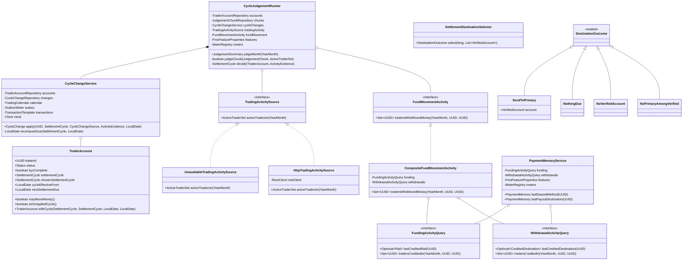

# Backend Low-Level Design — Settlement And Funding Experience (Run 004)

| | |
|---|---|
| Feature | `004-settlement-and-funding-experience` |
| Sub-stage | 5a — backend only. The client half is Stage 5b |
| Upstream | `hld.md` v3 (APPROVED), `tech-stack.md` v3, `hld-review.md` verdict APPROVED |
| PRD | `docs/specs/004-settlement-and-funding-experience/product-requirements.md` v1.1 + 3 parts |
| Language | Java 21, Spring Boot — the existing service's stack, not a choice made here |
| Nature | Delta on 216 existing sources. Every class below is either new in a named existing package or a change to a named existing class |

---

## 1. Requirements & Scope

### 1.1 Functional scope of this sub-stage

| ID | Backend obligation |
|---|---|
| REQ-SF-01 | Three settlement cycles. `MANDATORY_MONTHLY` settles on the monthly calendar, computes the amount identically, is never offered as a choice, and is recorded against each settlement |
| REQ-SF-02 | Monthly judgement moving traders onto and off the mandatory cycle from the first of the next calendar month. Built, and inert until the trading-activity signal exists |
| REQ-SF-03 | Settlement destination is the primary account only, with four ordered outcomes and zero-amount taking precedence over both destination faults |
| REQ-SF-04 | No backend change. The funding position reuses `FundViewService.getSummary` unchanged — this is the design decision, and the absence of work here is the point |
| REQ-SF-05 | Not built. Contract stated in `hld.md` §23 OQ-2 |
| REQ-SF-06 | Last credited deposit's rail, exposed for the client to intersect with currently-offered rails |
| REQ-SF-07 | Last credited withdrawal's destination. Settlements excluded structurally |

### 1.1a Module Manifest

Every module this LLD touches, marked Included or Excluded, with a reason for each exclusion. Added after the Stage 6 review found that the module set had to be inferred from package declarations, which left `notification`'s status undetermined.

| Module | Status | Scope in this run |
|---|---|---|
| `settlement` | **Included** | The cycle model, `CycleChangeService`, the judgement, the destination selector, two new repositories, and the changes to `SettlementRunner` |
| `platform` | **Included** | `TraderAccount` gains a field and a third enum value; `TraderAccountRepository` gains `findInRange`; two new exceptions; `FmsFeatureProperties` |
| `fundview` | **Included** | `PaymentMemoryService` and its controller. `FundViewService` itself is **unchanged** — REQ-SF-04 reuses it as-is, which is the design decision |
| `funding` | **Included**, narrowly | Publishes `FundingActivityQuery` across the module boundary. No change to the funding flow itself |
| `withdrawal` | **Included**, narrowly | Publishes `WithdrawalActivityQuery`. No change to the withdrawal or payout flow |
| `integration.orders` | **Included** | `TradingActivitySource` and its two implementations. The obligations client is unchanged |
| `notification` | **Included**, narrowly | Two new outbox event types — cycle changed, and the mandatory-cycle wording on settlement sent. **The outbox mechanism, dispatcher and channels are unchanged**; this run adds event types to an existing pipeline and no new delivery path |
| `ledger` | **Excluded** | No new ledger movement. The settlement debit is the existing one; only its destination selection changes |
| `partner` | **Excluded** | Run 004 initiates no new payment. The mandatory cycle sends settlements through the path run 003 built, unmodified |
| `reconciliation` | **Excluded** | No new position to reconcile. The settlement's transit accounting is unchanged |
| `integration.bank` | **Excluded** | Read-only and unchanged. REQ-SF-03 narrows how its answer is *used*, not how it is called |

### 1.2 Non-functional targets

Pulled from `hld.md` §4.2; none invented here.

- Memory lookup ≤ 15 ms p99, single indexed row read.
- Judgement completes the whole book within 30 minutes; `hld.md` §5.3 sizes it at 8.3 minutes over 500 chunks of 1,000 traders.
- No addition may delay or prevent a deposit or withdrawal. Every new read degrades to absent.
- Settlement run completes within its configured window; the window is per-cycle configuration because `hld.md` §23 OQ-3 may tighten it for the mandatory cycle.
- One trader's data fault must not stop another trader's settlement.

### 1.3 Out of scope for this document

- Every client concern: rendering, the projection, the rail intersection, cache invalidation, and the screen-open telemetry. Stage 5b owns all of these. This document states only what the server must expose for them.
- Collateral (REQ-SF-05).
- Bank account management — owned by the Bank module in a separate repository.
- The payment paths themselves. Nothing in run 004 changes how money moves.

### 1.4 Open assumptions

- **A-LLD-1 — the trading-activity client is written against a contract that does not exist yet.** `hld.md` §23 OQ-1 specifies bulk retrieval of traders active in a month, plus a freshness answer. §6.6 below defines the interface and a stub implementation that reports the signal unavailable. When the real contract lands, one class is added and one property flipped; nothing else changes.
- **A-LLD-2 — module boundaries force the activity and memory reads through service interfaces, not repositories.** `ModuleBoundaryTest` forbids any module touching another module's `repository` package. The payment memory needs `funding_attempt` and `withdrawal_request`, which belong to two different feature modules, and the judgement needs the same two tables. Both therefore go through narrow service interfaces published by the owning modules — the pattern `FundViewService` already uses to read `WithdrawalCommitments`. This adds two small interfaces rather than a boundary exemption, and §5 explains why that is the right trade.
- **A-LLD-3 — `chosen_settlement_cycle` is backfilled, not defaulted.** Confirmed by `hld.md` §9.2 and §22.1.

---

## 2. Core Entities & Data Model

### 2.1 Domain entities

| Entity | Package | Single responsibility |
|---|---|---|
| `TraderAccount` *(changed)* | `platform.domain` | The trader's money identity. Gains `chosenSettlementCycle`; its `SettlementCycle` enum gains a third value |
| `CycleChange` *(new)* | `settlement.domain` | One recorded assignment of a cycle to a trader, with the evidence that produced it |
| `CycleChangeSource` *(new)* | `settlement.domain` | Who changed it: `AUTOMATIC`, `TRADER`, `OPERATIONS` |
| `ActivityEvidence` *(new)* | `settlement.domain` | What the judgement found for one trader in one month. Three nullable facts, never prose |
| `JudgementChunk` *(new)* | `settlement.domain` | One chunk of one month's judgement: its bounds, its state, and the row a runner locks to claim it |
| `Settlement` *(changed)* | `settlement.domain` | Gains the cycle in force and a destination fault reason |
| `DestinationOutcome` *(new)* | `settlement.domain` | The four ordered results of choosing where a settlement goes |
| `PaymentMemory` *(new)* | `fundview.domain` | The trader's last successful choice on one payment direction. Either answer may be absent |

### 2.2 Database schema

Three Flyway migrations, all additive, none rewriting a table, none taking a long lock.

#### V18 — the cycle model

```sql
-- V18 — the third settlement cycle, and the trader's remembered choice.
--
-- Source: hld.md §9.2. The applied cycle lives in the existing column deliberately: three
-- modules read settlement_cycle on ordinary paths, and a reader that had to combine two
-- columns and forgot would not fail — it would silently use the wrong cycle, which is the
-- worst available failure for a compliance obligation.

ALTER TABLE trader_account
    DROP CONSTRAINT ck_cycle;

ALTER TABLE trader_account
    ADD CONSTRAINT ck_cycle CHECK (settlement_cycle IN ('QUARTERLY', 'MONTHLY', 'MANDATORY_MONTHLY'));

ALTER TABLE trader_account
    ADD COLUMN chosen_settlement_cycle TEXT NULL;

-- Backfill, not a default: a column default cannot reference another column, and before this
-- run every cycle a trader is on is one they chose or were defaulted to. None is applied.
UPDATE trader_account
   SET chosen_settlement_cycle = settlement_cycle
 WHERE chosen_settlement_cycle IS NULL;

ALTER TABLE trader_account
    ALTER COLUMN chosen_settlement_cycle SET NOT NULL;

ALTER TABLE trader_account
    ADD CONSTRAINT ck_chosen_cycle CHECK (chosen_settlement_cycle IN ('QUARTERLY', 'MONTHLY'));

COMMENT ON COLUMN trader_account.chosen_settlement_cycle IS
    'The cycle the trader selected or was defaulted to. Never MANDATORY_MONTHLY — that cycle is '
    'applied, never chosen (REQ-SF-01). This is what an automatic exit restores.';

COMMENT ON COLUMN trader_account.next_settlement_due IS
    'Recomputed on every cycle change, not only after a settlement — hld.md §7.2.1. The '
    'settlement run selects on this column, so a cycle change that left it alone would change '
    'what every record says without changing when a settlement happens.';
```

#### V19 — the cycle change record and the judgement's chunks

```sql
-- V19 — the evidence base for an automatic cycle change, and the judgement's chunk journal.
--
-- Source: hld.md §9.3 and §12.2. The chunk table is both the resumability record and the
-- concurrency control: a runner claims a chunk by locking its row.

CREATE TABLE settlement_cycle_change (
    change_id                UUID        PRIMARY KEY,
    trader_id                UUID        NOT NULL REFERENCES trader_account(trader_id),
    from_cycle               TEXT        NOT NULL,
    to_cycle                 TEXT        NOT NULL,
    effective_from           DATE        NOT NULL,   -- always the first of a calendar month
    source                   TEXT        NOT NULL,   -- AUTOMATIC | TRADER | OPERATIONS
    month_judged             DATE        NULL,       -- first of the judged month; null for a trader change
    trade_seen               BOOLEAN     NULL,       -- null when the activity source did not answer
    movement_seen            BOOLEAN     NULL,
    activity_source_answered BOOLEAN     NULL,
    actor                    TEXT        NOT NULL,
    correlation_id           UUID        NOT NULL,
    created_at               TIMESTAMPTZ NOT NULL DEFAULT now(),
    CONSTRAINT ck_cc_cycles CHECK (
        from_cycle IN ('QUARTERLY', 'MONTHLY', 'MANDATORY_MONTHLY')
        AND to_cycle IN ('QUARTERLY', 'MONTHLY', 'MANDATORY_MONTHLY')),
    CONSTRAINT ck_cc_source CHECK (source IN ('AUTOMATIC', 'TRADER', 'OPERATIONS')),
    CONSTRAINT ck_cc_effective_first CHECK (EXTRACT(DAY FROM effective_from) = 1),
    -- An automatic change is judged against a month and must carry what was found.
    CONSTRAINT ck_cc_automatic_evidence CHECK (
        source <> 'AUTOMATIC'
        OR (month_judged IS NOT NULL AND activity_source_answered IS NOT NULL)),
    -- One automatic change per trader per judged month. This is what makes a re-run of a
    -- partially completed judgement safe at the row level as well as the chunk level.
    CONSTRAINT ux_cc_auto_month UNIQUE (trader_id, month_judged, source)
);

COMMENT ON TABLE settlement_cycle_change IS
    'Append-only. The answer to a trader who disputes an automatic cycle change, which is why '
    'the evidence is three discrete columns rather than a prose string: operations asking how '
    'many traders moved on fund movement alone is a query, not a text search.';

COMMENT ON CONSTRAINT ck_cc_effective_first ON settlement_cycle_change IS
    'Rule SF2.3 in the database. A cycle change never takes effect inside the month in progress, '
    'and never on an arbitrary day.';

CREATE INDEX ix_cc_trader ON settlement_cycle_change (trader_id, created_at DESC);
CREATE INDEX ix_cc_month ON settlement_cycle_change (month_judged) WHERE source = 'AUTOMATIC';

CREATE TABLE cycle_judgement_chunk (
    chunk_id       UUID        PRIMARY KEY,
    month_judged   DATE        NOT NULL,   -- first of the judged month
    chunk_no       INT         NOT NULL,
    from_trader_id UUID        NOT NULL,   -- inclusive lower bound of the trader-id range
    to_trader_id   UUID        NULL,       -- exclusive upper bound; null on the final chunk
    state          TEXT        NOT NULL,   -- PENDING | CLAIMED | COMPLETE
    traders_seen   INT         NOT NULL DEFAULT 0,
    changes_made   INT         NOT NULL DEFAULT 0,
    claimed_at     TIMESTAMPTZ NULL,
    completed_at   TIMESTAMPTZ NULL,
    CONSTRAINT ux_chunk UNIQUE (month_judged, chunk_no),
    CONSTRAINT ck_chunk_state CHECK (state IN ('PENDING', 'CLAIMED', 'COMPLETE')),
    CONSTRAINT ck_chunk_counts CHECK (traders_seen >= 0 AND changes_made >= 0)
);

COMMENT ON TABLE cycle_judgement_chunk IS
    'Resumability record and concurrency control in one object. A runner claims a chunk by '
    'locking its row with SKIP LOCKED, so two runners divide the work rather than duplicating '
    'it — hld.md §12.2. Month-level idempotency is the backstop, not the control.';

CREATE INDEX ix_chunk_claimable ON cycle_judgement_chunk (month_judged, chunk_no)
    WHERE state <> 'COMPLETE';

-- The settlement carries the cycle that produced it. Joining to the trader's current cycle
-- when the record is read would return today's answer, and the trader's cycle moves.
ALTER TABLE settlement ADD COLUMN cycle_in_force TEXT NULL;
ALTER TABLE settlement ADD COLUMN destination_fault TEXT NULL;

ALTER TABLE settlement
    ADD CONSTRAINT ck_settlement_cycle_in_force CHECK (
        cycle_in_force IS NULL
        OR cycle_in_force IN ('QUARTERLY', 'MONTHLY', 'MANDATORY_MONTHLY'));

ALTER TABLE settlement
    ADD CONSTRAINT ck_settlement_destination_fault CHECK (
        destination_fault IS NULL OR destination_fault IN ('NO_PRIMARY_AMONG_VERIFIED'));

COMMENT ON COLUMN settlement.cycle_in_force IS
    'Null on settlements written before run 004. Absence means "before this run", not an error '
    '— hld.md §22.3 declines to backfill a value that is not recoverable.';

COMMENT ON COLUMN settlement.destination_fault IS
    'Distinct from outstanding_reason so a fault can be counted and listed without parsing '
    'prose. Set only where money would actually have been sent.';

CREATE INDEX ix_settlement_destination_fault ON settlement (created_at)
    WHERE destination_fault IS NOT NULL;
```

#### V20 — the withdrawal memory index

```sql
-- V20 — the index behind REQ-SF-07's lookup.
--
-- Partial rather than full: the memory only ever asks about credited withdrawals, and the
-- table also holds every failed, returned and cancelled request. About a third the size for
-- the same answer.

CREATE INDEX ix_withdrawal_last_credited
    ON withdrawal_request (trader_id, created_at DESC)
    WHERE state = 'CREDITED';

COMMENT ON INDEX ix_withdrawal_last_credited IS
    'Serves REQ-SF-07 only. Settlements never appear in this table, so the rule that a '
    'settlement must not seed the withdrawal memory is enforced by where the data lives.';

-- The judgement's fund-movement question is a different access pattern from the memory's:
-- "which traders in this id range were credited during month M", not "this trader's latest".
-- A trader-leading index cannot serve it as a range read — it degrades to one probe per
-- trader, 500,000 per run, which is not what the 8.3-minute chunk budget was built on.
-- Leading on the date makes it one range scan per chunk per table.
CREATE INDEX ix_funding_credited_month
    ON funding_attempt (created_at, trader_id)
    WHERE state = 'CREDITED';

CREATE INDEX ix_withdrawal_credited_month
    ON withdrawal_request (created_at, trader_id)
    WHERE state = 'CREDITED';

COMMENT ON INDEX ix_funding_credited_month IS
    'Serves the monthly cycle judgement''s fund-movement half. Distinct from '
    'ix_funding_trader_state, which answers a single trader''s latest deposit — the two '
    'questions have opposite leading columns and one index cannot serve both well.';
```

### 2.3 Index justification

| Index | Query it serves | Why it exists |
|---|---|---|
| `ix_withdrawal_last_credited` | Latest credited withdrawal for a trader | REQ-SF-07's lookup, ≤ 15 ms p99 |
| `ix_funding_trader_state` *(existing)* | Latest credited deposit for a trader | Already present. REQ-SF-06 needs no new index |
| `ix_cc_trader` | A trader's cycle history, newest first | Answering a dispute |
| `ix_cc_month` | Automatic changes for a judged month | The judgement's own idempotency check and the K3 metric |
| `ix_chunk_claimable` | The next unclaimed chunk of a month | The claim query, which runs 500 times a month |
| `ix_settlement_destination_fault` | Settlements held for a fault in a period | The operations endpoint in §4.5 |
| `ix_funding_credited_month` | Traders credited a deposit during month M, within an id range | The judgement's fund-movement half. Date-leading, so each chunk is one range scan rather than 1,000 probes — which is what `hld.md` §5.3's chunk budget assumes |
| `ix_withdrawal_credited_month` | The same for withdrawals | As above |
| `ix_trader_next_settlement` *(existing)* | Traders due for settlement | Unchanged, and the reason §3.2's transaction must maintain `next_settlement_due` |

---

## 3. Class Diagram & Design Patterns

### 3.1 Class diagram



### 3.2 Design patterns and why each is here

| Pattern | Where | Justification tied to a requirement |
|---|---|---|
| **Strategy** | `TradingActivitySource` with an unavailable and an HTTP implementation | REQ-SF-02 must ship inert and become live without a rewrite. The unavailable implementation is the shipping default, selected by configuration; the HTTP one is added when `hld.md` §23 OQ-1 is answered. This is what makes "designed and switched off" a real state rather than a promise |
| **Sealed type hierarchy** | `DestinationOutcome` with four permitted subtypes | REQ-SF-03 has exactly four outcomes and the compiler should enforce that all four are handled. A boolean-and-null encoding would let a caller forget the fault case, which is the case that must not be silently skipped. The existing `ObligationsResult` uses the same shape for the same reason |
| **Composite** | `CompositeFundMovementActivity` over two module queries | The fund-movement half of the inactivity test spans two feature modules. The composite is what lets the judgement ask one question while respecting the module boundary in A-LLD-2 |
| **Repository** | `CycleChangeRepository`, `JudgementChunkRepository` | The service's existing convention: interface in `repository`, `Jdbc*` implementation, `NamedParameterJdbcTemplate` |
| **Template method (transaction)** | `CycleChangeService.apply` | The four-fact transaction in `hld.md` §7.2.1 is the unit of correctness; making it one method with one transaction boundary is what stops a caller writing three of the four facts |
| **Published-interface boundary** | `FundingActivityQuery`, `WithdrawalActivityQuery` | A-LLD-2. Cross-module reads go through the owning module's service, as `WithdrawalCommitments` already does for the fund view |

Explicitly avoided: no `CycleManager`, no `SettlementHelper`. `CycleChangeService` writes a cycle change and nothing else; `CycleJudgementRunner` decides who should change and delegates every write to it.

---

## 4. API Contract & Edge Layer

### 4.1 Endpoints

| Verb | Path | Purpose | Auth |
|---|---|---|---|
| `GET` | `/funds/payment-memory` | The trader's last successful choice on one payment direction | Gateway assertion → `TraderContext` |
| `GET` | `/funds/summary` | Unchanged shape plus the third cycle value and its explanation | Gateway assertion → `TraderContext` |
| `POST` | `/funds/settlement-cycle` | Existing endpoint; now accepts a choice from a trader on the applied cycle | Gateway assertion → `TraderContext` |
| `POST` | `/funds/screen-open` | Records that a trader opened a money-movement screen. Guardrail G4's denominator | Gateway assertion → `TraderContext` |
| `GET` | `/funds/features` | The three client-facing feature switches | Gateway assertion → `TraderContext` |
| `POST` | `/funds/deposits` | **Changed** — the existing request gains three optional fields: `screenElapsedMillis` (G4's duration), `preselectionKept` (K6's tag), and `amountAdjustedAfterProjection` (K4). All three are telemetry; none changes the deposit's behaviour, and all are absent when the client cannot supply them | Gateway assertion → `TraderContext` |
| `POST` | `/funds/withdrawals` | **Changed** — the existing request gains an optional `preselectionKept` for K6's withdrawal half. Nothing else moves | Gateway assertion → `TraderContext` |
| `GET` | `/internal/funds/settlements/destination-faults` | Settlements held for a missing primary in a period | Internal prefix, not routed from the public gateway |

### 4.2 `GET /funds/payment-memory`

**Request.** One required query parameter. Without it the server would perform both lookups and hand each screen the other's answer — the funding screen would receive a bank account label it never renders, and `hld.md` §5.2's per-screen cost model would understate load by half.

```java
public enum MemoryDirection { DEPOSIT, PAYOUT }
```

`GET /funds/payment-memory?direction=DEPOSIT`

**Response** — `MoneyResponseEnvelope<PaymentMemoryView>`, HTTP 200 in every non-error case including absence.

```java
/**
 * Absent is a first-class answer, not an error and not a default.
 *
 * <p>The three reasons for absence — no history, the method is no longer offered, the lookup
 * failed — are deliberately not distinguished here. The client behaves identically in all
 * three, and REQ-SF-06 forbids naming a method the trader cannot use, so a reason code would
 * exist only to be ignored or, worse, rendered. The distinction is made server-side as a
 * metric (§7.4), where the audience is an operator rather than a trader.
 */
public record PaymentMemoryView(
        MemoryDirection direction,
        @Nullable String lastDepositRail,        // "INSTANT" | "TRANSFER", null when absent
        @Nullable DestinationView lastDestination) {

    public record DestinationView(String reference, String label) {}
}
```

**Validation.** `direction` is required and must parse to the enum; an unknown value is a 400 with the permitted set named. No trader identifier is accepted — it comes from `TraderContext`, so ownership is structural rather than checked.

**Rail availability is not applied here.** The server returns the rail the trader last used. Intersecting it with the rails currently offered to that trader happens in the client, which already holds `availableRails` from the deposit limits response; doing it server-side would mean fetching that list a second time (`hld.md` §7.4). Stage 5b owns the intersection and the assertion that a withheld rail is neither pre-selected nor named.

### 4.3 `POST /funds/screen-open` — guardrail G4's denominator

```java
public record ScreenOpenRequest(MoneyScreen screen) {}

public enum MoneyScreen { ADD_FUNDS, WITHDRAW }
```

Returns 202 with no body. Fire-and-forget: a failure here is swallowed by the client and never surfaces to the trader, because a telemetry call that can break a funding screen would violate §1.2 outright.

**This deviates from `hld.md` §13.2, which said the screen-open moment rides the payment-memory read. Stating the deviation rather than making it silently.** Two reasons the memory read cannot carry it:

1. **A GET must not have a recording side effect.** The memory read is a cacheable, retryable GET. Recording an open inside it makes it neither.
2. **The existing client retries.** `QueryProvider` sets `retry: 2`, so a memory read that fails twice and succeeds on the third attempt would record three opens. Guardrail G4's denominator would inflate exactly when the service is degraded — which is precisely the condition the guardrail exists to measure, so the metric would be least trustworthy when it mattered most.

The design intent of §13.2 is preserved: the open is reported **at open**, not at submission, so abandonment appears as opens without submissions rather than as silence. Only the carrier changes.

**The duration is reported separately, on the submission that ends it.** The existing deposit request gains one optional field:

```java
// added to the existing deposit request record
@Nullable Long screenElapsedMillis
```

So G4 is a duration over a known denominator: opens counted by this endpoint, durations recorded on the deposits that completed. A screen opened and abandoned contributes to the denominator and not the numerator, which is the whole point.

### 4.4 `GET /funds/features`

```java
public record ClientFeatureFlags(
        boolean fundingPosition,
        boolean depositMemory,
        boolean withdrawalMemory) {}
```

Derived from `FmsFeatureProperties` (§6.7). The judgement switch is deliberately absent — it governs a batch job and is not the client's business.

A dedicated endpoint rather than fields bolted onto `/funds/summary` and `/funds/deposits/limits`: two carriers would mean two places to keep in step, and a trader whose summary is unavailable would lose their switches with it, which would tie a feature flag's availability to an unrelated upstream's health. One resource, one cache entry, read by every surface that needs it.

`hld.md` §7.5 requires these be revertible without a release, which is why they are server-driven at all: a build-time constant cannot be turned off while a guardrail is regressing.

### 4.5 `GET /internal/funds/settlements/destination-faults`

```java
public record DestinationFaultView(
        UUID traderId,
        UUID settlementId,
        String cyclePeriod,
        long amountPaise,
        String fault,          // NO_PRIMARY_AMONG_VERIFIED
        Instant recordedAt) {}
```

`GET /internal/funds/settlements/destination-faults?from=2026-09-01&to=2026-09-30`

Returns the affected traders and settlements for the period. It names no bank account: operations needs to know which traders are affected so the Bank module's data can be corrected, not what those traders' accounts are.

### 4.6 Changed response fields on `/funds/summary`

```java
public record CycleView(
        SettlementCycle cycle,
        LocalDate nextSettlementDue,
        boolean chosenByTrader,
        @Nullable String appliedReason,   // non-null only on MANDATORY_MONTHLY
        @Nullable String endsWhen) {}     // non-null only on MANDATORY_MONTHLY
```

`appliedReason` and `endsWhen` are what REQ-SF-01 requires: a cycle the trader did not choose is described as applied, with one line saying why and one saying what ends it. `chosenByTrader` is false exactly when the cycle is `MANDATORY_MONTHLY`, and the client must not infer that from the enum value — a second cycle could be applied one day.

**Contract compatibility.** Widening the cycle enum is treated as breaking to the published contract until the consumer question in `hld.md` §8.3 is answered. Inside this repository the client ships in the same release.

### 4.7 Error responses

| Domain condition | Status | Payload |
|---|---|---|
| `direction` missing or unparseable | 400 | Existing validation error shape, naming the permitted values |
| Memory lookup fails internally | 200 | `PaymentMemoryView` with both fields null. A convenience that returns 500 would put a new failure on a payment screen, which §1.2 forbids |
| Trader account not found | 404 | Existing `MissingSnapshotException` handling, unchanged |
| Trader selects `MANDATORY_MONTHLY` on `/funds/settlement-cycle` | 400 | `CycleNotSelectableException` → "That settlement cycle cannot be chosen." REQ-SF-01 forbids offering it |
| Destination-fault query with `from` after `to` | 400 | Existing validation error shape |

Every exception thrown in §7.3 has a row here. `GlobalExceptionHandler` gains two mappings and keeps its existing structure.

---

## 5. SOLID Breakdown

**SRP.** `CycleChangeService` owns one thing: writing a cycle change correctly and completely. `CycleJudgementRunner` owns deciding who should change. Merging them — the obvious shortcut, since the judgement is the only automatic caller — would put the four-fact transaction inside a loop that also holds chunk state, and the trader-initiated and operations paths would then either duplicate the transaction or call into a batch runner. That duplication is exactly how `next_settlement_due` came to be missed in the first HLD draft.

**OCP.** `TradingActivitySource` is the extension point that lets REQ-SF-02 ship inert. Adding the real signal adds a class and changes a property; `CycleJudgementRunner` is not touched. `DestinationOutcome` is deliberately closed rather than open — a fifth settlement destination outcome should not be addable without the compiler forcing every handler to consider it.

**LSP.** `UnavailableTradingActivitySource` and `HttpTradingActivitySource` are substitutable because `ActiveTraderSet` carries its own `answered` flag rather than encoding "unavailable" as an empty set. An empty set means nobody traded; unavailable means do not judge. Collapsing the two would make the unavailable implementation return a value that reads as "the whole book is inactive", which would move every trader onto the mandatory cycle the first time the upstream was down.

**ISP.** `FundingActivityQuery` and `WithdrawalActivityQuery` are two interfaces rather than one `ActivityQuery`, and each carries only the two methods its owning module can answer. A single combined interface would force the funding module to implement a withdrawal-shaped method it has no data for.

**DIP.** `CycleJudgementRunner` depends on `TradingActivitySource` and `FundMovementActivity`, never on an HTTP client or a repository in another module. `PaymentMemoryService` depends on the two published module interfaces. Wiring is constructor injection throughout, matching the existing service; the activity source implementation is selected by a Spring conditional on the property in §6.7.

---

## 6. Interface & Skeleton Code

### 6.1 The cycle, extended

```java
package com.firm.fms.platform.domain;

public record TraderAccount(
        UUID traderId,
        Status status,
        boolean kycComplete,
        SettlementCycle settlementCycle,
        SettlementCycle chosenSettlementCycle,
        LocalDate cycleEffectiveFrom,
        LocalDate nextSettlementDue) {

    /** REQ-SF-01. Three values; only two of them are selectable. */
    public enum SettlementCycle {
        QUARTERLY,
        MONTHLY,
        /** Applied to a dormant trader, never offered. REQ-SF-02 moves a trader onto it. */
        MANDATORY_MONTHLY;

        public boolean isSelectable() {
            return this != MANDATORY_MONTHLY;
        }

        /** Both monthly cycles settle on the monthly calendar — Rule SF1.2. */
        public int monthsPerPeriod() {
            return this == QUARTERLY ? 3 : 1;
        }
    }

    public TraderAccount {
        Objects.requireNonNull(settlementCycle, "settlementCycle");
        Objects.requireNonNull(chosenSettlementCycle, "chosenSettlementCycle");
        Objects.requireNonNull(nextSettlementDue, "nextSettlementDue");
        if (!chosenSettlementCycle.isSelectable()) {
            throw new IllegalArgumentException(
                    "chosenSettlementCycle must be a cycle the trader could have chosen; "
                            + "MANDATORY_MONTHLY is applied, never chosen");
        }
    }

    public boolean isOnAppliedCycle() {
        return !settlementCycle.isSelectable();
    }

    /** All four facts move together — see CycleChangeService.apply. */
    public TraderAccount withCycle(
            SettlementCycle applied, SettlementCycle chosen,
            LocalDate effectiveFrom, LocalDate nextDue) {
        return new TraderAccount(
                traderId, status, kycComplete, applied, chosen, effectiveFrom, nextDue);
    }
}
```

### 6.2 The four-fact transaction

This is the method the HLD's §7.2.1 exists for, and the one whose incompleteness was the blocker in the first design review.

```java
package com.firm.fms.settlement.service;

/**
 * The only place a trader's settlement cycle changes.
 *
 * <p>Every source routes through here — the monthly judgement, a trader's own selection, and an
 * operations action while the activity signal is absent. That is deliberate: the defect this
 * class exists to prevent was reported against the automatic path alone, and would have
 * survived in the other two if each wrote its own update.
 */
@Service
public class CycleChangeService {

    private final TraderAccountRepository accounts;
    private final CycleChangeRepository changes;
    private final TradingCalendar calendar;
    private final OutboxWriter outbox;
    private final TransactionTemplate transactions;
    private final Clock clock;

    public CycleChangeService(
            TraderAccountRepository accounts, CycleChangeRepository changes,
            TradingCalendar calendar, OutboxWriter outbox,
            TransactionTemplate transactions, Clock clock) {
        this.accounts = accounts;
        this.changes = changes;
        this.calendar = calendar;
        this.outbox = outbox;
        this.transactions = transactions;
        this.clock = clock;
    }

    /**
     * Apply a cycle change, writing all four facts or none.
     *
     * @param target the cycle that will apply from {@code effectiveFrom}
     * @param evidence what was found; null for a non-automatic change
     * @param effectiveFrom must be the first of a calendar month, and must not be in the past
     * @return the recorded change, or empty when the trader is already on the target cycle
     */
    public Optional<CycleChange> apply(
            UUID traderId, SettlementCycle target, CycleChangeSource source,
            @Nullable ActivityEvidence evidence, LocalDate effectiveFrom) {

        // PSEUDOCODE — the orchestration this class exists for.
        //
        //  1. Reject an effectiveFrom that is not the first of a month, or is in the past.
        //     Rule SF2.3 is enforced here and again by ck_cc_effective_first, because a
        //     constraint alone would surface as a database error rather than a stated refusal.
        //  2. Open the transaction. Everything below commits together or not at all.
        //  3. accounts.lockForUpdate(traderId) — the existing row lock, so a trader-initiated
        //     change and the judgement cannot interleave on one trader.
        //  4. If the account is already on `target`, return empty. No row, no notification,
        //     no wasted settlement recomputation. A re-run of a partially completed judgement
        //     reaches here.
        //  5. Decide the remembered choice:
        //       - target is selectable  -> chosen becomes target (the trader picked it, or an
        //                                  automatic exit restored it)
        //       - target is applied     -> chosen is preserved untouched; it is what an exit
        //                                  will restore
        //  6. Recompute next_settlement_due from the INCOMING cycle's calendar, as of
        //     effectiveFrom — never carried forward from the outgoing cycle. This is the fact
        //     whose omission made a cycle change change nothing.
        //  7. accounts.save(account.withCycle(target, chosen, effectiveFrom, nextDue)).
        //  8. changes.insert(cycleChange) — append-only; the unique constraint on
        //     (trader_id, month_judged, source) makes a concurrent duplicate a refusal rather
        //     than a second row.
        //  9. outbox.write(cycle-changed event) — inside the transaction, so a crash cannot
        //     leave a changed cycle with no notification or a notification with no change.
        // 10. Commit, and return the change.

        requireFirstOfMonth(effectiveFrom);
        requireNotInThePast(effectiveFrom);

        return transactions.execute(status -> {
            TraderAccount account = accounts.lockForUpdate(traderId)
                    .orElseThrow(() -> new MissingSnapshotException(
                            "no trader account for " + traderId, null));

            if (account.settlementCycle() == target) {
                return Optional.empty();
            }

            SettlementCycle chosen = target.isSelectable()
                    ? target
                    : account.chosenSettlementCycle();

            LocalDate nextDue = recomputeDue(target, effectiveFrom);

            accounts.save(account.withCycle(target, chosen, effectiveFrom, nextDue));

            CycleChange change = new CycleChange(
                    UUID.randomUUID(), traderId, account.settlementCycle(), target,
                    effectiveFrom, source, evidence, actorFor(source),
                    UUID.randomUUID(), clock.instant());
            changes.insert(change);

            outbox.write(OutboxEvent.cycleChanged(
                    traderId, account.settlementCycle(), target, effectiveFrom, source,
                    change.correlationId()));

            return Optional.of(change);
        });
    }

    /**
     * The next settlement date the incoming cycle implies, on or after the effective date.
     *
     * <p>Delegates to the same date arithmetic the settlement run uses. Two cycles both
     * settling monthly get the same dates, which is Rule SF1.2 — the mandatory cycle inherits
     * the market-wide calendar rather than acquiring one of its own.
     */
    private LocalDate recomputeDue(SettlementCycle target, LocalDate effectiveFrom) {
        return CyclePeriod.nextSettlementDateOnOrAfter(effectiveFrom, target, calendar);
    }
}
```

**Who reads `settlementWindowBusinessDays`.** `SettlementRunner` reads the map when it opens a run's journal, resolving the window for the cycle being settled and computing `expected_complete_by` from it — the column `settlement_run_journal` already carries, and which run 001 hardcoded at two business days. The same resolved window is the source of the `within_window` tag on `fms.settlement.run.completed`, which is guardrail G3's only input. Without this wiring the property would be dead configuration and G3 would have no source, which is what the Stage 6 review found.

`CyclePeriod` gains `nextSettlementDateOnOrAfter` beside its existing `nextSettlementDateAfter`. The distinction matters: a cycle taking effect on 1 September should settle on September's date if that date has not passed, whereas the existing method deliberately skips past a date already used.

### 6.3 The monthly judgement

```java
package com.firm.fms.settlement.runner;

@Component
public class CycleJudgementRunner {

    private static final int CHUNK_SIZE = 1_000;

    /**
     * Judge one calendar month across the whole book.
     *
     * <p>Returns a summary rather than throwing on an unavailable activity source: a month that
     * could not be judged is a recorded outcome, not a failure. §7.4's counter is what makes
     * the difference visible, because a job that correctly does nothing looks exactly like a
     * job that has silently done nothing for a year.
     */
    public JudgementSummary judgeMonth(YearMonth month) {

        // PSEUDOCODE — the orchestration.
        //
        //  1. If the judgement switch is off, return a skipped summary immediately. This is
        //     the shipping state and costs one property read.
        //  2. ActiveTraderSet active = tradingActivity.activeTradersIn(month).
        //     If !active.answered(): increment the skipped-month counter, record the gap, and
        //     return. Rule SF2.4 — unknown is not inactive. Judging on fund movement alone
        //     here would move exactly the traders the definition was written to protect.
        //  3. chunks.createIfAbsent(month, CHUNK_SIZE) — idempotent; a re-run finds them.
        //  4. Loop:
        //       a. chunk = chunks.claimNext(month)   // FOR UPDATE ... SKIP LOCKED
        //          If none, exit the loop — every chunk is claimed or complete.
        //       b. Inside one transaction:
        //            - traders = accounts.findInRange(chunk.from, chunk.to)
        //            - moved   = fundMovement.tradersWhoMovedMoney(month, chunk.from, chunk.to)
        //            - for each trader:
        //                evidence = new ActivityEvidence(
        //                              active.contains(traderId), moved.contains(traderId), true)
        //                target   = decide(trader, evidence)
        //                if target != trader.settlementCycle():
        //                    cycleChanges.apply(traderId, target, AUTOMATIC, evidence,
        //                                       firstDayOf(month.plusMonths(1)))
        //            - chunks.markComplete(chunk, seen, changed)
        //       c. On an exception inside a chunk: the transaction rolls back, the chunk
        //          returns to PENDING when the lock is released, and the loop continues with
        //          the next chunk. One trader's fault does not stop the book (§1.2).
        //  5. Return the summary: chunks completed, traders seen, changes made.

        if (!features.cycleJudgementEnabled()) {
            return JudgementSummary.skipped(month, "judgement switch is off");
        }

        ActiveTraderSet active = tradingActivity.activeTradersIn(month);
        if (!active.answered()) {
            meters.counter("fms.cycle.judgement.skipped", "reason", "activity_unavailable")
                    .increment();
            return JudgementSummary.skipped(month, "trading activity source did not answer");
        }

        chunks.createIfAbsent(month, CHUNK_SIZE);

        int completed = 0;
        for (Optional<JudgementChunk> claimed = chunks.claimNext(month);
             claimed.isPresent();
             claimed = chunks.claimNext(month)) {
            if (judgeChunk(claimed.get(), active)) {
                completed++;
            }
        }
        return JudgementSummary.completed(month, completed);
    }

    /**
     * Which cycle this trader should be on, given what the month showed.
     *
     * <p>Rule SF2.1: either kind of use makes the month active. Requiring both would move an
     * actively trading trader who never moves cash onto a cycle meant for dormant accounts,
     * which inverts the rule.
     */
    private SettlementCycle decide(TraderAccount trader, ActivityEvidence evidence) {
        boolean used = evidence.tradeSeen() || evidence.movementSeen();
        if (used) {
            return trader.isOnAppliedCycle()
                    ? trader.chosenSettlementCycle()   // exit: restore what they chose
                    : trader.settlementCycle();        // already on their own cycle
        }
        return SettlementCycle.MANDATORY_MONTHLY;      // entry, or stay
    }
}
```

### 6.4 The destination decision

```java
package com.firm.fms.settlement.domain;

/** The four outcomes of choosing where a settlement goes. REQ-SF-03. */
public sealed interface DestinationOutcome {

    /** Nothing is due. No destination is used, so no destination state can block it. */
    record NothingDue() implements DestinationOutcome {}

    record SendToPrimary(VerifiedAccount account) implements DestinationOutcome {}

    /** Trader-facing: they are told money is waiting and that adding an account releases it. */
    record NoVerifiedAccount() implements DestinationOutcome {}

    /** Operations-facing: the Bank module's invariant is violated. Not the trader's to fix. */
    record NoPrimaryAmongVerified() implements DestinationOutcome {}
}
```

```java
package com.firm.fms.settlement.service;

public final class SettlementDestinationSelector {

    /**
     * <p><strong>Zero is evaluated first, and that ordering is the requirement.</strong> A
     * settlement that sends no money must not be held against a fault in a destination it was
     * never going to use — otherwise a trader owed nothing, whose accounts happen to carry no
     * primary flag, is chased by operations and never gets the zero record Rule 25.1 requires.
     */
    public DestinationOutcome select(long amountPaise, List<VerifiedAccount> verified) {
        if (amountPaise == 0L) {
            return new DestinationOutcome.NothingDue();
        }
        if (verified.isEmpty()) {
            return new DestinationOutcome.NoVerifiedAccount();
        }
        return verified.stream()
                .filter(VerifiedAccount::primary)
                .findFirst()
                .<DestinationOutcome>map(DestinationOutcome.SendToPrimary::new)
                .orElseGet(DestinationOutcome.NoPrimaryAmongVerified::new);
    }
}
```

The fallback to `verified.get(0)` present in the current `SettlementRunner` is deleted. `SettlementRunner.computeAndRecord` switches over the sealed type, so adding a fifth outcome later would fail to compile until every site handled it.

### 6.5 Payment memory

```java
package com.firm.fms.fundview.service;

@Service
public class PaymentMemoryService {

    /**
     * The rail of the trader's last credited deposit.
     *
     * <p>Not intersected with the rails currently offered — the client does that, because it
     * already holds the availability list from the deposit limits response (hld.md §7.4).
     */
    public PaymentMemory lastDepositMethod(UUID traderId) {
        if (!features.depositMemoryEnabled()) {
            return PaymentMemory.absent();
        }
        try {
            return funding.lastCreditedRail(traderId)
                    .map(PaymentMemory::ofRail)
                    .orElseGet(() -> { counted("no_history"); return PaymentMemory.absent(); });
        } catch (RuntimeException e) {
            counted("unavailable");
            log.warn("deposit memory lookup failed for trader {}", traderId, e);
            return PaymentMemory.absent();   // never a failure on a payment screen
        }
    }

    /**
     * The destination of the trader's last credited withdrawal.
     *
     * <p>Settlements cannot appear here. A settlement writes a {@code settlement} row and a
     * {@code payment_attempt} row and never a {@code withdrawal_request}, so REQ-SF-07's rule
     * that a settlement must not seed this answer holds because of where the data lives rather
     * than because of a predicate a later refactor could drop. {@code SettlementIsolationTest}
     * asserts it.
     */
    public PaymentMemory lastPayoutDestination(UUID traderId) {
        if (!features.withdrawalMemoryEnabled()) {
            return PaymentMemory.absent();
        }
        try {
            return withdrawals.lastCreditedDestination(traderId)
                    .map(PaymentMemory::ofDestination)
                    .orElseGet(() -> { counted("no_history"); return PaymentMemory.absent(); });
        } catch (RuntimeException e) {
            counted("unavailable");
            log.warn("withdrawal memory lookup failed for trader {}", traderId, e);
            return PaymentMemory.absent();
        }
    }
}
```

### 6.6 The activity sources

```java
package com.firm.fms.settlement.service;

public interface TradingActivitySource {

    /**
     * The traders who placed at least one trade in the month.
     *
     * <p>Bulk by contract, not per trader. hld.md §5.3: a per-trader call means 500,000
     * requests in one run — five times outside the job's own budget serially, or a monthly
     * load spike against an endpoint on the withdrawal critical path if parallelised.
     *
     * @return a set that carries whether the source answered at all. Never null, and an empty
     *         answered set is meaningfully different from an unanswered one
     */
    ActiveTraderSet activeTradersIn(YearMonth month);
}

/**
 * The shipping implementation until hld.md §23 OQ-1 is answered.
 *
 * <p>It reports unavailable rather than empty. Empty would mean nobody traded, which would
 * move the entire book onto the mandatory cycle the first time this ran.
 */
@Component
@ConditionalOnProperty(name = "fms.activity.trading-source", havingValue = "unavailable",
        matchIfMissing = true)
public class UnavailableTradingActivitySource implements TradingActivitySource {

    @Override
    public ActiveTraderSet activeTradersIn(YearMonth month) {
        return ActiveTraderSet.unanswered();
    }
}
```

### 6.7 Feature switches

```java
package com.firm.fms.platform.config;

/**
 * @param fundingPositionEnabled REQ-SF-04's position on the add-funds screen
 * @param depositMemoryEnabled REQ-SF-06
 * @param withdrawalMemoryEnabled REQ-SF-07
 * @param cycleJudgementEnabled REQ-SF-02. <strong>Defaults to false.</strong> The other three
 *        default to true. This one is off because the requirement is that no automatic cycle
 *        change happens until the activity signal is real, and a switch is a stronger
 *        guarantee of that than an absent dependency, which could become present by accident
 * @param settlementWindowBusinessDays per cycle, because hld.md §23 OQ-3 may tighten the
 *        window for the mandatory cycle and the answer should be a setting, not a release
 */
@ConfigurationProperties(prefix = "fms.features")
public record FmsFeatureProperties(
        boolean fundingPositionEnabled,
        boolean depositMemoryEnabled,
        boolean withdrawalMemoryEnabled,
        boolean cycleJudgementEnabled,
        Map<SettlementCycle, Integer> settlementWindowBusinessDays) {

    public FmsFeatureProperties {
        if (settlementWindowBusinessDays == null || settlementWindowBusinessDays.isEmpty()) {
            settlementWindowBusinessDays = Map.of(
                    SettlementCycle.QUARTERLY, 2,
                    SettlementCycle.MONTHLY, 2,
                    SettlementCycle.MANDATORY_MONTHLY, 2);
        }
    }
}
```

### 6.8 Repository contracts

Each method states its precondition, its not-found behaviour, what it throws, and its transactional guarantee.

**`CycleChangeRepository`** (`settlement.repository`)

| Method | Contract |
|---|---|
| `void insert(CycleChange change)` | Precondition: `effective_from` is the first of a month. Runs inside the caller's transaction and does not commit. Throws `DuplicateCycleChangeException` when `ux_cc_auto_month` is violated — which is a concurrent duplicate judgement, not a bug, and the caller treats it as "already done" |
| `List<CycleChange> forTrader(UUID traderId, int limit)` | Returns newest first; empty list when none, never null. Read-committed is sufficient — a dispute is answered from committed history |
| `boolean automaticChangeExists(UUID traderId, LocalDate monthJudged)` | The judgement's per-trader idempotency check. Read-committed; the unique constraint is the real guard and this only avoids wasted work |

**`JudgementChunkRepository`** (`settlement.repository`)

| Method | Contract |
|---|---|
| `void createIfAbsent(YearMonth month, int chunkSize)` | Idempotent. Commits its own transaction — chunk creation must survive a crash in the first chunk. Partitions the trader-id space into contiguous ranges |
| `Optional<JudgementChunk> claimNext(YearMonth month)` | **Takes a row lock**: `SELECT ... WHERE state <> 'COMPLETE' ORDER BY chunk_no FOR UPDATE SKIP LOCKED LIMIT 1`. Returns empty when every chunk is claimed or complete. Must be called outside the caller's chunk transaction so the lock's lifetime is the chunk's own transaction |
| `void markComplete(JudgementChunk chunk, int seen, int changed)` | Runs inside the chunk transaction. Committing it releases the claim |

**`TraderAccountRepository`** (`platform.repository`, changed)

| Method | Contract |
|---|---|
| `List<TraderAccount> findInRange(UUID fromInclusive, UUID toExclusive)` | **New.** Ordered by `trader_id`. Empty list when the range holds none. Read-committed; the per-trader lock is taken later by `CycleChangeService` |
| `Optional<TraderAccount> lockForUpdate(UUID traderId)` | **Unchanged.** `SELECT ... FOR UPDATE`. Must be called inside a transaction; the lock is held to commit |

**`FundingActivityQuery`** (`funding.service`, published across the module boundary)

| Method | Contract |
|---|---|
| `Optional<Rail> lastCreditedRail(UUID traderId)` | Latest `funding_attempt` with `state = 'CREDITED'`. Empty when the trader has none — empty is an answer, not an error. Uses the existing `ix_funding_trader_state`. Read-committed |
| `Set<UUID> tradersCreditedIn(YearMonth month, UUID from, UUID to)` | Traders with a deposit credited in the month within the id range. Empty set when none. **Never consults `settlement`** — the table has no funding rows, which is what keeps a settlement from counting as trader activity |

**`WithdrawalActivityQuery`** (`withdrawal.service`, published across the module boundary)

| Method | Contract |
|---|---|
| `Optional<CreditedDestination> lastCreditedDestination(UUID traderId)` | Latest `withdrawal_request` with `state = 'CREDITED'`, returning reference and label as shown to the trader. Empty when none. Uses `ix_withdrawal_last_credited` |
| `Set<UUID> tradersCreditedIn(YearMonth month, UUID from, UUID to)` | As above for withdrawals. Settlements are absent structurally |

---

## 7. Concurrency, Thread-Safety & Edge Cases

### 7.1 Two runners on one month

**Concern.** Two service instances start the monthly judgement. Without control, both read the same unjudged traders, both write cycle changes, and both enqueue notifications — so a trader receives two "your cycle changed" messages for one change, and the audit table that exists to be authoritative in a dispute accumulates duplicate rows.

**Mechanism.** A row lock on the chunk journal with `SKIP LOCKED`. A runner claims a chunk by locking its row; the other runner skips it and takes the next. The lock is held for the chunk's transaction — roughly a second — against a table no trader-facing path reads, so it contends with nothing.

**Backstop, not the control.** `ux_cc_auto_month` makes a duplicate automatic change for the same trader and month a constraint violation rather than a second row. Month-level idempotency alone would not have prevented two runners interleaving inside a month, which is why the lock is the primary control and this is the guard beneath it.

### 7.2 A trader changes cycle while the judgement is running

**Concern.** The judgement decides a trader should move to `MANDATORY_MONTHLY` at the same moment the trader selects `MONTHLY` in the app.

**Mechanism.** Both go through `CycleChangeService.apply`, which takes `accounts.lockForUpdate(traderId)` — the existing per-trader row lock. One wins and commits; the other blocks, then re-reads inside its transaction and sees the updated cycle. Neither produces a wrong state, and both outcomes are defensible: the trader's choice is recorded and applies when the account is in use again, per Rule SF1.6.

### 7.3 Exception hierarchy

| Exception | Package | Thrown when | Caught where |
|---|---|---|---|
| `CycleNotSelectableException` | `platform.error` | A trader selects `MANDATORY_MONTHLY` | `GlobalExceptionHandler` → 400 |
| `InvalidCycleEffectiveDateException` | `platform.error` | `effectiveFrom` is not the first of a month, or is in the past | Not caught — a programming error, surfaced in tests |
| `DuplicateCycleChangeException` | `platform.error` | `ux_cc_auto_month` violated | `CycleJudgementRunner` treats it as already-done and continues |
| `MissingSnapshotException` *(existing)* | `platform.error` | No trader account | Unchanged |
| `BankModuleUnavailableException` *(existing)* | `platform.error` | Bank module unreachable during settlement | Unchanged — the settlement is left outstanding |

### 7.4 Metrics

| Metric | Type | Tags | Serves |
|---|---|---|---|
| `fms.settlement.destination.outcome` | Counter | `outcome` | K1, K2 |
| `fms.settlement.run.completed` | Counter + Timer | `cycle`, `within_window` | G3 |
| `fms.cycle.change` | Counter | `source`, `direction` | K3 |
| `fms.cycle.judgement.skipped` | Counter | `reason` | Proves the inert path is behaving rather than silently broken |
| `fms.money.screen.opened` | Counter | `screen` | **G4's and G1/G2's denominator.** Fed by `POST /funds/screen-open` (§4.3), so an abandoned screen still counts — which is the whole reason the open is reported at open rather than at submission |
| `fms.deposit.screen_to_submit` | Timer | — | G4's duration, from the optional `screenElapsedMillis` on the deposit request |
| `fms.funding.position.shown` | Counter | `available` | K4 numerator; shows how often the unavailable state is actually reached |
| `fms.payment.memory.lookup` | Counter | `direction`, `outcome` | Distinguishes a dead feature from a young population — without it a failing lookup looks exactly like a book of first-time traders, and a falling K6 sends the investigation after a selection bug rather than an outage |
| `fms.payment.memory.latency` | Timer | `direction` | The ≤ 15 ms p99 bar |
| `fms.deposit.completed` / `fms.withdrawal.completed` | Counter | `preselection_kept` | K6, G1, G2. The tag comes from the client's optional `preselectionKept` field — the server knows which rail was used but not whether it was the one pre-selected, because the availability intersection happens in the client. Null when nothing was pre-selected, so "no memory" stays distinguishable from "memory overridden" |
| `fms.funding.amount.adjusted` | Counter | — | K4. Emitted once per screen open from the client's optional `amountAdjustedAfterProjection` field on the deposit request, not per keystroke |
| `fms.deposit.repeat_within_window` | Counter | — | K5, the under-funding signature and the metric REQ-SF-04 exists to move. **Derived server-side** by a scheduled query over `funding_attempt` credited timestamps per trader; needs no client event and no new table |
| `fms.settlement.explanation.requested` | Counter | — | K7. Incremented by the existing explanation read path when the requested entry is a settlement |

### 7.5 Business rules and edge cases

| Rule | Enforced by |
|---|---|
| A cycle change never takes effect inside the month in progress | `requireFirstOfMonth` plus `ck_cc_effective_first` |
| The mandatory cycle is never chosen | `SettlementCycle.isSelectable`, `ck_chosen_cycle`, and the record constructor |
| Zero-amount settlements are recorded regardless of destination state | `SettlementDestinationSelector.select` evaluates zero first |
| A settlement never seeds the withdrawal memory | Structural: settlements write no `withdrawal_request` row |
| A settlement never counts as trader activity | Structural: settlements write neither a `funding_attempt` nor a `withdrawal_request` row |
| Unknown trading activity is not inactivity | `ActiveTraderSet.answered()` checked before any chunk runs |
| A trader with no earlier cycle returns to quarterly | `chosen_settlement_cycle` is `NOT NULL`, backfilled by V18, so the case cannot arise after migration |

---

## 8. Test Strategy

### 8.1 Unit scenarios

**`CycleChangeService`** — the four-fact transaction:

- An entry from `QUARTERLY` to `MANDATORY_MONTHLY` leaves `chosen_settlement_cycle` as `QUARTERLY` and sets `next_settlement_due` to the monthly date on or after the effective date. **This is the blocker assertion: the due date must match the incoming cycle, not the outgoing one.**
- An exit restores `chosen_settlement_cycle` and recomputes the due date on the restored cycle's calendar.
- A trader already on the target cycle produces no row, no event and no due-date change.
- An `effectiveFrom` that is not the first of a month is refused before the transaction opens.
- A change effective 1 September does not disturb a settlement already due in August.

**`CycleJudgementRunner`**:

- An unanswered activity source produces no cycle change for any trader and increments the skipped counter.
- A trader with a trade and no movement is active; with a movement and no trade is active; with neither is inactive.
- **A trader whose only movement in the month was a settlement is judged inactive** — the self-cancelling-cycle trap, and the assertion that keeps the mandatory cycle from switching itself off after one settlement.
- A trader active in a month while already on their own cycle produces no change.

**`SettlementDestinationSelector`** — all four outcomes, plus the two ordering assertions:

- Zero due with verified accounts and no primary → `NothingDue`, not `NoPrimaryAmongVerified`.
- Zero due with no verified accounts at all → `NothingDue`, not `NoVerifiedAccount`.

**`PaymentMemoryService`**:

- A failed deposit does not qualify; a returned withdrawal does not qualify.
- A repository exception yields absent rather than propagating.
- A disabled switch yields absent without touching the query.

### 8.2 Integration scenarios

- **Two concurrent runners divide the chunks.** Two threads run `judgeMonth` for the same month against a real database; every chunk completes exactly once and no trader receives two cycle changes. This is the test that verifies §7.1's lock rather than trusting it.
- **A crash mid-run resumes.** Kill after chunk 3 of 10; re-run; chunks 1–3 are untouched and 4–10 complete.
- **A cycle change is visible to the settlement run.** Apply an entry effective the first of next month, then run the settlement selection for that month and confirm the trader is now selected by `findDueForSettlement` — the end-to-end version of the blocker.
- **`SettlementIsolationTest`** — run a settlement to completion and assert it produced no `withdrawal_request` and no `funding_attempt` row. One assertion protects both the memory exclusion and the activity exclusion; a future change routing settlements through either table fails here rather than silently changing behaviour.
- **A concurrent trader selection and automatic change on one trader** resolve to one final state with two recorded changes in a defensible order.
- **`GET /funds/payment-memory?direction=DEPOSIT`** returns 200 with a null rail for a trader with no history, and 400 for a missing or unknown direction.

### 8.3 Mocking boundaries

| Layer | Approach | Why |
|---|---|---|
| Repositories in unit tests | Mocked | The logic under test is the decision, not the SQL |
| Repositories in integration tests | Real PostgreSQL via the existing test container setup | The row lock, `SKIP LOCKED` and the unique constraints are the things being verified, and none of them exists in a mock |
| `TradingActivitySource` | Fake with a settable answered flag and member set | The real one does not exist yet, and the unanswered path is the shipping behaviour that most needs testing |
| Bank module | Existing `FakeBankAccountClient` | Already the convention |
| Payment partner | Not exercised — run 004 initiates no new payments | |

Every concurrency mechanism in §7 has a test in §8.2: the chunk lock, the per-trader row lock, and the unique constraint each appear in a named scenario rather than being left correct on paper.
