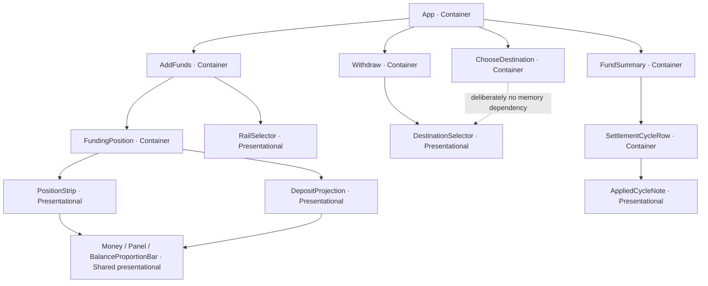
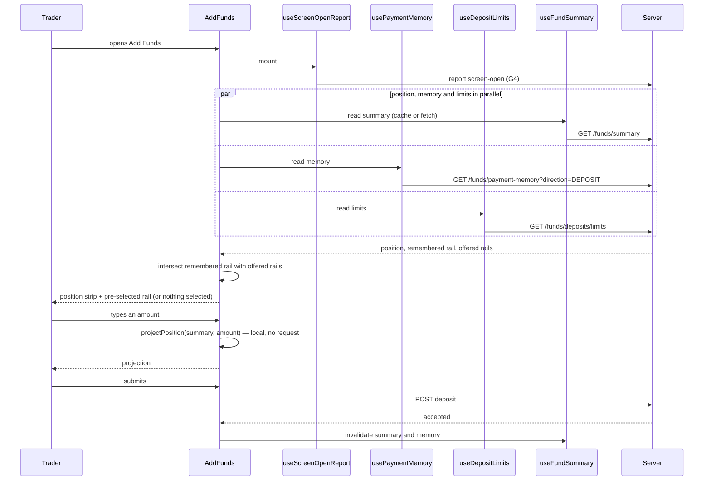

# Frontend Low-Level Design — Settlement And Funding Experience (Run 004)

| | |
|---|---|
| Feature | `004-settlement-and-funding-experience` |
| Sub-stage | 5b — frontend only. The backend half is `lld-backend.md` |
| Upstream | `hld.md` v3 (APPROVED), `lld-backend.md` (APPROVED), PRD v1.1 + 3 parts |
| Stack | React 18 + TypeScript, TanStack Query v5, inline styles over CSS custom-property tokens — the existing client's stack, not a choice made here |
| Nature | Delta on an existing client with six surfaces. No new route, no new page, no new dependency |

---

## 1. Executive Summary

Run 004 changes three of the six existing surfaces and adds no seventh. `AddFunds` gains a position strip and an after-deposit projection, and starts on the trader's last successful rail. `Withdraw` starts on the trader's last successful destination. `FundSummary` renders a third settlement cycle honestly as applied rather than chosen. `ChooseDestination` is changed by being deliberately left alone — it must issue no payment-memory request at all, which is a rule this document states and a test enforces.

**Key architectural choices at a glance:**

| Decision | Choice | Why not the alternative |
|---|---|---|
| Position data source | Reuse `useFundSummary` | A second query would create a second computation the HLD spent §7.3 eliminating |
| Projection | Pure function, component-local | A server round trip per keystroke, and an uncacheable response keyed on an amount still being typed |
| Rail intersection | Client-side, composing memory with `useDepositLimits` | The client already holds both; the server would fetch the availability list twice |
| Memory state | Server state via TanStack Query | It is derived from payment records, so it is server state by definition — never a client store |
| Feature switches | Server-driven, delivered on existing responses | A client-side flag cannot be turned off without a release, which defeats the guardrail-isolation purpose |

**Stated assumptions:**

- **A-FE-1 — resolved.** The three client switches come from `GET /funds/features` (`lld-backend.md` §4.4), a dedicated resource rather than fields on existing responses. That matters to this design: a trader whose summary is unavailable keeps their switches, because the two are not carried together.
- **A-FE-2 — resolved, and not the way `hld.md` §13.2 suggested.** The screen-open moment goes to `POST /funds/screen-open` (`lld-backend.md` §4.3) rather than riding the payment-memory read. The argument that settled it is on this side of the contract: `QueryProvider` sets `retry: 2`, so a memory GET that failed twice and succeeded on the third attempt would have recorded three opens — inflating guardrail G4's denominator exactly when the service is degraded, which is the condition the guardrail exists to measure. The design intent is preserved: the open is reported at open, so abandonment shows as opens without submissions rather than as silence. The duration is reported separately as `screenElapsedMillis` on the deposit request that ends it.
- **A-FE-3.** The existing global `staleTime: 30_000` continues to govern the fund summary. §9.1's rule is implemented as explicit invalidation on movement completion, not as a per-query stale time of zero, because zero would remove the caching benefit `hld.md` §5.1 depends on.

---

## 2. Functional Requirements

| ID | Frontend obligation | Surface |
|---|---|---|
| REQ-SF-01 | Render three cycles; describe the applied one as applied, with why it applies and what ends it; offer only the two selectable cycles | `FundSummary` |
| REQ-SF-04 | Show position before an amount; show projection after one; state what the margin proportion covers; never show a figure that cannot be confirmed | `AddFunds` |
| REQ-SF-06 | Pre-select the last successful rail, state why it is selected, allow a one-action change, pre-select nothing when the rail is no longer offered and do not name it | `AddFunds` |
| REQ-SF-07 | Pre-select the last successful destination and mark it; never pre-select or mark anything on the post-failure re-choice screen | `Withdraw`, `ChooseDestination` |
| Guardrail G4 | Report the screen-open moment at open, not at submission | `AddFunds` |
| Guardrails G1, G2 | Report the screen-open moment on **both** money-movement screens, so both completion rates have a denominator | `AddFunds`, `Withdraw` |

**Implicit requirements** surfaced rather than invented: loading and empty states for both new reads; the position and memory must not gate the form; the projection must disappear when the amount is cleared or out of range; every new figure needs an accessible announcement.

---

## 3. Non-Functional Requirements

| Dimension | Target | Source |
|---|---|---|
| Payment path | Never blocked, delayed or prevented by any addition here | PRD cross-cutting NFR; `hld.md` §15.1 |
| Projection responsiveness | Updates within the same render as the amount change; the trader never sees a projection belonging to an amount they have already changed | PRD; `[PROPOSED: pending eng confirmation]` for any specific interval |
| Position freshness | Cacheable, invalidated by the trader's own completed movement | `hld.md` §11.1 |
| Accessibility | WCAG 2.2 AA. Regulated domain — this is a compliance bar, not an aspiration | Inherited from run 001 |
| Browser support | Unchanged from the existing client | — |
| Bundle | No new dependency. Every capability uses React, TanStack Query and existing components | `tech-stack.md` |

---

## 4. Architecture Decisions

| # | Decision | Chosen | Alternatives rejected |
|---|---|---|---|
| D1 | Feature organisation | Components co-located in the existing `surfaces/<Surface>/` folders | A new `features/` tree would introduce a competing convention into a codebase with six working surfaces |
| D2 | Position component split | Container reads the query; `PositionStrip` and `DepositProjection` are pure presentational | A single component fetching and rendering would be untestable without a query client and would re-render the form on every position refetch |
| D3 | Projection computation | Pure function `projectPosition(summary, amount)` in `lib/` | Computing inside the component makes it unreachable from a unit test; computing server-side is rejected by `hld.md` §5.5 |
| D4 | Memory state | TanStack Query, one query key per direction | Global store — server-derived data must never be modelled as global client state. Local `useState` would refetch on every mount and lose the cache |
| D5 | Rail intersection placement | A composing hook, `useRememberedRail`, over the memory and limits queries | Doing it inside the component would duplicate the logic when the withdrawal side needs the same shape; doing it server-side needs a second availability fetch |
| D6 | Cycle rendering | Extend the existing `SettlementCycleRow` | A new component would duplicate the change-confirmation flow that already exists there |
| D7 | Form state | Existing `useState` in `AddFunds` and `Withdraw` | A form library for two fields is unjustified weight; the rule-of-three has not been reached |
| D8 | Switch delivery | Server-driven, from a dedicated `GET /funds/features`, persisted locally as the failure fallback | Build-time flags cannot be reverted without a release, defeating their purpose. Fields on existing responses would drift across two carriers and would tie a switch's availability to an unrelated upstream's health |

---

## 5. Component Hierarchy



`ChooseDestination` renders its own selection list and does not reuse `DestinationSelector`, because reuse is precisely the refactor that would give it a memory dependency. That is stated in §7.5 and asserted in §22.

---

## 6. Folder Structure

```
frontend/web/src/
  surfaces/
    AddFunds/
      AddFunds.tsx                    # changed — mounts position, uses remembered rail
      FundingPosition.tsx             # new — container; reads the summary query
      PositionStrip.tsx               # new — presentational; the four figures + proportion
      DepositProjection.tsx           # new — presentational; the after-deposit figures
      AddFunds.test.tsx               # extended
      FundingPosition.test.tsx        # new
    Withdraw/
      Withdraw.tsx                    # changed — pre-selects the remembered destination
    ChooseDestination/
      ChooseDestination.tsx           # unchanged, and asserted to stay that way
    FundSummary/
      SettlementCycleRow.tsx          # changed — three cycles, applied-cycle note
      AppliedCycleNote.tsx            # new — presentational; why it applies, what ends it
  hooks/
    useFunds.ts                       # changed — adds usePaymentMemory, query keys
    usePaymentMemory.ts               # new — one query per direction, switch-aware
    useRememberedRail.ts              # new — composes memory with offered rails
    useRememberedDestination.ts       # new — composes memory with verified accounts
    useScreenOpenReport.ts            # new — fires the G4 open signal exactly once
    useMutations.ts                   # changed — invalidates the summary on movement
  lib/
    projectPosition.ts                # new — pure; the after-deposit arithmetic
    projectPosition.test.ts           # new
  types/
    api.ts                            # changed — third cycle, memory view, cycle view
```

Nine new files, six changed. No new folder, no new layer.

---

## 7. Component Specifications

### 7.1 `FundingPosition` — Container

**Purpose.** Owns the position query and decides which of the three states renders. It is the only new component that touches a query.

| Prop | Type | Notes |
|---|---|---|
| `amountPaise` | `Paise \| null` | Null when the field is empty or invalid — the projection is then absent, not zero |
| `amountAcceptable` | `boolean` | False when the amount is outside the permitted range. No projection is shown for an amount the next step will refuse |

**State owned.** None. Query state comes from `useFundSummary`; the amount is owned by `AddFunds`, which already validates it.

**Behaviour.** Renders `PositionStrip` when the summary is available; renders a stated-unavailable message when it is not; renders `Skeleton` while loading. Renders `DepositProjection` only when the summary is available *and* `amountPaise` is non-null *and* `amountAcceptable`.

### 7.2 `PositionStrip` — Presentational

**Purpose.** The four figures a funding decision needs, plus the proportion and its scope.

| Prop | Type | Notes |
|---|---|---|
| `freePaise` / `blockedPaise` / `committedPaise` / `withdrawablePaise` | `Paise` | |
| `marginProportion` | `number` | 0–1 |
| `proportionCovers` | `'cash'` | REQ-SF-04's criterion that the position states what the proportion is computed over. A union with one member today, gaining `'cash-and-collateral'` when REQ-SF-05 ships — a union rather than a boolean so the third state is addable without changing the prop's meaning |
| `asOf` | `string` | |

**Behaviour.** Pure. Renders a confirmed zero as `₹0.00` rather than omitting the line — Rule SF4.7, and a new trader learning what the figures mean is served by seeing them at zero.

### 7.3 `DepositProjection` — Presentational

**Purpose.** What the position becomes once this deposit is credited.

| Prop | Type |
|---|---|
| `current` | `AvailablePosition` |
| `projected` | `ProjectedPosition` |
| `amountPaise` | `Paise` |

**Behaviour.** Pure. Labels every figure as a future state — Rule SF4.2. A projected figure presented in the same voice as a current one is a claim the broker cannot honour until the money arrives, so the heading carries "after this deposit" and the figures are visually subordinate to the current position rather than replacing it.

### 7.4 `RailSelector` — Presentational

**Purpose.** The rail choice, with the remembered one pre-selected and explained.

| Prop | Type | Notes |
|---|---|---|
| `rails` | `RailAvailability[]` | Straight from `useDepositLimits`, unchanged |
| `selected` | `Rail \| ''` | Empty is a legitimate state, not an error |
| `rememberedRail` | `Rail \| null` | Already intersected with availability by `useRememberedRail` |
| `onSelect` | `(rail: Rail) => void` | |

**Behaviour.** When `rememberedRail` matches a rail in the list, that option carries a visible and accessible "you used this last time" label. Changing away is one action with no confirmation step the other options do not also require — Rule SF6.4 and the equal-reachability bar. When `rememberedRail` is null nothing is pre-selected and nothing is said about it.

### 7.5 `ChooseDestination` — unchanged, deliberately

**Specification: this component must not import or call `usePaymentMemory`, `useRememberedDestination`, or any hook that transitively does.**

This is a rule the client obeys, not a property anything enforces, and the distinction matters. The settlement exclusion in `lld-backend.md` §6.5 cannot regress because no settlement exists in the table being read. This one regresses the moment someone lifts the memory into a shared hook so both withdrawal surfaces reuse one cache entry — an ordinary refactor, since `ChooseDestination` *is* a withdrawal surface. From there, marking the option is one careless render away, on the screen where the PRD is most insistent that nothing be marked, because the trader is re-choosing after money has already failed to arrive once. §22 asserts that rendering this component issues no memory request.

### 7.6 `AppliedCycleNote` — Presentational

| Prop | Type |
|---|---|
| `appliedReason` | `string` |
| `endsWhen` | `string` |

Renders only when the cycle is applied. Both strings come from the server (`CycleView`), not from client copy, so the explanation stays consistent with the notification the trader received.

---

## 8. Type Definitions

```ts
/** REQ-SF-01. The third value is applied, never offered in a selector. */
export type SettlementCycle = 'QUARTERLY' | 'MONTHLY' | 'MANDATORY_MONTHLY';

/** The two a trader may choose. Derived, so widening SettlementCycle cannot silently widen this. */
export type SelectableCycle = Exclude<SettlementCycle, 'MANDATORY_MONTHLY'>;

export interface CycleView {
  cycle: SettlementCycle;
  nextSettlementDue: string;
  /**
   * False exactly when the cycle is applied. Read this rather than comparing the enum —
   * a second applied cycle would otherwise require finding every comparison site.
   */
  chosenByTrader: boolean;
  appliedReason: string | null;
  endsWhen: string | null;
}

export type MemoryDirection = 'DEPOSIT' | 'PAYOUT';

/**
 * Absent is a value, not an error and not a default.
 *
 * The three reasons for absence are not distinguished here on purpose: the client behaves
 * identically in all three, and REQ-SF-06 forbids naming a method the trader cannot use.
 */
export interface PaymentMemoryView {
  direction: MemoryDirection;
  lastDepositRail: Rail | null;
  lastDestination: { reference: string; label: string } | null;
}

/** The subset of a summary the position needs, narrowed from the available branch. */
export interface AvailablePosition {
  freePaise: Paise;
  blockedPaise: Paise;
  committedPaise: Paise;
  withdrawablePaise: Paise;
  totalPaise: Paise;
  obligationsAsOf: string;
}

/** Only cash moves. A deposit releases no margin and pledges nothing — Rule SF4.3. */
export interface ProjectedPosition {
  freePaise: Paise;
  totalPaise: Paise;
  withdrawablePaise: Paise;
  blockedPaise: Paise;   // carried through unchanged, shown for comparison
  marginProportion: number;
}

/** Discriminated so an unavailable position cannot be rendered as figures. */
export type PositionState =
  | { status: 'loading' }
  | { status: 'unavailable'; traderMessage: string }
  | { status: 'available'; position: AvailablePosition; marginProportion: number };

export interface ClientFeatureFlags {
  fundingPosition: boolean;
  depositMemory: boolean;
  withdrawalMemory: boolean;
}
```

---

## 9. State Management

| Slice | Classification | Owner | Mutated by | Re-renders |
|---|---|---|---|---|
| Fund summary | Server state | `useFundSummary` | Refetch; invalidation on movement | `FundingPosition`, `FundSummary` |
| Deposit limits (incl. `availableRails`) | Server state | `useDepositLimits` | Refetch | `AddFunds`, `RailSelector` |
| Payment memory (deposit) | Server state | `usePaymentMemory('DEPOSIT')` | Invalidation after a completed deposit | `AddFunds` |
| Payment memory (payout) | Server state | `usePaymentMemory('PAYOUT')` | Invalidation after a completed withdrawal | `Withdraw` |
| Verified accounts | Server state | `useVerifiedBankAccounts` | Refetch | `Withdraw`, `AddFunds` |
| Amount entered | Local | `AddFunds` / `Withdraw` `useState` | User input | Owning surface + projection |
| Selected rail | Local, seeded once | `AddFunds` `useState` | User selection; seeded from the remembered rail on first resolution | `RailSelector` |
| Selected destination | Local, seeded once | `Withdraw` `useState` | As above | `DestinationSelector` |
| Screen-open reported | Local ref | `useScreenOpenReport` | Fires once per mount | Nothing — a ref, deliberately, so reporting never causes a render |
| Feature flags | Server state | Delivered on existing responses | Refetch | Consumers |

**Seeding rule.** The remembered rail and destination seed local state exactly once, when the memory query first resolves and only if the trader has not already chosen. A memory refetch must never overwrite a live selection — the existing `AddFunds` effect already guards on `!selectedBankRef` and this follows the same shape.

### 9.1 Cache invalidation — `hld.md` §11.1

**Rule: the funding position is cacheable, and a completed movement by the same trader invalidates it.**

```ts
// in useMutations.ts, on deposit and withdrawal success
queryClient.invalidateQueries({ queryKey: queryKeys.fundSummary });
queryClient.invalidateQueries({ queryKey: queryKeys.paymentMemory(direction) });
```

The reasoning, from `hld.md` §11.1: what REQ-015 forbids is showing a figure the broker cannot stand behind, and a position that omits *this trader's own deposit from thirty seconds ago* is that case. A position a few seconds behind unrelated activity is not. The alternative — setting `staleTime: 0` on the summary — would remove the caching benefit `hld.md` §5.1 depends on for its read-increase ceiling, to solve a problem targeted invalidation solves precisely.

The failure this prevents is concrete and is the domain scenario the Stage 4 review raised: an intraday trader funds, finds it was not enough, returns within the stale window, and sizes a second deposit against a position that does not include the first.

---

## 10. Custom Hooks

| Hook | Purpose | Returns | Wraps |
|---|---|---|---|
| `usePaymentMemory(direction)` | One memory answer | `UseQueryResult<PaymentMemoryView>` | TanStack Query; `enabled` from the matching switch |
| `useRememberedRail()` | The remembered rail **intersected with currently-offered rails** | `Rail \| null` | `usePaymentMemory('DEPOSIT')` + `useDepositLimits` |
| `useRememberedDestination()` | The remembered destination, intersected with still-verified accounts | `{ reference, label } \| null` | `usePaymentMemory('PAYOUT')` + `useVerifiedBankAccounts` |
| `useScreenOpenReport(surface)` | Fires the G4 open signal once per mount | `void` | A ref; no render |

### 10.1 `useRememberedRail` — the intersection

```ts
export function useRememberedRail(): Rail | null {
  const { data: memory } = usePaymentMemory('DEPOSIT');
  const { data: limits } = useDepositLimits();

  const remembered = memory?.lastDepositRail ?? null;
  if (!remembered || !limits) return null;

  const offered = limits.availableRails.find((r) => r.rail === remembered && r.available);
  return offered ? remembered : null;   // withheld → nothing pre-selected, nothing named
}
```

The server returns what the trader last used; it does not know what is offered to them now. Rail availability is per-trader — a rail whose identity type the Bank module cannot resolve for a trader is withheld from that trader — and it already arrives on the limits response this screen fetches anyway. `hld.md` §7.4 places the intersection here for that reason.

Returning null rather than the withheld rail is what stops the failure REQ-SF-06 was written to prevent: a selected radio with no matching option in the list, which reads as a broken form rather than a withheld feature, and which lands hardest on the traders whose rail is withheld for a standing reason rather than a transient one.

### 10.2 `useScreenOpenReport` — guardrail G4

Reports the open moment **at open**, not on submission. Reporting only on submission would observe only traders who submitted; if the position slowed the screen enough that some abandoned, those sessions would produce no measurement, and since abandoners experience the worst latency, dropping them pulls the reported figures down. The guardrail would improve as the harm worsened, and would be believed.

The hook holds a ref so the report fires exactly once per mount and never causes a render. A remount inside the same session reports again, which is correct: the denominator is screen opens, not sessions.

**Both `AddFunds` and `Withdraw` mount it**, with their own `MoneyScreen` value. `lld-backend.md` §7.4 makes `fms.money.screen.opened` the denominator for G1 and G2 as well as G4, so mounting it only on the funding screen would leave the withdrawal completion rate a numerator with nothing underneath it. Only `AddFunds` sends a duration, because only G4 measures one.

It posts to `/funds/screen-open` with `retry: false`, overriding the client's default `retry: 2`. That override is the whole reason this is not carried on the memory read: a retried GET would have recorded one open per attempt, and the over-count would peak exactly when the service was degraded — the condition G4 exists to detect. The hook also records the open timestamp in the same ref, and `AddFunds` sends the elapsed milliseconds with the deposit when it submits, which is what pairs the duration to the denominator.

---

## 11. API Contracts

| Endpoint | Method | Request | Response | Statuses handled |
|---|---|---|---|---|
| `/funds/payment-memory` | GET | `?direction=DEPOSIT\|PAYOUT` | `PaymentMemoryView` | 200 including absent; 400 unknown direction; any failure → treated as absent |
| `/funds/summary` | GET | — | Existing `FundSummary` with `CycleView` fields added | 200 in both available and unavailable cases, unchanged |
| `/funds/settlement-cycle` | POST | `SelectableCycle` + idempotency key | Existing shape | 200; 400 when `MANDATORY_MONTHLY` is submitted, which the UI never does |
| `/funds/screen-open` | POST | `{ screen: 'ADD_FUNDS' \| 'WITHDRAW' }` | none (202) | Fire-and-forget. **`retry: false` on this call specifically** — the default `retry: 2` would record up to three opens for one screen open and inflate G4's denominator |
| `/funds/features` | GET | — | `ClientFeatureFlags` | 200. **On failure the last known value stands, persisted in `localStorage` and seeded into the query on mount; only a client that has never successfully fetched defaults to all-on.** Failing open unconditionally would let an outage re-enable a feature operations had just switched off to stop a guardrail regression — the one moment the switch exists for. Persistence rather than the in-memory cache alone, because the in-memory cache dies on the page reload that a degraded service makes more likely, which would return the client to never-fetched and defeat the rule exactly when it was needed. Flags are neither PII nor sensitive, so §21's storage concern does not apply |
| `/funds/deposits` | POST | Existing body **plus three optional telemetry fields** — see below | Existing shape | Unchanged behaviour. Each field is omitted when the client cannot supply it, e.g. after a page reload mid-flow |
| `/funds/withdrawals` | POST | Existing body **plus optional `preselectionKept`** | Existing shape | Unchanged behaviour |

**The three telemetry fields on a deposit, and why the client is the only thing that can send them:**

| Field | Type | Serves | Why not server-derived |
|---|---|---|---|
| `screenElapsedMillis` | `number \| undefined` | G4's duration | The server never sees the screen open |
| `preselectionKept` | `boolean \| null` | K6 | The server knows which rail was used but not whether it was the one pre-selected — the availability intersection that decides the pre-selection happens in `useRememberedRail` (§10.1) and its result exists nowhere else. **Null when nothing was pre-selected**, so "no memory" stays distinguishable from "memory overridden", which is the difference between a trader with no history and a trader the memory served badly |
| `amountAdjustedAfterProjection` | `boolean` | K4 | Sent once per screen open, true if the trader changed the amount at any point while a projection was on screen. Once rather than per keystroke, or the metric measures typing speed rather than whether the projection informed a decision |

`Withdraw` sends `preselectionKept` on the same terms. K5 needs nothing from the client — `lld-backend.md` §7.4 derives it from deposit timestamps.

New client function in `api/funds.ts`, following the existing naming discipline — named for what the trader is doing, not for the endpoint:

```ts
export function getPaymentMemory(
  direction: MemoryDirection,
  signal?: AbortSignal,
): Promise<PaymentMemoryView>;
```

**Normalisation boundary.** `PaymentMemoryView` is mapped at the API layer into the two narrow shapes the hooks return (`Rail | null`, `{reference,label} | null`). No component receives the raw response, so the "absent for three different reasons" shape never reaches a component that might try to distinguish them.

---

## 12. Data Flow



The projection step issues no request, which is the whole reason it is client-side. The three parallel reads are independent; none blocks the amount field or the submit action.

---

## 13. User Flow

1. Trader opens Add Funds → position appears with the four figures and the proportion, labelled with what it covers and when it was true.
2. The rail they used last is already selected, with "you used this last time" beside it. If that rail is now withheld, nothing is selected and nothing is said about it.
3. Trader types an amount → the projection appears below, labelled as the position after this deposit.
4. Trader adjusts the amount → the projection follows. Clearing it removes the projection and leaves the position.
5. Trader submits → the existing deposit flow runs unchanged; the summary and memory are invalidated so a return visit fetches.

Withdrawal is the same shape minus the position: every verified account is shown, the last-used one selected and marked. After a failed payout, the re-choice screen shows untried accounts with nothing selected and nothing marked.

---

## 14. Validation Rules

| Input | Rule | Where | On failure |
|---|---|---|---|
| Amount | Existing floor, ceiling and format rules | `AddFunds`, unchanged | Existing message; **and no projection is rendered** |
| Amount | Non-null and acceptable before a projection is shown | `FundingPosition` | Projection absent |
| `direction` | One of the two literals | API layer | 400 from the server; the client never constructs another value |
| Selected rail | Must be in `availableRails` with `available: true` | `useRememberedRail`, then the existing submit guard | Nothing pre-selected |
| Selected destination | Must be in the current verified list | `useRememberedDestination` | Nothing pre-selected; no fallback to the primary account, because a settlement destination and a withdrawal destination are separate decisions |

---

## 15. Error Handling

| Category | Example | Strategy | Recoverable |
|---|---|---|---|
| Position unavailable | Obligations cannot be confirmed | Position and projection both disappear together with a stated reason; funding continues | Yes — retry available, and the form still works |
| Position request fails | Network error | Same as above. Never a zero, never a stale figure, never one without the other | Yes |
| Memory request fails | Timeout, 5xx | Nothing pre-selected. The failure is not narrated to the trader | Yes, silently |
| Memory returns absent | First-time trader | Identical rendering to a failure, by design | n/a |
| Limits fail | Existing behaviour | Existing `ErrorPanel` with retry | Yes |
| Unexpected render error | Component throw | Existing `ErrorBoundary` at the surface level | Full-surface fallback |

**No new error boundary is added.** The two new reads degrade to absent rather than throwing, so the existing boundary is not asked to catch anything new.

---

## 16. Accessibility

Target: **WCAG 2.2 AA**, a compliance bar in this domain rather than an aspiration.

| Concern | Design |
|---|---|
| Position semantics | A `<dl>` of figures inside a labelled region, matching the existing `FundSummary` breakdown, so a screen reader announces label and value as a pair |
| Projection announcement | The projection region is `aria-live="polite"`; a change announces the resulting available balance, not every figure, so a trader adjusting an amount is not read a four-item list on each keystroke |
| Pre-selection reason | "You used this last time" is part of the option's **accessible name**, not a decoration beside it, so it is heard at the moment the option is encountered rather than after it |
| Applied cycle | The reason and what-ends-it text sit inside the same labelled group as the cycle value, so the explanation is not orphaned from what it explains |
| Colour | No figure or state is conveyed by colour alone; committed and blocked money are distinguished by label |
| Keyboard | Rails and destinations remain native radio inputs — arrow-key navigation, space to select — rather than div-based custom widgets |
| Focus | No focus is moved by the position appearing, the projection appearing, or a pre-selection resolving. All three happen without the trader acting, and stealing focus mid-typing is the specific harm |

---

## 17. Responsive Design

Desktop-first with responsive support, matching the existing client and the back-office-adjacent nature of a funding screen; the existing layout already uses `auto-fit` grids.

| Breakpoint | Position strip | Projection |
|---|---|---|
| ≥ 1024px | Four figures in a row, proportion bar full width | Beside the amount field |
| 768–1023px | Two by two | Below the amount field |
| < 768px | **Pattern change** — the four figures collapse to available and blocked, with the remaining two behind a "show all" disclosure | Below the amount field, two figures only |

The mobile change is a pattern change rather than a reflow: four figures stacked vertically would push the amount field below the fold on a phone, which would defeat the purpose of putting the position on the funding screen.

---

## 18. Styling Strategy

Inline styles over CSS custom-property tokens — the existing client's approach, used unchanged. Introducing a second styling approach for nine new files would fragment a codebase that is currently consistent. No new token is required; the position reuses `--signal`, `--caution`, `--slate` and the existing spacing scale, and `BalanceProportionBar` already establishes the visual language for a proportion.

---

## 19. Design Tokens

| Category | Tokens used | New? |
|---|---|---|
| Colour | `--signal`, `--signal-wash`, `--caution`, `--alert`, `--slate`, `--paper-raised` | No |
| Spacing | `--space-1` … `--space-5` | No |
| Typography | `--text-xs` … `--text-lg`, `--font-figure` with tabular numerals for all money | No |
| Radii / motion | `--radius-tight`, `--duration-fast`, `--ease-smooth` | No |

Money figures use the existing tabular-numeral treatment so a projection sitting under a current figure aligns digit-for-digit — without it, comparing the two requires reading rather than glancing.

---

## 20. Performance Optimizations

Only the three this feature's profile actually justifies:

1. **`useMemo` on the projection.** It recomputes on every keystroke and feeds two components. Memoised on `[summary, amountPaise]`.
2. **Parallel independent queries.** Position, memory and limits are three unrelated reads; none awaits another, so the screen's time-to-interactive is the slowest single read rather than their sum.
3. **The invalidation rule as a performance decision as much as a correctness one.** Targeted invalidation preserves the cache hits `hld.md` §5.1 depends on, where `staleTime: 0` would convert a conditional +28% peak read increase into an unconditional one.

Explicitly not applied: virtualisation (no list exceeds a handful of rows), code-splitting (no new route, no new dependency), and blanket memoisation of the presentational components (they receive primitives and re-render cheaply).

---

## 21. Security Considerations

| Concern | Treatment |
|---|---|
| Trader identity | Never sent by the client. Every new read derives the trader from the gateway session, so there is no parameter to tamper with |
| Data minimisation | The `direction` parameter exists partly for this: without it the funding screen would receive and cache a bank account label it never renders, which would then appear in devtools during a support session, in client error reports, and in proxy logs |
| Disclosure | The memory reveals nothing the trader cannot already see in their own transaction history |
| XSS | `appliedReason` and `endsWhen` are server-supplied strings rendered as text, never as HTML |
| Token handling | Unchanged; no new auth surface |
| CSRF | No new state-changing request. The telemetry report is the only new write-shaped call and carries no trader-supplied content |

---

## 22. Testing Strategy

**Unit** — `projectPosition`: only cash figures move; blocked and committed are carried through unchanged; the proportion recomputes; a zero amount yields the current position.

**Component:**

| Scenario | Asserts |
|---|---|
| Position available | Four figures, proportion, as-of time, and what the proportion covers |
| Position unavailable | No figures, a stated reason, **and the amount field and submit remain usable** |
| Position loading | Skeleton; form still usable |
| Amount entered | Projection appears, labelled as a future state |
| Amount cleared | Projection disappears, position remains |
| Amount out of range | No projection |
| Remembered rail offered | Pre-selected, labelled, changeable in one action |
| **Remembered rail withheld** | **Nothing pre-selected, and the withheld rail is not named anywhere in the DOM** |
| No memory | Nothing pre-selected, nothing said |
| Memory request fails | Identical to no memory |
| Applied cycle | Rendered as applied, with reason and what-ends-it; the selector offers only two options |

**Integration:**

- **`ChooseDestination` issues no payment-memory request.** Rendered with a request spy; the assertion is on the absence of the call, not on the absence of a marking — a component that fetched and ignored would pass a rendering assertion and fail this one.
- **A completed deposit invalidates the summary**, so the next render of `AddFunds` fetches rather than serving a position that predates the trader's own deposit.
- A memory resolving after the trader has already chosen does not overwrite their choice.

**Not worth testing:** the presentational components' styling, and the shared `Money`/`Panel` primitives, which run 001 already covers.

---

## 23. Edge Cases

| Case | Expected |
|---|---|
| Memory resolves after the trader has selected | Selection stands; the seed is skipped |
| Position refetches while the trader is typing | Projection recomputes from the new figures; the amount is untouched |
| Position becomes unavailable mid-typing | Position and projection are removed together; the amount and submit survive |
| Remembered destination no longer verified | Nothing pre-selected; **no fallback to the primary account** |
| Trader has withdrawn only via settlement | Nothing pre-selected — settlements never reach `withdrawal_request`, so the backend returns absent |
| Both memory and position unavailable at once | The screen degrades to exactly today's Add Funds. Three independent degradations must not compound into a broken screen |
| Rapid amount changes | Projection is derived, not fetched, so no request races exist |
| Two tabs open, deposit completed in one | The other's cache invalidates on window focus via the existing `refetchOnWindowFocus` |
| Zero balance, nothing blocked | Every line renders zero rather than the strip disappearing |
| Feature switch off mid-session | **The change takes effect on the next mount, not immediately.** Unmounting the position while a trader is mid-amount would make the figures vanish under their hands with no explanation — which is a worse experience than the unavailable state, because that one states a reason. A one-line rule that removes the case entirely |
| Remembered rail is `INSTANT` and the amount exceeds the instant ceiling | The existing bound message applies, unchanged. The pre-selection is **not** dropped: the message already names the alternative ("use bank transfer for more"), and silently changing a selection the trader can see would be a worse surprise than an explained refusal. Recorded because the pre-selection turns what used to be a deliberate choice into a correction for traders who habitually fund large amounts by transfer — a real regression the feature introduces, accepted with the reason stated |

---

## 24. Risks

| # | Risk | Impact | Mitigation |
|---|---|---|---|
| **R-1 — closed** | The screen-open moment had no wire representation | — | Resolved before 5c by `lld-backend.md` §4.3: `POST /funds/screen-open` for the open, `screenElapsedMillis` on the deposit request for the duration. Deliberately not the memory read, for the retry reason in A-FE-2 |
| **R-2** | The `staleTime: 30_000` default plus invalidation may still show a position seconds old after another actor's change | Low — the as-of time is displayed, and the case §9.1 targets is the trader's own movement | Accepted, and stated rather than hidden |
| **R-3 — closed** | The client switches had no delivery mechanism | — | Resolved by `lld-backend.md` §4.4: `GET /funds/features` |
| **R-4** | The applied-cycle copy (`appliedReason`, `endsWhen`) does not exist yet | Blocked wording, not blocked build | `hld.md` §23 OQ-5, owner named, non-blocking |

---

## 25. Implementation Checklist

**Types and API layer**

1. Widen `SettlementCycle`; add `SelectableCycle`, `CycleView`, `PaymentMemoryView`, `AvailablePosition`, `ProjectedPosition`, `PositionState`, `ClientFeatureFlags`.
2. Add `getPaymentMemory` to `api/funds.ts`; map the response at the boundary.
3. Add `paymentMemory` to `queryKeys`.

**Position**

4. Write `projectPosition` and its unit test first — it is pure and the rest depends on its shape.
5. Build `PositionStrip`, then `DepositProjection`, then `FundingPosition`.
6. Mount in `AddFunds` above the amount field; confirm the form stays usable in all three position states.

**Memory**

7. `usePaymentMemory`, then `useRememberedRail` with the intersection, then `useRememberedDestination`.
8. Seed `AddFunds`'s rail and `Withdraw`'s destination, guarding against overwriting a live selection.
9. Add the "used this last time" label to both, as part of the accessible name.
10. Add the invalidation calls to `useMutations`.

**Cycle**

11. Extend `SettlementCycleRow` for three cycles; build `AppliedCycleNote`; ensure the selector offers only `SelectableCycle`.

**Telemetry and switches**

12. `useScreenOpenReport` on **both** money-movement surfaces — posting to `/funds/screen-open` with `retry: false`, holding the open timestamp.
13. Send the three telemetry fields: `screenElapsedMillis` and `amountAdjustedAfterProjection` on the deposit, `preselectionKept` on both movements.
14. `useFeatureFlags` over `GET /funds/features`, seeded from `localStorage` and persisting each success; wire the three switches, taking effect on next mount.

**Tests**

15. The `ChooseDestination` no-request assertion — write it before anyone is tempted to share the hook.
16. The withheld-rail assertion.
17. The invalidation assertion.

---

## 26. Acceptance Criteria

- [ ] Add Funds shows available, blocked, committed and withdrawable, with the proportion and what it covers, before any amount is entered.
- [ ] Entering a valid amount shows the resulting position, labelled as after this deposit; clearing it removes the projection and keeps the position.
- [ ] An amount outside the permitted range produces no projection.
- [ ] When obligations cannot be confirmed, no position and no projection appear, a reason is stated, and a deposit can still be submitted.
- [ ] Add Funds opens on the rail of the trader's last credited deposit, labelled as such, changeable in one action.
- [ ] When that rail is withheld from the trader, nothing is pre-selected and the rail is named nowhere.
- [ ] Withdraw opens on the account of the trader's last credited withdrawal, marked as last used, with every verified account equally reachable.
- [ ] The post-failure destination screen pre-selects nothing, marks nothing, and **issues no payment-memory request**.
- [ ] Fund Summary renders the mandatory cycle as applied, with why it applies and what ends it, and its selector offers only quarterly and monthly.
- [ ] A completed deposit or withdrawal invalidates the summary, so a return to Add Funds does not show a position predating that movement.
- [ ] Every new figure, label and pre-selected state is available to assistive technology without relying on colour.
- [ ] No position, memory or telemetry failure can prevent or delay a deposit or a withdrawal.
